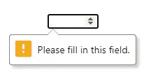

# HTML 表单和约束验证完全指南

> 原文：<https://www.sitepoint.com/html-forms-constraint-validation-complete-guide/>

在本文中，我们来看看 HTML 表单域和 HTML5 提供的验证选项。我们还将看看如何通过使用 CSS 和 JavaScript 来增强这些功能。

## 什么是约束验证？

每个表单域都有其用途。这一目的通常由**约束**来控制——或者控制什么应该和什么不应该输入每个表单域的规则。例如，`email`字段需要一个有效的电子邮件地址；一个`password`字段可能需要某些类型的字符，并且具有所需字符的最小数量；文本字段可能对可以输入的字符数有限制。

现代浏览器能够检查用户是否遵守了这些约束，并在违反这些规则时发出警告。这被称为**约束验证**。

## 客户端与服务器端验证

在该语言早期编写的大多数 JavaScript 代码都处理客户端表单验证。即使在今天，开发人员也要花大量时间编写函数来检查字段值。在现代浏览器中这还有必要吗？大概不是。在大多数情况下，这取决于你想做什么。

但首先，这里有一个重要的警告信息:

> 客户端验证是一项精细的工作，可以在应用程序浪费时间和带宽向服务器发送数据之前，防止常见的数据输入错误。它不是服务器端验证的替代品！
> 
> 始终清理数据服务器端。不是每个请求都来自浏览器。即使这样，也不能保证浏览器验证了数据。任何知道如何打开浏览器开发工具的人也可以绕过你精心制作的 HTML 和 JavaScript。

## HTML5 输入字段

HTML 优惠:

*   [`<textarea>`](https://developer.mozilla.org/docs/Web/HTML/Element/textarea) 用于多行文本框
*   [`<select>`](https://developer.mozilla.org/docs/Web/HTML/Element/select) 为下拉列表选项
*   [`<button>`](https://developer.mozilla.org/docs/Web/HTML/Element/button) 为…按钮

但是你最常使用的是 [`<input>`](https://developer.mozilla.org/docs/Web/HTML/Element/input) :

```
<input type="text" name="username" /> 
```

`type`属性设置控件类型，有大量选项可供选择:

| `type` | 描述 |
| --- | --- |
| `button` | 没有默认行为的按钮 |
| `checkbox` | 复选/勾选框 |
| `color` | 颜色选择器 |
| `date` | 年、月、日的日期选择器 |
| `datetime-local` | 日期和时间选择器 |
| `email` | 电子邮件输入字段 |
| `file` | 文件选择器 |
| `hidden` | 隐藏的领域 |
| `image` | 显示由`src`属性定义的图像的按钮 |
| `month` | 月份和年份选择器 |
| `number` | 数字输入字段 |
| `password` | 文本模糊的密码输入字段 |
| `radio` | 单选按钮 |
| `range` | 滑块控件 |
| `reset` | 将所有表单输入重置为默认值的按钮(但要避免使用，因为它很少有用) |
| `search` | 搜索输入字段 |
| `submit` | 表单提交按钮 |
| `tel` | 电话号码输入字段 |
| `text` | 文本输入字段 |
| `time` | 没有时区的时间选择器 |
| `url` | URL 输入字段 |
| `week` | 周数和年份选择器 |

如果您省略了`type`属性或者它不支持某个选项，浏览器会退回到`text`。现代浏览器对所有类型都有很好的支持，但旧浏览器仍然会显示一个文本输入字段。

其他有用的`<input>`属性包括:

| 属性 | 描述 |
| --- | --- |
| `accept` | 文件上传类型 |
| `alt` | 图像类型的可选文本 |
| `autocomplete` | 字段自动完成的提示 |
| `autofocus` | 页面加载的焦点字段 |
| `capture` | 媒体捕获输入法 |
| `checked` | 复选框/单选被选中 |
| `disabled` | 禁用控件(不会对其进行验证或提交其值) |
| `form` | 使用此 ID 与表单关联 |
| `formaction` | 在提交和图像按钮上提交的 URL |
| `inputmode` | 数据类型提示 |
| `list` | [的 ID`<datalist>`自动完成选项](https://www.sitepoint.com/html5-datalist-autocomplete/) |
| `max` | 最大值 |
| `maxlength` | 最大字符串长度 |
| `min` | 最小值 |
| `minlength` | 最小字符串长度 |
| `name` | 提交给服务器的控件的名称 |
| `pattern` | 正则表达式模式，如一个或多个大写字符的`[A-Z]+` |
| `placeholder` | 字段值为空时的占位符文本 |
| `readonly` | 该字段不可编辑，但仍将被验证和提交 |
| `required` | 该字段是必需的 |
| `size` | 控件的大小(通常在 CSS 中被覆盖) |
| `spellcheck` | 设置`true`或`false`拼写检查 |
| `src` | 图像 URL |
| `step` | 数字和范围中的增量值 |
| `type` | 字段类型(见上文) |
| `value` | 初始值 |

### HTML 输出字段

除了输入类型，HTML5 还提供只读输出:

*   [`output`](https://developer.mozilla.org/docs/Web/HTML/Element/output) :计算或用户动作的文本结果
*   [`progress`](https://developer.mozilla.org/docs/Web/HTML/Element/progress) :具有`value`和`max`属性的进度条
*   [`meter`](https://developer.mozilla.org/docs/Web/HTML/Element/meter) :根据`value`、`min`、`max`、`low`、`high`和`optimum`属性的设定值，可以在绿色、琥珀色和红色之间变化的刻度。

## 输入标签

字段应该有一个关联的`<label>`，您可以将它放在元素周围:

```
<label>your name <input type="text" name="name" /><label> 
```

或者使用`for`属性将字段的`id`链接到标签:

```
<label for="nameid">your name</label>
<input type="text" id="nameid" name="name" /> 
```

标签对于可访问性很重要。您可能遇到过使用`placeholder`来节省屏幕空间的表单:

```
<input type="text" name="name" value="" placeholder="your name" /> 
```

一旦用户键入内容，占位符文本就会消失，甚至是一个空格。最好显示一个标签，而不是强迫用户记住字段想要什么！

## 输入行为

字段类型和约束属性改变浏览器的输入行为。例如，`number`输入显示移动设备上的数字键盘。该字段可以显示微调器，并且键盘上/下光标按压将增加和减少值。

大多数字段类型是显而易见的，但也有例外。例如，信用卡是数字的，但是递增/递减旋钮没有用，而且当输入一个 16 位数字时，很容易向上或向下按。最好使用标准的`text`类型，但是将 [`inputmode`属性](https://developer.mozilla.org/docs/Web/HTML/Global_attributes/inputmode)设置为`numeric`，显示一个合适的键盘。设置 [`autocomplete="cc-number"`](https://developer.mozilla.org/docs/Web/HTML/Attributes/autocomplete) 也表示任何预先配置或先前输入的卡号。

使用正确的字段`type`和`autocorrect`提供了在 JavaScript 中难以实现的好处。例如，一些移动浏览器可以:

*   通过使用相机扫描信用卡来导入信用卡详细信息
*   导入短信发送的[一次性码](https://web.dev/sms-otp-form/#autocomplete%22one-time-code%22)

## 自动验证

浏览器确保输入值符合由`type`、`min`、`max`、`step`、`minlength`、`maxlength`、`pattern`和`required`属性定义的约束。例如:

```
<input type="number" min="1" max="100" required /> 
```

试图提交空值会阻止表单提交，并在 Chrome 中显示以下消息:



微调器不允许 1 到 100 范围之外的值。如果您键入的字符串不是数字，也会出现类似的验证消息。没有一行 JavaScript 代码。

您可以通过以下方式停止浏览器验证:

*   向`<form>`元素添加一个`novalidate`属性
*   向提交按钮或图像添加一个`formnovalidate`属性

## 创建自定义 JavaScript 输入

如果您正在编写一个新的基于 JavaScript 的日期输入组件，请停下来，离开您的键盘！

编写自定义输入控件很困难。你必须考虑鼠标、键盘、触摸、语音、可访问性、屏幕尺寸，以及当 JavaScript 失败时会发生什么。你也创造了不同的用户体验。也许你的控制优于桌面、iOS 和 Android 上的标准日期选择器，但不熟悉的 UI 会让一些用户感到困惑。

开发人员选择创建基于 JavaScript 的输入有三个主要原因。

### 1.标准控件很难设计样式

CSS 样式是有限的，通常需要一些技巧，比如用标签的`::before`和`::after`伪元素覆盖输入。情况正在改善，但质疑任何将形式置于功能之上的设计。

### 2.旧浏览器不支持现代类型

本质上，你是在为 Internet Explorer 编码。IE 用户不会得到日期选择器，但仍然可以用`YYYY-MM-DD`格式输入日期。如果你的客户坚持，那么只在 IE 中加载聚合填充。没有必要给现代浏览器增加负担。

### 3.您需要一个以前从未实现过的新输入类型

这种情况很少见，但总是从适当的 HTML5 字段开始。它们速度很快，甚至在脚本加载之前就可以工作。您可以根据需要逐步增强字段。例如，少量的 JavaScript 可以确保日历事件的结束日期在开始日期之后。

总之:*避免重复发明 HTML 控件！*

## CSS 验证样式

您可以将下面的[伪类](https://developer.mozilla.org/docs/Web/CSS/Pseudo-classes)应用到输入字段，根据当前状态对它们进行样式化:

| 选择器 | 描述 |
| --- | --- |
| `:focus` | 有焦点的字段 |
| `:focus-within` | 一个元素包含一个有焦点的字段(是的，是父选择器！) |
| `:focus-visible` | 由于键盘导航，元素具有焦点，因此焦点环或更明显的样式是必要的 |
| `:required` | 具有`required`属性的字段 |
| `:optional` | 没有`required`属性的字段 |
| `:valid` | 通过验证的字段 |
| `:invalid` | 未通过验证的字段 |
| `:user-valid` | 用户与之交互后通过验证的字段(仅限 Firefox) |
| `:user-invalid` | 用户与之交互后未通过验证的字段(仅限 Firefox) |
| `:in-range` | 该值在`number`或`range`输入的范围内 |
| `:out-of-range` | 值超出了`number`或`range`输入的范围 |
| `:disabled` | 具有`disabled`属性的字段 |
| `:enabled` | 没有`disabled`属性的字段 |
| `:read-only` | 具有`read-only`属性的字段 |
| `:read-write:` | 没有`read-only`属性的字段 |
| `:checked` | 选中的复选框或单选按钮 |
| `:indeterminate` | 不确定的复选框或单选按钮状态，例如当所有单选按钮都被取消选中时 |
| `:default` | 默认提交按钮或图像 |

您可以使用`::placeholder`伪元素来样式化输入的`placeholder`文本:

```
/* blue placeholder on email fields */
input[type="email"]::placeholder {
  color: blue;
} 
```

上面的选择器具有相同的特异性，因此顺序可能很重要。考虑这个例子:

```
input:invalid { color: red; }
input:enabled { color: black; } 
```

无效输入有红色文本，但它仅适用于具有`disabled`属性— *的输入，因此所有启用的输入都是黑色的。*

浏览器在页面加载时应用验证样式。例如，在下面的代码中，每个无效字段都有一个红色边框:

```
:invalid {
  border-color: #900;
} 
```

用户在与表单交互之前，会遇到一组令人望而生畏的红框。在第一次提交后或值更改时显示验证错误会提供更好的体验。这就是 JavaScript 介入的地方…

## JavaScript 和约束验证 API

[约束验证 API](https://developer.mozilla.org/docs/Web/API/Constraint_validation) 提供了表单定制选项，可以增强标准的 HTML 字段检查。您可以:

*   在用户与字段交互或提交表单之前，停止验证
*   使用自定义样式显示错误消息
*   提供自定义验证，这在 HTML 中是不可能的。当您需要比较两个输入时，这通常是必要的，例如当您输入电子邮件地址或电话号码时，检查“新”和“确认”密码字段是否具有相同的值，或者确保一个日期在另一个日期之后。

### 表单验证

在使用 API 之前，您的代码应该禁用默认验证和错误消息，方法是将表单的`noValidate`属性设置为`true`(与添加一个`novalidate`属性相同):

```
const myform = document.getElementById('myform');
myform.noValidate = true; 
```

然后，您可以添加事件处理程序，例如当表单提交时:

```
myform.addEventListener('submit', validateForm); 
```

处理程序可以使用`checkValidity()`或`reportValidity()`方法检查整个表单是否有效，当表单的所有输入都有效时，这两个方法返回`true`。(不同之处在于`checkValidity()`检查是否有任何输入受到约束验证。)

Mozilla 文档[解释了](https://developer.mozilla.org/docs/Web/API/HTMLInputElement/invalid_event):

> 每个无效字段也会触发一个`invalid`事件。这不会冒泡:处理程序必须添加到每个使用它的控件中。

```
// validate form on submission
function validateForm(e) {

  const form = e.target;

  if (form.checkValidity()) {

    // form is valid - make further checks

  }
  else {

    // form is invalid - cancel submit
    e.preventDefault();

  }

}; 
```

一个有效的表单现在可能会招致进一步的验证检查。同样，无效表单可能会突出显示无效字段。

### 现场验证

单个字段具有以下约束验证属性:

*   `willValidate`:如果元素是约束验证的候选元素，则返回`true`。

*   `validationMessage`:确认信息。如果字段有效，这将是一个空字符串。

*   `valitity`:一个 [ValidityState 对象](https://developer.mozilla.org/docs/Web/API/ValidityState)。当字段有效时，它有一个设置为`true`的`valid`属性。如果是`false`，以下一个或多个属性将是`true`:

    | 有效性状态 | 描述 |
    | --- | --- |
    | `.badInput` | 浏览器无法理解输入 |
    | `.customError` | 已经设置了自定义有效性消息 |
    | `.patternMismatch` | 该值与指定的`pattern`属性不匹配 |
    | `.rangeOverflow` | 该值大于`max`属性 |
    | `.rangeUnderflow` | 该值小于`min`属性 |
    | `.stepMismatch` | 该值不符合`step`属性规则 |
    | `.tooLong` | 字符串长度大于`maxlength`属性 |
    | `.tooShort` | 字符串长度小于`minlength`属性 |
    | `.typeMismatch` | 该值不是有效的电子邮件或 URL |
    | `.valueMissing` | 一个`required`值为空 |

单个字段有以下约束验证方法:

*   `setCustomValidity(message)`:为无效字段设置错误信息。当字段有效时，必须传递空字符串，否则字段将永远无效。
*   `checkValidity()`:输入有效时返回`true`。属性`valitity.valid`做同样的事情，但是`checkValidity()`也触发了字段上的`invalid`事件，这可能是有用的。

`validateForm()`处理函数可以遍历每个字段，并在必要时将`invalid`类应用于其父元素:

```
function validateForm(e) {
  const form = e.target;
  if (form.checkValidity()) {
    // form is valid - make further checks
  }
  else {
    // form is invalid - cancel submit
    e.preventDefault();
    // apply invalid class
    Array.from(form.elements).forEach(i => {
      if (i.checkValidity()) {
        // field is valid - remove class
        i.parentElement.classList.remove('invalid');
      }
      else {
        // field is invalid - add class
        i.parentElement.classList.add('invalid');
      }
    });
  }
}; 
```

假设您的 HTML 定义了一个电子邮件字段:

```
<div>
  <label for="email">email</label>
  <input type="email" id="email" name="email" required />
  <p class="help">Please enter a valid email address</p>
</div> 
```

当电子邮件未指定或无效时，脚本将一个`invalid`类应用于`<div>`。CSS 可以在表单提交时显示或隐藏验证消息:

```
.help { display: none; }
.invalid .help { display: block; }
.invalid label, .invalid input, .invalid .help {
  color: red;
  border-color: red;
} 
```

## 创建自定义表单验证程序

以下演示显示了一个示例联系人表单，该表单需要用户名和/或电子邮件地址和/或电话号码:

参见 [CodePen](https://codepen.io) 上 site point([@ site point](https://codepen.io/SitePoint))
的 Pen [约束验证 API 示例](https://codepen.io/SitePoint/pen/rNmQPPx)。