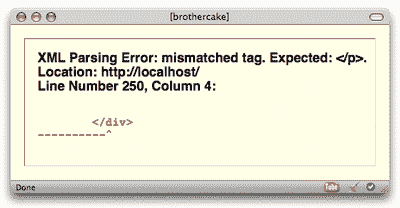

# HTML 或 XHTML:真的重要吗？

> 原文：<https://www.sitepoint.com/html-or-xhtml-does-it-matter/>

我可以说，自 1995 年第一个标准规范 HTML 2.0 发布以来，HTML 已经走过了漫长的道路。我希望 T2 能这么说——但这不是真的。

又过了四年，下一个规范发布了——1999 年的 HTML 4.01——而现在，八年过去了，从那以后没有任何重大进展。

但也许这是件好事。也许 HTML 4 的稳定性是对其设计的一种证明(在 SitePoint 上，我们刚刚以印刷形式发布了最终的 HTML 参考[*。打印！)或者它可以被理解为停滞，这指向更棘手的东西…*](https://www.sitepoint.com/books/htmlref1/)

你看，回到网络还是新生的、未经探索的、主要由学者和“超级极客”使用的时代，就事情应该如何发展达成共识肯定要容易得多。很少有人参与其中，甚至更少人有任何特定的既得利益。但是现在网络已经建立，被数百万人所依赖。大大小小公司的命运都取决于此。既然如此多的人有强烈而具体的观点和议程，那么就标准应该是什么达成一致就变得几乎不可能了。

我认为这就是 HTML(就此而言，CSS)的发展停滞不前的原因。

但是随着 HTML 5 的出现，改变即将来临。这一变化并非没有争议，但它仍然是受欢迎的变化。在本文的后面，我们将浏览一下规范草案，看看我们能从中得到什么，但是首先我想回顾一下 HTML 的历史和发展。

##### *♥*

HTML 最初被认为是一种语义语言，在这种语言中，元素应该只描述其内容的 T2 意义，而不是表现形式。然而，这种良好的意愿并没有持续很久。

HTML 3.0 于 1995 年提出并起草，但包括许多新元素——如支持数学图形——浏览器供应商认为这些元素太复杂，难以实现。供应商选择只实现提案的一部分，并添加他们认为应该包含的新标记(主要是表示性标记),希望这将随后被 W3C 批准。

事实证明，这种新标记的大部分确实被采用了。HTML 3.2 最终在 1997 年作为一个规范发布，并标准化了许多新的表示元素和属性，比如已经被浏览器实现的``、``和`align`。

1997 年，HTML 4.0 规范发布，尽管它继续包含由供应商直接发起的表示标记，但它也开始推动清理 HTML，称一些标记“已被否决”，并建议不要使用。HTML 4 标准有三种风格:

*   **strict**–不允许不推荐的标记
*   **过渡**或**松散**-不赞成使用的标记是允许的
*   **框架集**–主要允许与框架相关的标记

但是马已经跑了，留下马厩的门在铰链上无用地摆动。此时 W3C 已经失去了控制。网络爆炸式增长，不同的浏览器——主要是 Netscape Navigator 和 Microsoft Internet Explorer——在专有特性和实现上展开竞争(还记得`<layer>`？).这一时期通常被称为“浏览器战争”

##### XHTML 何去何从？

XHTML 1.0 出现于 2000 年，是 HTML 4 到 XML 的形式化。XML 本身在 1998 年作为定义标记语言的通用规范被标准化，并且是 SGML 的一个更严格和更简单的分支，SGML 是标准的通用标记语言，HTML 本身最初就是从 SGML 派生出来的。

XHTML 最初很受欢迎；这是最新的标准，被认为更好地解决了战后对标准和可访问性的推动。事实上，Web 内容可访问性指南的第[版](https://www.w3.org/TR/WCAG10/)在其第 11.2 点中暗示了 XHTML 的使用:“当 W3C 技术可用并适合某项任务时使用它们，当得到支持时*使用最新版本的*……”(我的重点)。

然而，尽管有这段蜜月期，XHTML 的潜在问题很快就开始出现了。绝大多数使用 XHTML 的开发人员都使用 text/html MIME 类型，这意味着它被浏览器解析为普通的 HTML 而不是 XML。对于 HTML 解析器来说，XHTML 自结束元素(比如``)只是一个带有额外字符(`&gt;`)的元素。因此，它的成功使用依赖于错误处理——这就是它向后兼容的原因。

但是，当使用 application/xhtml+xml MIME 类型或类似类型将 XHTML 作为 XML 提供时，就会出现问题。首先是主流的网络浏览器 Internet Explorer 不支持这种 MIME 类型；对于这样的文档，它会提示下载，而不是试图显示它们。在支持 MIME 类型的浏览器中，验证 XML 解析器的严格性对于现实世界的使用来说可能太极端了。对于一个无效的 XML 文档，浏览器甚至不会像处理 HTML 那样尽力去解析文档——相反，它们只会显示一个验证错误并停止，正如 Firefox 中的这个例子所示。

从可用性的角度来看，这显然是不可接受的，因为绝大多数用户都不知道这意味着什么，也不知道该怎么做。甚至像我这样的 XHTML 铁杆支持者也对在自己的站点上将其作为 XML 服务感到紧张，甚至不会考虑将其用于客户端站点。

因此，如果真正的 XHTML 使用起来过于挑剔，而作为文本的 XHTML 只是带有语法错误的 HTML，没有 XML 的任何好处(例如能够嵌入其他形式的 XML，以及使用名称空间)，那么 XHTML 到底有什么意义呢？为什么不坚持使用好的 HTML 呢？毕竟，我们在 XHTML 中发现的对语义的严格和强调在 HTML Strict 中同样存在。如果严格对你来说意味着什么，HTML 可以做到！

这些基本上是伊恩·希克森在他的标志性文章[“将 XHTML 作为有害的文本/html 发送”](http://www.hixie.ch/advocacy/xhtml)中提出的观点。我认为这篇文章是反 XHTML 运动的关键。我也不同意希克森在每一个重要方面的观点。

XHTML *仍然值得使用，因为它是一个过渡标准，将我们推向纯 XML Web。XML 本质上比 SGML 更好，因为它更简单、更严格，也更容易解析(一旦你理解了它的规则)。我不知道我们从哪里接受了应该原谅标记错误的观点，但我不同意这种观点。*

在我的书中，只有验证错误是一个主要的问题。一些浏览器正在努力改善这种情况——例如，Opera 会显示验证错误，但仍会尝试解析和显示页面。无论如何，即使考虑到用户生成的内容，制作可靠、正确显示的可靠页面也并不难——你只需要小心。

但是更确切地说，XHTML 仍然可以为一些浏览器提供 XML 的好处，即使其他浏览器没有受益。一个很好的例子是我不久前写的一个用嵌入式 SVG 替换文本的脚本(类似于 [SiFR](http://wiki.novemberborn.net/sifr) )。当然，只有当页面是真正的 XML 时，它才能在支持嵌入 SVG 的浏览器中工作。但至少它在其他环境中干净利落地失败了，没有改动原文。

因此，我们有这样一种情况，如果可能的话，文档必须是 XML，但如果不是也没关系。我认为，这是一个很明显的例子，值得进行内容协商，并将 XHTML 作为 XML 提供给支持浏览器。

##### 兴起 HTML 5？

HTML 5 的主要目标之一是定义如何处理异常，以便以可预测的方式处理格式错误或无效的标记。与以前的 HTML 版本不同，该规范牢牢地锚定在现实世界的实现中，因为它是基于对已经存在的内容和实现的观察，并且在至少有两个可互操作的实现之前不会被认为是最终的。

HTML 5 语法兼容 HTML 4 和 XHTML 1。使用 HTML 4 语法的 HTML 5 文档必须作为 text/html 提供，而使用 XHTML 语法的文档必须作为 XML 提供。DOCTYPE 也得到了极大的简化，仅用于将浏览器切换到标准模式(而不是引用 DTD)；XML 文档不需要 DOCTYPE，它总是以标准模式呈现。

而且，也许对作者来说最重要的是，该规范添加了一系列全新的元素、属性和可脚本化的 API。其中包括:

*   新的结构内容元素，如`<article>`、`<section>`、`<header>`和`<footer>`
*   新的嵌入元素，如`<figure>`、`<audio>`和`<video>`
*   常见数据结构的新语义，例如`<time>`和`<datagrid>`
*   专门为构建 web 应用程序而设计的元素，如`<output>`(用于脚本化流程的输出)、`<progress>`(用于显示长流程的进度)和`<event-source>`(用于处理服务器发送的事件)，以及一系列新的`<input>`类型，如`datetime`、`range`、`email`和`url`
*   一系列用于处理文档和嵌入内容的新脚本方法，例如用于`<canvas>`元素的 2D 绘图 API，用于`draggable`属性的拖放 API，以及其他 DOM 方法，如`getElementsByClassName()`和`getSelection()`

然而，伴随着这些增加的是一些有争议的删除，其中许多都与可访问性特性有关——想想``的`alt`属性，以及`<table>`标记的`summary`和`headers`属性。删除它们的主要理由是，实际上它们很少被使用，或者很少被正确使用。我认为这不是一个足够好的理由——这些是有价值的和必要的可访问性特性，没有一个具体的好理由就删除它们是不行的。当然，很遗憾这些属性很少被正确使用，但是与其删除它们，不如更好地教育开发人员正确使用它们。

***注:**
在 HTML 5 工作组内部，关于这方面的讨论似乎大多集中在创作工具的需求上。但坦率地说，我不明白我们为什么要关心他们的需求。那些决心按照标准工作的人不需要被说服他们的价值；那些没有这样做的人现在也不会被说服。个别公司的商业议程不应以任何方式影响标准制定过程。*

相反，一些表示元素和属性被保留了下来，因为它们在实践中被广泛使用，有效地认可了非语义标记的使用。这些包括`
`、`<b>`和``。然而与此同时，其他元素如`<big>`和``已经被删除，因为它们*纯粹是表现性的*。我不确定这种区分是如何得出的，除了参考流行的用法，但在我看来这是假的。当定义一个规范时，我们应该考虑特定标记的有用性和相关性——而不是认可人们已经在使用它的不正确的方式。

价格上涨的情况尤其令人失望。由于已经移除了`headers`属性，不再有任何方法来描述辅助技术的复杂表的内部结构，其中`scope`是不够的。许多开发者都写过这个问题，最著名的是 [Gez Lemon](http://juicystudio.com/article/html-scope-headers-debate.php) 。

该规范旨在提供“关注可访问性，将其作为新功能的内置概念”，这意味着希望将可访问性融入其中。但是，移除辅助功能——而不是用替代功能取代它们——如何实现这个目标呢？HTML 5 没有内置的辅助功能；它几乎不认为这是事后的想法，因为它真正的重点是为可视化 web 应用程序接口提供语义，而不是结构化和独立于模式的文档。

从很多方面来说，HTML 5 是一个令人兴奋的发展，因为它提供了大量广泛的新语义和 API。这一定是件好事——我们已经超越了 HTML 4，它不再适合我们的目的。然而，缺乏对可访问性的认真关注，过度强调创作工具和 RPC 应用程序的需求，以及过于务实地试图制裁现有的不良做法，都是值得关注的原因。

但我认为特别有趣的是，HTML 5 最初是如何产生的。W3C 并没有发起它；相反，它是由一个名为 WHATWG(Web 超文本应用技术工作组)的独立组织起草和开发的，只是后来才被 W3C 接受。

我觉得非常有必要指出这样一个重大的发展是如何超出 W3C 的设想，并且不得不独立地投入使用。我们在[微格式](http://microformats.org/)上看到了同样的情况，这两个例子都表明 W3C 已经变得没有创新能力了。这种停滞可能是其过度官僚主义的一个方面——所有大型老牌组织都有这种倾向。

##### Avast XHTML 2？

XHTML 2 似乎不太可能获得足够的关注。实现决定了技术的成败——似乎没有人(甚至是 Mozilla)对实现 XHTML 2 感兴趣。

XHTML 2 背后有一些很好的想法——特别是，在我看来, *any* 元素接受`src`属性的能力——但是它非常复杂，并且绝对要求其文档以 XML 的形式提供。XHTML 2 并不是为了向后兼容而设计的，尽管从学术角度来说这很好，但在现实世界中这是一个问题的雷区。唯一的问题是，在过渡期间，站点所有者必须执行从 XHTML 2 到 XHTML 1 的实时转换。

但是事情是这样的:XHTML 1 应该是过渡时期！然而，如果没有无处不在的吸收，我们就永远无法超越它，所以我们似乎永远也不可能超越它。XHTML 2 仍然是一个工作草案，可能永远不会进步——这有什么意义呢？

##### 结论

本文试图说明从 XHTML 1 回到 HTML 4 是一种倒退。我已经展示了使用 XHTML 的价值，即使只有一些浏览器能够真正从中受益，这继续支持我的信念，即 XHTML 比 HTML 4 更好。

我对 HTML 5 有所担心，但尽管如此，我还是对这一创新印象深刻，感到兴奋。我期待着有一天我们能够真正使用它，对我来说，这意味着规范是稳定的，所有主流浏览器都实现了它的大部分。但是在这一时刻到来之前，HTML 5 需要提供一个像样的可访问性标记，而目前它还没有。如果前面列举的问题没有解决，我可能会考虑忽略 HTML 5，坚持使用 XHTML 1。

不管怎样，我都将继续使用 XHTML 语法，尽可能地从 XML 中获益。这就是我给你的建议。

## 分享这篇文章