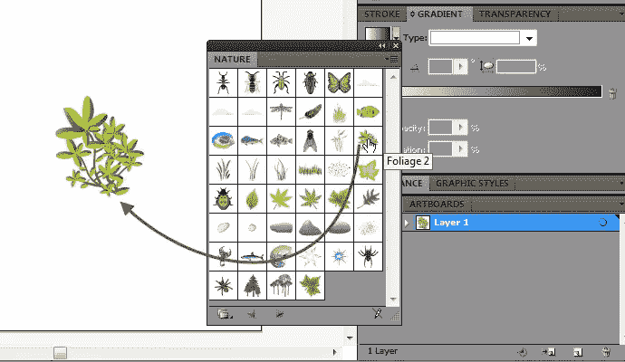
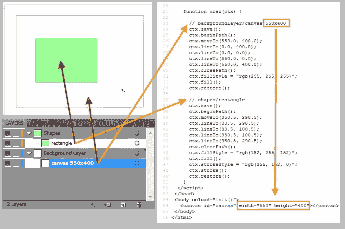

# 用 Ai 开发 HTML5 画布->Canvas

> 原文：<https://www.sitepoint.com/html5-canvas-development-with-ai-canvas/>

随着新的 HTML5 规范在 web 开发领域的出现，Web 不再是原来的样子了。我们现在可以做过去只是梦想的事情。

其中之一是能够在我们的浏览器中直接绘制图像，现在有了 Canvas API，这已经成为可能。这很容易理解，学起来也很快。但是，有一个问题。画一些相当简单的东西可能要花很长时间(有时非常长)。

此外，你需要对你画的每一笔进行大量的计算。这听起来有点令人沮丧，尤其是对于我们这些不喜欢数学的人来说。

幸运的是，在这篇文章中，我将告诉你一个简单易行的解决方案。Ai->Canvas 是一个方便的小 Adobe Illustrator 插件，由[麦克·斯旺逊](http://blog.mikeswanson.com/)创建，它允许你将任何创建或导入的矢量和位图艺术作品转换成有效的 Canvas 绘图。

它提供了绘图、动画和事件编码，因此您可以轻松地构建基于画布的交互式 web 应用程序。

## Ai->画布能做什么

事实上，使用 Ai->Canvas 插件你可以做很多事情。首先，它可以将几乎任何 Illustrator 作品导出到 HTML5 画布元素中——复杂的形状、渐变、透明、阴影和各种各样的东西。如果画布缺乏对特定功能的支持，Ai->Canvas 会自动将图稿栅格化为位图，并在画布上正确定位图像。

此外，您可以轻松地将动画添加到 Illustrator 绘图中。这些包括旋转、缩放、淡入淡出、缓动和沿路径移动。对于更高级的动画，您可以添加触发器，在一个动画完成时启动另一个动画，响应用户交互，如鼠标单击等。

Ai->Canvas 的真正强大之处在于，当它与 JavaScript 命令配对时，它不仅可以用于静态的艺术品和绘图，还可以创建动态的图形、游戏、显示等等。该插件使开发人员或设计人员能够将 Illustrator 图层输出为单独的 JavaScript 绘图功能。每个功能都有一组选项，使生成的图稿更容易处理。

简而言之，Ai->Canvas 的主要目的是通过提供坚实的 HTML 和 JavaScript 代码库来加速 HTML5 canvas 的开发，这些代码库可以复制到您自己的应用程序中，并在需要时进行扩展。

## 入门指南

要开始使用 Ai->Canvas，您需要[下载](http://www.visitmix.com/labs/ai2canvas/)一个 Windows 或 OS X 版本，并将插件文件解压缩到您的 Adobe Illustrator 插件文件夹中。对于 Adobe Illustrator CS5 的默认安装，应该是这样的—*C:程序文件 Adobe Illustrator cs5 插件*。在苹果电脑上，应该是这样的——*/应用程序/Adobe Illustrator CS5/插件*。

一旦插件安装完毕，如果 Illustrator 已经在运行，你需要重新启动它。现在，你应该可以下拉**文件**菜单，选择**导出…** ，看到<画布> (*。HTML)"作为选项在**下的**保存为类型下拉列表中。这就是你需要做的。简单吧。

以上对使用 Illustrator CS3 到 CS5 的用户有效。如果你有最新版本的 Illustrator，请参见[Illustrator to html 5 Canvas Plug-In Updated for CS6](http://blog.mikeswanson.com/post/29634279264/ai2canvas)，其中麦克·斯旺逊解释了如何为 AI CS6 获得该插件的工作版本，以及如何安装它。

## 它是如何工作的

是时候看看插件的运行了。为此，您需要在 Adobe Illustrator 中构建您的资源。这些可能包括现有的绘图和/或图像，甚至创建要导出的新绘图。

因此，首先在 Illustrator 中创建新文档。大小并不重要，因为导出的画布获得的是形状的整体大小，而不是 AI 画板的整体大小。

现在创建一些简单的形状——圆形，矩形。然后只需在**文件**菜单上选择**导出**，并选择<画布> (*。HTML)”。这将为您创建适当的代码以及您需要的任何附加文件。

您可以为您的应用程序编辑这些内容。在支持 canvas 的浏览器中加载文件，您将能够查看您的插图以及您可能创建的任何动画。

一个小技巧——如果你想创建特定大小的画布，只需创建一个所需尺寸的矩形，例如 550×400，并将其命名为“画布”。然后在这个形状里面画出你需要的所有东西。注意:为了得到准确的尺寸，请制作没有描边的矩形。

## 够好吗？

当我们探索一些新的 web 开发工具时，以下三个因素对于最终得分是最重要的:速度、简单性和质量。让我们在接下来的三个部分看看 Ai->Canvas 是如何适应这些的。

### 创作速度

你能多快画出一幅油画？对于单个或几个对象来说，答案并不重要，但是当我们讨论成百上千个对象时，答案就很关键了。要了解差异，只需进行以下实验。创建一个新文档，在**符号**面板中选择**自然**库，然后将**树叶 2** 符号放到画板上。

现在导出到画布，打开文件，看看源代码。

是的，没错。仅在几秒钟内就动态创建了 2，500 多行代码！那么，你用手做这个有多快？

正如您所看到的，插件的有用性随着绘图的复杂性而增加。绘图越复杂，为您节省的时间就越多。

### 易用性

当你读到或听到“画画”这个词时，你脑海中会浮现出什么样的画面？我打赌不是坐标系统和数学计算。但这就是 Canvas API 的工作方式。

这真的很糟糕。想象一下，当一个艺术家需要画一个简单的笔画时，他/她每次都被迫进行数学计算。这肯定会扼杀创造力。

幸运的是，有了 Ai->Canvas 插件，你不仅可以轻松自然地绘图，还可以用同样简单的方式在绘图中包含动画和交互。即使是新手也可以用最少的努力立刻创作出很酷的图画和动画。

### 代码质量

让我们面对现实吧。如果你最终得到的是臃肿、低质量的产品，那么你能多快、多容易地创造出东西也没用。

有许多“很酷”的工具可以产生自动生成的代码，但在大多数情况下，它意味着“意大利面条”代码。幸运的是，用 Ai->Canvas 生成的代码令人惊讶地有序且易于理解。让我们看看我的意思。

正如你已经知道的，Illustrator 文档是层次化的树结构，可以变得相对复杂。那么，如何在呈现的 HTML/JS 中定位特定的元素呢？插件为每个呈现的元素输出一个路径/面包屑注释行。比如 *//图层名/组名/美术名*。你可以在你喜欢的代码编辑器中使用 **Find** 功能找到任何元素。当存在不被支持的已知特性时，其他评论也会被导出。

所有作品名称都经过“清理”,因此它们只包含有效的 HTML/JS 字符。尽可能删除多余的命令。此外，当在多个函数之间分割绘图时，单个渲染函数会以正确的顺序绘制所有内容。最后，您会得到结构良好的代码，可以轻松地进行调整和扩展。

如你所见，Ai->Canvas 相当好地通过了所有三个要求。当然，和这个世界上的其他东西一样，插件并不完美，您可能需要编辑和定制导出的代码。但是考虑到插件提供的所有好处，下次当您处理 Canvas API 时，它可以极大地加速和简化您的开发过程。

## 结论

这篇文章仅仅触及了你能用 Ai->Canvas 插件做些什么的皮毛。

作为下一步，我建议你浏览一下[太阳系教程](http://www.visitmix.com/labs/ai2canvas/documentation.html)，以便了解插件如何在实际应用中使用。如果你想了解更多，你可以[下载扩展文档](http://www.visitmix.com/labs/ai2canvas/common/tutorials/ai2canvas.zip)，在那里你会找到如何使用插件的有用信息，以及一些不错的例子。

就是这样。我希望当你开始下一个画布绘制/应用时，这个方便的工具将为你节省大量宝贵的时间和枯燥的数学计算。

## 分享这篇文章