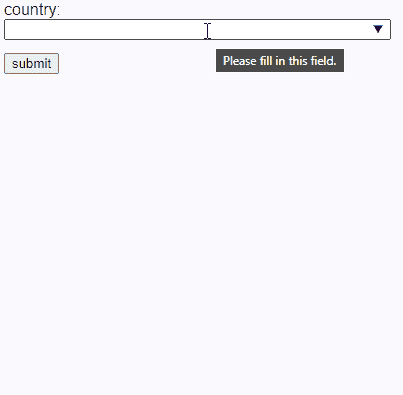

# 带有 HTML5 数据列表的轻量级自动完成控件

> 原文：<https://www.sitepoint.com/html5-datalist-autocomplete/>

**在本教程中，我们将深入探讨很少使用的 HTML5 `<datalist>`元素。它可以实现一个轻量级的、可访问的、跨浏览器的自动完成表单控件，不需要 JavaScript。**

## `<select>`怎么了？

当你想让用户从小范围的选项中选择时，HTML5 `<select>`控件是理想的选择。在以下情况下，它们不太实用:

*   有很多选项，比如国家或职位
*   用户想要输入他们自己的选项，但该选项不在列表中

显而易见的解决方案是自动完成控件。这允许用户输入几个字符，这限制了可用于更快选择的选项。

当你开始输入时，会跳到正确的位置，但这并不总是显而易见的。它不会在所有设备(如触摸屏)上工作，并且会在一两秒内重置。

开发人员经常求助于众多基于 JavaScript 的解决方案，但是定制的自动完成控件并不总是必要的。HTML5 `<datalist>`元素是轻量级的，可访问的，并且没有 JavaScript 依赖。你可能听说过它有问题或者缺乏支持。这在 2021 年是不正确的，但是有浏览器不一致和警告。

## `<datalist>`快速启动

从包含 200 多个选项的列表中选择您的国家是自动完成控件的理想选择。直接在 HTML 页面中为[每个国家](https://en.wikipedia.org/wiki/ISO_3166-1_alpha-2)定义一个带有子`<option>`元素的`<datalist>`:

```
<datalist id="countrydata">
  <option>Afghanistan</option>
  <option>Åland Islands</option>
  <option>Albania</option>
  <option>Algeria</option>
  <option>American Samoa</option>
  <option>Andorra</option>
  <option>Angola</option>
  <option>Anguilla</option>
  <option>Antarctica</option>
  ...etc...
</datalist> 
```

数据表的`id`可以被任何`<input>`字段中的`list`属性引用:

```
<label for="country">country</label>

<input type="text"
  list="countrydata"
  id="country" name="country"
  size="50"
  autocomplete="off" /> 
```

令人困惑的是，最好设置`autocomplete="off"`。这确保用户看到的是`<datalist>`中的值，而不是他们之前在浏览器中输入的值。

结果是:



这是 Microsoft Edge 中的默认呈现方式。其他应用程序实现了类似的功能，但是不同平台和浏览器的外观不同。

## `<option>`选项

使用标签作为`<option>`的文本子元素是很常见的:

```
<datalist id="mylist">
  <option>label one</option>
  <option>label two</option>
  <option>label three</option>
</datalist> 
```

使用`value`属性会产生相同的结果:

```
<datalist id="mylist">
  <option value="label one" />
  <option value="label two" />
  <option value="label three" />
</datalist> 
```

*注意:结束的`/>`斜杠在 HTML5 中是可选的，尽管它可以帮助防止编码错误。*

您也可以使用以下任一格式根据所选标签设置值。

**选项 1:**

```
<datalist id="mylist">
  <option value="1">label one</option>
  <option value="2">label two</option>
  <option value="3">label three</option>
</datalist> 
```

**选项二:**

```
<datalist id="mylist">
  <option value="1" label="label one" />
  <option value="2" label="label two" />
  <option value="3" label="label three" />
</datalist> 
```

在这两种情况下，当选择一个有效选项时，输入字段被设置为`1`、`2`或`3`，但是 UI 在不同的浏览器之间有所不同:

*   Chrome 显示了一个包含值和标签的列表。选择一个选项后，只有值会保留下来。
*   Firefox 只显示带有标签的列表。一旦选择了一个选项，它就会切换到该值。
*   边缘仅显示值。

以下 CodePen 示例显示了所有变体:

见笔 [HTML5 < datalist >由 SitePoint(](https://codepen.io/SitePoint/pen/jOVqGaJ)[@ SitePoint](https://codepen.io/SitePoint))[code Pen](https://codepen.io)上的
)自动完成示例。