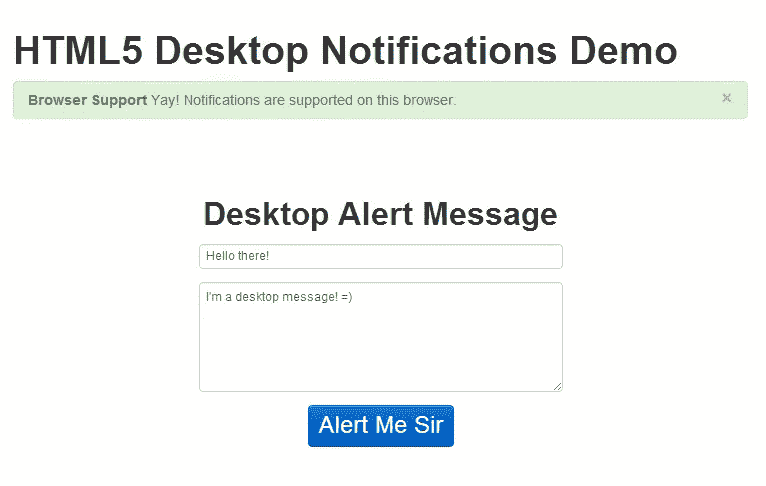
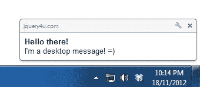
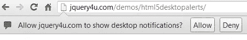
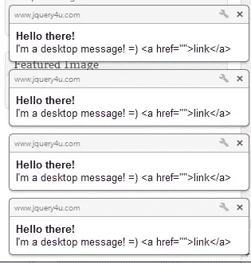

# HTML5 桌面通知示例

> 原文：<https://www.sitepoint.com/html5-desktop-notifications/>

你好伙计。所以今天我做了一个快速演示，向你展示一个使用 HTML5 和一点 JavaScript 的**桌面通知的例子。**

[在 GitHub 上查看项目](https://github.com/sdeering/HTML5-Desktop-Notifications)



## HTML5 桌面警报的背景信息

> 通知允许向网页环境之外的用户警告某个事件，例如电子邮件的发送。

您可以显示、排队和替换通知。您还可以向出现在邮件正文左侧的警报添加图标。此外，您还可以将标记成员用于多个实例(这种情况的结果是一个通知；第二个替换具有相同标签的第一个)。阅读更多关于 W3C Web 通知 API 的信息。

从我的测试来看，任何时候只有 4 个警报显示，它们被排队，所以当你关闭一个时，下一个就会显示，以此类推。此外，你不能把超链接(这将是很好的)。这是桌面警报的样子。



像大多数这样的功能一样，出于安全原因，系统会提示您进行访问。





## 剧本

这个脚本非常简单，它只是使用 webkitNotifications 来生成一个带有标题和消息的桌面提醒。

```
/*
   @Copyright: jQuery4u 2012
   @Author: Sam Deering
   @Script: html5desktopalert.js
*/
(function($,W,D,undefined)
{
    W.JQUERY4U = W.JQUERY4U || {};

    W.JQUERY4U.HTML5DESKTOPALERT = {

        name: "jQuery HTML5 DESKTOP ALERT",

        namespace: "W.JQUERY4U.HTML5DESKTOPALERT",

        settings:
        {
           //turn into plugin? ...
        },

        cache:
        {
            //runtime data, dom elements etc...
        },

        init: function(settings)
        {
            this.settings = $.extend({}, this.settings, settings);
            this.cache.notifications = window.webkitNotifications;
            this.testBrowserSupport();
            this.setupEventHandlers();
        },

        setupEventHandlers: function()
        {
           var _this = this;
           $('#alert-me-btn').bind('click', function(e)
           {
               _this.checkPermission("desktopAlert");
           });
        },

        //tests HTML5 browser support and permission request
        testBrowserSupport: function()
        {
            var $browserMsg = $('#browser-support-msg');
            if(this.cache.notifications)
            {
                $browserMsg.html("Yay! Notifications are supported on this browser.").parent().addClass('alert-success');
            }
            else
            {
                $browserMsg.html("Sorry. Notifications aren't supported on this browser.").parent().addClass('alert-error');
            }
        },

        checkPermission: function(callback)
        {
            var _this = this;
            if (this.cache.notifications.checkPermission() == 0)
            {
                _this[callback]();
            }
            else
            {
                this.cache.notifications.requestPermission(function()
                {
                    if (this.cache.notifications.checkPermission() == 0) _this[callback]();
                });
            }
        },

        desktopAlert: function()
        {
            console.log('sending alert...');
            var notification = window.webkitNotifications.createNotification("", $('#da-title').val(), $('#da-message').val());
            notification.show();
        }
    }

    $(D).ready( function()
    {
        //start up the form events
        W.JQUERY4U.HTML5DESKTOPALERT.init();
    });

})(jQuery,window,document);
```

## 分享这篇文章