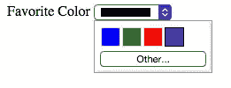

# 了解 HTML5 表单属性(第 2 部分)

> 原文：<https://www.sitepoint.com/html5-form-attributes-part-2/>

以下是我们的书的摘录，由 Alexis Goldstein、Louis Lazaris 和 Estelle Weyl 撰写的《真实世界的 CSS3，第二版。世界各地的商店都有出售，或者你可以在这里买到电子书。

### `pattern`属性

`pattern`属性使您能够提供一个正则表达式，用户的输入必须匹配该表达式才能被视为有效。对于用户可以输入自由格式文本的任何输入，您可以使用`pattern`属性来限制什么语法是可接受的。

模式中使用的正则表达式语言是与 JavaScript 相同的基于 Perl 的正则表达式语法，除了模式属性必须匹配整个值，而不仅仅是子集。当包含一个模式时，您应该总是向用户指出什么是期望的(和必需的)模式。

当与`pattern`属性一起使用时，全局`title`属性具有特殊的意义。由于浏览器目前在鼠标悬停时显示`title`属性的值，比如工具提示，所以要包含比占位符文本更详细的模式说明，这就形成了一个连贯的陈述。在支持带有错误消息的原生表单验证的浏览器中，该`title`属性也将与浏览器的默认错误消息一起显示，我们将在本章稍后介绍。

#### 注意:正则表达式

正则表达式是大多数编程语言的一个特性，它允许开发人员指定字符的模式，并检查给定的字符串是否与该模式匹配。对于门外汉来说，正则表达式是出了名的难以理解。例如，检查字符串是否格式化为十六进制颜色值的一个可能的正则表达式是:`#[A-Fa-f0-9]{6}`。

关于正则表达式语法的完整教程超出了本书的范围，但是如果你想学习的话，网上有很多很好的资源、教程和备忘单。或者，您可以在网上搜索或在论坛上询问适合您的模式。

举个基本的例子，让我们给表单中的密码字段添加一个`pattern`属性。我们希望强制要求密码长度至少为六个字符，不含空格:

```
<li> 
<label for="password">I would like my password to be:</label> 
<p>(at least 6 characters, no spaces)</p>
<input type="password" id="password" name="password" 
required title="(at least 6 characters, no spaces)" pattern="\S{6,}"> 
</li>
```

\S 表示“任何非白色空间字符”，而`{6,}`表示“至少六次”如果您想规定字符的最大数量，例如，6 到 10 个字符的语法应该是`\S{6,10}`。

与`required`属性一样，`pattern`属性将阻止表单被提交，如果没有匹配的模式，并将提供一个错误消息。

如果您的模式不是一个有效的正则表达式，那么为了验证的目的，它将被忽略。

从 Firefox 4、Safari 5、Chrome 10、Opera 11、IE10、Android 2.3 开始，所有浏览器都在一定程度上支持`pattern`属性。所谓“某种程度上”，我们指的是虽然所有浏览器现在都支持`pattern`属性，但是有些浏览器——特别是 Safari 和 Android 允许在表单提交时发送无效数据。

此外，类似于`placeholder`和`required`属性，您可以使用该属性的值为不支持浏览器的 JavaScript 验证代码提供基础。

### `disabled`属性

布尔属性`disabled`比 HTML5 存在的时间更长，但在某种程度上有所扩展。除了新的`output`元素之外，它可以用于任何表单控件，并且与以前版本的 HTML 不同，HTML5 允许您设置字段集的`disabled`属性，并将其应用于该字段集中包含的所有表单元素。

通常，默认情况下，带有`disabled`属性的表单元素在浏览器中的内容是灰色的。浏览器将禁止用户关注设置了`disabled`属性的表单控件。该属性通常用于禁用提交按钮，直到所有字段都被正确填写。

您可以在 CSS 中使用`:disabled`伪类来设计禁用的表单控件，并使用`:enabled`或`:not(:disabled)`伪类来设计未禁用的表单控件。

带有`disabled`属性的表单控件不与表单一起提交，所以服务器端的表单处理代码无法访问它们的值。如果您想要一个用户不能编辑但仍然可以查看和提交的表单值，请使用`readonly`属性。

### `readonly`属性

`readonly`属性类似于`disabled`属性:它使得用户无法编辑表单域。然而，与`disabled`不同的是，字段*可以*获得焦点，它的值与表单一起提交。

在评论表单中，我们可能希望包含当前页面的 URL 或被评论文章的标题，让用户知道我们正在收集这些数据，而不允许他们更改这些数据:

```
<label for="about">Article Title</label> 
<input type="text" name="about" id="about" readonly 
↵value="http://www.thehtml5herald.com/register.html">
```

### `multiple`属性

`multiple`属性(如果存在)表示可以在一个表单控件中输入多个值。虽然它在以前的 HTML 版本中可用，但它只适用于`select`元素。在 HTML5 中，它也可以添加到`file`、`email`和`range`输入类型中。如果存在，用户可以选择多个文件，包括几个逗号分隔的电子邮件地址，或者有一个带有两个滑块的范围。

虽然从 mobile Safari 7 和 IE10 开始，所有浏览器都支持`multiple`文件输入，但在撰写本文时，范围输入的`multiple`属性还不被任何地方支持。

#### 注意:空格还是逗号？

您可能会注意到，用于电子邮件输入的 iOS 触摸键盘包含一个空格。当然，电子邮件地址中不允许有空格，但是浏览器允许你用空格和逗号分隔多封邮件。最初，空格在一些浏览器中是不允许的，但是在逗号分隔符之后添加空格已经包含在规范中。

### `form`属性

不要与`form`元素混淆，HTML5 中的`form` *属性*允许您将`form`元素与没有嵌套的表单相关联。这意味着您现在可以将字段集或表单控件与文档中的任何其他表单相关联。这解决了表单不可嵌套的老问题。虽然您仍然不能嵌套表单，但是您可以将“嵌套”表单控件与非祖先表单相关联。

`form`属性将与字段集或控件相关联的表单元素的 ID 作为其值。

如果省略该属性，控件将只与嵌套它的窗体一起提交。如果你包含了`form`属性并删除了它，确保使用 `el.removeAttribute('form')`而不是`el.setAttribute('form', '')`。如果包含了`form`属性，但该值为空或指向无效的表单 id，则表单控件将与页面上的所有表单解除关联，并且不会与任何表单一起提交，包括它可能嵌套的任何祖先表单。

所有浏览器都支持他的属性，从 Android 4 和 IE 11 开始。

### `autocomplete`属性

属性指定表单或表单控件是否应该具有自动完成功能。对于大多数表单域，这将是一个在用户开始键入时出现的下拉列表。对于密码字段，它是在浏览器中保存密码的能力。对该属性的支持在浏览器中已经存在多年了，尽管在 HTML5 之前它从未出现在规范中。

如果表单控件或表单中省略了`autocomplete`属性，则默认值为`on`。您可能在上次填写表格时注意到了这一点。要禁用表单控件(或表单)上的自动完成功能，请使用`autocomplete="off"`。这对于敏感信息来说是一个好主意，比如信用卡号，或者永远不需要重用的数据，比如验证码。

自动完成也由浏览器控制，忽略开发人员设置的首选项。当默认值为`on`时，浏览器必须启用它才能工作；然而，将`autocomplete`属性设置为`off`会覆盖浏览器对相关表单控件的`on`偏好。

### `datalist`元素和`list`属性

从 IE10 和 Android 4.4.3 开始，除 Safari 之外的所有浏览器目前都支持 Datalists。在默认表单中，它们满足一个共同的要求:一个带有一组预定义的自动完成选项的文本字段。与`select`元素不同，用户可以输入他们喜欢的任何值，但是他们会看到一组建议的选项。



图 4.4。Firefox 中的 datalist 元素

对于某些输入类型，如`text`和`date`输入类型，当用户在字段中输入时，会显示一个下拉选项列表，如图 4.4 所示。对于`range`输入类型，浏览器会在滑动条上显示小勾号，指示建议的选项在哪里。对于`color`输入类型，用户会看到颜色建议样本，如果他们喜欢选择不同的颜色，可以选择切换到设备的默认颜色选择器。

与`select`非常相似，`datalist`元素是一个选项列表，每个选项都放在一个`option`元素中。然后使用输入中的`list`属性将`datalist`与`input`关联起来。`list`属性将您希望与输入关联的`datalist`的`id`属性作为其值。一个`datalist`可以与多个输入字段相关联。

下面是实际情况:

```
<label for="favcolor">Favorite Color</label> 
<input type="color" list="colors" id="favcolor" name="favcolor"> 

<datalist id="colors"> 
<option value="#0000FF" label="blue"> 
<option value="#008000" label="green"> 
<option value="#ff0000" label="red"> 
<option value="#663399" label="RebeccaPurple"> </datalist>
```

### `autofocus`属性

Boolean `autofocus`属性指定页面一加载，表单控件就应该被聚焦。在给定页面中，只有一个表单元素可以自动聚焦。为了更好的用户体验和可访问性，最好使用这个属性*而不是*。

输入元素支持更多的属性，其中一些是特定于类型的。属性包括图像输入类型的`alt`、`src`、`height`、`width`，数字输入类型的`step`、`min`、`max`，包括日期和范围。`dirname`帮助告诉服务器表单控件的方向性。`formaction`、`formenctype`、`formmethod`、`formnovalidate`和`formtarget`提供了覆盖表单属性的方法`inputmode`有助于向浏览器指示当设备能够显示动态小键盘时要显示什么小键盘。`minlength`和`maxlength`规定了允许输入的长度。`checked`、`name`、`size`、`type`和`value`你应该已经很熟悉了，虽然`:checked`和`:default`伪类可能比较新。接下来，我们将介绍其中一些相关的输入类型。

## 分享这篇文章