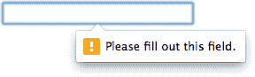

# HTML5 表单:CSS

> 原文：<https://www.sitepoint.com/html5-forms-css/>

在这个关于 HTML5 表单的三部分系列的第二篇文章中，我们将研究样式，或者更具体地说，研究可以用来在各种状态下定位输入字段的伪类选择器。如果您还没有阅读，请[参考第一部分](/html5-forms-markup)以确保您理解基本的标记概念。

## 移除默认样式

你可能已经注意到浏览器应用了默认格式。例如，大多数浏览器对`search`框应用圆角，并添加微妙的背景渐变，这在你的平面设计中可能看起来错位。

要移除默认样式，可以使用`appearance: none;`属性，这需要前缀。然而，小心使用，因为它可以删除基本的样式-复选框和单选按钮在 Chrome 中消失！为了安全起见，只在需要时应用该属性，并在尽可能多的浏览器中进行测试，例如

```
input[type="text"],
input[type="email"],
input[type="tel"],
input[type="number"],
textarea {
  -webkit-appearance: none;
  -moz-appearance: none;
  -ms-appearance: none;
  appearance: none;
  outline: 0;
  box-shadow: none;
}
```

注意我还重置了`outline`和`box-shadow`来移除所有浏览器中默认的难看的蓝色框阴影焦点和错误样式。

外观属性在 CSS-Tricks 上有记录，但它处于不断变化的状态。

## :聚焦

`:focus`从 CSS2.1 开始支持，为当前使用的字段设置样式，例如

```
input:focus,
textarea:focus,
select:focus {
  background-color: #eef;
}
```

## :已检查

`:checked`样式应用于选中的复选框或单选按钮，例如

```
<input type="checkbox" name="test" />
<label for="test">check me</label>
```

```
input:checked ~ label {
    font-weight: bold;
}
```

没有相应的':未选中'选择器，但你不应该需要一个:简单地创建一个默认样式，然后在激活`:checked`时应用更改。或者，你可以使用`:not(:checked)`。

## :不确定

`:indeterminate`技术上还不在规范里，[虽然提到了](http://dev.w3.org/csswg/selectors-3/#indeterminate)。根据规范，它代表一个“既没有选中也没有取消选中”的复选框或单选按钮

它的不同寻常之处在于，它只在通过 JavaScript 设置复选框的`.indeterminate`属性时应用样式，即

```
document.getElementById("mycheckbox").indeterminate = true;
```

对`.checked`属性没有影响，只能为真或假。

很少有情况下`:indeterminate`会有用。如果你有一个列表复选框，你可以提供一个“全选”复选框，当你点击它时，可以选择或不选择每一项。但是，如果您选中某些项目,“全部选中”复选框可能会进入不确定状态。

## :必需

`:required`将样式应用于任何具有`required`属性的输入，并且必须在提交之前输入。

## :可选

`:optional`将样式应用于任何没有`required`属性的输入。我不确定为什么要加上它，因为`:not(:required)`也会这么做？！

## :有效

`:valid`对当前保存有效数据的任何输入应用样式。

## :无效

类似地，`:invalid`(或`:not(:valid)`)将样式应用于当前保存无效数据的任何输入，例如

```
input:invalid {
    border-color: #900;
}
```

## :范围内(数字和范围输入)

使用`:in-range`可以选择符合`step`值的`min`和`max`属性之间包含有效值的数字和范围。显然，滑球出界有点困难，但是…

## :超出范围(数字和范围输入)

`:out-of-range`目标范围输入的无效数值。

## :已禁用

具有`disabled`属性的输入可以用`:disabled`伪类作为目标，例如

```
input:disabled {
    color: #ccc;
    background-color: #eee;
}
```

请记住，禁用的字段不会被验证，也不会将它们的数据发送到服务器。然而，伪类的样式，比如`:required`和`:invalid`，仍然会被应用。

## :已启用

同样，可以用`:enabled`(或`:not(:disabled)`)选择非禁用字段。实际上，您不太可能需要这个选择器，因为它是默认的输入样式。

## :只读

具有`readonly`属性的输入可以用`:read-only`伪类作为目标。请记住，只读输入仍然会被验证并发送到服务器，但是用户不能更改这些值。

## :读写

可以用`:read-write`(或`:not(:read-only)`)选择标准读写字段。同样，这不是你经常需要的选择器。

## :默认(仅提交按钮或输入)

最后，我们有了`:default`选择器，它将样式应用于默认的提交按钮。

## 占位符文本样式

可以使用带有供应商前缀的`::placeholder`伪元素对`placeholder`属性文本进行样式化(在单独的规则中)，例如

```
input::-webkit-input-placeholder { color: #ccc; }
input::-moz-placeholder { color: #ccc; }
input:-ms-input-placeholder { color: #ccc; }
input::placeholder { color: #ccc; }
```

## CSS 特异性

上面的选择器具有相同的特性，所以在定义应用于相同输入的两种或多种样式时，一定要小心。考虑:

```
input:invalid { color: red; }
input:enabled { color: black; }
```

这里我们要求所有无效字段都使用红色文本，但这永远不会发生，因为我们已经在样式表中定义了所有启用的字段都使用黑色文本。

保持选择器简单，使用最少的代码。例如，一个空的`:required`字段将是`:invalid`，因此很少需要对前者进行样式化。

## 验证气泡

提交时，第一个无效值会以错误气泡突出显示:



气泡设计将因设备和浏览器而异。只有 Webkit/Blink 浏览器允许一定程度的非标准 CSS 定制:

```
::-webkit-validation-bubble { ... }
::-webkit-validation-bubble-arrow { ... }
::-webkit-validation-bubble-message { ... }
::-webkit-validation-bubble-arrow-clipper { ... }
```

我的建议是:不要费心去尝试。如果您需要自定义错误格式，您几乎肯定会希望使用自定义消息。为此，您将需要 JavaScript。

## 浏览器支持

一般来说，重要的样式和选择器适用于 IE10+以后的所有现代浏览器。一些不太有用的，比如`in-range`现在只是 Webkit/Blink。旧的浏览器将支持`:focus`，但是对于任何更复杂的东西，你将需要提供 JavaScript 后备。

## 创建可用的表单

上面的样式会立即应用。例如:

```
input:invalid {
    border-color: #900;
}
```

对任何无效字段应用红色边框。不幸的是，当页面第一次加载时，每个字段都可能是无效的，用户会看到一组令人望而生畏的红框。

就个人而言，我更喜欢错误出现在提交时，或者当焦点从一个无效的字段转移时。浏览器本身没有提供这种方法。你猜对了——你需要 JavaScript。幸运的是，HTML5 约束验证 API 提供了工具来:

*   在使用表单之前暂停验证
*   使用自定义错误消息
*   聚合填充不支持的输入类型
*   为旧浏览器提供后备样式和验证，以及
*   创建更多可用的表单

在本系列的最后一部分，我们将更深入地了解这些。

## 分享这篇文章