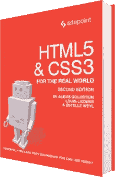

# HTML5 表单:我们工具箱中的可靠工具

> 原文：<https://www.sitepoint.com/html5-forms-dependable-tools/>



以下是我们的书的摘录，由 Alexis Goldstein、Louis Lazaris 和 Estelle Weyl 撰写的《真实世界的 CSS3，第二版。世界各地的商店都有出售，或者你可以在这里买到电子书。

我们已经编写了页面的大部分代码，现在您已经了解了几乎所有关于新 HTML5 元素及其语义的内容。但是在我们开始网站的 *外观* 之前——我们将在第 7 章中进行——我们将从 HTML5 先驱报的*首页快速绕道来看看注册页面。这将说明 HTML5 在 web 表单方面提供了什么。*

HTML5 web 表单引入了新的表单元素、输入类型、属性、本地验证和其他表单特性。这些特性中的许多我们已经在我们的界面中使用了很多年:表单验证、组合框、占位符文本等等。不同的是，以前我们必须借助 JavaScript 来创建这些行为；现在它们可以直接在浏览器中使用。您所需要做的就是在标记中包含属性，使它们可用。

HTML5 不仅让开发者标记表单变得更容易，对用户来说也更好。随着客户端验证由浏览器本地处理，不同站点之间将会有更好的一致性，并且许多页面在没有多余 JavaScript 的情况下会加载得更快。

让我们开始吧！

## 我们工具箱中可靠的工具

表单通常是开发人员在他们的页面中最后包含的东西，许多开发人员觉得表单很无聊。好消息是 HTML5 给编码形式注入了更多的乐趣。在本章结束时，我们希望你能期待在你的标记中适当地使用表单元素。

让我们从简单的老式 HTML 开始我们的注册表单:

```
<form id="register" method="post">
  <header>
    <h1>Sign Me Up!</h1>
    <p>I would like to receive your fine publication.</p>
  </header>

  <ul>
    <li>
      <label for="register-name">My name is:</label>
      <input type="text" id="register-name" name="name">
    </li>
    <li>
      <label for="address">My email address is:</label>
      <input type="text" id="address" name="address">
    </li>
    <li>
      <label for="url">My website is located at:</label>
      <input type="text" id="url" name="url">
    </li>
    <li> 
      <label for="password">I would like my password to be:</label>
      <p>(at least 6 characters, no spaces)</p>
      <input type="password" id="password" name="password">
    </li>
    <li>
      <label for="rating">On a scale of 1 to 10, my knowledge of HTML5 is:</label>
      <input type="text" name="rating" id="rating">
    </li>
    <li>
      <label for="startdate">Please start my subscription on:</label>
      <input type="text" id="startdate" name="startdate">
    </li>
    <li>
      <label for="quantity">I would like to receive <input type="text" name="quantity" id="quantity"> copies of <cite> The HTML5 Herald</cite>.</label>
    </li>
    <li>
      <label for="upsell">Also sign me up for <cite>The CSS3 Chronicle</cite></label>
      <input type="checkbox" id="upsell" name="upsell" value="CSS Chronicle">
    </li>
    <li>
      <input type="submit" id="register-submit" value="Send Post Haste">
    </li>
  </ul>
</form>
```

这个示例注册表单使用了从最早的 HTML 版本开始就已经存在的表单元素。这个表单通过`label`和`p`元素向用户提供了每个字段中需要什么类型数据的线索，所以即使是 Netscape 4.7 和 IE5 的用户(开玩笑！)能看懂形式。它可以工作，但肯定还可以改进。

在这一章中，我们将增强这个表单，使其包含 HTML5 表单特性。HTML5 提供了新的特定于电子邮件地址、URL、数字、日期等的输入类型。除此之外，HTML5 还引入了可用于新的和现有输入类型的属性。这些允许您提供占位符文本，根据需要标记字段，并声明什么类型的数据是可接受的——所有这些都不需要 JavaScript。

我们将在本章后面介绍所有新添加的输入类型。在此之前，让我们看看 HTML5 提供的新表单属性。

## 分享这篇文章