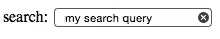
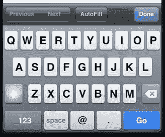
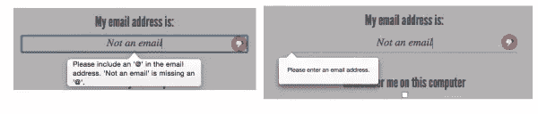

# HTML5 表单:输入类型(第 1 部分)

> 原文：<https://www.sitepoint.com/html5-forms-input-types/>

以下是我们的书的摘录，由 Alexis Goldstein、Louis Lazaris 和 Estelle Weyl 撰写的《真实世界的 CSS3，第二版。世界各地的商店都有出售，或者你可以在这里买到电子书。

您可能已经熟悉了`input`元素的`type`属性。这是决定向用户显示哪种表单输入的属性。如果省略了它——或者在新输入类型和旧浏览器不理解的情况下——它仍然工作；输入将默认为`type="text"`。这是使 HTML5 表单今天仍然可用的关键，即使您仍然支持旧的浏览器。如果你使用一种新的输入类型，比如`email`或`search`，旧的浏览器只会给用户一个标准的文本字段。

我们的注册表单目前使用您熟悉的十种输入类型中的四种:`checkbox`、`text`、
、`submit`。以下是 HTML5 之前可用类型的完整列表:

*   `button`
*   `checkbox`
*   `file`
*   `hidden`
*   `image`
*   `password`
*   `radio`
*   `reset`
*   `submit`
*   `text`

[HTML5](https://www.w3.org/TR/html5/forms.html) 规范给了我们另外九种输入类型，提供了更多特定于数据的 UI 元素和原生数据验证:

*   `search`
*   `email`
*   `url`
*   `tel`
*   `date`
*   `time`
*   `number`
*   `range`
*   `color`

HTML5.1 和 WHATWG HTML Living Standard 包括四种额外的日期输入类型，其中三种在现代浏览器中得到很好的支持:

*   `datetime-local`
*   `month`
*   `week`
*   `datetime`

(任何浏览器都不支持)

让我们详细看看这些新类型，看看我们如何使用它们。

### 搜索

`search`输入类型(`type="search"`)提供了一个搜索字段——一个单行文本输入控件，用于输入一个或多个搜索词。该规范规定:

> 文本状态和搜索状态之间的区别主要是风格上的:在搜索字段不同于常规文本字段的平台上，搜索状态可能导致与平台的搜索字段一致的外观，而不是像常规文本字段那样出现。

许多浏览器以与浏览器或操作系统搜索框一致的方式设计搜索输入。目前，Chrome、Safari、Opera 和 IE 都增加了通过鼠标点击清除输入的功能，一旦文本输入到字段中，就会提供一个×图标，如图 4.5 所示。日期/时间输入类型在 Chrome 和 Opera 中也是可以清除的，IE11 现在包括一个×图标来清除大多数输入类型，包括文本类型的输入。



图 4.5。搜索输入类型的样式类似于操作系统的搜索字段

在苹果设备上，Chrome、Safari 和 Opera 中的搜索栏默认为圆角，与设备的搜索栏外观相匹配。在带有动态键盘的触摸板上，“go”按钮显示为搜索图标或单词“search”，具体取决于设备。如果包含非标准结果属性，Chrome 和 Opera 将在表单域中显示一个放大镜图标。

虽然您仍然可以使用`type="text"`作为搜索字段，但新的搜索类型是一个视觉提示，告诉用户需要去哪里搜索网站，并提供一个用户习惯的界面。HTML5 先驱报没有搜索栏，但这里有一个你如何使用它的例子:

```
<form id="search" method="get"> 
  <label for="s">Search</label> 
  <input type="search" id="s" name="s"/> 
  <input type="submit" value="Search"/> 
</form>
```

因为`search,`像所有新的输入类型一样，在不支持的浏览器中显示为常规文本框，所以没有理由在适当的时候不使用它。

### 电子邮件地址

毫不奇怪，`email`类型`(type="email")`用于指定一个或多个电子邮件地址。它支持布尔`multiple`属性，允许多个逗号分隔(可选空格)的电子邮件地址。

让我们更改表单，使用`type="email"`作为注册人的电子邮件地址:

```
<label for="email">My email address is</label> 
<input type="email" id="email" name="email"/>
```

如果您将输入类型从`text`更改为`email`，就像我们在这里所做的那样，您会注意到用户界面没有明显的变化；输入看起来仍然像一个纯文本字段。但是，幕后有分歧。

如果您使用的是触摸板设备，这种变化会变得很明显。当你关注电子邮件领域时，大多数触摸板设备——如运行 Chromium 的 iPad 或 Android 手机——都将显示针对电子邮件输入优化的键盘，包括@符号、句点和空格按钮，但没有逗号，如图 4.6 所示。



图 4.6。电子邮件输入类型在 iOS 设备上提供了自定键盘

Firefox、Chrome、Opera 和 Internet Explorer 10 也为无效的电子邮件输入提供了错误消息:如果你试图提交一个内容无法识别为一个或多个电子邮件地址的表单，浏览器会告诉你出了什么问题。默认的错误信息如图 4.7 所示。



图 4.7。Opera(左)和 Firefox(右)上格式不正确的电子邮件地址的错误消息

**注意:自定义验证消息**

不喜欢浏览器提供的默认错误信息？用`.setCustomValidity(errorMsg)`设置您自己的。`setCustomValidity`将您想要提供的错误消息作为其唯一的参数。如果您设置了自定义验证消息，一旦该值生效，您必须将验证消息设置为空字符串(falsy 值)以启用表单提交:

```
function setErrorMessages(formControl) {
  var validityState_object = formControl.validity;
  if (validityState_object.valueMissing) {
      formControl.setCustomValidity('Please set an age 
↵(required)');  
  } else if (validityState_object.rangeUnderflow) {
      formControl.setCustomValidity('You\'re too young');
  } else if (validityState_object.rangeOverflow) {
      formControl.setCustomValidity('You\'re too old');
  } else if (validityState_object.stepMismatch) {
      formControl.setCustomValidity('Counting half 
↵birthdays?');
  } else {
      //if valid, must set falsy value or will always error 
      formControl.setCustomValidity('');
  }
}
```

不幸的是，虽然您可以改变消息的内容，但您会被它的外观所困扰，至少现在是这样。

### 资源定位符

`url`输入`(type="url")`用于指定网址。很像`email`，它将作为一个普通的文本字段出现。在许多触摸屏上，屏幕键盘会针对网址输入进行优化，带有正斜杠(/)和“.”。com”快捷键。

让我们更新注册表单以使用 url 输入类型:

```
<label for="url">My website is located at:</label> 
<input type="url" id="url" name="url"/>
```

### URL 的验证

从 Internet Explorer 10 开始的所有现代浏览器都支持 url 输入类型，如果值不是以协议开头，则报告输入无效。仅验证 URL 的通用协议格式，因此，例如，`q://example.xyz`将被视为有效，即使`q://`不是真正的协议，`.xyz`也不是真正的顶级域名。如果希望输入的值符合更具体的格式，请在标签中(或在占位符中)提供信息让用户知道，并使用 pattern 属性来确保它是正确的，如前所述。

### 电话号码

对于电话号码，使用`tel`输入类型`(type="tel")`。与`url`和`email`类型不同，tel 类型不强制特定的语法或模式。字母和数字——实际上，除了换行符或回车符之外的任何字符——都是有效的。有一个很好的理由:在世界各地，每个国家都有不同长度和标点符号的有效电话号码，所以不可能指定一种单一的格式作为标准。例如，在美国，+1(415)555-1212 和 415.555.1212 一样容易理解，但是公司也可以在他们的电话号码中使用字母，例如(800)CALL-NOW。

您可以通过包含具有正确语法的占位符，或者在输入后添加注释和示例来鼓励特定的格式。此外，您可以通过使用 pattern 属性来规定格式。包含带有模式属性的标题，以提供工具提示并改善本机验证错误消息的 UX。您还可以使用`setCustomValidity`方法来提供更多信息的客户端验证。

在使用`tel`输入类型时，动态触摸板通常会显示电话键盘，包括星号和井号键。除了电话号码，您还可以使用`tel`。例如，它可能是社会安全号码表单输入的最佳键盘。

## 分享这篇文章