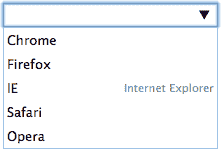

# HTML5 表单:标记

> 原文：<https://www.sitepoint.com/html5-forms-markup/>

这是关于 HTML5 web 表单的三部分系列的第一部分。在讨论样式和客户端 JavaScript 验证 API 之前，我们将在本文中介绍基本的标记。即使您已经熟悉表单，我也建议您阅读本文——其中有许多新的属性和问题！

HTML 表单可能很普通，但对于大多数网站和应用程序来说是必不可少的。在 HTML4 中，输入字段仅限于:

*   `input type="text"`
*   `input type="checkbox"`
*   `input type="radio"`
*   `input type="password"`
*   `input type="hidden"` —用户无法查看的数据
*   `input type="file"` —用于上传
*   `textarea` —用于较长的文本输入
*   `select` —用于下拉列表
*   `button` —通常用于提交表单，尽管也可以使用`input type="submit"`和`input type="image"`。

另外:

*   CSS 样式的可能性是有限的，
*   像日期和颜色选择器这样的自定义控件必须用代码开发，而且
*   客户端验证需要 JavaScript。

## 其他 HTML5 输入类型

大量新的类型被引进。这些提供了本地输入帮助和验证，无需任何 JavaScript 代码…

| 类型 | 描述 |
| --- | --- |
| `email` | 输入电子邮件地址 |
| `tel` | 输入电话号码—不强制使用严格的语法，但会删除换行符 |
| `url` | 输入一个 URL |
| `search` | 自动移除换行符的搜索栏 |
| `number` | 浮点数 |
| `range` | 用于输入近似值的控制，通常由滑块表示 |
| `date` | 输入年、月、日 |
| `datetime` | 根据当前 UTC 时区输入日、月、年、小时、分钟、秒和微秒 |
| `datetime-local` | 输入不带时区的日期和时间 |
| `month` | 输入不带时区的月份和年份 |
| `week` | 输入不带时区的周数 |
| `time` | 输入不带时区的时间 |
| `color` | 指定一种颜色 |

## 输入属性

除非另有说明，否则输入字段可以具有下列任何特定于表单的属性。一些是布尔属性，也就是说，它们不需要值，例如

```
<input type="email" name="email" required />
```

尽管如果您喜欢更严格的类似 XHTML 的语法，也可以添加它们，例如

```
<input type="email" name="email" required="required" />
```

| 属性 | 描述 |
| --- | --- |
| `name` | 输入字段名称 |
| `value` | 初始值 |
| `checked` | 检查一个`checkbox`或`radio`输入 |
| `maxlength` | 输入字符串的最大长度。这也可以应用于 HTML5 中的`textarea`字段 |
| `minlength` | 输入字符串的最小长度。这是有据可查的，但是在撰写本文时，浏览器支持很差，并且该属性会导致 HTML 验证器出错。另一个选择是`pattern=".{3,}"`，它将强制至少三个字符。 |
| `placeholder` | 输入框中显示的微妙的文本提示 |
| `autofocus` | 当页面加载时，将焦点设置到此(非隐藏)字段 |
| `required` | 表示必须输入一个值 |
| `pattern` | 确保值符合正则表达式 |
| `min` | 允许的最小值(数字和日期类型) |
| `max` | 允许的最大值(数字和日期类型) |
| `step` | 值粒度。例如，`input type="number" min="10" max="19" step="2"`将只允许值 10、12、14、16 或 18。 |
| `autocomplete` | 为浏览器提供自动完成的提示，例如“帐单电子邮件”,或者可以设置为“开”或“关”来相应地启用和禁用 |
| `inputmode` | 指定输入机制。最有用的选项:

*   `verbatim`—Non-prose content, such as user name
*   `latin`—Latin characters, such as search fields.
*   `latin-name`—Name, that is, the initial capital.
*   `latin-prose`—Prose content, such as news, tweets, etc.
*   `numeric`—Enter numbers where `number` or `range` are inappropriate, such as credit card numbers.

 |
| `size` | `text`或`password`输入的字符大小或`email`、`tel`、`url`或`search`输入的像素大小。可能最好避免，因为您应该使用 CSS 来样式化字段。 |
| `rows` | 文本行数(仅限于`textarea` |
| `cols` | 文本列的数量(仅限于`textarea` |
| `list` | 指向一组[数据列表](#datalists)选项 |
| `spellcheck` | 设置为 true 或 false 以启用或禁用拼写检查 |
| `form` | 此输入所属表单的 ID。一般来说，输入应该嵌套在一个`form`中，但是这个属性允许在页面的任何地方定义输入 |
| `formaction` | 指定提交时覆盖`form`动作的 URI(仅提交按钮/图像) |
| `formmethod` | 指定提交时覆盖`form`方法的 GET 或 POST(仅提交按钮/图像) |
| `formenctype` | 指定提交时的内容类型(仅提交按钮/图像上的`text/plain`、`multipart/form-data`或`application/x-www-form-urlencoded`) |
| `formtarget` | 指定提交时覆盖`form`目标的目标窗口/框架(仅提交按钮/图像) |
| `readonly` | 虽然输入值将被验证和提交，但不能更改 |
| `disabled` | 禁用输入-不会进行验证，也不会提交数据 |

注意`date`字段必须始终使用 YYYY-MM-DD 作为`value`、`min`和`max`属性。

以下示例请求一封以@mysite.com 结尾的强制电子邮件，并在页面加载时获得焦点:

```
<input
  type="email"
  name="login"
  pattern="@mysite\.com$"
  autocomplete="email"
  autofocus
  required />
```

## 数据列表

数据表包含一组适用于任何类型`input`的选项，例如

```
<input type="text" name="browser" list="browsers" />

<datalist id="browsers">
  <option value="Chrome" />
  <option value="Firefox" />
  <option value="Internet Explorer" />
  <option value="Safari" />
  <option value="Opera" />
</datalist>
```

当支持`datalist`时，当您开始键入时，浏览器会显示自动完成选项。如果双击控件或单击向下箭头(如果显示)，通常会显示整个列表。与标准的`select`下拉框不同，用户可以自由地忽略这些选择并输入他们自己的值。

可以像标准选择选项一样设置值和文本，例如

```
<option value="IE">Internet Explorer</option>
```

但是请注意，实现是不同的。例如，Firefox 在文本本身(Internet Explorer)上自动完成，而 Chrome 更喜欢 value (IE)并以灰色显示文本:



如果您想通过 Ajax 检索选项，可以用 JavaScript 填充数据列表。

## 禁用验证

通过在`form`元素上设置一个`novalidate`属性，可以禁用整个表单的验证。或者，您可以在表单的提交按钮/图像上设置一个`formnovalidate`属性。

还要记住，设置输入的`disabled`属性将会阻止对该字段的验证。

## 输出字段

虽然我们主要讨论输入类型，但 HTML5 也提供了只读输出选项:

*   `output` —计算或用户操作的结果
*   `progress` —进度条(`value`和`max`属性定义状态)
*   `meter` —根据属性`value`、`min`、`max`、`low`、`high`和`optimum`的设定值，可以在绿色、琥珀色和红色之间变化的刻度

## 分离和标记输入

[whatwg.org 表单规范](http://www.whatwg.org/specs/web-apps/current-work/multipage/forms.html)规定:

> 表单的每个部分都被认为是一个段落，通常使用
> 
> 元素与其他部分分开

有意思。我通常使用一个`div`,尽管我怀疑从语义的角度来看这有什么关系。标签更短，尽管你可能需要应用一个类来修改边距。

更重要的是，您应该在输入本身周围或旁边使用标签元素，并使用一个`for`属性来说明输入的 ID，例如

```
<p>
  <p>
  <label for="firstname">First name</label>
  <input type="text" id="firstname" name="firstname" placeholder="first name" required maxlength="20" />
</p>

<p>
  <label for="lastname">Last name</label>
  <input type="text" id="lastname" name="lastname" placeholder="last name" required maxlength="20" />
</p>

<p>
  <label for="email">Email address</label>
  <input type="email" id="email" name="email" placeholder="your@email.address" required maxlength="50" />
</p>

<p>
  <label>
    <input type="checkbox" name="newsletter" />
    Sign up for our newsletter
  </label>
</p>
```

## 没有标准控制

浏览器厂商没有具体的接口指南可以遵循。这是有意的:典型的桌面鼠标控制的日期选择器在移动设备上可能太小，因此供应商可以实现基于触摸的替代方案。

## 浏览器支持

并非所有浏览器都支持每种输入类型和属性。一般来说，IE10+以后的大多数现代浏览器都包含了电子邮件和数字等基本功能。但是，在撰写本文时，日期类型仅在 Webkit 和 Blink 浏览器中受支持。

当特定类型时，浏览器将恢复到标准的`text`输入，当不支持这些值时，浏览器将忽略这些属性。

## 始终使用正确的类型！

为请求的数据使用正确的输入类型很重要。这似乎是显而易见的，但是您会遇到一些情况，这时您可能会尝试使用标准的文本输入。

考虑日期。支持参差不齐，这导致了实施问题:

1.  标准的`date`输入总是以 YYYY-MM-DD 格式返回日期，不管日期选择器在您的语言环境中是如何显示的。

3.  IE 和 Firefox 会退回到标准的`text`输入，但是你的用户可能会希望输入美国 MM-DD-YYYY 或欧洲 DD-MM-YYYY 格式的值。

5.  JavaScript 日期选择器，比如 jQuery UI 中的日期选择器，允许您定义一个自定义格式——甚至是 YYYY-MM-DD 以保持一致性——但是您不能保证 JavaScript 将被启用。

简单的解决方案是放弃 HTML5 `date`输入，恢复到`text`并实现自己的日期控制。不要。你永远也不会创建一个自定义的日期选择器，它可以在所有的设备上以所有的屏幕分辨率工作，支持键盘、鼠标和触摸输入，并且在 JavaScript 被禁用时还能继续运行。特别是，移动浏览器通常领先于桌面浏览器，并实现了良好的触摸屏控制。

HTML5 输入类型是未来的趋势。在需要良好的跨浏览器支持的情况下，使用它们并在必要时添加 JavaScript polyfills。但是请记住…

## 验证服务器端

不保证浏览器验证。即使你强迫每个人都使用最新版本的 Chrome，你也无法阻止:

*   允许无效数据的浏览器错误或 JavaScript 故障
*   用户使用浏览器工具更改您的 HTML 或脚本
*   来自您控制之外的系统的提交，或
*   浏览器和服务器之间的数据拦截(当然是通过 HTTP)。

客户端验证从来没有也永远不会取代服务器端验证。在服务器上验证用户数据至关重要。在客户端，这是一个很好的选择。

最后，记住日期可能会以 YYYY-MM-DD 或您指定给用户的任何格式(MM-DD-YYYY、DD-MM-YYYY 等)接收。)检查前四个字符中的数字，或者根据需要使用本地语言/框架日期解析方法。

我们在这篇文章中已经讨论了很多。在下一部分，我们将看看与表单相关的 CSS 属性。

## 分享这篇文章