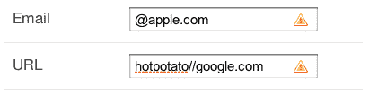
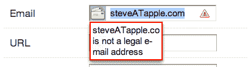
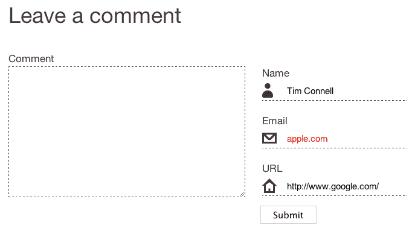
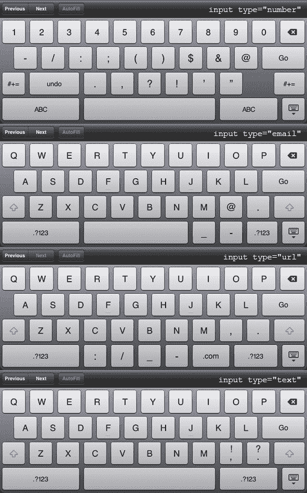

# HTML5 甚至更花哨的表单

> 原文：<https://www.sitepoint.com/html5-forms/>

对于我们这些在网络行业工作的人来说，这是一个全新的世界。浏览器厂商走在了游戏的前面，并在 HTML5 成为 W3C 标准之前实现了对它的支持。许多 web 开发人员已经利用这一点，用 HTML5 编写网站代码。有一个被大肆宣传的元素，它允许你在没有 Flash 的情况下提供流媒体视频；有语义文档标记，包含像`article`和`section`这样的元素。但是 HTML5 表单呢？那里发生了什么事？

乍一看，你可能会对 HTML5 目前给 web 表单带来的东西感到失望；每个浏览器实现新元素的方式略有不同，最令人印象深刻的功能还没有完全准备好。然而，如果你挖掘得更深一点，就有尚未开发的潜力可以立即使用——天哪，表单的未来看起来多美好啊！

让我们更仔细地看看 HTML5 表单，并在展望未来的同时发现今天的实际应用。每个人都有适合自己的东西，改进了移动浏览器的可用性，可爱的 CSS，以及更简单的方法来驱动日常表单功能，如占位符文本。

## 引入新的输入类型

HTML5 规范的当前草案带来了 13 种新的`input`字段类型。是的， *十三* 全新的、闪亮的方式定义了美好的旧`input`元素，所以在`text`旁边腾出一些空间为以下内容投入:

*   `email`对于电子邮件地址，立即使用再合适不过了

*   对于电话号码(有些浏览器可能会去掉空格)，可以立即使用

*   `url`对于网址，现在很好用

*   `color`为十六进制颜色值；这里希望我们能在未来看到 OS-native 颜色选择器！

*   `number`为整数；一些浏览器在输入字段旁边提供了向上/向下箭头。您还可以使用`min`和`max`属性将数量限制在给定的范围内。

*   `range`用滑块控件进行数字输入；像`number`输入类型一样，您可以使用`min`和`max`属性来定义范围。你也可以使用`step`属性来控制滑块移动的增量。这已经可以使用了，因为不支持它的浏览器只会显示一个文本字段——但是要小心使用这个字段。不管它们看起来有多酷，滑块只对某些任务有用(比如价格范围)；在大多数情况下，常规的数字字段对用户来说会更容易。

*   `search`为搜索关键词，所以自然只是站点搜索的工具。警惕当前的 Mac OS 渲染:它看起来就像内置的 Spotlight 搜索，但如果你需要以不同的方式显示它，没有覆盖样式。看看[苹果网站](http://www.apple.com/)上的例子。

*   用于日期相关输入的`date`、`month`、`week`、`time`、`datetime`和`datetime-local`。几个令人兴奋的新领域——现在我们只需等待所有的浏览器来实现它。

[看看浏览器中所有新的输入类型](http://sitepoint-examples.s3.amazonaws.com/html5-forms/fields.html)。

**note:** What’s up doctype?

记住:如果你使用 HTML5 元素，你需要一个 HTML5 文档类型。幸运的是，它又短又甜:

```
<!DOCTYPE html>
```

## 原生自动对焦和占位符

为 HTML5 规范做出贡献的人已经完成了两个常见功能领域的产品，这两个领域迄今为止都是由 JavaScript 驱动的:自动聚焦和占位符文本。

### 自动对焦

想在页面加载时自动聚焦表单中的字段吗？你不再需要依赖 JavaScript。现在，您可以向表单域添加一个属性，浏览器将完成所有工作:

```
<input type="text" *autofocus="true"* />  
```

好吧，所以不是所有的浏览器在编写时都支持它——但是不用担心，这里有一个小 jQuery 来增加对旧浏览器的向后兼容性:

```
inputEl = document.createElement('input');if !!('autofocus' in inputEl) {  $('input[autofocus="true"').eq(0).focus();};
```

这个代码片段创建一个输入字段，然后检查字段是否支持`autofocus`属性。如果没有支持，那么它会寻找属性为`autofocus="true"`的第一个字段，并聚焦。

**note:** You’re still using JavaScript, so what’s the difference?

您可能想知道为什么要用一个 JavaScript 片段替换另一个。当然，我们可以继续使用相同的旧脚本来完成这项工作，但是随着功能的逐步增强，为什么不推动我们的行业向前发展，并为那些处于前沿的人提供更好的体验呢？

### 占位符文本

您曾经不得不在字段中添加占位符文本吗？也许您使用了一些 JavaScript 来实现这一点。如果是这样，你会喜欢这个新的`placeholder`属性。有了一个`placeholder`属性，你就可以利用内嵌语义 HTML5 的优点来完成所有的工作。

以下是邮政编码字段的示例:

```
<input type="text" name="postcode" id="postcode" *placeholder="A1A 1A1"* />
```

和`autofocus`一样，浏览器对这个属性的支持还是比较弱的。好消息是已经有一个 [jQuery 插件](http://github.com/mathiasbynens/Placeholder-jQuery-Plugin)可以用来增加对这些浏览器的支持。

**warning:** Use with Caution

如果你读过 [*花式表单设计*](https://www.sitepoint.com/premium/library/) ，你就会知道在使用占位符这样强大的工具时，你有很多责任。小心不要仅仅因为可以而过度使用这个属性；占位符有利于提供示例输入，但不应该用来替代字段的`label`。

## 让我们听听基于浏览器的验证

想象一下客户端对所需电子邮件地址的验证像以下这样简单:

```
<input type="email" name="sample-email" id="sample-email" *required="true"* />
```

现在，如何使用定制的正则表达式来验证像邮政编码这样的输入呢？这正是 HTML5 [承诺带给桌面](https://www.w3.org/TR/html5/common-input-element-attributes.html#attr-input-pattern)的东西。

目前只有 Opera 10 包含验证支持，提交时错误文本会出现在第一个无效字段的下方。一个问题是，必填字段的错误消息显示为“您必须指定一个值”，而无效字段的错误消息显示为，例如，“timATsitepoint 不是有效的电子邮件地址。”我希望在丢弃值得信赖的 [jQuery 验证](http://bassistance.de/jquery-plugins/jquery-plugin-validation/)插件之前看到可定制的错误消息。

## CSS 新浪潮

验证很酷，但是当清晰易读地呈现给用户时效果最好。幸运的是，HTML5 允许一些简洁的 CSS 定位。

### 样式无效字段

虽然现在使用 HTML5 验证还为时过早，但是现在随时都有可能看到由 CSS 伪类选择器驱动的动态验证指示器出现。

如果访问者犯了错误，这个一行程序将为他们提供一个可视化的线索(结果显示在图 1[中，“使用:invalid 伪类向无效字段添加图标”](#fig_invalid "Figure 1. Using the :invalid pseudo-class to add an icon to invalid fields")):

```
:invalid {  background: url(images/icon-error.gif) no-repeat 95% 50%;}
```

**图一。使用`:invalid`伪类给无效字段添加图标**



指标都很好，但是当访问者提交表单时呢？[图 2，“Opera 10.61 中的验证消息”](#fig_operavalid "Figure 2. Validation messages in Opera 10.61")展示了 Opera 如何处理这个问题(在撰写本文时，Opera 是唯一一个在提交时有验证消息的浏览器)。

**图二。Opera 10.61 中的验证消息**



希望他们实现了一种方法来覆盖验证消息的样式！

### 用属性选择器定位字段

如果您可以在表单中的所有电子邮件、电话和 URL 字段中添加一些风格，而不必针对`id` s，这不是很好吗？感谢属性选择器，你可以！[图 3，“一个整洁的评论表单”](#fig_commentform "Figure 3. A spruced-up comment form")是一个使用一些超级简单的 CSS 来添加一些设计风格的评论表单的例子。

**图 3。整洁的意见表**



CSS 使用属性选择器来定位`text`、`email`和`url`字段，外加一个`:invalid`伪类选择器声明块:

```
/* Icons */fieldset div input[type="text"] {  background: url(images/icon-name.png) no-repeat left center;}fieldset div input[type="email"] {  background: url(images/icon-email.png) no-repeat left center;}fieldset div input[type="url"] {  background: url(images/icon-url.png) no-repeat left center;}/* Validation */:invalid {  color: red;}
```

查看此意见表在中的一个[实例。](http://sitepoint-examples.s3.amazonaws.com/html5-forms/comment-form.html)

## 奖励移动 Safari 用户

如果所有这些抽奖卡还不够，使用 HTML5 表单(通过 iPhone、iPod touch 和 iPad)的移动 Safari 访问者会自动获得为数字(包括电话)、网址和电子邮件地址量身定制的键盘。在图 4 的[“移动 Safari 键盘”](#fig_mobsafari "Figure 4. Mobile Safari keyboards")中查看这些不同字段的键盘。

**图 4。移动 Safari 键盘**



## 还停留在过去的表格上？

您是否正在努力获取表单代码，以便将访问者的体验升级到最新、最棒的状态？你可能会想，如果你使用的是自动输出表单的 CMS，那你就不走运了。在本文的前面，我们看到了一点 JavaScript 渐进式改进是如何通过产品实现的，并为我们今天使用`autofocus`和`placeholder`属性提供了一种方法。使用新的字段类型应该没有什么不同，所以这里是一些代码，使这一切成为可能。该代码查找用 jQuery 验证插件应用的验证规则，当它找到一个数字或电子邮件验证规则时，将基础字段换成新的 HTML5 输入类型:

```
/* * Hook into validation method to automatically upgrade fields to HTML 5 */$('input').each(function() {  // Fetch validation rules for current input element  var inputEl = this,    rules = $(inputEl).rules();  // Stop right here if there are no rules applied to this element  if (rules == undefined) {    return $(this);  }  // Run through validation rules and upgrade fields to corresponding input types    // Email  if (rules.email == true) {    inputEl.setAttribute('type','email');  }  // Number  else if (rules.digits == true) {    inputEl.setAttribute('type','number');    // If there are validation rules for min and max length set the corresponding attributes    if (rules.rangelength != undefined) {      inputEl.setAttribute('min', rules.rangelength[0]);      inputEl.setAttribute('min', rules.rangelength[1]);    } else {      if (rules.minlength != undefined) {        inputEl.setAttribute('min', rules.minlength);      }      if (rules.maxlength != undefined) {        inputEl.setAttribute('max', rules.maxlength);      }    }  }  // URL  else if (rules.url == true) {    inputEl.setAttribute('type','url');  }});
```

使用此代码，移动 Safari 上的访问者将收到一个键盘来匹配每个字段。

**note:** Not Your (Input) Type?

上面的代码专门针对`email`和`number`字段。之所以选择这些，是因为它们是最有用、最受支持的输入类型。

## 其他表格元素

事情并没有就此结束——未来还会有本地的[自动完成](https://www.w3.org/TR/html5/common-input-element-attributes.html#the-autocomplete-attribute)、[进度条](https://www.w3.org/TR/html5/the-button-element.html#the-progress-element)和 [`keygen`](http://dev.w3.org/html5/markup/keygen.html) 用于生成公钥-私钥对。小心点！

## 浏览器支持

在 [Find Me By IP](http://findmebyip.com/litmus/#target-selector) 查看浏览器对 HTML5 表单的支持。要在你现在使用的浏览器中获得支持，请查看[html 5 测试](http://html5test.com/)。

## 交给你了

在不久的将来，你无疑会看到更多的网站采用 HTML5 表单来使表单编码更简单、更健壮。游客将受益于更性感的形式，更一致的元素和功能。跟上潮流，考虑在你的下一个领域使用一些 HTML5！

## 分享这篇文章