# HTML5 游戏:基准测试精灵动画

> 原文：<https://www.sitepoint.com/html5-gaming-benchmarking-sprite-animations/>

当我与游戏工作室会面时，我经常被反复问及同一个问题:如果我用 HTML5 编写/移植我的游戏，它会在各种目标设备上运行良好吗？会不会可玩或者游戏性太吃亏？

为了回答这个问题，我经常使用我自己的经验，这些经验是基于我所知道的和在我自己的测试中运行良好的。但是我也觉得仅仅提供一些好的建议是不够的。与此同时，有一些明显的事实。例如，我们都知道移动设备不能像台式电脑那样制作那么多的精灵动画*和*保持 60 FPS(每秒帧数)。

我们还知道，结合 SVG 和 Canvas 是编写跨设备扩展的游戏的好主意，但这也会影响性能。此外，即使 GPU 和硬件加速在移动设备上可用，它们的硬件架构也与 PC 有很大不同，这也会对性能产生很大影响。在为手机编写 HTML5 游戏时，有几十个这样的场景需要解决和注意。但是比例是多少呢？


我和我的朋友 David Catuhe 决定衡量这些不同的场景，并建立一个基准框架，以便更好地了解应该注意什么。它被称为 HTML5 土豆游戏工作台框架。这个概念是为了帮助你对你的目标平台进行基准测试，并获得你未来游戏的指标:同时支持的精灵数量，SVG &画布合成性能，视频的使用，等等。这是一个工具，我们想提供给你，以帮助你自己的游戏场景基准。

David 在这里发表了一篇文章，解释了我们如何构建我们的基准框架:[对 HTML5 游戏进行基准测试:HTML5 土豆游戏平台](http://blogs.msdn.com/b/eternalcoding/archive/2013/05/21/benchmarking-a-html5-game-html5-potatoes-gaming-bench.aspx)。举例来说，我们花了一些时间来验证它，比如和[的 Windows 性能工具包](http://msdn.microsoft.com/en-us/library/windows/desktop/jj585574(v=vs.85).aspx)配套的工具。我们不会在这里深究这一部分，但这是一篇值得一读的重要文章，因为我们需要依赖框架的稳定性来构建基于它的所有未来基准。

这篇文章将说明如何使用这个工具，并将集中在你可以在游戏中使用的精灵数量上，以在所有平台上保持良好的帧速率。我们还将发现在这些场景中如何实际使用 GPU(图形处理单元)的有趣细节。

## 基准测试前我问自己的问题

在我与游戏开发者的各种讨论中，我们经常思考一系列重复出现的问题:

*   200，1000，5000 个精灵的基准机/浏览器的 FPS 是多少？
*   基准测试设备以 30 FPS 和 60 FPS 显示的最佳精灵数量是多少？
*   用来绘制精灵的画布的分辨率有什么影响？我只能使用 800×480 的画布，还是可以放大到 1920×1080？如果有，性能成本是多少？
*   使用[硬件缩放](http://blogs.msdn.com/b/eternalcoding/archive/2012/03/22/unleash-the-power-of-html-5-canvas-for-gaming-part-1.aspx)(即设置一个高于画布本身大小的`style.width` & `style.height`)的性能成本是多少？

我还想知道性能是否是由于 GPU 或 CPU 有限的情况。这个想法是为了知道 CPU 是在等待 GPU 完成它的工作还是相反。

为了回答所有这些问题，我构建了一些特定的基准来衡量这个场景。

## 本文中所有基准使用的核心

为了给我的精灵制作动画，我重复使用了一些现有的资源，比如这两篇文章:

*   [HTML5 游戏:用 EaselJS 在画布上制作精灵动画](http://blogs.msdn.com/b/davrous/archive/2011/07/21/html5-gaming-animating-sprites-in-canvas-with-easeljs.aspx)
*   [HTML5 游戏:构建核心对象&用 EaselJS 处理碰撞](http://blogs.msdn.com/b/davrous/archive/2011/07/29/html5-gaming-building-the-core-objects-amp-handling-collisions-with-easeljs.aspx)

然后，我们将使用来自 [CreateJS 套件](http://www.createjs.com/#!/CreateJS)的著名 [EaselJS 框架](http://www.createjs.com/#!/EaselJS)，因为我知道它可以在任何地方运行，并且已经针对性能进行了优化。

请阅读 JSFiddle 上的这个嵌入式演示中暴露的主要逻辑:[https://jsfiddle.net/ppwFT/light/](https://jsfiddle.net/ppwFT/light/)。

我们将在我们的基准框架中重复使用完全相同的逻辑。

各种基准测试如下面的简化代码所示，能够集成到 HTML5 土豆游戏平台框架中:

```
(function () { 
    &quot;use strict&quot;; 

    var canvas, context, stage, screen_width, screen_height, Monsters, contentManager; 

    var spritesNumber, displayBench, currentWorkBench, dynamicSpritesNumberLabel; 
    var shadowsEnabled = false; 
    var useRAF = false; 

    var init = function (workbench, spritesNumParam, shadowsEnabledParam, canvasSizeXParam,  
                         canvasSizeYParam, then) { 
        // Initialization logic, creating the canvas, the EaselJS Stage, etc. 
    }; 

    var buildFixNumberOfSprites = function () { 
        // Our Monsters collection 
        Monsters = new Array(); 

        for (var xMonsters = 0; xMonsters &lt; spritesNumber; xMonsters++) { 
            var newRandomMonster = new Monster(contentManager, shadowsEnabled, screen_width, screen_height); 
            Monsters.push(newRandomMonster); 
            stage.addChild(newRandomMonster); 
        } 

        createjs.Ticker.addEventListener(&quot;tick&quot;, tick); 
        // Best Framerate targeted (60 FPS) 
        createjs.Ticker.useRAF = useRAF; 
        createjs.Ticker.setFPS(60); 

        // Waiting 1s before doing taking first FPS due to some warm up needed on most machines 
        setTimeout(displayBench, 1000); 
    }; 

    // tick function called-back by EaselJS 
    var tick = function () { 
        // looping inside the Monsters collection 
        for (var monster in Monsters) { 
            var m = Monsters[monster]; 
            // Calling explicitly each tick method  
            // to launch the update logic of each monster 
            m.tick(); 
        } 

        // update the stage: 
        stage.update(); 
    } 

    var stopEaselJSBench = function () { 
        // cleaning things  
    } 

    var easelJSSpritesBench_200_NoShadow_640_480 = new POTATOES.GamingBench.Bench(&quot;Drawing 200 sprites  
        (640x480)&quot;, &quot;http://blogs.msdn.com/davrous&quot;, 
        function (workbench) { // Init 
            init(workbench, 200, false, 640, 480, this.onInitCompleted); 
        }, function () { }, function (workbench) { // End 
            stopEaselJSBench(); 
        }); 

    POTATOES.GamingBench.registerBench(easelJSSpritesBench_200_NoShadow_640_480); 
})();
```

您将需要构建等价的代码来构建您自己的基准，这些基准将被框架监控。关键是通过`registerBench`函数将您的基准定义添加到受监控的集合中。

为了在各种可用的浏览器和设备上验证我的布局(而不是性能)，我使用了浏览器堆栈。感谢[现代。即](http://www.modern.ie/en-us)，你可以获得三个月的试用期。它可以让你在 IE 到 10、Firefox、Chrome、Opera、Android & iOS 设备上测试和验证你的网站布局。一个非常有用的工具，你应该看看。

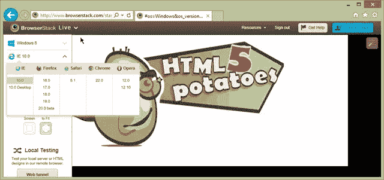

以下大部分分享的结果是在运行 Windows 8 Pro 的华硕 UX31A (Zenbook Touch)超极本上完成的，该超极本采用集成了英特尔 HD4000 GPU 的酷睿 i5 处理器。但我也在诺基亚 Lumia 920、iOS 6.0 下的 iPad 2、Surface RT 和 Xbox 360 上进行了一些测试。我让您在自己的设备上测试共享基准。

## 平均每秒 200，1000 和 5000 个精灵

让我们从测试任意数量的精灵开始，检查你的设备/浏览器将如何处理它。

我插入了一系列基准测试，这些测试将在 640×480 的画布上运行 20 秒的 sprint:200 个没有阴影的精灵，200 个启用了阴影的精灵，1000 个精灵和 5000 个没有阴影的精灵。您可以通过以下链接在一个单独的窗口中运行该基准:[前缀 sprites numbers 系列基准](https://david.blob.core.windows.net/html5/perf/prefixednumbers/index.htm)。只需按下“启动前缀精灵数字系列”按钮，它将运行所有这些。

最后，您将获得所有基准的摘要，并附有分数。分数就是你的设备在 20 秒内能够渲染的帧数。最佳逻辑分数是 1200。因为你可以每秒渲染 60 帧* 20 秒= 1200 帧。我们正在使用可用的`requestAnimationFrame`。因此，有时可能会出现 tick 在 16ms 多一点的时候回调我们，这就是为什么有些情况下会出现 1201，如下图所示:


如果您单击计算的平均 FPS，它将显示在基准测试的整个持续时间内所有即时测量的 FPS 的图形。我们使用著名的 [d3.js](http://d3js.org/) 框架来生成一些 SVG。

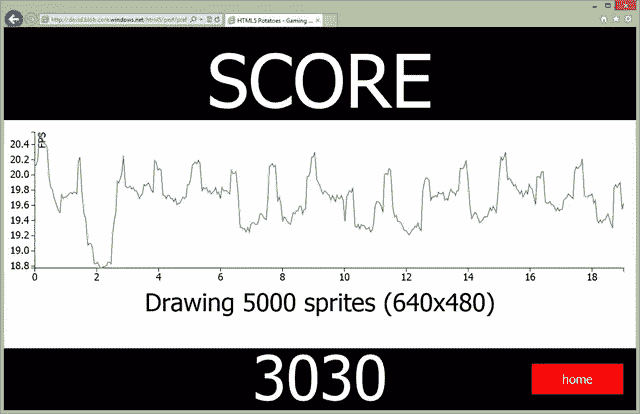

按下“返回”按钮返回到摘要屏幕，或简单地触摸图表。

### 一些结果和分析

我首先在装有 IE10、Chrome 26 和 Firefox 20 的 Windows 8 机器上运行了这个基准测试，所有这些机器都启用了硬件加速。好消息是，所有现代桌面浏览器都有一些非常好的硬件加速层。IE10 似乎有最好的总体分数(我的机器上是 3030)，但不能像 Chrome 一样处理阴影(平均 27 FPS，200 个精灵，而 IE10 是 12)。Chrome 整体得分 2870。它不能在我的屏幕上保持 1000 个精灵 60 FPS，而 IE10 和 Firefox 实现这一点没有任何问题。火狐 20 整体得分 2913。最困难的测试是处理 200 个有阴影的精灵(平均每秒 6 帧，IE10 和 Chrome 分别是 12 帧和 27 帧)。除此之外，它的分数与 IE10 完全相同。

那么，现阶段我们应该得出什么结论呢？首先，你绝对不应该对你的用户说:“请改用这个浏览器”，因为我们在这里谈论的是为网络和所有平台开发游戏。用户不应该让他们的用法适应你的代码，你的代码应该让自己适应用户在网络上的用法。如果你正在开发一款只针对 Windows 应用商店应用的游戏，情况就不同了。在这种情况下，您只需以 IE10 为基准来确定您的资产限额。

但是，如果我们从总体上考虑网络，我们会发现，在我的台式机上，所有的浏览器都能以 60 FPS 的速度轻松处理 500 到 1000 个精灵。如果我们想保持一个好的帧速率，我们绝对不应该使用阴影。对于像我这样的以集成英特尔 GPU 为目标的 HTML5 桌面游戏，你可以在屏幕上使用不到 1000 个动画精灵，没有任何问题。请记住，这个测试不考虑一些碰撞测试和/或物理引擎的影响。但它已经给出了一些有趣的数据。

在移动端，我在我的诺基亚 Lumia 920 上运行过相同的系列(Windows Phone 8 嵌入了 IE10)。它可以在没有阴影的情况下保持 200 个精灵平均 36 FPS。激活阴影是不可行的，因为我们正以每秒 1 帧的速度下降。

所以，我们已经有一些有趣的信息需要消化。相同的渲染和 JavaScript 引擎(IE10)能够在使用集成 GPU 的台式 PC 上以 60 FPS 显示 1000 个精灵，但对于像当前 ARM 架构这样的低端硬件来说，200 个精灵已经太多了。移动设备和桌面设备之间存在 5X 到 10 倍的性能差异。所以现在的下一步是找到保持 60 FPS(为了良好的桌面体验)和 30 FPS(为了相对良好的移动体验)的最佳精灵数量。

## 每秒 30 帧和 60 帧的最佳精灵数量

为了帮助你找到保持 30 或 60 FPS 目标的最佳数量的精灵，我建立了以下基准系列:[启动 30 和 60 FPS 目标系列](https://david.blob.core.windows.net/html5/perf/dynamicnumbers/index.htm)。

### 一些结果和分析

这次最后提供的分数是维持 30 或 60 FPS 的最佳精灵数量。在我的 Windows 8 华硕机器上的 IE10 上，HD4000 能够以 30 FPS 显示 3750+子画面，以 60 FPS 显示 1600 个子画面。在我运行 Windows Phone 8 的诺基亚 Lumia 920 上，IE10 能够以 30 FPS 的速度显示 286 个精灵，以 60 FPS 的速度显示 75 个精灵。在 Surface RT 上，IE10 能够以 30 FPS 的速度显示 370+个精灵，以 60 FPS 的速度显示 100+个精灵。

我们的桌面精灵数量从 1600 个下降到了 75 个！

我甚至走得更远:我对 Xbox 360 上可用的 IE 版本进行了基准测试。的确，我们可以想象构建一个运行在 Xbox 360 浏览器内部的 HTML5 游戏。举个例子，我已经在我的游戏中做到了。可以在这里测试一下:[http://aka.ms/platformer](https://david.blob.core.windows.net/techdays2013/platformer/index.html)。你可以用游戏手柄玩游戏，我们有 60+ FPS！借助 Hand，您还可以在移动/桌面触摸设备上玩游戏。JS(更多细节请点击:[借助 Hand，创建一个通用的虚拟触摸操纵杆，适用于所有触摸模式。JS](http://blogs.msdn.com/b/davrous/archive/2013/02/22/creating-an-universal-virtual-touch-joystick-working-for-all-touch-models-thanks-to-hand-js.aspx) 。

让我们以 30/60 FPS 目标系列为基准:

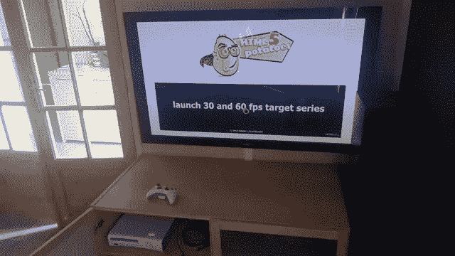

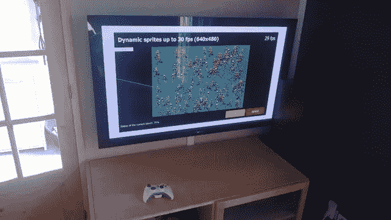

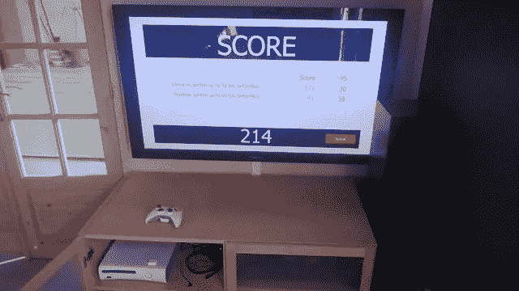

Xbox 360 可以显示 171 个精灵以保持 30 FPS，43 个以保持 60 FPS。

所以，使用 Internet Explorer 作为对比的基础，华硕 Zenbook > Surface RT >诺基亚 Lumia 920 > Xbox 360 在带有 sprites 动画的 HTML5 游戏中保持 60 FPS。

我也很好奇改变另一个参数来证实我的一些想法。我确信提升我的 HTML5 游戏性能的最重要的硬件是 GPU。事实上，所有现代浏览器现在都大量使用它们来卸载布局引擎需要完成的工作。我需要有同样的机器有 2 个可用的 GPU。其他一切都应该保持不变(CPU、内存、硬盘、屏幕分辨率等)。为此，我一直在使用索尼 Vaio Z13，它配备了英特尔酷睿 i7 Sandy Bridge 处理器，集成了 HD3000 GPU 和独立的 nVidia GT330m GPU。

使用英特尔 HD3000，Vaio 能够以 30 FPS 显示 2900 个子画面，以 60 FPS 显示 1100 个子画面。使用 nVidia GT330m，同样的 Vaio 能够以 30 FPS 显示 5400 个精灵，以 60 FPS 显示 2500 个精灵。然后，通过从英特尔 GPU 切换到英伟达 GPU，我们的 X2 性能大约有所提升。GPU 对于 HTML5 游戏，甚至对于 2D 画布游戏都非常重要。

| **被测设备** | **每秒 30 帧的最大精灵数** | **每秒 60 帧的最大精灵数** |
| 带 HD4000 的华硕 Zenbook | Three thousand seven hundred and fifty | One thousand six hundred |
| 配备 HD3000 的索尼 Vaio Z13 | Two thousand nine hundred | One thousand one hundred |
| 索尼 Vaio Z13 搭配 GT330m | Five thousand four hundred | Two thousand five hundred |
| 表面 RT | Three hundred and seventy | One hundred |
| 诺基亚雪 920 | Two hundred and eighty-six | Seventy-five |
| xbox360 | One hundred and seventy-one | Forty-three |

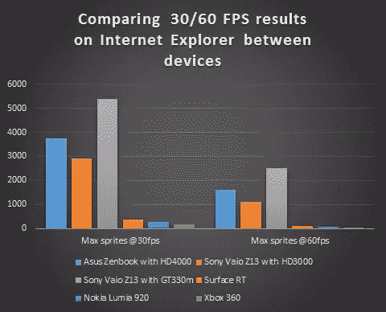

### 结论

你有三个选择来构建一个跨平台的游戏，在任何地方都能运行良好。你可以选择最低的值(这里是 43 个精灵)，永远不要在屏幕上放置超过这个数量的精灵，以确保在 Xbox 360，Windows Phone 8，Surface RT 和运行 HD4000 GPUs 的 Windows 8 机器上到处都有 60 FPS。当然，您需要在您的其他目标平台上运行相同的基准:Android 平板电脑和手机、iOS 平板电脑和手机等等，以找到最佳的幻数。

采取第一种选择是最容易的，但是遗憾的是台式机没有得到充分利用。第二个选择是构建游戏的两个版本(就像你的网站的两个版本):一个用于手机，一个用于电话。您可以根据每个平台的性能来调整图形的复杂性。或者，您也可以在移动设备上将最佳数字设定为 30 FPS，这样您就可以确保在桌面上运行@60 FPS。接下来的想法是在手机/平板电脑上达到 30 帧/秒，在桌面上达到 60 帧/秒。

最后，第三个也是最后一个选项是构建一个游戏引擎，它可以根据检测到的性能动态调整图形引擎的复杂性。这是一些游戏工作室经常在 PC 上做的事情。这需要更多的工作，当然，你还需要决定在不影响全球游戏性的情况下，游戏中显示或不显示什么样的资源。

但是今天，如果你的目标是移动市场，做这样的基准测试是非常重要的。使用“移动优先”的方法，否则在优化这些较低 GPU 的性能时会遇到麻烦。

## 画布分辨率的影响

这一次，我们将始终显示相同数量的精灵(500)，但我们将改变画布的分辨率:320×200，640×480，1024×768 和 1920×1080。我确信，提高分辨率肯定会降低平均 FPS，即使只是为了显示一些动画精灵。那么，让我们通过这个链接来检查一下:[启动各种画布分辨率系列](https://david.blob.core.windows.net/html5/perf/variousresolutions/index.htm)。

### 一些结果和分析

好吧，看看我机器上 IE10 的结果:

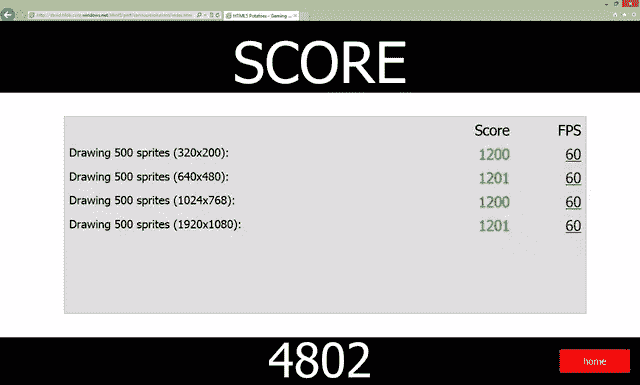

在我的机器上，各种分辨率对平均帧速率没有影响！这一点在我的移动 WP8 设备和 Xbox 360 上也得到了证实。只有 Chrome 的平均 FPS 更低，只有 320×200，原因不明。这似乎不符合逻辑。但这可能是因为一个我不知道的特定优化。我在几个设备上测试的 Firefox 和所有其他渲染/JavaScript 引擎都提供了相同的结果:在我的场景中，分辨率对全局性能没有影响。

也请注意，这并不意味着你不应该为你的全局性能关心你的画布的分辨率。这只是意味着对于精灵动画，在这个特定的基准下，分辨率没有影响。即使在移动平台上，GPU 似乎也能毫无问题地承担负载。我对这些初步结果感到非常惊讶，所以我做了进一步的测试和基准测试。

为了仔细检查 GPU 是否饱和，我有以下想法。我有一台嵌入了两个 GPU 的笔记本电脑，一台索尼 Vaio Z13。它拥有英伟达 GT330m 和英特尔 HD3000 集成 GPU。英特尔 HD3000 包含多达 12 个标量 128 位执行单元，而 nVidia GT330m 包含 48 个 128 位执行单元。

还有一些工具可以帮助检查 GPU 的负载。例如， [GPU-Z](http://www.techpowerup.com/gpuz/) 可以为你提供实时的 GPU 负载。然后，我首先在 nVidia GPU 上运行了最后一个基准系列，GPU-Z 在“Sensors”选项卡上打开，以验证 GPU 负载:320×200 时 15%，640×480 时 30%，1024×768 时 25%，1920×1080 时 55%(不要问我为什么 1024 年比 640 年低，我真的不知道)。

然后，我在 HD3000 上重新运行了相同的基准测试:320×200 时为 30%，640×480 时为 40%，1024×768 时为 62%，1920×1080 时为 100%。从逻辑上来说，这一次，平均 FPS 从 320×200 –> 1024×768 中的 60 FPS 下降到 1080p 中的 55 FPS。

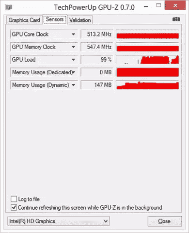

低于 60 FPS 是因为我们陷入了 GPU 受限的场景。除了降低渲染分辨率和/或显示更少的精灵之外，你什么也做不了。顺便说一下，我已经做了一些测试，并使用了“硬件扩展”，如本文所述:[释放 HTML 5 Canvas 的游戏能力](http://blogs.msdn.com/b/eternalcoding/archive/2012/03/22/unleash-the-power-of-html-5-canvas-for-gaming-part-1.aspx)，对全球平均 FPS 几乎没有影响，因为即使在移动设备上，今天的 GPU 也似乎毫不费力地完成了这项操作。这是一个非常好的选择。如果由于 GPU 负载过高而导致帧速率过低，请尝试以较低的分辨率渲染画布，并使用这种硬件缩放方法将其全屏拉伸。

可能会出现由于 CPU 受限而导致帧丢失的情况。为了监控这一点，您需要像最近的浏览器中嵌入的分析器工具。然后，您将看到您应该努力工作以重新获得一些 FPS 的代码部分。您需要避免 GPU 等待 CPU 完成工作的时间过长。例如，有些情况可以使用 [HTML5 Web Workers](http://blogs.msdn.com/b/davrous/archive/2011/07/15/introduction-to-the-html5-web-workers-the-javascript-multithreading-approach.aspx) 进行优化。

但是我也发现了一些非常特殊的情况，低于 60 FPS 是由于更复杂的原因。这是其中之一:GPU-Z 显示 GPU 负载约为 50%，但 FPS 低于 60 FPS。使用 IE10 中包含的 F12 工具来分析代码会显示以下结果:

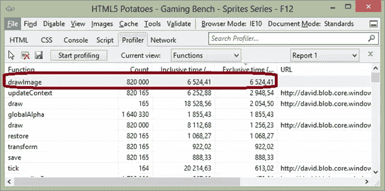

它将显示您仅受`drawImage`功能的限制。`drawImage`是浏览器处理的原生函数。大概是混合了 CPU 使用和 GPU 使用。你不能在 JavaScript 的这个层次优化这个部分。所以，你只需要处理它！

### 更进一步

您可以查看一下 [Windows 性能工具包](http://msdn.microsoft.com/en-us/library/windows/desktop/jj585574(v=vs.85).aspx)中可用的工具集，并阅读以下方法:[使用 Windows 性能工具测量浏览器性能](http://blogs.msdn.com/b/ie/archive/2010/06/21/measuring-browser-performance-with-the-windows-performance-tools.aspx)。

你可能也想知道为什么我们有这么轻微的 FPS 下降，即使是相对稳定的 60 平均 FPS:

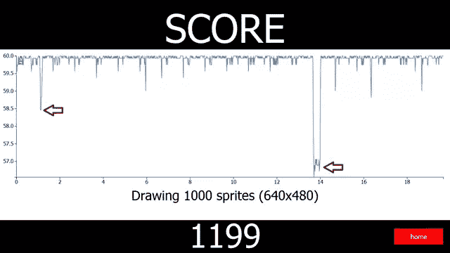

和大卫·卡图赫一起，我们有了一个精确的想法。但是最好能够验证它。然后，我使用了以下方法:

*   创建一个空白的 Visual Studio 2012 Windows 应用商店应用程序项目。事实上，由于 Windows 8 使用 IE10 在 HTML5 中运行 Windows Store 应用程序，我只需复制/粘贴其中一个基准的代码，就可以让 Visual Studio 分析 Windows Store 应用程序了。:)如果你愿意，可以在这里下载这个测试项目:[html 5 potatoesmodernapp . zip](https://david.blob.core.windows.net/html5/perf/HTML5PotatoesModernApp.zip)
*   我设置了一个独特的工作台，显示 1000 个精灵，并进入“分析”“>“JavaScript 分析”“>“UI 响应性”“>“启动启动项目”:

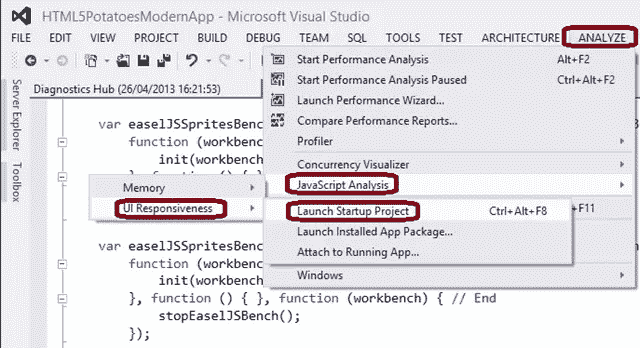

经过一些处理后，您将获得这样的结果:

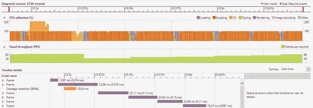

我们可以看到，这是 GC，它对某些帧的丢失负责。我记得在这篇文章中读到过关于 GC 的有趣细节:[我们快了吗？](http://phoboslab.org/log/2011/08/are-we-fast-yet)与这个其他基准相关联:[html 5-基准](http://html5-benchmark.com/)。

### 结论

你知道我最喜欢这个故事的什么吗？即使有 HTML5 这样的高层，理解目标架构也能帮助你优化 HTML5 游戏的代码。

这确实是你应该记住的，来构建你的游戏，这些游戏应该可以在所有 HTML5 兼容的设备上扩展。现在可以有一个独特的代码库在任何地方运行。但是布局和 JavaScript 兼容性只是故事的一小部分。你需要知道你要瞄准哪些设备，了解它们的局限性和 GPU 特性，并最终对它们进行基准测试，以便为你的游戏做出合适的设计决策。

我真的希望这篇文章和我们的基准框架能对你未来的 HTML5 游戏有所帮助。我们将很快就 HTML5 游戏的其他重要主题撰写类似的文章。

本文是来自 Internet Explorer 团队的 HTML5 技术系列的一部分。用免费的虚拟机@ [尝试一下本文中的概念。即](http://www.modern.ie/en-us)。

## 分享这篇文章