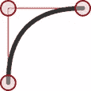
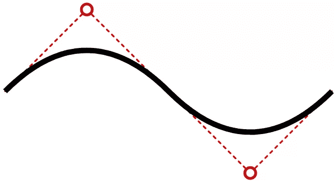

# 如何在 HTML5 SVGs 上绘制二次贝塞尔曲线

> 原文：<https://www.sitepoint.com/html5-svg-quadratic-curves/>

**文章“[如何在 SVGs](https://www.sitepoint.com/svg-path-element/) 中创建复杂路径”研究了`<path>`元素，并展示了如何绘制一系列直线和圆弧来创建任何形状。(它通常用于复制字体，而不需要下载完整的字体。)**

属性提供了一些绘制平滑曲线的额外技巧。在本文中，我们将讨论二次贝塞尔曲线，但是您也可以参考“[如何在 SVG 图像上绘制三次贝塞尔曲线](https://www.sitepoint.com/html5-svg-cubic-curves/)”来获得更复杂的选项。

## 什么是二次贝塞尔曲线？

二次曲线有一个起点(P0)和一个终点(P2)。单个控制点(P1)决定了线条的曲率。[维基百科的贝塞尔曲线页面](https://en.wikipedia.org/wiki/B%C3%A9zier_curve)提供了一个很好的世代图解:


[图片来源](https://upload.wikimedia.org/wikipedia/commons/3/3d/B%C3%A9zier_2_big.gif)

数学忍者们还可以在 [WolframMathWorld](http://mathworld.wolfram.com/QuadraticCurve.html) 检查诱发偏头痛的方程式。

二次曲线非常适合绘制平滑的边缘。正如您在此图中看到的，很容易指定通常会出现方形边缘的控制点:



## 错综复杂的道路

使用 SVG path `d`属性中的`Q`指令定义二次贝塞尔曲线:

```
<path d="M100,250 Q250,100 400,250" /> 
```

初始的`M`指令将笔移动到第一个点(`100,250`)。`Q`后有两个坐标:单个控制点(`250,100`)和绘制的最终点(`400,250`)。

你也可以用小写的`q`来表示相对坐标而不是绝对坐标。下面的曲线是相同的，可能更容易编码:

```
<path d="M100,250 q150,-150 300,0" /> 
```

最后，还有简写的`T`和`t`指令(和往常一样，小写选项表示相对坐标而不是绝对坐标)。这些函数接受更多的结束坐标来将多条曲线串在一起。控制点是从最后一个用于保证完全平滑的连续曲线中推断出来的。例如，走这条路:

```
<path d="M100,250 Q250,100 400,250 T700,250" /> 
```

它画一条从`100,250`到`400,250`的曲线，控制点在`250,100`。绘制另一条曲线，在`700,250`结束，控制点被推断为`550,400`。



推断出的控制点在数学上是正确的，但并不总是你所需要的！

二次贝塞尔曲线可能有点难以编码和可视化，因此这个快速生成工具将为您生成`<path>`代码:

参见 [CodePen](https://codepen.io) 上的笔 [SVG 二次贝塞尔曲线路径创建工具](https://codepen.io/SitePoint/pen/dypyZxy)by site point([@ site point](https://codepen.io/SitePoint))
。