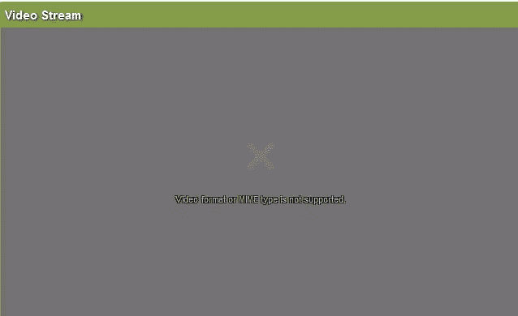

# HTML5 视频 RTSP 直播流

> 原文：<https://www.sitepoint.com/html5-video-rtsp-live-streams/>

我对使用 HTML5 播放 RTSP 现场视频流做了一些研究，看起来 HTML5 目前不支持 RTSP/RTMP 格式。这就是使用 HTML5 显示普通视频的方式。

```
//HTML5 Video Tag
$("#fms").html('<video id="sampleMovie" src="rtsp://feedurl" width="640" height="360" controls="">');</video>
```

因此，播放直播流的**选项如下:**

```
1\. Realplayer
2\. Quicktime player
3\. Flowplayer
4\. VLC player

```



**相关帖子:**

*   [**Flowplayer 动态视频大小**](http://www.jquery4u.com/flowplayer/flowplayer-dynamic-video-size/)
*   [**使用 jQuery 嵌入电影使用 Flowplayer**](http://www.jquery4u.com/flowplayer/jquery-embed-movie-flowplayer/)

## 分享这篇文章