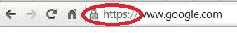

# HTTPS 基础知识

> 原文：<https://www.sitepoint.com/https-basics/>

## 什么是 HTTPS？

安全超文本传输协议或 SSL 上的超文本传输协议用于网络上的安全通信，或者更重要的是互联网上的安全通信。当你访问一个使用 HTTPS 的页面时，你会在 URI 中看到`https://`，在浏览器中看到一个锁图标。



如果你想知道你的网站是否以及如何实现 HTTPS，我们将在这篇文章中通过简要描述 HTTPS 是什么，为什么以及如何实现它来试图澄清这个问题。

### 为什么去 HTTPS？

考虑开发一个电子商务网站，要求用户输入敏感信息，如信用卡详细信息，以便进行在线交易。如果信息按原样在互联网上传播并被某人截获，它很容易被理解和滥用。这就是 HTTPS 的用武之地——如果你需要防止这类威胁，你需要去 HTTPS。

HTTPS 答应你两件事:首先，通过应用加密机制将敏感数据加密成乱码，只有您的服务器(证书所有者)才能解密该加密机制。现在，如果用[中间人](http://en.wikipedia.org/wiki/Man-in-the-middle_attack)攻击拦截这些信息，就没有意义了。其次，HTTPS 认证该网站是它所声称的网站。在你的情况下，它会在发送用户的加密信用卡信息之前验证你的网站，这样就没有人能模仿你了。

因此，去 HTTPS 认证您的网站，并保护敏感信息在互联网上传播。这在证书和加密的帮助下成为可能。

*   证书

    为了让你去 HTTPS，你需要一个证书。它是您的网站提交的数字文档，用于向用户(web 浏览器)表明您的身份。证书是由被称为证书颁发机构(CA)的公司颁发的，它将对您的网络相关信息进行加密，如您的域名、服务器平台和身份信息，如公司名称、地址、电话号码等。在证书内。您可能想知道浏览器如何信任证书。所有浏览器都带有一组预安装的信息，让它们知道可信任的证书颁发机构。当你去 HTTPS 时，你会在你的服务器上有你的证书，它会被发送给你的用户，他的浏览器会认证你。

*   加密

    我们知道，HTTPS 在通过互联网发送数据之前会对数据进行加密，然后由服务器解密。在加密-解密场景中，涉及到一对密钥。一个是公的，一个是私的。当您的网站希望您的用户发送信息时，您的服务器会指示用户的浏览器使用一个密钥(public)来加密要发送的数据。一旦收到加密的消息，服务器将使用它的私钥来解密和理解数据。在 HTTPS，任何用公钥加密的纯文本只能由私钥持有者解密。

那么我们如何实现这一点呢？

### 如何去 HTTPS

要访问 HTTPS，您需要在服务器上安装一个证书。证书可以是自签名的，也可以是第三方签名的。自签名证书是由自己签名的证书，不受浏览器信任。当用户访问来自具有自签名证书的服务器的安全网页时，会看到一条警告。但是，如果您想通过安全的连接免费测试您的应用程序，或者如果您想在内部网中建立安全的连接，那么它将非常有用。另一方面，第三方签署的证书由浏览器信任的 CA 验证和发布。这将花费你每年，价格从 10 美元到数百美元不等，取决于证书提供的某些功能。

要获得证书，您需要一个私钥和一个证书签名请求(CSR)。这些都是在你的网站托管服务器上生成的。在前面的加密部分，我们看到了私钥的作用。CSR 只是一个需要提交以获得证书的请求。当您生成 CSR 时，您将输入您的身份信息，如企业名称、位置等。

假设您获得了一个由某个浏览器或浏览器版本不信任的 CA 签署的证书。这种情况很少发生，但是如果发生，您的用户会看到“连接不可信”的消息。为了防止这种情况，您的 CA 将提供另一个称为链证书的证书。这个有一个可信的 CA 链，可以验证您的 CA 和提供的证书。

### 安装自签名证书

SSLShopper 网站上的一篇文章向您解释了如何在 Apache 服务器上安装自签名证书。它还更多地谈到了自签名证书。[如果你想要 IIS 7 中的证书，看这里](http://www.sslshopper.com/article-how-to-create-a-self-signed-certificate-in-iis-7.html)。

如果您的网站位于共享主机上，您可以使用前端功能进行安装。C 面板文档探讨了如何使用 C 面板和 WHM 来实现这一点。大多数情况下，无论证书是什么类型，主机提供商都会要求您提供安装证书的请求。

#### 安装由 CA 签名的证书

您也可以从像 [Verisign](http://www.verisign.com/) 这样的 CA 购买一个证书，并在您为商业用途部署您的站点时将其安装在您的服务器上。这个 [SSL 安装指南](http://www.sslshopper.com/ssl-certificate-installation.html)将对你拥有的任何服务器有所帮助。CA 也可以通过电子邮件和证书向您发送安装说明或其支持页面的参考。

如果你的网站是在共享主机上，你可以看看 C 面板文档和你的主机提供商的帮助。

我还想向您展示 BlueHost 如何在[上解释如何获得自签名证书](https://my.bluehost.com/cgi/help/560)以及[如何在其主机中获得 CA 签名证书](https://my.bluehost.com/cgi/help/204)。

## HTTPS 安装完毕，下一步是什么？

HTTPS 做好准备后，你需要对你的网站和服务器做一些修改，以使其正常工作，这个过程简单明了。

在你的网站中，需要安全通信的页面必须在开头读 https://而不是 http://。例如，如果你想让页面[http://mydomain.com/checkout.php](http://mydomain.com/checkout.php)安全地加载；你需要将你网站上该页面的所有链接都改成 https://mydomain.com/checkout.php 的。
除此之外，您还需要添加一个服务器设置来自动重定向那些试图通过不安全的 URIs 访问安全页面的用户。例如，试图使用 http://访问上述页面(checkout.php)的用户应该被路由到 https://。让我们看看如何在 Apache 上做到这一点。

为此，请将下面的代码添加到。htaccess 文件，

```
RewriteEngine  On  RewriteCond  %{HTTPS} off RewriteRule  (.*) https://%{HTTP_HOST}%{REQUEST_URI}
```

但是，这会将您的所有网页重定向到 https://。如果您只需要重定向特定的页面，最好的方法是将这些文件放在一个文件夹中，或者通过应用程序的路由器进行特殊路由，并使用如下规则:

```
RewriteEngine  On  RewriteCond  %{HTTPS} off RewriteRule  ^/?securepage/(.*) https://%{SERVER_NAME}/secureFolder/$1 [R,L]
```

如果使用 http://访问此文件夹中的文件，此规则将使用 https://重定向这些文件。这当然是一种预防措施，即使用户通常不会手动更改协议，除非他们的意图是不光彩的。

我们还需要做一件事。可以有资源(图像，css 文件等。)不安全地加载到您的安全页面上。要解决这个问题，只需将这些文件的 http://替换为//，例如:

```
link rel="stylesheet" href="http://mysite.com/css/style.css"
```

应该读作，

```
link rel="stylesheet" href="//mysite.com/css/style.css"
```

你完了！最佳做法是使用不同的浏览器访问您的安全页面，并确保一切正常。您可能会在浏览器中看到锁图标。你也可以点击它获得更多信息。

## 结论

在这篇文章中，我们讨论了什么是 HTTPS，为什么要去 HTTPS，以及如何实现它。我们还研究了一些基本的技术问题，以了解 HTTPS 是如何工作的。希望这有助于你清楚地了解 HTTPS 是什么，以及如何与它合作。非常欢迎您的反馈！

## 分享这篇文章