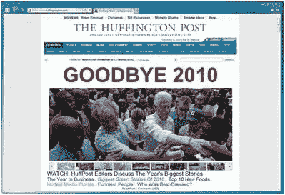
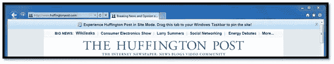
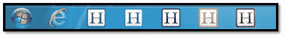
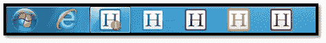
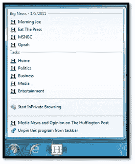
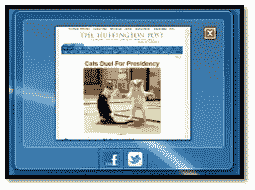

# 赫芬顿邮报+钉住网站:重塑重大新闻体验

> 原文：<https://www.sitepoint.com/huffpost-pinned-sites-reinventing-the-big-news-experience/>

《赫芬顿邮报》是一家领先的社会新闻和观点网站——“互联网报纸”《赫芬顿邮报》涵盖一切——政治、媒体、商业、娱乐、生活、时尚、可持续的“绿色”生活、世界新闻、技术、非营利组织、大学生活、书籍、教育、宗教、旅游、艺术、美食、喜剧:它是新闻、博客和原创内容的最佳目的地。该网站每月的独立访问者超过 2600 万。

《赫芬顿邮报》希望为读者提供相关和及时的“大新闻”，并鼓励他们参与评论和社交帖子。利用 Internet Explorer 9 和 Windows 7 开发工具,《赫芬顿邮报》创建了一个身临其境的、类似应用程序的网络体验，具有新的固定网站功能:

*   [收藏夹图标](http://msdn.microsoft.com/en-us/library/gg491740%28VS.85%29.aspx)
*   [跳转列表](http://msdn.microsoft.com/en-us/library/gg491724%28VS.85%29.aspx)
*   [通知](http://msdn.microsoft.com/en-us/library/gg491744%28VS.85%29.aspx)
*   [缩略图工具栏](http://msdn.microsoft.com/en-us/library/gg491730%28VS.85%29.aspx)

对读者和《赫芬顿邮报》的业务来说，这个结果都很棒。锁定网站的用户…

*   花在网站上的时间增加了 49%
*   留在现场的可能性增加了 14%
*   浏览的页面增加了 11%

这正是《赫芬顿邮报》所希望的——更多的参与。

《赫芬顿邮报》的开发人员使用这些工具，通过在用户的 Windows 7 任务栏中设计一个始终活跃的存在来保持读者的回头率，IE9 在全球的份额[超过 20%,在美国接近 30%](http://windowsteamblog.com/ie/b/ie/archive/2011/08/31/internet-explorer-9-reaches-20-usage-share-worldwide-on-windows-7-approaching-30-in-the-us.aspx)。《赫芬顿邮报》首席技术官保罗·贝瑞在[的视频](http://www.youtube.com/watch?v=AvnDZxgIHJI)中描述了他们采取的方法。

想做同样的事情吗？复制《赫芬顿邮报》的开发工作大约需要一天时间。前往 [BuildMyPinnedSite](http://www.buildmypinnedsite.com/) 获取想法和代码样本。一个更简单的版本(具有大部分好处)可以在 15 分钟内完成。

本案例研究中的链接将直接带您到特定的 [MSDN 钉住网站](http://msdn.microsoft.com/en-us/ie/dd797411.aspx)部分，因此您可以更深入地了解细节并查看代码示例和演示。

### 形势

IE9 的核心原则之一是把网站放在用户体验的中心。用户去他们的浏览器是为了访问网站，而不是为了浏览器本身。开发者应该拥有[工具来构建](http://msdn.microsoft.com/en-us/ie/dd797411.aspx)吸引人的用户体验——浏览器不应该碍事。

虽然今天的网络大部分是静态的和以内容为中心的，但越来越多的网站正在出现，它们是交互式的、个性化的和社会化的。很明显，这是当今网络的发展方向。

《赫芬顿邮报》意识到，成功意味着向读者提供相关的、有针对性的本地内容，并鼓励他们贡献自己的内容。这也意味着使用整个 PC 来保持在读者面前——而不是简单地依赖浏览器 URL、搜索或移动应用程序。

《赫芬顿邮报》的开发者很忙。他们专注于网站内容和功能，所以他们没有时间探索每个平台上的每个功能。他们考虑的功能必须是简单的。他们肯定受到**的高度冲击。**而且他们必须立即**提升用户体验**。

以下是《赫芬顿邮报》对功能进行排名的三个标准，以及在考虑新的浏览器功能时你应该问自己的一些问题。

1.  **客户参与度**

*   它是否以及时和相关的方式到达客户手中？
*   这是客户日常工作流程的一部分吗？
*   它是否有助于客户更快地获得我们的内容？
*   它会让我们的客户更深入地体验网站吗？

*   **客户价值**

*   它是否能激励顾客留下来并与顾客互动更久？
*   这是否会增加我们的客户参与广告和优质体验的机会？
*   对客户来说是“前沿”还是“必备”？
*   它是否增强了日常体验？
*   它能建立忠诚度和品牌价值吗？

*   **工程值**

*   从发展的角度看是否简单可持续？
*   它是否建立在一个可靠的、长期的、拥有成熟客户群的平台上？
*   它与企业的使命和价值观同步吗？
*   *底线——在给定项目中使用是否有利可图？*

《赫芬顿邮报》希望他们的网络体验更像一个应用程序。社会参与也是一个优先事项。当读者参与进来时，他们会更频繁地访问网站，更深入地了解网站，停留更长时间。

他们评估了 Internet Explorer 9 固定站点的功能，以了解这些功能将如何影响客户参与度和价值。**他们很快就对“快速取胜”和“身临其境”的潜力感到满意。**

易于实施、标准、性能和可持续性是必备条件，因为平台——以及用于社交整合和移动设备的第三方 APIs 继续消耗他们有限的开发带宽。

### **解决方案**

**简单学习，简单开发。**

开发人员通过 [MSDN IE9 代码样本库](http://msdn.microsoft.com/en-us/library/gg491737%28v=VS.85%29.aspx)和 [IETestDrive Pinned Sites](http://ie.microsoft.com/testdrive/Browser/SitePinning/Default.html) 了解了 IE9 Pinned Site 的实现，其中包括带有“显示代码”弹出窗口的易于理解的场景。

IE9 的[固定站点 API](http://msdn.microsoft.com/library/gg491738%28v=VS.85%29.aspx#the_pinned_site_api_)和[内置 F12 开发者工具](http://www.beautyoftheweb.com/#/productguide/fast/f12-developer-tools)也非常有用。

像许多在线新闻网站一样，赫芬顿邮报主要使用 JavaScript 从他们的内容管理系统发布新闻。这使得基于 JavaScript 的钉住网站功能很容易添加和测试到现有系统中，几乎不需要定制代码。

困难的部分是决定*提供什么*内容以及*什么时候*提供。他们决定展示他们的大新闻版块，因为这是他们区别于竞争新闻网站的地方。

**端到端的努力？离上线还有 3 天。**

*   设计= 2 天，由营销、编辑和产品规划部门共同完成
*   开发= 1 天，1 名开发人员构建、测试和部署

IE9 中的《赫芬顿邮报》是一个干净的、品牌化的体验，它将内容和交互性作为重点。固定网站功能旨在通过浏览器之外的 Windows 7 增加客户参与度。

### IE9 中的《赫芬顿邮报》深度解读

深入体验一下，下面是赫芬顿邮报如何在仅仅 **1 天的时间里，用一个开发者:**改造他们的网站

第一步:根据你当前的品牌观感。

《赫芬顿邮报》使用[固定的网站元数据](http://msdn.microsoft.com/en-us/library/gg491732%28v=VS.85%29.aspx)定义了导航按钮颜色、主页、窗口大小和工具提示。IE9 完成剩下的工作。

第二步:让你的用户知道。那就提醒他们！

《赫芬顿邮报》希望读者使用 IE9 来锁定他们的网站。当用户还没有锁定它时，站点会自动检查，并提示用户拖动标签来锁定它。所有用 **完成的只是** [**15 行代码**](http://msdn.microsoft.com/en-us/library/gg491729%28v=VS.85%29.aspx) 。用户现在可以将选项卡拖到任务栏，并开始固定站点体验。

第三步:在每个任务栏上显示《赫芬顿邮报》。

《赫芬顿邮报》想要一种看起来“干净而闪亮”的品牌体验，就像用户体验中的一部分。他们在 [X-Icon 编辑器](http://ie.microsoft.com/testdrive/Browser/IconEditor/Default.html)中设计了 5 个[收藏夹图标](http://msdn.microsoft.com/en-us/library/gg491740%28v=VS.85%29.aspx)，用的是与每个新闻部分相关的颜色。

读者可以简单地将他们最喜欢的部分直接钉在任务栏上，只需点击一下就可以跳回《赫芬顿邮报》的体验。

第四步:一次又一次地把它们带回来！

新闻瞬息万变。当重大新闻来袭时，读者需要知道。《赫芬顿邮报》希望确保他们的读者是第一位的。通知是一种很好的方式，可以不引人注目地提醒读者突发新闻，而不会产生干扰噪音或不必要的电子邮件。自定义图标覆盖和[工具栏闪烁](http://msdn.microsoft.com/en-us/library/gg491735%28v=VS.85%29.aspx)直接在任务栏上吸引用户的注意力。

第五步:深入了解跳转列表。

当读者发现新内容时，他们会很高兴，赫芬顿邮报希望鼓励他们探索这个网站。

[动态跳转列表](http://msdn.microsoft.com/en-us/library/gg491725%28v=VS.85%29.aspx)包含名人姓名、政治观点或娱乐热点等“热门”关键词，让读者更容易发现有趣的新闻。每个跳转列表由新闻部分个性化，每 15 分钟更新一次。

用户可以右击被锁定的站点来查看新的跳转列表。这有多简单？！？

第六步:使用缩略图工具栏进行社交。

看似很小很简单，却有很大的作用。点击任务栏上的[缩略图工具栏](http://msdn.microsoft.com/en-us/library/gg491726%28v=VS.85%29.aspx)，让**轻松** **【赞】【推特】**故事。用户可以轻松地与朋友分享故事，这反过来又让《赫芬顿邮报》的内容拥有了更大的受众。

### 总结和后续步骤

《赫芬顿邮报》根据*客户价值*与他们的*代码成本*来衡量成功。一个小小的开发投资——一天，一个开发人员——创造一个身临其境的读者体验真的得到了回报。

为 IE9 开发很简单，尤其是当您的目标是直接向客户交付优秀的内容时。释放 Windows 7 和 IE9 的潜力，让您的注意力集中在它应该在的地方——内容，最终是您的客户。

**超过了《赫芬顿邮报》的成功指标！**

《赫芬顿邮报》对小小的努力(1 天，1 个开发者)在读者目标上的回报感到兴奋不已:

**锁定网站的用户…**

*   花在网站上的时间增加了 49%
*   留在现场的可能性增加了 14%
*   浏览的页面增加了 11%

**现场体验好处:**

*   通过让用户一键访问即可锁定他们想要的新闻内容，创造了个性化的体验
*   通过通知提高用户参与度，将用户拉回到他们的“大新闻”中
*   代码成本低，使用现有技术(如 JavaScript)易于维护

**准备好了吗？学习如何做他们做过的事。**

**看看它的实际效果！**

查看 IE9 中的[赫芬顿邮报](http://www.huffingtonpost.com/)。开发人员可以获得大量资源，包括代码示例、技术文档、API 等，如下所示:

*   [建立我的钉住网站](http://www.buildmypinnedsite.com/):关于钉住，你需要知道的一切都在一个地方
*   [MSDN 钉住网站](http://msdn.microsoft.com/en-us/ie/dd797411.aspx):特色与深度开发
*   IE 试驾:演示、测试和代码样本
*   [@IE 在 Twitter 上](http://twitter.com/IE):让你的问题得到解答！
*   探索 IE 博客:很好的例子和操作指南
*   [Web 之美](http://www.beautyoftheweb.com/#/startdeveloping/):IE9 特性和站点实现的完整来源

轻松点击！本案例研究中引用的链接:

**SitePoint Content Partner**

本教程是在微软的支持下完成的。我们努力合作开发对您最有用、最相关的 SitePoint 内容。

*   [www.huffingtonpost.com](http://www.huffingtonpost.com/)
*   [http://www.beautyoftheweb.com/#/startdeveloping/](http://www.beautyoftheweb.com/#/startdeveloping/)
*   [MSDN IE9 代码样本库](http://msdn.microsoft.com/en-us/library/gg491737%28v=VS.85%29.aspx)
*   [IETestDrive 固定站点](http://ie.microsoft.com/testdrive/Browser/SitePinning/Default.html)
*   [固定站点 API](http://msdn.microsoft.com/library/gg491738%28v=VS.85%29.aspx#the_pinned_site_api_)
*   [收藏夹图标](http://msdn.microsoft.com/en-us/library/gg491740%28v=VS.85%29.aspx)
*   [X 图标编辑器](http://ie.microsoft.com/testdrive/Browser/IconEditor/Default.html)
*   [声明固定站点元数据](http://msdn.microsoft.com/en-us/library/gg491732%28v=VS.85%29.aspx)
*   [检测 IE9 和 Windows 7](http://msdn.microsoft.com/en-us/library/gg491733%28v=VS.85%29.aspx)
*   [提示用户锁定站点](http://msdn.microsoft.com/en-us/library/gg491729%28v=VS.85%29.aspx)
*   [创建动态跳转列表](http://msdn.microsoft.com/en-us/library/gg491725%28v=VS.85%29.aspx)
*   [自定义图标覆盖图](http://msdn.microsoft.com/en-us/library/gg491744%28v=VS.85%29.aspx)
*   [工具栏闪烁](http://msdn.microsoft.com/en-us/library/gg491735%28v=VS.85%29.aspx)
*   [缩略图工具栏](http://msdn.microsoft.com/en-us/library/gg491726%28v=VS.85%29.aspx)

## 分享这篇文章