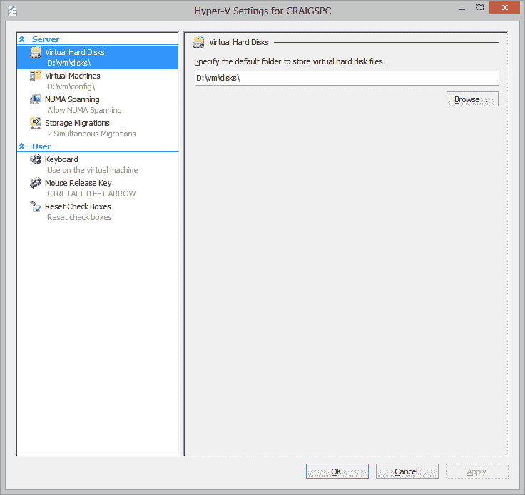
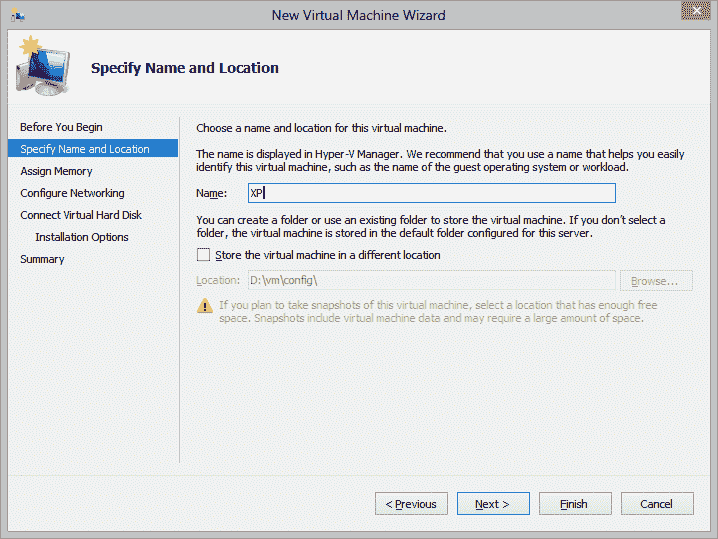
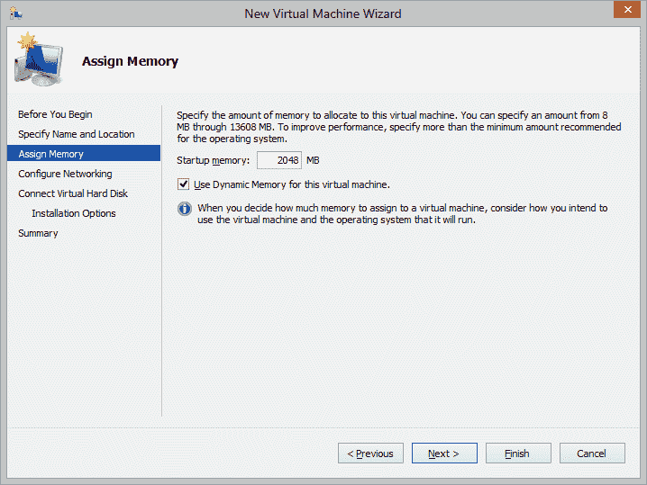
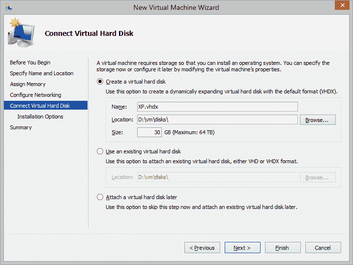
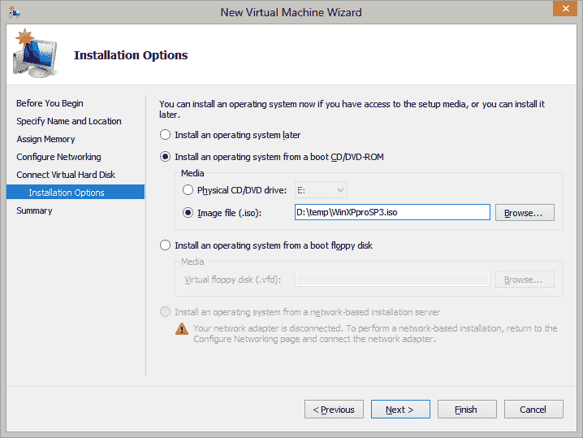
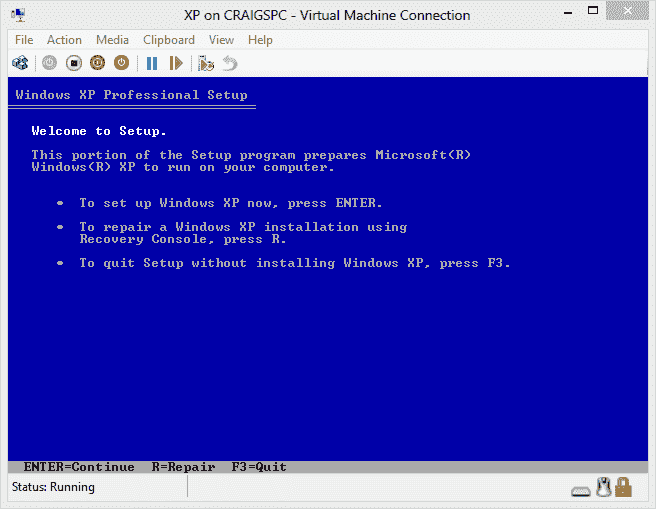
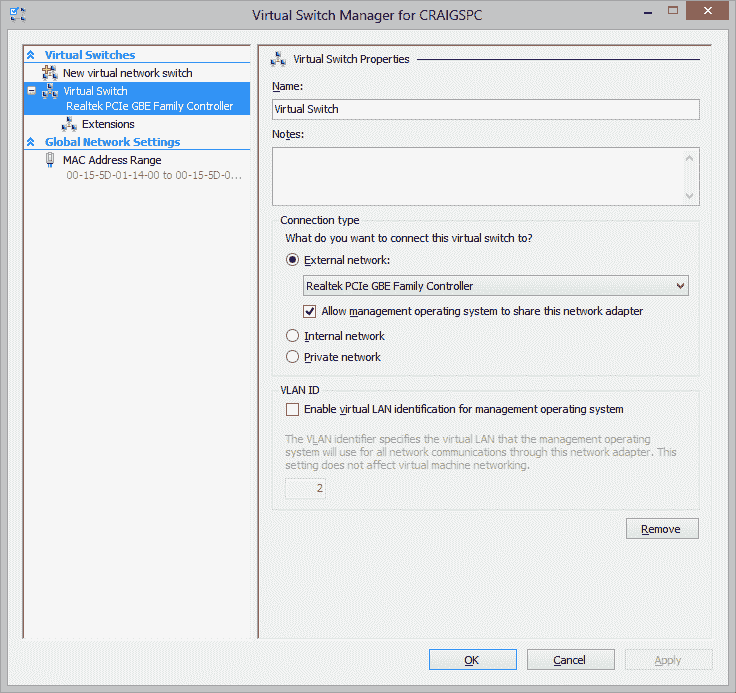
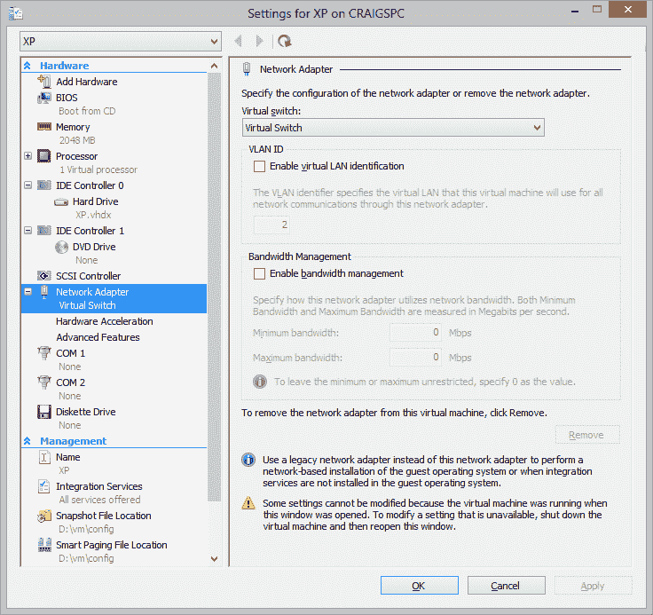

# 如何使用 Hyper-V 虚拟机

> 原文：<https://www.sitepoint.com/hyper-v-virtual-machine-tutorial/>

Hyper-V 是 Windows 8 Pro 和 Windows Server 2008 R2 及更高版本中提供的本机硬件辅助虚拟化平台。本质上，虚拟机是在您的 PC 上运行的 PC 模拟。您在物理主机上安装虚拟机软件，然后启动并安装任意数量的客户操作系统。流行的 VM 软件包括 [VMware](http://www.vmware.com/) 、 [VirtualBox](http://www.virtualbox.org/) 和微软虚拟 PC(在 Windows 7 中用于驱动 [XP 模式](https://www.sitepoint.com/ie6-ie7-ie8-win7-xp-mode/))。

虚拟机对于 web 开发人员至关重要:

1.  它们允许你测试其他浏览器，比如 IE 或者 Linux 的历史版本。
2.  您可以在 Windows 开发 PC 上设置开发服务器，例如带有 Apache、PHP 和 MySQL 的 Linux。

虚拟机是硬盘映像，因此它们的备份、克隆和移动比真正的 PC 要容易得多。此外，大多数虚拟机软件允许您制作快照，以便您可以测试软件或配置，并在发生灾难性故障时恢复。

Hyper-V 有许多优势，包括速度、多核处理器支持和虚拟机引导(用户可以将来宾虚拟机用作日常操作系统，这样他们就不会破坏主机)。但主要优势是虚拟机在后台运行。不需要启动软件；它总是运行和控制你的客户操作系统。同样，不需要打开或连接到来宾操作系统桌面—如果您运行的是开发服务器，您可以像将文件传输到网络上的任何其他设备一样简单地传输文件。

所以让我们来看看使用 Hyper-V 的基础知识。我使用的是 Windows 8，但 Windows Server 也类似。

## 1.启用超级虚拟化

从 Windows 控制面板中，选择**程序和功能**，然后选择**打开或关闭 Windows 功能**。检查 **Hyper-V** 以及所有平台和工具子组件。安装需要几分钟时间。

## 2.配置 Hyper-V 默认值

从开始屏幕(或 Win+Q)，运行 **Hyper-V 管理器**。您可以在**动作** > **Hyper-V 设置**中更改默认设置。

## 3.创建新的虚拟机

要创建新的虚拟机，请选择**操作** > **新建** > **虚拟机…** 。输入虚拟机的名称，并在必要时选择不同的文件位置:

现在输入您希望虚拟机使用的内存量—保持动态，除非您希望指定最大值:

现在，您可以创建或使用现有的硬盘映像，并指定最大大小(它将随着虚拟机需要更多空间而增长):

最后，您可以选择从物理驱动器或 ISO 映像安装操作系统:

点击**完成**完成向导。现在，您可以启动您的虚拟机(在操作窗格中单击**开始**)并安装一个客户操作系统。请记住，这发生在后台；要查看桌面，请在操作窗格中单击**连接…** 。

请注意，虚拟机还不能连接到网络—您可能希望[配置第一个](#network)，以便可以下载更新。

## 4.连接到您的网络

与其他虚拟机软件相比，连接到网络有点不寻常。Hyper-V 创建一个虚拟交换机设备，随后用于所有主机和来宾连接。在右侧操作窗格下，单击**虚拟交换机管理器…** 。选择**外部**，点击**创建虚拟开关**。

分配一个名称(*虚拟交换机*是最好的)，选择用于主机操作系统联网的真实网络适配器，然后点击**应用**。然后可以关闭该对话框。

现在，右键单击您的虚拟机并选择**设置…** (或在操作窗格中单击虚拟机下的设置…)。选择**网络适配器**选项卡，并确保选择了*虚拟交换机*(或其他任何名称)。

重启你的虚拟机，幸运的话，你应该有网络连接。

**网络烦恼？**
许多人都经历过 Hyper-V 访客的网络问题——我也是。建议使用独立的硬件网卡适配器，但这对大多数台式机和笔记本电脑来说是不切实际的。如果您无法连接或连接随机中断，请尝试以下补救措施:

1.  将来宾操作系统配置为使用固定的 IP 地址。
2.  如果仍然失败，在您的物理网卡设置中禁用 *TCP 校验和卸载*和 *UDP 校验和卸载*(它们的名称可能略有不同)。

## 5.连接到您的虚拟机

如上所述，您可以在虚拟机的操作窗格中单击 **Connect…** 来查看桌面。或者，您可以像使用任何联网的 Windows 设备一样使用微软的远程桌面连接工具。

Hyper-V 提供了一些伟大的特性，这将有利于网络开发人员。平台有什么有趣的用途吗？

## 分享这篇文章