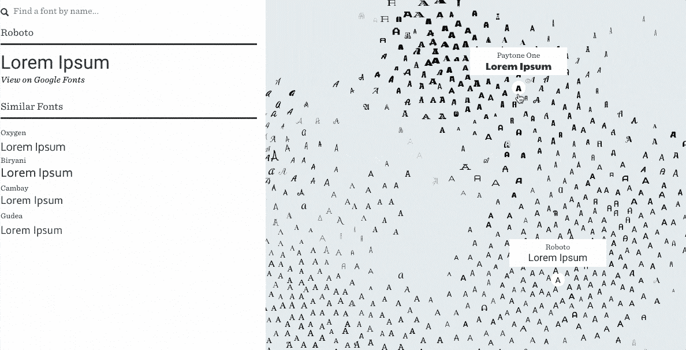
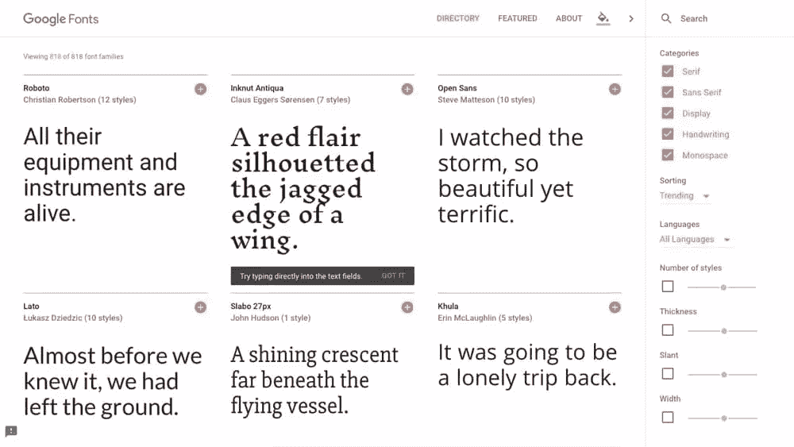
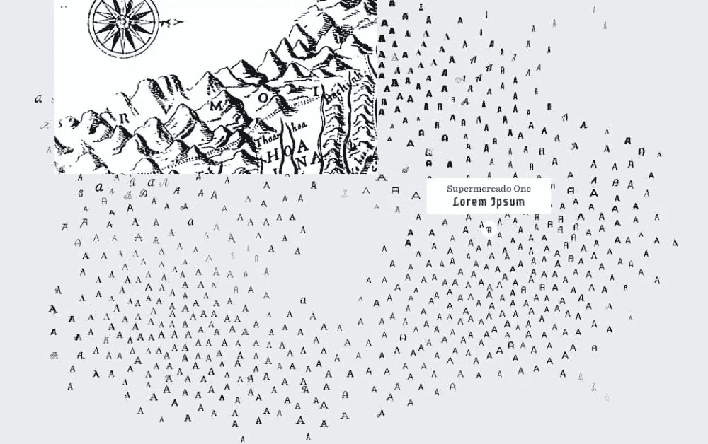
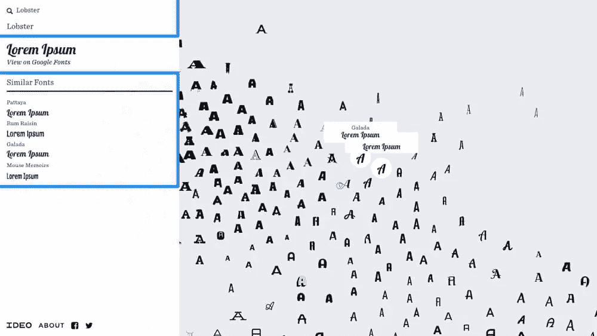

# IDEO 字体地图:寻找最佳谷歌字体的快速方法

> 原文：<https://www.sitepoint.com/ideo-font-map-a-faster-way-to-find-the-best-google-fonts/>

通过图表导航。

你如何应对响应式排版？查看克里斯·沃德新书的第四章，“快速启动响应网页设计，第二版”。

Google Fonts 提供了大量不同的易于嵌入的网络字体。准确的说是 818 种字体！但是你如何在 **818** 选项中找到适合你网页设计的字体呢？即使你使用搜索过滤器(*衬线、无衬线、显示、手写、等宽字体等*)来缩小搜索结果的范围，通常情况下，你还是会在找到正确的结果之前浏览一系列非竞争者。挑选字体可能非常耗时！

进入 [IDEO 字体地图](http://fontmap.ideo.com/)，它智能地使用机器学习将相似的(谷歌)字体分组在数字交互地图上。让我们来看看 IDEO 字体地图与直接使用谷歌字体相比如何。

## 谷歌字体与 IDEO 字体图

尽管谷歌字体使用起来很愉快(它的界面令人耳目一新)，但找到完美的*字体可能需要相当长的时间，因为搜索结果的排序是随机的。此外，导航是线性的——只有一个方向，滚动是到达那里的唯一方法。这是一个滚动，滚动，滚动的问题，直到你找到你需要的字体，*和*，如果你找到一个*几乎*符合要求的字体，就没有“浏览相似”功能。*

不是很省时。

通过机器学习，Font Map 能够在视觉上区分一种字体和另一种字体，并在数字画布上仔细显示每一种字体(让人想起旧的、老式的手绘地图)。

把地图想象成一个国家，字体样本就是当地人。当你在不同的地方旅行时，当地的方言会有细微的变化。在本例中，方言是分布在地图上的不同字体的隐喻。

在西南地区生活着复杂的衬线字体，在东南地区，现代无衬线字体。当你向北旅行时，字体的边缘开始变得有点粗糙。你会在西北地区发现古怪的手写字体，在东北地区发现古怪的显示字体。

有趣的观察:因为字体不能同时是衬线字体和无衬线字体，所以在地图中间有一个空白区域！

## 继续寻找完美的字体

首先快速浏览一下地图，找到一种类似于你正在寻找的字体(或者如果你已经有了字体的想法，在左边的搜索栏中输入)。然后，观察周围的字体，选择一些相似的，但更符合要求的字体。每走一步，你都应该离你要找的字体越来越近！

提示:当你选择一种字体时，你会在边栏中看到“相似字体”以及字体名称和一些 lorem ipsum 样本。

## 结论

有了 [IDEO 字体地图](http://fontmap.ideo.com/)，你就有了一个清晰的方向(*和一张到达那里的地图！*)。有了谷歌字体，你就可以滚动并期待最好的结果。最终结果是一样的，但是字体映射可以帮助您更快地选择字体。

你如何应对响应式排版？查看克里斯·沃德新书的第四章，“快速启动响应网页设计，第二版”。

## 分享这篇文章