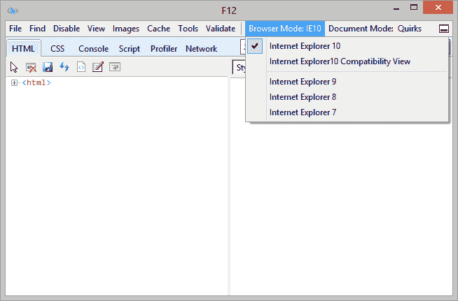
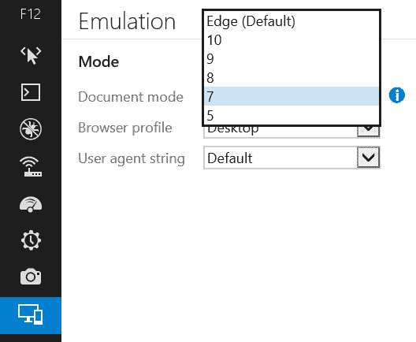

# IE11:浏览器模式返回

> 原文：<https://www.sitepoint.com/ie11-browser-modes-return/>

一个月前，我报道了 IE11 如何移除了[浏览器模式。从 IE8 开始就提供了浏览器模式，通过告诉站点像以前版本的应用程序一样呈现来帮助开发人员快速修复问题:](/ie11-mysterious-missing-browser-modes/)

这些模式旨在帮助公司在开发人员进行修复时继续使用传统的 web 应用程序。

然而，更多的人使用浏览器模式来测试旧的 IE 渲染。我们当然不应该，因为这些模式是对真实浏览器的不可靠模仿。例如，当切换到 IE9 模式时，你可以在 IE10 中找到 CSS3 动画等功能。

许多开发者对微软的决定拍手称快。我做到了。浏览器模式是有缺陷的，给人一种虚假的安全感，而且随着 IE 的改进，已经变得越来越没有必要。

许多开发人员不同意…

> 浏览器模式允许开发人员快速重现用户正在经历的事情，并提供了一种在您自己的环境中测试修复的快速方法，是的，最终的修复应该在非模拟浏览器中测试，但 MS 使这变得很难，因为您不能在一个系统上同时有多个版本的 IE。

尽管浏览器模式是老歌的拙劣替代品，但许多人发现它们对于快速和肮脏的测试很方便。在高速电脑上启动虚拟机可能只需要几秒钟，但浏览器模式几乎是即时的。

不管怎样，他们回来了。微软听取了投诉，并在 Windows 8.1 上的 IE11 中重新实现了浏览器模式(从技术上讲，它们一直潜伏在表面之下，只是隐藏起来了)。我不知道任何官方声明——我是在 Windows 8.1 上修补 IE11 final 进行 SitePoint 审查时偶然发现它们的。

要访问这些模式，请启动 F12 开发人员工具，单击底部的仿真图标，并选择一个**文档模式**——它们不再被命名为“浏览器模式”。

微软做出了正确的决定吗？具有讽刺意味的是，浏览器模式功能的缺乏会阻止一些公司升级 IE9/10。更少的升级意味着需要更长时间来支持老歌。我怀疑他们做得对。

也就是说，请不要使用浏览器模式！我知道它们很方便，但是当真正的 IE8 用户报告你的站点或应用程序的问题时，它们可能会导致更多的问题。

你很高兴看到 IE 浏览器模式的回归吗？

请关注即将在 SitePoint 上发布的 IE11 完整评论…

## 分享这篇文章