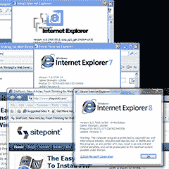

# 如何在 Windows 7 HOME 上运行 IE6、IE7、IE8

> 原文：<https://www.sitepoint.com/ie6-ie7-ie8-windows-7-home/>

我最近的文章[在同一台机器上使用 Windows 7 XP 模式运行 IE6、IE7 和 IE8](https://www.sitepoint.com/article/ie6-ie7-ie8-win7-xp-mode)，提供了在 Windows 7 PC 上安装虚拟 PC 和 XP 模式的说明。不幸的是，它只适用于 Windows 7 的专业版、旗舰版或企业版。

Windows 7 家庭普通版和高级版用户无法使用 XP 模式。这很不幸，因为绝大多数新电脑都安装了这些版本。但是，有一个解决方法允许 Windows 7 家庭开发者使用 XP 模式集成。

**1。检查您电脑的兼容性**

XP 模式需要硬件辅助虚拟化(HAV)。大多数现代处理器都支持这一功能，但可能需要在 BIOS 中启用。打开电脑后，通常立即按 DEL、F2 或 ESC 进入 BIOS 菜单。微软提供了一个有用的 [HAV 检测工具](http://go.microsoft.com/fwlink/?LinkId=163321)，可以帮助你进行 BIOS 配置。

**2。下载虚拟电脑**

您必须从以下位置而不是 Microsoft Virtual PC 网站下载 Virtual PC for Windows 7:

[http://www.microsoft.com/downloads/details.aspx?FamilyID = 2b 6 D5 c 18-1441-47ea-8309-2545 b08e 11 DD](http://www.microsoft.com/downloads/details.aspx?FamilyID=2b6d5c18-1441-47ea-8309-2545b08e11dd)

如果您以前没有安装正版 Windows 验证组件，可能会提示您在浏览器中安装正版 Windows 验证组件。

**3。创建新的虚拟机**

从**启动虚拟机开始** > **程序** > **Windows 虚拟机** > **虚拟机**然后点击工具栏上的**创建虚拟机**。

系统会提示您输入名称、位置、RAM (256MB 足够了)并创建一个新的虚拟硬盘。

**4。在虚拟机中安装 Windows XP**

现在，您需要启动虚拟机，并使用原始 CD 或磁盘映像安装 Windows XP。你还需要一个 XP 许可证——如果你报废或升级了一台电脑，你可能会有一个。

或者，你需要购买一份 Windows XP。OEM 版本通常价格更低，你或许可以在易贝上买到一份，但要确保它是合法的。

您还需要安装最新的更新，包括 SP3。但是，现在还不要安装 IE7 或 IE8！

**5。启用集成**

从虚拟机**工具**菜单中，选择安装**集成组件**。安装完成后，点击**工具** > **启用集成**。

**6。安装 Windows XP SP3 RemoteApp 升级**

在您的 XP VM guest 虚拟机(不是 Windows 7 主机)中，您应该从以下位置下载并安装 RemoteApp 升级:

[http://www.microsoft.com/downloads/details.aspx?FamilyID = 2f 376 f 53-83cf-4e5b-9515-2cb 70662 a 81 b](http://www.microsoft.com/downloads/details.aspx?FamilyID=2f376f53-83cf-4e5b-9515-2cb70662a81b)

**7。配置虚拟机分辨率和颜色深度(可选)**

默认情况下，IE6 和 IE7 将在 16 位颜色模式下运行，您的微妙阴影 web 应用程序可能看起来有点奇怪。要修复它，请参考[原创 XP 模式文章](https://www.sitepoint.com/article/ie6-ie7-ie8-win7-xp-mode)底部第一次运行 XP 模式*的步骤 3。*

**8。创建 IE6 和 IE7 虚拟机和桌面快捷方式**

现在，您可以按照原始 XP 模式文章第 2 页[上的说明，为 IE6 和 IE7 创建两个克隆的虚拟机和 Windows 7 桌面快捷方式。](https://www.sitepoint.com/article/ie6-ie7-ie8-win7-xp-mode/2)

[ *点击放大*](https://blogs.sitepointstatic.cimg/tech/193-ie678-xpmode-ie-fullscreen.png) 

非常感谢 [SitePoint 论坛](https://www.sitepoint.com/forums/showthread.php?t=646482)上的 [**logic_earth**](https://www.sitepoint.com/forums/member.php?u=92236) 为 Windows 7 家庭用户提供了一个伟大的解决方案。

## 您是否在考虑升级 Windows 7？

如果您已经在使用 Windows 7 Home 并且有一个备用的 XP 许可证，上面的解决方案是理想的。然而，如果您正在考虑 Windows 7 升级，购买专业版可能会为您节省时间和金钱。

美国的价格似乎有所下降:

*   [美国微软 Windows 7 专业版升级——175 美元](http://www.amazon.com/exec/obidos/ASIN/B002DHGM50/mswindows7-21)
*   [美国微软 Windows 7 专业版(完整版)——265 美元](http://www.amazon.com/exec/obidos/ASIN/B002DHLVII/mswindows7-21)
*   [美国微软 Windows 7 旗舰版升级——200 美元](http://www.amazon.com/exec/obidos/ASIN/B002DHLV8S/mswindows7-21)
*   [美国微软 Windows 7 旗舰版(完整版)——292 美元](http://www.amazon.com/exec/obidos/ASIN/B002DHGMVY/mswindows7-21)

英国的价格没有明显变化，但完整版的价格与升级版非常相似，而且比美国便宜:

*   [英国微软 Windows 7 专业版升级— 150](http://www.amazon.co.uk/exec/obidos/ASIN/B002DGS82G/mswindows7-21)
*   [英国微软 Windows 7 专业版(完整版)— 150](http://www.amazon.co.uk/exec/obidos/ASIN/B002DUCMTC/mswindows7-21)
*   [英国微软 Windows 7 旗舰版升级— 167](http://www.amazon.co.uk/exec/obidos/ASIN/B002DGS83K/mswindows7-21)
*   [英国微软 Windows 7 旗舰版(完整版)— 170](http://www.amazon.co.uk/exec/obidos/ASIN/B001XCWGII/mswindows7-21)

Windows 7 XP 模式是否减少了你的 IE 测试时间？

## 分享这篇文章