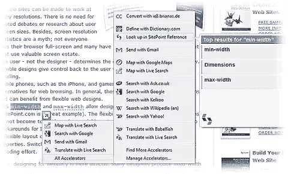

# Internet Explorer 8.0:一个月回顾，第 1 部分

> 原文：<https://www.sitepoint.com/ie8-review-1/>

我要坦白一件事。Internet Explorer 2.0 是我的第一个浏览器，在 2003 年 7 月 Mozilla 发布 Firebird 0.6.1 之前，IE 一直是我的默认浏览器。但是我将永远对 IE 情有独钟——它让我第一次尝到了网络的滋味，并让我着了迷。

IE8 于 2009 年 3 月 20 日发布，很快，大多数 Windows 用户将会收到[自动更新通知](https://www.sitepoint.com/ie8-automatic-update/)。我们听说过速度和令人兴奋的新功能，但 IE8 在日常使用中是什么样的呢？如果你还不想冒险，以下是我在使用一个月后的看法。

## 装置

IE8 在 Vista 上是 [13.2MB 下载，在 XP 上是](http://www.microsoft.com/ie)16.1 MB。在我的 Vista 笔记本电脑上安装花了大约 7 分钟，并需要重新启动。这比竞争对手的浏览器要长得多，但 IE 与系统紧密结合，所以这是有道理的。奇怪的是，没有安装进度条？来吧微软——甚至 IE3 都有！

有用的是，IE8 提供从包括 Firefox 和 Opera 在内的其他浏览器导入书签和设置。没那么有用的是我确定我的 Vista 启动时间慢了几秒？

从好的方面来说，我发现 IE8 很稳定，我没有遇到任何崩溃或意外重启。

## 连接

乍一看，IE8 看起来很像 IE7，我怀疑很少有人会注意到不同之处。我不太喜欢这个界面，但保留它可能比迷惑现有用户要好。默认情况下不显示停止和刷新按钮(IE7 这样做了吗？)我怀疑大多数人不使用它们，专家求助于 Esc 和 F5 键。如果右键单击工具栏，选择“自定义”，然后“在地址栏前显示停止和刷新按钮”，它们会重新出现。

如果你在搜索结果中点击一个链接打开一个新的标签，标签现在会有一点颜色。查看哪些选项卡是相关的是有用的，但是不可能选择使用的颜色。也许更糟糕的是，活动标签和非活动标签之间几乎没有区别，尽管快速标签对于查看所有打开页面的缩略图仍然很方便。

还有几个额外的命令栏选项，主要用于处理网页切片(稍后将详细介绍)和 InPrivate 浏览(也称为“色情模式”)，它隐藏了你的互联网活动。一个受欢迎的变化是“在这个页面上查找”现在是一个工具栏，而不是一个模态对话框。

收藏夹栏上还有一个“建议站点”按钮。根据我的经验，它会在随机的时间间隔内停止工作，奇怪的是，它会要求我禁用它，然后再重新启用它。然而，该按钮的用途有限，主要是为每个站点的*推荐 MSN 和 Hotmail。*

最后，IE8 允许您通过单击新标签屏幕上的链接或选择工具>重新打开上次浏览的会话来恢复上次浏览的会话。非常有用，但是为什么不增加一个选项，让 IE8 在启动时打开最后一个会话呢？

## 新功能和小部件

微软正在大肆宣传 IE8 的两大新功能:网页切片和加速器。像往常一样，微软的命名和营销信息倾向于混淆而不是解释这些创新。简而言之…

**网页快讯**是在大约 300 像素大小的窗口中打开的小网页。通常，它会包含指向网站上最新新闻或文章的链接。您可以将网页快讯添加到收藏夹栏，并浏览网站的最新内容，而无需访问它。

当然，RSS 提要这么做已经很多年了。但是，网页快讯可以包含任何内容，不会让人感到困惑。不过，我有疑问:对于新手来说它们相当复杂，而专家更可能使用 RSS 阅读器。

**加速器**当您高亮显示或右键单击网页上的单词或短语时，可以添加功能，例如翻译、地图查找、给某人发送电子邮件、参考等。

加速器是有用的，范围很广。也就是说，我不确定它们是否值得大肆宣传:加速器只是偶尔节省几秒钟，它们不太可能在其他浏览器中实现。

微软还提供了一个 [IE 插件 gallary](http://www.ieaddons.com/) 。这主要包括加速器、网页快讯、搜索引擎和一些工具栏。大多数都是由商业组织创建的，我怀疑它永远不会有各种各样的[插件可用于 Firefox](https://addons.mozilla.org/) 。这是朝着正确方向迈出的一步，但微软需要公开并记录完整的 IE API，以吸引开发者的兴趣。

另请参见:

*   IE8–一个月回顾，第 2 部分:页面渲染、JavaScript 速度和开发工具。

## 分享这篇文章