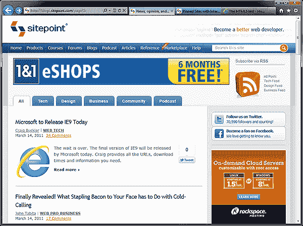
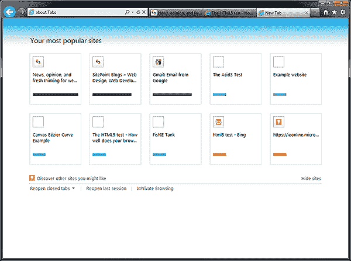

# Internet Explorer 9.0:第 1 周回顾

> 原文：<https://www.sitepoint.com/ie9-review/>

据微软报道，自从 IE9 上周发布以来，每秒钟有 27 次下载。我不怀疑这一点:这款浏览器受到了大量宣传，公司也在大力推广。在过去的 7 天里，我一直在使用 IE9。好吃吗？它已经成为我的默认浏览器了吗？请继续阅读…

## IE9 安装

微软紧随 Chrome 的脚步，推出了 530KB 的小型浏览器下载。在安装时，这需要另外的 20MB，在合理的网络连接下大约需要 5 分钟。

微软努力尝试取消重启，这是 IE4 以来的一个要求。他们成功了……在某种程度上。IE9 安装程序会要求你关闭几乎所有的应用程序——包括其他浏览器和后台进程。对我来说，重启更容易。

总之，完整的下载、安装和重启不到 10 分钟。这没有它的竞争对手快，但也不离谱。

## IE9 接口

自从第一个测试版以来，界面变化很小，但是现有的 IE 用户会被稀疏的布局所震惊:

默认安装有一个工具栏，包括:

*   大的后退和前进按钮
*   IE 的*“one box”*——微软对 Chrome 的 Omnibox 或者 Firefox 的牛逼吧的(更好的)称呼。它包含突出显示域名的 URL、搜索图标、HTTPS 挂锁图标、兼容性视图图标、刷新和停止图标。
*   标签。早期的评论提到了标签页的可用空间很小。微软已经用右击选项在单独的一行显示标签来回应批评。不同寻常的是，标签出现在地址栏的下面——就像其他供应商把它们移到上面一样。
*   主页、收藏夹和工具图标。

和 Chrome 一样，IE9 不会在应用程序的标题栏显示页面标题。有空间，但微软选择了简单。

如果你爱 IE7 和 8 *(肯定有人？！)*，可以重新启用菜单、收藏夹、命令和状态栏。它们在新的界面上看起来很糟糕，没有理由使用它们…除非你需要 RSS。IE9 支持 RSS，并提供了一个很好的内部阅读器，但微软将其降级为次要功能。这可能是一个明智的决定——如果 RSS 用潮湿的黑线鳕打他们的脸，大多数用户都不会知道它。

IE9 的界面是功能性的，但它相当方且有棱角。不丑，但是看起来没有 Chrome 或者 Opera 好看。

## IE9 中的新特性

微软没有给浏览器增加过多的新功能。它终于有了一个下载管理器，提供了改进的隐私保护和 ActiveX 阻止(2011 年还有人用 ActiveX 吗？)

正如您所料，Windows 7 集成非常出色。您可以将网站固定到任务栏或开始菜单，使用跳转列表、Aero peek 和窗口捕捉。钉住的网站实际上是打开自己 IE 窗口的网络应用程序的快捷方式。Ricky Onsman 最近写了一篇很棒的 Windows 7/IE9 开发者指南。有一些很好的特性，但是我怀疑许多开发者会有时间或者兴趣去使用它们，除非其他浏览器实现了类似的功能。

当启动浏览器或打开一个新标签页时，IE9 还可以显示一个“about:Tabs”页面:

还是那句话，与其说好看，不如说实用——Chrome、Safari 和 Opera 更漂亮。令人恼火的是，IE 不会自动打开上次的浏览会话。有一个“重新打开最后一个会话”链接，但需要额外点击。我怀疑它被省略是为了确保 IE 快速打开，但如果有这个选项就太好了。

IE 的附加软件仍然令人失望。大多数是公司购物工具栏，而不是有用的工具或功能增强。尽管是第一批提供扩展的浏览器之一，IE 的开发模式仍然植根于 Visual Studio 而不是 web 技术。相比之下，Opera 支持基于 HTML 和 JavaScript 的扩展已经有几个月了，并提供了更多样的有用插件。

## IE9 性能

如果你只关心原始速度，IE9 是适合你的浏览器。谁在乎有问题的基准测试——IE9 启动很快，运行速度快得惊人。试试 [FishIETank 演示](http://ie.microsoft.com/testdrive/Performance/FishIETank/)。该页面的开发是为了展示 IE 的威力，但它明显比 Chrome 或 Opera 快。

速度的提高很大程度上归功于新的 JavaScript 引擎和 DirectWrite 和 Direct2D 提供的图形硬件加速。不过你要注意，64 位版本的 IE 使用的是旧的 JavaScript 引擎，性能会受到相应的影响。

如果遇到硬件加速问题，可以使用运行速度较慢的软件渲染系统。我忍不住又挖了一次。微软在 XP 上放弃 IE9 的主要原因之一是因为它不提供相同级别的硬件支持。那么为什么 IE 不能在旧的操作系统上恢复软件模式呢？

## IE9 网络标准支持

微软承诺 HTML5 和 IE9 在 [ACID3 测试](http://acid3.acidtests.org/)中得分 95/100，在 [HTML5 测试](http://html5test.com/)中得分 130/400。这听起来可能不是特别令人印象深刻，但这是从 IE8 的巨大飞跃。IE9 开发者终于可以采用原生 SVG、canvas、离线存储、地理定位、音频、视频和 CSS3 圆角了！

有许多奇怪的遗漏，比如 CSS3 `text-shadow`属性。其他浏览器已经支持这个功能很多年了，而且它作为 IE 过滤器的效果已经存在十年了？

新的浏览器不太可能像它的前辈一样带来很多开发挑战。如果你的网站目前支持 IE8、Firefox、Chrome 和 Opera，它几乎肯定可以工作。我还没有看到一个网站崩溃，但这还为时尚早，问题最终会浮出水面。

IE9 正朝着正确的方向前进。让我们只希望微软继续通过频繁的更新来扩展特性集。微软——如果你在听的话——我投票支持 HTML5 表单和 JavaScript web workers！

## IE9 开发工具

IE9 保留了 F12 开发者工具对话框，并且有一个新的网络标签。不幸的是，与 Firebug、webkit inspector 和 Opera 的蜻蜓相比，它显得笨拙。当微软创造了 IT 行业中一些最好的开发工具时，这是令人惊讶的。但我们不要太苛刻；如果你遇到 IE 特有的问题，开发者工具是天赐之物。

除了 IE9 的默认呈现，浏览器还支持 IE9 兼容模式、IE8 模式和 IE7 模式。每个人都可以在标准和怪癖视图之间切换。这会给你的测试团队带来很多乐趣！

我对遗留模拟器有着复杂的感情。一方面，你可以在不运行虚拟机的情况下在 IE7 和 IE8 中测试一个站点，这很好。另一方面，你不能依赖这些模式来完全相同地复制 IE7/8…为什么我们还在测试一个 5 年前的浏览器？！！我希望微软能够在不久的将来放弃渲染模式，但目前，大量的人继续使用 IE6，7 和 8。

还有最后一个小问题。IE 总是提供出色的 XML 支持，但你可能会发现它在 IE9 中被打破了，文件被呈现为未经验证的纯文本。此修复可能有所帮助:单击“工具”>“管理加载项”>“选择所有加载项”>“定位 XML DOM 文档”>“单击禁用按钮”,然后再次启用它。要查看验证错误，您需要切换到 IE9 兼容性视图。呃。

## 摘要

总的来说，IE9 的优点多于缺点。微软已经生产了一个伟大的，现代的浏览器，将会取悦网络新手和开发者。

**IE9 的优点:**

*   惊人的速度
*   简洁的界面和良好的操作系统集成
*   合理的标准支持(目前)
*   这超出了我们的预期。

**IE9 的缺点:**

*   除了速度，它在大多数其他方面都落后于竞争对手
*   面向高级用户的功能很少，附加功能有限
*   开发工具不够完善，XML 可能有些古怪
*   它仅限于 Windows Vista/7，64 位版本毫无意义

现有 IE 用户应该立即升级(假设他们没有使用 XP)。开发人员也应该安装它，但前提是你能使用 I E8——这很可能在未来几年内仍是主要版本。

我喜欢 IE9，但对我来说，没有什么令人信服的理由将它作为我的全职默认浏览器。它非常适合快速浏览，很难挑剔它的速度，但我不禁认为微软为了性能牺牲了功能。

希望 IE9.1 不要太远。

## 分享这篇文章