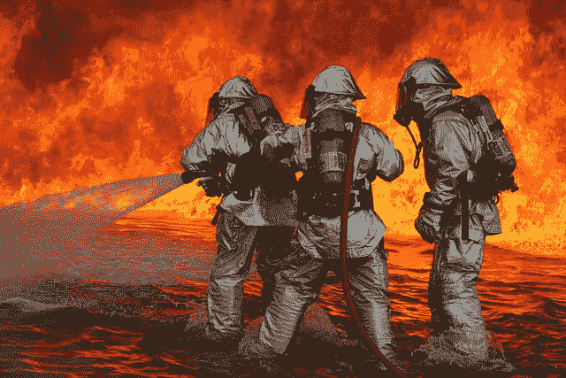
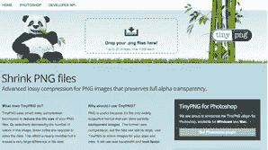
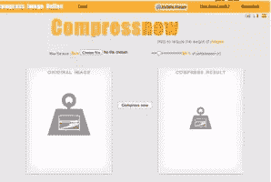
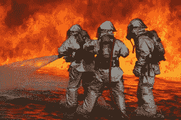
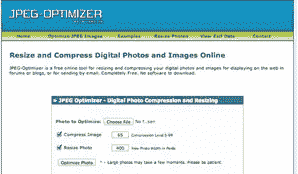
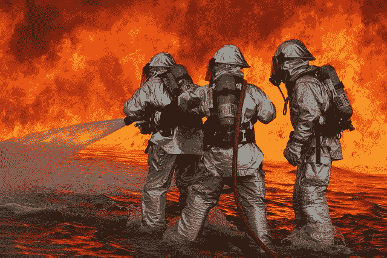
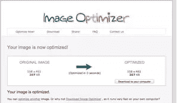

# 摊牌！5 种在线图像压缩工具的比较

> 原文：<https://www.sitepoint.com/image-compression-tools/>

Photo: tncountryfan

去年 [HTTP 档案报告](https://www.sitepoint.com/average-page-weights-increase-32-2013/ "Average Page Weights Increase by 32% in 2013 - Craig Buckler  ")发布了令人不安的消息，2013 年网络平均页面大小增加了 32%(达到平均 1.7Mb)。如果那是连*关闭*都要更正的话，那就是惊人的新闻了。

尽管可以预见的是，JavaScript、HTML 和 CSS 都有所增长，但超过一半的增长来自图像。这是一个像素更多、文件更大以及更多的例子。

虽然在一些罕见的情况下，你没有太多的办法来减少图像的大小，但由于越来越聪明的压缩算法，通常情况下，你可以在图像质量损失最小甚至没有损失的情况下大幅减少文件大小。

正如您所料，并不是所有的压缩工具都是一样的。一些产生质量差的图像，而几乎不影响它的文件大小，而另一些执行几乎任何图像的奇迹。

一些图形程序自带图像压缩工具。然而，根据我的经验，独立的图像压缩工具通常是更好的选择，因为它们是专门为这项工作设计的。

在众多独立的图像压缩工具中，我将只回顾在线工具。原因是它们是跨平台的，可以从任何地方访问。此外，他们提供从好到极好到极好的图像质量，所以我们绝对不会用可访问性来换取质量。

为了尽可能公平地进行比较，我将在不同的服务中使用相同的图片。这样，我们可以比较输出文件的大小，并对它们的质量做出平衡的判断。

另一方面，如果某个服务在某个特定映像下表现不佳，这并不总是意味着该服务很差，这可能是由该特定映像的特征造成的。

我将在整篇文章中使用这些图片:

1.原创 _Flowers.png

图片鸣谢:[http://www . Flickr . com/photos/ruby blossom/3391439995/sizes/o/](http://www.flickr.com/photos/rubyblossom/3391439995/sizes/o/)–原始文件大小 456 KB

2.原创 _ 飞机 _ 救援 _ 消防 _ 培训. jpg

图片鸣谢:[https://upload . wikimedia . org/Wikipedia/commons/thumb/0/0a/Aircraft _ Rescue _ firefly _ training . jpg/640 px-Aircraft _ Rescue _ firefly _ training . jpg](https://upload.wikimedia.org/wikipedia/commons/thumb/0/0a/Aircraft_Rescue_Firefighting_training.jpg/640px-Aircraft_Rescue_Firefighting_training.jpg)–原始文件大小 96.3KB

将用于比较的服务有:

*   [TinyPNG](https://tinypng.com/)
*   [压缩现在](http://compressnow.com/)
*   [Compressor.io](http://compressor.io/)
*   [JPEG 优化器](http://jpeg-optimizer.com/ "Resize and Compress Digital Photos and Images Online")
*   [图像优化器](http://www.imageoptimizer.net/Pages/Home.aspx "Welcome to the Free Image Optimizer!")

## 1.TinyPNG

TinyPNG 可能不是功能最丰富的在线图像压缩服务，因为它只能处理 PNG 文件。*但是，与其他一些服务不同，它可以保持图像的透明度。如果你的图像没有透明区域，你很难对此留下深刻印象，但如果有，你肯定会欣赏它。

* **更新**:自从我们发表这篇文章后，我们注意到 TinyPNG 增加了对 JPEG 上传的支持。

这项服务是免费的，没有广告——这也是它与榜单上其他服务的不同之处。

TinyPNG 还为 Windows 和 Mac 提供了一个 Photoshop 插件，所以如果你是桌面用户，并且正在使用这些操作系统中的任何一个，你可以试试这个插件。

至于质量，这里是它能做的:

原始图像–445 kb

TinyPNG 压缩图像

#### TinyPNG 压缩节省:76%。

就质量而言，输出是很棒的，对于这个特定的图像，压缩率达到了令人印象深刻的 76%。

出于好奇，我用更多的图片测试了这项服务。压缩率各不相同，但这些文件的高压缩图像质量良好，因此该服务很可能可以很好地处理任何 PNG 文件。

在消极方面，我不喜欢我不能控制压缩百分比。

你可能会说，如果服务做出比用户更好的决策，这并不是一件坏事。如果用户可以选择任何百分比的压缩，这可能会导致许多质量差的图像。相反，当服务决定压缩百分比时，它会选择产生良好结果的最高百分比。

TinyPNG 提供批处理(最多 20 个图像，每个最大 5MB)，这很方便，因为大多数情况下，您会有不止一个图像要压缩，批处理当然会节省时间。

## 2.Compressnow

如果除了 PNG 之外你还在使用其他格式，那么你可能想尝试一下 [Compressnow](http://compressnow.com/) 。这是一项免费服务，但伴随着相当多的广告。

该服务有英语、法语和西班牙语版本，这一点可能会受到国际用户的欢迎。

然而，多语言界面在这种设置中可以说是不太重要的，因为界面有图像来提示该做什么，而且只有几行文本。尽管如此，拥有非英语选项还是不错的。

Compressnow 支持 GIF、JPG、JPEG 和 PNG 格式。然而，对于我尝试的 PNG 图像，背景透明度没有得到保留。更重要的是，图像是从巴布亚新几内亚转换到 JPG，这不是一个很好的惊喜。

以下是 PNG 输出:

原始图像–445 kb

压缩现在压缩的图像

#### Compressnow 压缩:96.3 KB 到 70.2 KB。

这张图片是用 20%的压缩率制作的(我选择了这个)。Compressnow 允许您设置百分比–这使您能够灵活地在小图像尺寸和图像质量之间找到最佳选择。

对于 JPG，我使用了相同的压缩百分比。图像从 96.3 KB 缩小到 70.2 KB。同样，图像质量相当好:

原版 JPG

压缩压缩图像

#### 结果

Compressnow 以 3MB 最大速度提供多达 10 幅图像的批处理(相比之下，单个文件处理的每个文件为 9MB)。批处理似乎在我的系统上不起作用，但这并不意味着它根本不起作用。

## 3.Compressor.io

[Compressor.io](http://compressor.io/) 是又一个可以尝试的服务。它是免费的，支持大多数文件格式: **JPEG，PNG，GIF，SVG。**

它没有太多的选项——你真的只能选择压缩类型(有损或无损)。

就质量而言，我的感觉是不同的图像之间差别很大。我用两张图片(一张巴布亚新几内亚图片和一张 JPG 图片)测试了这项服务，结果有点令人失望。

使用无损压缩，两个图像都会保留其初始文件大小。有损压缩的结果如下:

原版 JPG

Compressor.io

文件大小从 96.32 KB 变为 69.32 KB，压缩了 28%，输出文件的图像质量也很好。

然而，在我的测试中，PNG 并没有进行得那么好，似乎有很多问题。无论是有损压缩还是无损压缩，它都不会对我在其他服务中使用的图像产生任何影响——压缩后，文件大小保持不变。我认为这是因为透明的背景，所以我改变了它，但结果更糟——没有图像，只有白色背景。

我决定用另一张图片来试试——一张非常简单的图片，只有渐变背景。结果很好——84%的压缩率，质量没有明显下降。

SVG 压缩选项是另一个有趣的附加功能。SVG 是一种完全不同的文件格式，这似乎需要一种完全不同的压缩方法——比纯数学更结构化的设计。

不管是哪种情况，我用 Compressor.io 压缩 SVG 文件都没有成功。

Compressor.io 既新颖又雄心勃勃，但你永远无法提前知道你的图像是否会被压缩，这一事实会阻止我目前使用它。我猜任何服务都有可能无法运行的图像，所以我不认为 Compress.io 比其他服务差仅仅是因为它不适合压缩我的测试图像。

## 4.JPEG 优化器

jpeg 优化器

顾名思义， [JPEG-Optimizer](http://www.jpeg-optimizer.com/) 只能处理 JPG 文件。这是一项带有一些广告的免费服务。

界面简单明了——上传文件并选择压缩百分比(0 到 99 之间的任何值)。

除了压缩，该服务还提供图像大小调整。它还附带了 Exif 阅读器实用程序。

这是该服务对我的图像进行 76%压缩后的效果。它节省了 31%的文件大小-从 94.1 到 64.9 和图像质量-看看你自己。

原版 JPG

JPEG 优化器

## 5.图像优化器

http://www.imageoptimizer.net/

Image Optimizer 是另一个免费的在线图像优化服务，没有广告(和一个光滑的界面)。我找不到它支持的文件格式列表，但我用 PNG 试了一下，效果不错。

我想他们也可以处理 JPG 和 GIF，包括动画 GIF(至少他们的 FAQ 是这么说的),但是当我尝试处理我在其他服务中使用的 JPG 图像时，文件大小根本没有变化。因为他们有一个付费版本，这些附加的文件格式很可能在那里找到。

图像优化器带有一个可下载的版本。如果您愿意，您可以在本地使用它，而不是在线使用。

对于压缩级别，您可以选择:最佳质量、高质量、正常、小文件大小、非常小的文件大小、最小文件大小。如果您愿意，您也可以裁剪(或缩放)图像。

下面是我使用最大压缩选项运行测试图像时发生的情况:

原始图像–445 kb

图像优化器–207 kb

文件从 445KB 变成了 207KB，这并不是特别令人印象深刻。最奇怪的是，不管选择哪种压缩级别，我都获得了相同的文件大小。

我知道这可能是我这边的问题，或者是我使用的特定图像的问题，但是让我注意我不能在预览中打开输出——我只能在 GIMP 中打开它。

除此之外，透明的背景消失了，这对于这张图片来说是个问题。

## 结论

感谢您耐心阅读到这里！作为奖励，这里有一个比较表，在这里你可以一目了然地看到服务是如何比较的。

|  | 

##### TinyPNG

 | 

##### compress

 | 

##### Compressor.io

 | [ JPEG optimizer | 

##### Image optimizer

 |
| 支持的格式 | PNG | GIF，JPG，JPEG，PNG | JPEG、PNG、GIF、SVG | JPEG，JPG | 未知——肯定是 PNG，也可能是 JPG 和 GIF，包括动画 GIF |
| 压缩 | 对于测试图像为 76%(从 456 到 109.8 KB)，否则会因图像而异 | 你设定百分比 | 无损和有损 | 你设定百分比 | 您可以从以下选项中选择:最佳质量、高质量、正常、小文件大小、非常小的文件大小、最小文件大小 |
| 图像质量 | 优秀的 | 优秀的 | 好的 | 从优秀到优秀 | 从优秀到优秀 |
| 成批处理 | 是的，最多 20 幅图像，每幅最大 5MB | 是的，最多 10 张图片，每张最多 3 MB | 未知的 | 不 | 不，对于网络版，对桌面版是 |
| 费用 | 自由的 | 自由的 | 自由的 | 自由的 | 自由的你可以花 49 美元升级到专业版。 |
| 其他的 | 保持透明度 | 有英语、法语和西班牙语版本 |  | 作物图像 | 圆滑的界面，设置最大高度/宽度 |

总而言之，这些服务都在某种程度上提供了好处，尽管可能会有小故障。我不能说一个肯定比其他的好，因为这取决于你的需求。

例如，如果保持透明性至关重要，TinyPNG 可能是您的最佳选择，因为它生成的文件很小，并且可以保持透明性。但是如果你的工作不仅仅是 PNG，TinyPNG 就不合适了

如果文件大小最重要，那么 JPEG-Optimizer 99%的压缩率可能是您的最佳选择。

此外，单个图像在一种服务下可能比其他服务好得多，而具有不同特征的图像可能正好相反。因此，测试项目中的典型图像，看看哪一个(哪些)最适合您的图像，可能是值得的。

## 分享这篇文章