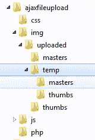
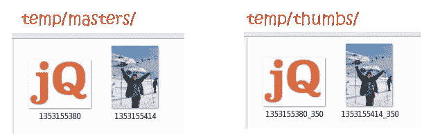

# jQuery AJAX 图片上传缩略图示例

> 原文：<https://www.sitepoint.com/image-upload-example/>

我收到了很多关于如何使用 Ajax 上传图片并显示缩略图的请求，所以我决定做一个快速演示来展示如何做到这一点。该脚本简化了通过 Ajax 上传图像的过程，并使用 PHP 创建缩略图，返回图像源并作为上传图像的缩略图显示给用户。所有这些都不需要重新加载页面。为了帮助你理解它是如何工作的，我在下面评论了几个关键部分。

[查看 Git 上的项目](https://github.com/sdeering/jQuery-Ajax-Thumbnail-Image-Upload)


### 上传图像功能

该函数将图像发送到后端，并接收关于上传图像及其创建的缩略图的数据。它使用 ajaxFileUpload 函数。

```
uploadImage: function()
{
    var _this = this,
        $imgInput = $('#image-upload');

    this.cache.$imgPreview.hide();
    this.cache.$imgOriginal.hide();
    $('.img-data').remove(); //remove any previous image data

    $.ajaxFileUpload(
    {
        url: _this.settings.uploadImageUrl,
        secureuri: false,
        fileElementId: 'image-upload',
        dataType: "json",
        success: function(data)
        {
            console.log(data);
            _this.cache.$imgPreview.attr('src',data.thumb.img_src);
            _this.cache.$imgOriginal.attr('src',data.master.img_src);

            //show img data
            _this.cache.$imgPreview.after('<div class="img-data">'+$.objToString(data.thumb)+'</div>');
            _this.cache.$imgOriginal.after('<div class="img-data">'+$.objToString(data.master)+'</div>');
            $('#remove-image-upload').show();
        },
        error: function(xhr, textStatus, errorThrown)
        {
            console.log(xhr, textStatus, errorThrown + 'error');
            return false;
        },
        complete: function()
        {
            //hide loading image
            _this.cache.$form.find('.loading').hide();
            _this.cache.$imgPreview.show();
            _this.cache.$imgOriginal.show();
        }
    });
}
```

### 图像缩略图

一旦上传了图像，图像缩略图 src 就用新的缩略图 src 更新。

```
<!-- Generated Image Thumbnail -->

```

### 示例表单提交

可以正常获取表单数据，并将缩略图 src 添加到作为表单提交的一部分发送的数据中。

```
submitForm: function()
{
    /* example of submitting the form */
    var $theForm = $('#submit-plugin-form'),
        formData = $theForm.serialize(); //get form data

    //include video thumb src
    formData += '&image-thumb=' + $('#image-thumb').attr('src');
    $theForm.find(':input').attr('disabled', 'disabled'); //lock form

    $.ajax(
    {
        type: "POST",
        url: 'php/submitForm.php',
        dataType: "json",
        data: formData,
        success: function(ret)
        {
            //...
        },
        error: function(xhr, textStatus, errorThrown)
        {
            console.log(xhr, textStatus, errorThrown + 'error');
            return false;
        }
    });
}
```

### 后端 PHP 脚本

我用 PHP 编写了一个后端脚本，它从前端接收图像并上传，创建缩略图，并以 JSON 的形式返回主图像和缩略图图像信息。
[查看 PHP 脚本](https://github.com/sdeering/jQuery-Ajax-Thumbnail-Image-Upload/blob/master/php/phpUploadImage.php)。

### 文件夹结构

上传的图像和缩略图存储在一个临时文件夹中，然后当提交表单时，图像被移动并重命名到主图像文件夹中。


### 文件的命名

临时文件使用时间戳和拇指及其维度来命名。


### 安全性

您需要确保图像目录有可写权限 774 应该足够高。

## 分享这篇文章