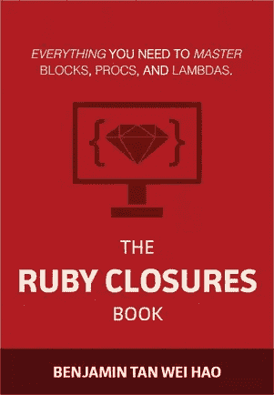
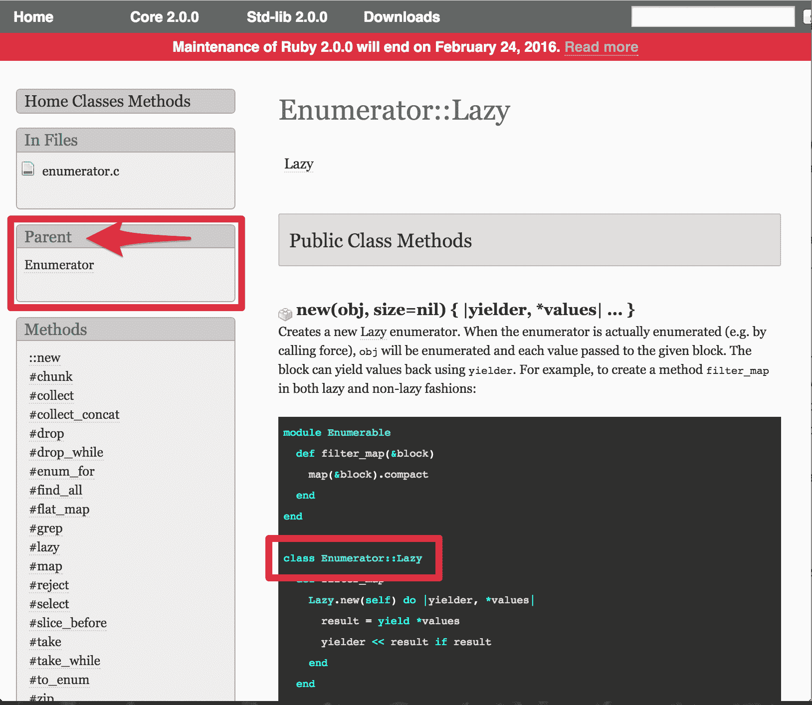

# 在 Ruby 中实现惰性枚举

> 原文：<https://www.sitepoint.com/implementing-lazy-enumerables-in-ruby/>

> 这篇文章摘自 Benjamin 自己写的《Ruby Closures》一书。如果你喜欢这篇文章(你会的)，告诉我们你最后喜欢的是什么，这样你就有机会获得一份免费的副本！现在…继续读下去…



我一直对 Ruby 的懒惰枚举很着迷，这是 Ruby 2.0 中引入的一个特性。在本文中，我们将深入探讨惰性枚举，了解 Ruby 如何通过创建自己的惰性枚举来实现这一有趣的编程技术。

*懒*到底是什么？露比是想偷懒吗？懒是指*评价*的风格。要理解这一点，可以考虑懒惰评估的反面:*急切*评估。

关于急切求值，真的没有什么可谈的，因为这是 Ruby 的标准工作方式。但有时候，渴望是一件坏事。例如，您认为这意味着什么:

```
irb> 1.upto(Float::INFINITY).map { |x| x * x }.take(10)
```

您可能期望结果是`[1, 4, 9, 16, 25, 36, 49, 64, 81, 100]`。不幸的是，Ruby 解释器不知道什么时候停止。这里的问题是`1.upto(Float::INFINITY)`。`1.upto(Float::INFINITY)`代表一个*无限的*序列。在控制台里看起来怎么样？

```
irb> 1.upto(Float::INFINITY)
=> #<Enumerator: 1:upto(Infinity)>
```

毫无疑问，这里会返回一个枚举数。让我们尝试使用`Enumerator#to_a`将*值从枚举器中强制取出:*

```
irb> 1.upto(5).to_a
=> [1, 2, 3, 4, 5]
```

到无限和更远的地方！：

```
irb> 1.upto(Float::INFINITY).to_a
```

现在，您不应该对这将导致无限循环感到惊讶。注意`Enumerator#to_a`对于从枚举器中“强制”出值是有用的。事实上，`Enumerator#to_a`是`Enumerator#force`的别名。稍后你会看到，当你想知道*所有*由一个枚举器产生的值时，这是有用的。

## 带来了懒惰！

那么我们如何从一个无限列表中获取值呢？介绍`Enumerable#lazy`:

```
irb> 1.upto(Float::INFINITY).lazy.map { |x| x * x }
=> #<Enumerator::Lazy: #<Enumerator::Lazy: #<Enumerator: 1:upto(Infinity)>>:map>
```

看起来通过用一个`Enumerator::Lazy`包装它，`1.upto(Float::INFINITY)`枚举器已经变得懒惰了。这个惰性枚举器本身包装了一个惰性版本的 map。让我们再次尝试第一个表达，但是这次用`Enumerable#lazy`:

```
irb> 1.upto(Float::INFINITY).lazy.map { |x| x * x }.take(10)
=> #<Enumerator::Lazy: #<Enumerator::Lazy: #<Enumerator::Lazy: #<Enumerator: 1:upto(Infinity)>>:map>:take(10)>
```

啊，`Enumerable#take`也是包起来了！我们如何得到所有的值？`Enumerable#to_a`来救援:

```
irb> 1.upto(Float::INFINITY).lazy.map { |x| x * x }.take(10).to_a
=> [1, 4, 9, 16, 25, 36, 49, 64, 81, 100]
```

这个魔法是如何运作的？我们马上就会知道了。我们将实现我们自己的懒惰枚举版本，尽管是最小的版本。在这个过程中，您还将了解 Ruby 的枚举器的一些有趣的方面。

## 构建骨架

首要的事情是决定我们的实现应该放在哪里。要做到这一点，我们只需要找到`Enumerator::Lazy`住在哪里。如果我们看一下官方文件，会发现一个线索:



所以，`Enumerator`是`Lazy`的*父*。在代码中:

```
class Lazy < Enumerator
end
```

不是像那样重新打开 Ruby 类(我会不由自主地抽搐)，我们的小练习是发明另一个名字。快速浏览一下同义词库，会得到类似于`Lazy`的结果。介绍，`Lax`！：

```
class Lax < Enumerator
end
```

## 外部迭代与内部迭代

从`Enumerator`继承给我们买了什么？要回答这个问题，我们需要重温一下什么是枚举器。从文档中:

> 允许内部和外部迭代的类。

迭代的两种味道有什么区别？关键在于*谁*控制迭代。

对于*内部*迭代，控制迭代的是`Array`对象(或任何`Enumerable`)。事实上，这就是你通常与`Enumerable`互动的方式

另一方面，*外部的*迭代是由包裹在`Enumerable`周围的一些其他对象控制的。

为什么首先需要外部迭代器？嗯，有时候你不想一次遍历所有的元素。你希望能够告诉可枚举的，“现在给我确切的一个，当我需要下一个时，我会再问一次”。外部迭代器给了你这种能力。

## 从可枚举对象创建枚举数

我提到过一个`Enumerator`包裹一个`Enumerable`。我们可以在代码中看到:

```
irb> e = Enumerator.new([1,2,3])
irb> e.next
=> 1
irb> e.next
=> 2
irb> e.next
=> 3
irb> e.next
StopIteration: iteration reached an end
      from (irb):7:in `next'
```

当我们用枚举器包装一个数组时，我们可以多次调用`Enumerator#next`来检索下一个值。当没有更多的值时，引发`StopIteration`异常。

请注意，Ruby 抱怨使用了`Object#to_enum`,或者使用了一个块。让我们用一个积木，因为这样更有趣:

```
e = Enumerator.new do |yielder|
  [1,2,3].each do |val|
    yielder << val
  end
end
```

让我们看看`irb`中的代码:

```
irb(main):008:0> e = Enumerator.new do |yielder|
irb(main):009:1*   [1,2,3].each do |val|
irb(main):010:2*     yielder << val
irb(main):011:2>   end
irb(main):012:1> end
=> #<Enumerator: #<Enumerator::Generator:0x007fb9798e0668>:each>
```

像往常一样，我们可以称之为`Enumerator#next`:

```
irb(main):013:0> e.next
=> 1
irb(main):014:0> e.next
=> 2
irb(main):015:0> e.next
=> 3
irb(main):016:0> e.next
StopIteration: iteration reached an end
        from (irb):16:in `next'
        from (irb):16
        from /Users/benjamintan/.rbenv/versions/2.2.0/bin/irb:11:in `<main>'
```

让我们再看一遍代码，因为代码比看上去的要多。出现了几个问题:

```
e = Enumerator.new do |yielder|
  [1,2,3].each do |val|
    yielder << val
  end
end
```

1.  传递到块中的这个`yielder`对象是什么？
2.  `yielder do?`是什么
3.  最重要的是，*怎么可能简单地包装一个`Enumerable`就能一个接一个地检索元素呢？*

 *我们可以回答前两个问题。使用块创建一个`Enumerator`对象时，`yielder`对象被传递到块中。

`yielder`对象的目的是*存储下一个产量*的指令。不是数值，而是*指令*。那就是`yielder does. The` `is aliased to the` `yield`的方法，但与`yield` *关键字*无关。是的，这是令人困惑的。

调用`Enumerator#next`时，返回下一个值并返回。这表明`yielder`对象必须记住某种形式的状态。这是如何实现的？前面代码清单的返回值给了我们一个线索:

```
#<Enumerator: #<Enumerator::Generator:0x007fb9798e0668>:each>
```

这告诉我们一个`Enumerator`对象包含另一个名为`Enumerator ::Generator`的对象。

## 发电机，纤维，天啊！

让我们绕道探索`Enumerator::Generator`。*生成器*能够将内部迭代器，比如`[1,2,3]`，转换成外部迭代器。它是允许一个接一个检索元素的秘方。

发电机是如何工作的:

1.  首先，它计算一些结果
2.  这个结果被返回给调用者
3.  此外，它还保存了计算的状态，以便调用者可以*继续计算*以生成下一个结果

一种方法是使用一个鲜为人知的 Ruby 构造，叫做*纤程*。`Fiber`类非常适合将内部迭代器转换成外部迭代器。

我自己没有怎么用过纤维，但尽管如此，探索它们还是很有趣的。让我们快速浏览一下基础知识。

用`Fiber.new`创建一个纤程，以及一个表示计算的块。让我们看看这个例子:

```
f = Fiber.new do
  x = 0
  loop do
    Fiber.yield x
          x += 1
  end
end
```

我们创建一个纤程，给它一个计算模块。此块包含一个没有结束的循环。这是什么`Fiber.yield`？那是秘制酱！我们一会儿就会谈到这一点。

当你像上面的例子一样创建一个纤程时，代码块不会立即执行。那么，如何执行这个块呢？用`Fiber#resume`。观察:

```
irb> f = Fiber.new do
irb*   x = 0
irb>   loop do
irb*     Fiber.yield x
irb>     x += 1
irb>   end
irb> end
=> #<Fiber:0x007fb979023e58>
irb> f.resume
=> 0
irb> f.resume
=> 1
irb> f.resume
=> 2
```

现在回到秘制酱料。你刚刚创建的是一个无穷数生成器。循环不会无限期运行的原因是因为`Fiber.yield`的行为。首先，如你所知，这与`yield`关键字无关。

当调用`Fiber#resume`时，代码执行`Fiber.yield x`，值返回给调用者，控制权返回给调用者。直到下一次调用`Fiber#resume`，然后`x`递增，循环进行另一轮，再次执行`Fiber.yield x`，并将控制权交还给调用者。

## 实现`Lax`，我们自己的`Enumerator::Lazy`

现在我们已经了解了生成器是如何工作的，让我们回到`Enumerator::Lax`实现。我们不必直接使用`Enumerator::Generator`,因为那是由`yielder`对象为我们处理的。

让我们考虑一下客户会如何使用我们的代码。事实上，我们将尽可能地模仿真实的实现。这里有一个例子:

```
1.upto(Float::INFINITY).lax
  .map { |x| x*x }
  .map { |x| x+1 }
  .take(5)
  .to_a
```

这应该能让我们。

这就是手法发挥作用的地方。当调用`lax`时，返回一个`Lax`枚举器的实例。当调用`map`时，这个方法是在一个`Lax`实例上调用的，而不是在可枚举对象上定义的`map`。

为了启用类似于`1.upto(Float::INFINITY).lax`和`[1,2,3].lax`的东西并返回一个新的`Lax`实例，我们必须在`Enumerable`模块中添加一个新方法:

```
module Enumerable
  def lax
    Lax.new(self)
  end
end

class Lax < Enumerator
end
```

`self`是实际可枚举的。它作为参数传递给`Lax`构造函数。如果您现在运行代码，您不会得到任何错误，但是您仍然会得到无限循环。这是因为我们所做的只是提供了一个额外的间接层次，而没有做任何有趣的事情。

我们知道我们需要填充`yielder`，所以让我们这样做:

```
class Lax < Enumerator
  def initialize(receiver)
    super() do |yielder|
      receiver.each do |val|
        yielder << val
      end
    end
  end
end
```

即使只有这一小段代码，我们也已经可以一个接一个地迭代一个无限的集合了:

```
irb> e = 1.upto(Float::INFINITY).lax
=> #<Lax: #<Enumerator::Generator:0x007f8324155c30>:each>
irb> e.next
=> 1
irb> e.next
=> 2
irb> e.next
=> 3
```

## 实现懒惰`map`

现在，我们需要在诸如`map`和`take`这样的方法上实现方法链接。因为`Enumerable::Lax`返回一个`Lax`实例，这意味着我们需要定义`map`和`take`的`Lax`版本。对`map`和`take`的每次调用又返回*的另一个* `Lax`实例。

`Lax`中的地图方法会是什么样子？首先:

```
def map(&block)
end
```

我们还知道我们需要返回一个新的`Lax`实例。这一次，`self`将成为另一个`Lax`实例。

```
def map(&block)
  Lax.new(self)
end
```

我们真正想要的是用被`map`方法修改的元素填充 yielder 对象。这意味着我们必须向`map`中的`Lax`实例传递两件东西:`yielder`对象和要映射的元素。我们可以像这样通过块参数传递这些:

```
def map(&block)
  Lax.new(self) do |yielder, val|
    yielder << block.call(val)
  end
end
```

这是做什么的？看起来像是用`val`调用了`map`的块，然后该元素被传递给 yielder。那是*而不是*完全准确。它更像是关于如何处理映射值的*指令*存储在 yielder 中。

由于`Lax`可以接收一个块，我们需要修改构造函数来处理这种情况:

```
class Lax < Enumerator
  def initialize(receiver)
    super() do |yielder|
      receiver.each do |val|        
        if block_given? 
          yield(yielder, val)
        else
          yielder << val
        end
      end
    end
  end
end
```

当提供了一个块时，就像在`map`的`Lax`版本的情况下，我们然后产生这个块，传入`yielder`对象和元素`val`。

有用吗？让我们来了解一下！

```
p 1.upto(Float::INFINITY).lax
        .map { |x| x*x }
  .map { |x| x+1 }
  .first(5)
```

`Enumerable#first(5)`返回可枚举的前 5 个元素，这就给出了`[2, 5, 10, 17, 26]`。

## 实现懒惰`take`

现在我们已经看到了`map`是如何实现的，让我们试着实现`take`。顾名思义，`Enumerable#take(n)`从枚举中返回第一个`n`元素。*惰性*版本将返回一个用`Enumerable#take`包装的`Lax`实例。

```
class Lax < Enumerator
  # initialize and map goes here 

  def take(n)
    taken = 0
    Lax.new(self) do |yielder, val|
      if taken < n
        yielder << val
        taken += 1 
      else
        raise StopIteration
      end
    end
  end
end
```

`take`的逻辑应该足够容易理解。这里有趣的事情是`take`如何发出迭代已经结束的信号——它引发了一个`StopIteration`异常。

不要生气，因为这正是 Ruby 实现它的方式。我们可以在构造函数内部处理这个异常，当我们检测到一个`StopIteration`异常时，什么也不做:

```
class Lax < Enumerator

  def initialize(receiver)
    super() do |yielder|
      begin
        receiver.each do |val|
          if block_given? 
            yield(yielder, val)
          else
            yielder << val
          end
        end
      rescue StopIteration
      end
    end
  end

  # map and take goes here ...
end
```

在我们开始下一轮代码之前，您应该有以下代码:

```
module Enumerable
  def lax
    Lax.new(self)
  end
end

class Lax < Enumerator

  def initialize(receiver)
    super() do |yielder|
      begin
        receiver.each do |val|
          if block_given? 
            yield(yielder, val)
          else
            yielder << val
          end
        end
      rescue StopIteration
      end
    end
  end

  def map(&block)
    Lax.new(self) do |yielder, val|
      yielder << block.call(val)
    end
  end

  def take(n)
    taken = 0
    Lax.new(self) do |yielder, val|
      if taken < n
        yielder << val
        taken += 1 
      else
        raise StopIteration
      end
    end
  end

end
```

有了这些，让我们来试试代码:

```
p 1.upto(Float::INFINITY).lax
  .map { |x| x*x }
  .map { |x| x+1 }
  .take(10)
  .to_a
```

如果你得到了`[2, 5, 10, 17, 26]`，那么它成功了！

## 摘要

懒枚举在你第一次遇到它们的时候看起来很神奇。事实上，即使当你开始解开组成懒惰可枚举数的碎片时，你无疑会发现一些有趣的 Ruby 片段，否则你可能不会遇到。

在写这一章之前，我从未遇到过`Enumerator::Yielder`、`Enumerator::Generator`和`Fiber`。谢天谢地， [Rubinius 对 Enumerable 的实现](https://github.com/rubinius/rubinius/blob/master/kernel/common/enumerable.rb)帮了大忙。了解`Fiber.yield`的行为是如何“啊哈！”我的时刻。

## 分享这篇文章*