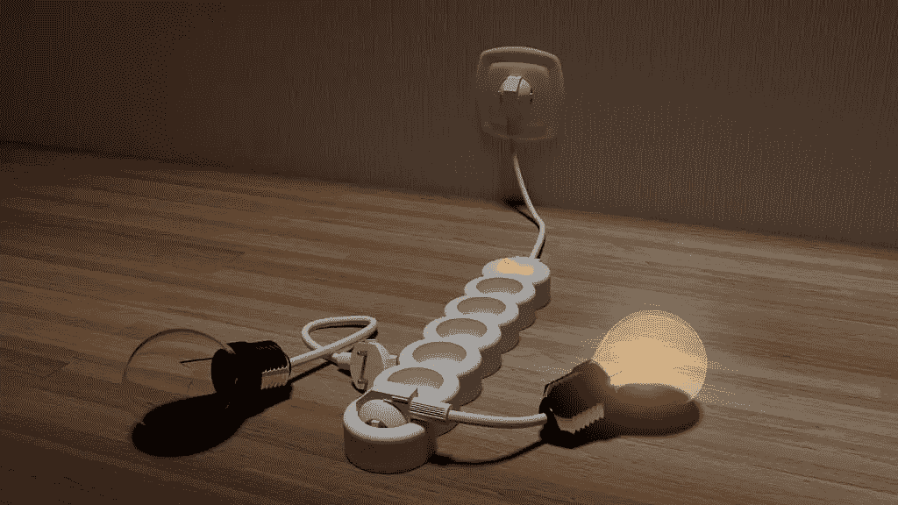
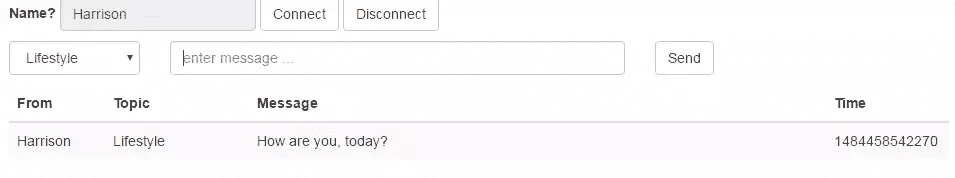

# 实现 Spring Websocket 服务器和客户端

> 原文：<https://www.sitepoint.com/implementing-spring-websocket-server-and-client/>

### 目录 

*   [克里夫关于 Websockets、STOMP 和 Spring 的笔记](#cliffsnotesonwebsocketsstompandspring)
*   [web sockets 简介](#introductiontowebsockets)
*   [踩过网络插座](#stompoverwebsocket)
*   【WebSockets 的弹簧支架
*   [Spring 聊天服务器实现](#springchatserverimplementation)
*   [构建配置](#buildconfiguration)
*   [消息控制器](#messagecontroller)
*   [配置弹簧](#configuringspring)
*   [网络浏览器客户端](#webbrowserclient)
*   [连接并注册推送回叫](#connectingandregisteringpushcallback)
*   [向服务器发送消息](#sendingmessagestotheserver)
*   [构建并运行应用](#buildingandrunningtheapplication)
*   [Java/Spring 聊天客户端](#javaspringchatclient)
*   [总结](#summary)
*   [评论](#comments)

本文将指导您实现基于 Spring 框架的 WebSocket 服务器和客户机。它演示了全双工通信以及服务器如何将消息推送到客户端。您将了解一些 WebSockets 的工作原理，以及用于服务器和客户端之间通信的 STOMP 消息格式。

为了从他的文章中获得最大收益，您需要很好的 Java 知识，以及对 Spring 框架的一些了解，尤其是 Spring MVC。我们将要实现的服务器的源代码可以在 GitHub 上获得。

## Cliff 关于 Websockets、STOMP 和 Spring 的笔记

为了让您在 JVM 上启动并运行 Websocket，下面简单介绍一下我们在本文后面需要的东西。

### WebSockets 简介

WebSocket 是一种基于 TCP 的全双工通信协议。它通常用于用户浏览器和后端服务器之间的交互通信。一个例子是在服务器和连接的客户端之间进行实时通信的聊天服务器。另一个例子是股票交易应用程序，其中服务器向订阅的客户端发送股票价格变化，而不需要客户端的明确请求。

WebSocket 是一个使用 TCP 作为底层协议的通信通道。它是由客户机向服务器发送 HTTP 请求来启动的，请求升级到 WebSocket 的连接。如果服务器支持 WebSockets，客户端请求将被批准，双方之间将建立 WebSocket 连接。建立连接后，所有通信都通过 WebSocket 进行，不再使用 HTTP 协议。

这篇文章很好地解释了 WebSockets 如何工作的细节。

### 踩在网络插座上

WebSocket 通信协议本身并不要求任何特定的消息格式。由应用程序来决定交换消息的格式。这种格式被称为子协议。(有点类似于网络浏览器和网络服务器同意在 TCP 套接字上使用 HTTP 协议。)

一种常用的格式是用于通用消息的 STOMP 协议(面向流文本的消息协议)。各种[面向消息的中间件(MOM)](https://en.wikipedia.org/wiki/Message-oriented_middleware) 系统如 [Apache ActiveMQ](http://activemq.apache.org/) 、 [HornetQ](http://hornetq.jboss.org/) 和 [RabbitMQ](https://www.rabbitmq.com/) 都支持 STOMP。

[Spring 框架](https://spring.io/)使用 STOMP 作为消息传递协议实现 WebSocket 通信。

### WebSockets 的 Spring 支持

Spring 框架为 web 应用程序中的 WebSocket 消息传递提供了支持。 [Spring 版本 4](http://docs.spring.io/spring/docs/4.3.6.BUILD-SNAPSHOT/spring-framework-reference/htmlsingle/) 包含了一个新的模块 [`spring-websocket`](https://docs.spring.io/spring/docs/current/spring-framework-reference/html/websocket.html) ，用于给服务器和客户端增加 WebSocket 支持。

Spring 框架指南包含了一个详细的如何演示一个示例服务器实现的指南。然而，没有必要阅读该指南；我们涵盖了理解本文中的实现所需的所有细节。

Spring 框架指南的一个缺点是没有提供关于实现 Java/Spring 客户机与服务器通信的信息。我们将在本文中解决这个问题。正如您将看到的，实现需要正确的咒语才能正确工作。

## Spring 聊天服务器实现

先决条件已经完成，现在是实现聊天服务器的时候了。以下是它的工作原理:

*   Spring chat 服务器创建一个 HTTP 端点(`/chat`)，用于建立 WebSocket 通道。
*   一旦建立了通道，服务器和客户机就通过该通道交换消息。
*   当服务器监听并响应客户端消息时，客户端也可以注册来自服务器的“推送”消息的回调。这允许服务器在需要时向客户端发送通知，而无需明确的客户端请求。

从服务器到客户端的消息“推送”使得 WebSocket 通信不同于普通的 HTTP 交互。

### 构建配置

服务器所需的 Maven 依赖项如下所示。`spring-boot-starter-websocket`依赖项包括 WebSockets 的服务器端实现所需的库。

剩下的`org.webjars`依赖项是 HTML/Javascript 聊天客户端所需的 WebSocket 和 STOMP 消息传递的 jQuery、Bootstrap 和客户端库。Java WebSocket 服务器实现不使用这些 Javascript 依赖项。它们是完全独立于后端应用程序的前端客户端所必需的。如果 HTML/Javascript 客户机没有与 Spring 应用程序分开使用或打包，这些依赖项可以安全地从 POM 中删除。

```
<dependency>
  <groupId>org.springframework.boot</groupId>
  <artifactId>spring-boot-starter-websocket</artifactId>
</dependency>
<dependency>
  <groupId>org.webjars</groupId>
  <artifactId>webjars-locator</artifactId>
</dependency>
<dependency>
  <groupId>org.webjars</groupId>
  <artifactId>sockjs-client</artifactId>
  <version>1.0.2</version>
</dependency>
<dependency>
  <groupId>org.webjars</groupId>
  <artifactId>stomp-websocket</artifactId>
  <version>2.3.3</version>
</dependency>
<dependency>
  <groupId>org.webjars</groupId>
  <artifactId>bootstrap</artifactId>
  <version>3.3.7</version>
</dependency>
<dependency>
  <groupId>org.webjars</groupId>
  <artifactId>jquery</artifactId>
  <version>3.1.0</version>
</dependency> 
```

### 信息控制器

在 Spring MVC 中，用`@Controller`注释[来修饰一个类会将这个类标记为 web 控制器](https://spring.io/guides/gs/serving-web-content/)。这与`@RequestMapping`装饰一起将一个方法标记为 HTTP 端点。以类似的方式，Spring Framework 消息传递可以使用注释`@MessageMapping`将方法注册为消息监听器。

对于我们简单的聊天服务器，响应回显从客户端收到的消息，并添加几个字段。对于现实世界的应用程序，这个方法是实现业务逻辑的地方。下面是该方法的实现:

```
@MessageMapping("/chat/{topic}")
@SendTo("/topic/messages")
public OutputMessage send(
        @DestinationVariable("topic") String topic, Message message)
        throws Exception {
    return new OutputMessage(message.getFrom(), message.getText(), topic);
} 
```

消息控制器方法接受一个 POJO(一个普通的旧 Java 对象),消息从 JSON 反序列化到这个 POJO 中。`@DestinationVariable`注释用于从目的地捕获模板变量`topic`。下面的`Message`类是由服务器定义的，用于从客户端读取消息。

```
public class Message {

    private String from;
    private String text;

    // adding getters and setters here
} 
```

为了将响应发送回客户端，消息控制器方法使用一个`@SendTo`注释来指定响应要发送到的客户端队列。从方法返回的值被序列化为 JSON 并发送到指定的目的地。在我们的例子中，我们将响应消息定义如下。注意，输入消息字段`text`只是被复制到响应消息字段`message`。在您的应用程序中，您可以做任何需要的额外处理，还可以在请求或响应类中包含更多的字段。

```
public class OutputMessage {

    private String from;
    private String message;
    private String topic;
    private Date time = new Date();

    // add getters and setters here
} 
```

### 配置弹簧

该应用程序是使用一个`@Configuration`类为 WebSockets 配置的，该类扩展了`AbstractWebSocketMessageBrokerConfigurer`并提供了以下方法的实现。

```
@Override
public void configureMessageBroker(MessageBrokerRegistry config) {
    config.enableSimpleBroker("/topic");
    config.setApplicationDestinationPrefixes("/app");
}

@Override
public void registerStompEndpoints(StompEndpointRegistry registry) {
    registry.addEndpoint("/chat").setAllowedOrigins("*").withSockJS();
} 
```

请注意以下几点:

*   应用目的地前缀设置为“`/app`”。这意味着 WebSocket 映射以“`/app`”为前缀，以获得真实值。
*   注册端点“`/chat`”以启动 WebSocket 协议握手。
*   方法`setAllowedOrigins("*")`用于启用服务器的 CORS，因此[跨源](https://www.w3.org/TR/cors/)客户端可以连接到服务器。如果您的需求不需要跨来源的客户端连接，那么您可以删除这个调用。



## 网络浏览器客户端

用 HTML 和 Javascript 编写的示例 web 应用程序包含在代码中[——它为聊天应用程序实现了一个简单的前端。下面显示了应用程序的快照。](https://github.com/jaysridhar/spring-websocket-server)



### 连接和注册推送回调

应用程序使用 [SocksJS](https://github.com/sockjs/sockjs-client) 库来处理 WebSocket 连接，使用 [stomp-websocket](http://jmesnil.net/stomp-websocket/doc/) 库来支持 stomp。下面的连接代码创建了一个 WebSocket 通道，并使用它来创建 STOMP 客户端。一旦连接了 WebSocket，就会为来自服务器的 push 消息注册一个回调。消息从 JSON 中被反序列化并显示给用户。

```
var wsocket = new SockJS('/chat');
var client = Stomp.over(wsocket);
client.connect({}, function(frame) {
    client.subscribe('/topic/messages', function (message) {
        showMessage(JSON.parse(message.body));
    });
}); 
```

### 向服务器发送消息

客户端使用`send()`向服务器发送消息。消息是 JSON 格式的，并且与服务器端的消息控制器所期望的格式相同。

```
client.send("/app/chat/" + topic, {}, JSON.stringify({
    from: $("#from").val(),
    text: $('#text').val(),
})); 
```

## 构建和运行应用程序

该服务器被实现为 Spring Boot 应用程序，并且包括嵌入式 web 服务器。使用 Maven 构建应用程序。

```
mvn clean package 
```

如果需要，运行服务器并指定 web 服务器应该监听的端口。

```
java -Dserver.port=9090 -jar target/chat-server-0.1.0.jar 
```

一旦服务器启动，在`http://<hostname>:9090/`打开聊天应用程序

## Java/Spring 聊天客户端

虽然 HTML/Javascript 客户端有助于在浏览器中演示 WebSocket 的用法，但是 Java 客户端有助于在应用程序中与服务器进行交互。也许您有一个外汇交易应用程序，需要向所有连接的应用程序报告更新的价格。或者您可能想要订阅已发布的消息以获得更新通知。无论何种用例，学习如何在 Java 应用程序中与 WebSocket 服务器交互都是有用的。

设置底层传输并创建一个 SockJS 客户机。Spring 中的 sockjs 客户端模块实现了 SockJS 协议(这里，JS 只是名称的一部分——不涉及 JavaScript ),作为(浏览器)客户端不支持 WebSocket 时的后备选项。这使得应用程序可以使用 WebSockets，但在运行时需要时可以退回到其他替代方案——而无需更改应用程序代码。Internet Explorer 8 和 9 使用的另一种传输方式是 [Ajax/XHR 流](https://docs.spring.io/spring/docs/current/spring-framework-reference/html/websocket.html#websocket-fallback-xhr-vs-iframe)。

```
WebSocketClient simpleWebSocketClient = new StandardWebSocketClient();
List<Transport> transports = new ArrayList<>(1);
transports.add(new WebSocketTransport(simpleWebSocketClient));
SockJsClient sockJsClient = new SockJsClient(transports); 
```

`SockJsClient`用于创建一个 STOMP 客户端，它支持所使用的消息协议。

```
WebSocketStompClient stompClient = new WebSocketStompClient(sockJsClient); 
```

当然，我们需要在 JSON 和 POJOs 之间来回映射。

```
stompClient.setMessageConverter(new MappingJackson2MessageConverter()); 
```

连接到服务器，一旦建立连接，就注册一个消息处理程序来监听来自服务器的推送消息。

```
String url = "ws://localhost:9090/chat";
StompSessionHandler sessionHandler = new MyStompSessionHandler();
StompSession session = stompClient.connect(url, sessionHandler).get(); 
```

从服务器订阅消息，如下所示:

```
session.subscribe(topic, new StompFrameHandler() {
    @Override
    public Type getPayloadType(StompHeaders headers) {
        return ServerMessage.class;
    }

    @Override
    public void handleFrame(StompHeaders headers,Object payload) {
        System.err.println(payload.toString());
    }
}); 
```

按如下方式向服务器发送消息:

```
ClientMessage msg = new ClientMessage(userId, line);
session.send("/app/chat/java", msg); 
```

客户端的完整源代码可以从[这里](https://github.com/jaysridhar/spring-websocket-client)下载。

## 摘要

我们来复习一下。

我们从简单介绍 WebSockets 和 STOMP 开始。STOMP 是在 WebSockets 上运行的消息传递子协议，它提供了诸如主题订阅之类的功能。

Spring 框架(用于 WebSocket 服务器)为服务器和客户端提供了 WebSocket 模块。这些模块很容易用 Spring 定义的注释进行配置。Spring 还处理往来于 POJOs 的消息的序列化和反序列化。

Web 浏览器客户端显示与服务器的交互，以及如何接收和处理来自服务器的推送消息。最后，Spring 客户端演示了如何与 WebSocket 服务器通信以及订阅消息主题。

## 分享这篇文章