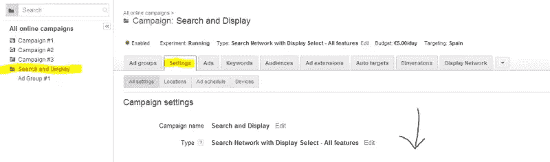
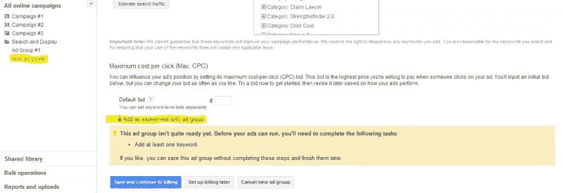
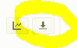
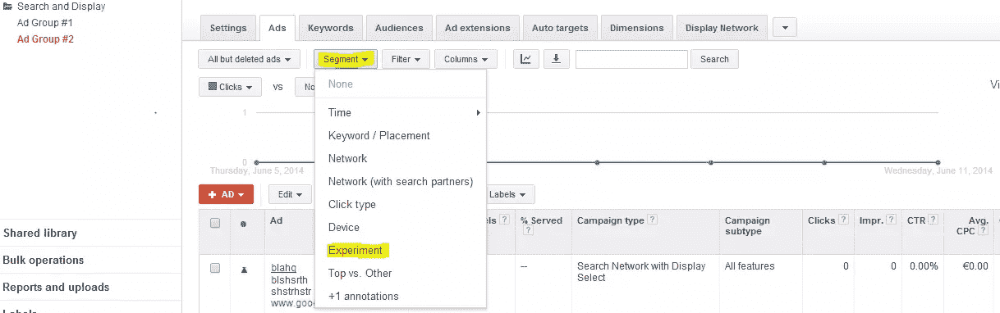

# 如何用 AdWords A/B 测试提高你的点击率

> 原文：<https://www.sitepoint.com/improve-click-rates-adwords-ab-testing/>

你是否曾经无法在两套不同的广告文案中做出选择？还是两个不同的登陆页面？

你可能知道 A/B 测试在电子邮件活动中的好处，但是你知道吗，你也可以用 Google AdWords A/B 测试工具吃掉你的 PPC 蛋糕？

这个工具的正式名称是 AdWords Campaign Experiments，简称 ACE，它是提高点击率、转换率等关键指标最可靠的方法之一。

通过使用 ACE 工具来运行您的 A/B 测试，您将自己置于一个双赢的局面，您可以在一个低风险的环境中测试甚至是最激进的想法。

而且由于 AdWords 的 A/B 测试相对来说还不常用，掌握这个工具也会让你在竞争中领先一步。

卖了？很好。现在让我们学习如何为 Google AdWords 设置 A/B 测试。要做到这一点，你需要一些 AdWords 的基本知识和一个已经建立了一些活动的帐户。

## 入门指南

与任何一种实验一样，当你进行 A/B 测试时，在开始 之前，必须 ***定义明确的目标。ACE 工具允许你在测试中改变三个不同的变量:**竞价、关键词和广告组**。想一想你到底想比较什么，你这样做的目的是什么。***

也许你正在寻找增加转化率，想看看如果增加你的出价可以有这种效果。或者，也许你想尝试一个新的关键字，这是太冒险，以至于不能下大赌注。也许你想做的就是在两组非常相似的广告文案中做出选择。

不确定从哪里开始？我在这篇文章的底部包含了一个方便的测试列表。

## 配置您的测试活动

第一步是选择要测试的现有活动。若要对此活动启用 A/B 测试，您需要正确配置其设置。

转到**设置**选项卡，向下滚动到页面底部的**实验**部分。填写您想要的关于实验的任何信息，然后继续。请记住，这将需要是一个**搜索和显示类型的**活动，其中**所有功能都已启用**，以便实验可用。否则，您将无法访问该选项。

在进入下一步之前，保存您的更改。

## 50:50 A/B 分割还是更小的测试组？

你如何划分你的印象实际上取决于你的数据集的大小。如果你足够幸运，有一个高流量的活动，有很多的转换，你可能会选择只切断一小部分你的活动进行测试，以降低风险。

另一方面，如果你在一个较小的数据集上工作，或者如果你在两个具有相同风险的选项上工作，比如几乎相同的广告文案集，你可能会发现除了 50:50 的分割之外，很难从任何东西上得出结论。

转到你的广告活动中的**广告组**标签，并加入与你为你的广告活动创建普通广告组相同的参数:标题、关键词、广告文案、默认出价等等。这里唯一的区别是，您需要确保选中“添加* *作为仅实验广告组”复选框。

瞧啊。现在，当您的广告显示在您的仪表盘上时，您会看到它标有谷歌的实验符号:

切换此选项以决定将广告组的哪些部分设置为控件，以及您想要试验哪些部分。

## 监控你的实验

一旦你的测试已经运行了几天，你就要开始监控你的实验组和对照组之间的差异。进入**战役>片段>实验**，你会看到两组都出现了。

统计上相关的差异用灰色箭头标出。一个箭头表示谷歌 95%确定搜索结果的差异是相关的，而不是偶然的。两个意味着 99%的把握，三个意味着 99.9%的把握。(据推测，确定性是使用平均值的标准偏差或类似的东西计算的。)

在这一点上遭受强迫性账户检查？我们都经历过。但是如果你发现你的时间都花在刷新按钮上，你应该记住波动的结果会给你错误的印象。试着避免每周检查你的实验超过两次，让它们酝酿至少两个星期(取决于你的数据集的大小，几个月可能更好)，然后得出任何结论。如果你在节假日等不可预测的时段开展活动，这一点尤其正确。

如果你发现很难抗拒检查你的帐户，设置一个预定的电子邮件报告，这样你就可以按照你选择的时间表接收你需要的信息，然后*不去管你的帐户*。为此，点击**下载报告**按钮并选择您需要的频率。

## 根据您的结果采取行动

你的实验成功了吗？恭喜你。现在是时候将实验设置应用到你的活动中了。

回到你的战役的**设置**菜单，向下滚动到你最初启用实验的地方。你会看到你有三个选择:**停止运行实验**，**应用:完全启动变更**和**删除:移除变更**。

请记住，应用更改将永久删除您的原始设置。如果你不太确定做出这种改变是否明智，那么有必要进行一次后续实验，将实验参数设为 90%，控制参数设为 10%，以确保这一点。

## AdWords A/B 测试的想法

准备好使用 ACE 工具了吗？正如我所承诺的，我将在这篇文章的结尾列出一些可以尝试的想法。这只是一些建议——可能性是无限的。

### 投标

*   提高你的出价会带来更多的转化吗？如果是的话，从投资回报率的角度来看，这值得吗？
*   对你最有竞争力的关键词积极竞价会提高流量质量吗？还是只是浪费钱？
*   当你对一个真正特定的关键词出价很高时会发生什么？

### 关键词

*   当你瞄准一个你不太确定是否有效的近义词时会发生什么？如果你从来没有勇气尝试，ACE 工具可以让你安全地进行实验。
*   你总是喜欢长尾巴吗？尝试一个非常简短、明显的关键字，看看会发生什么。
*   同样，如果您通常使用相对通用的关键字，这也是尝试更具体的关键字的好机会。

### 广告文案

*   据说使用“得到”这个词的[行动号召更加有力](http://www.getelastic.com/the-power-of-the-word-get/)。检验这个理论！
*   谷歌建议将每个单词的第一个字母大写，以使文本突出。这对 CTR 真的有正面影响吗？是时候找出答案了。
*   如果你从未尝试过动态更新文本，为什么不现在就做呢？

### 奖金测试

*   你的公司是否一直在考虑推出新产品或服务？如果您已经建立了分销网络，使用 ACE 工具来衡量新产品或服务的需求，并与现有的产品或服务进行比较，这是快速进行市场调查的一个好方法。只要确保你准备好了一个可靠的成功/失败计划！

## 简单(安全)的实验

谷歌的 ACE 工具很容易使用——但更重要的是，它得到了结果。

对于新技术来说，最难的部分是打破你的舒适区，第一次尝试它们。

然而，一个成功的 AdWords 从业者的标志是他们能够通过利用任何可用的新工具而站在新发展的最前沿。

你试过用 ACE 工具进行 A/B 测试吗？怎么样了？请在评论中告诉我们。

## 分享这篇文章