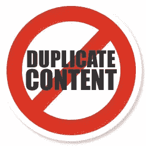

# 用 Google 的新规范元素改进 SEO

> 原文：<https://www.sitepoint.com/improve-seo-google-canonical-element/>

避免重复内容。每一个优秀的搜索引擎优化专家都会告诉你，原创内容是你在试图爬上搜索引擎这个滑溜溜的斜坡时取得成功的最佳途径。从其他地方复制内容或将相同的内容整合到其他网站会对您的页面排名产生不利影响。

不幸的是，大多数网站无意中发布了重复的文本。考虑你的主页；相同的内容可以从不同的网址获得吗？…

*http://www.mysite.com/*
http://www.mysite.com/index.htmlT5*http://www.mysite.com/index.php?sessionid=57*

很少有内容管理系统能够很好地处理重复页面。一个 [URL 重写引擎](http://en.wikipedia.org/wiki/Rewrite_engine)，比如 [Apache 的 mod_rewrite](http://httpd.apache.org/docs/1.3/mod/mod_rewrite.html) ，可以有所帮助，但是很难保证每个页面都有唯一的地址。谷歌和其他搜索引擎尽最大努力解决非恶意复制，但你永远无法确定你的网站没有被降级。

重复内容的问题最终通过 Google 新的 canonical element 得到了解决。Web 开发人员可以在 HTML `<head>`中使用一个新的`<link>`标签来指明他们喜欢的页面 URL。例如:

`<link rel="canonical" href="http://www.mysite.com/" />`

注意:

*   规范 URL 必须在同一个域中，尽管允许使用子域，如 *www* .mysite.com 和 *products* .mysite.com。
*   相对路径名被处理，Google 将把 URL 解析成页面的`<base>`链接设置的任何路径。
*   首选 URL 不需要包含原始页面内容的精确副本。谷歌将允许细微的差别，比如产品列表的顺序。然而，尽可能避免这种情况当然是明智的。
*   谷歌将遵循规范链，但建议指定一个单一的有效网址，以获得最佳结果。

更多信息和说明可在[谷歌网站管理员中心博客](http://googlewebmastercentral.blogspot.com/2009/02/specify-your-canonical.html)获得。标签正在被谷歌机器人解析。微软和雅虎都同意了这项提议；他们可能很快就会跟进。

你遇到过由于网站内容重复而导致的网页排名问题吗？规范元素会对你的 SEO 工作有帮助吗？

## 分享这篇文章