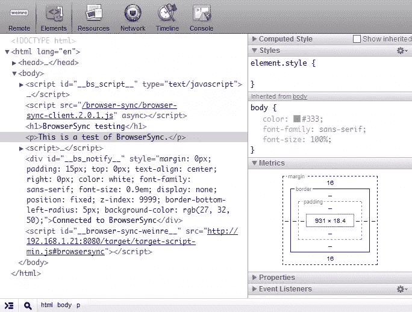
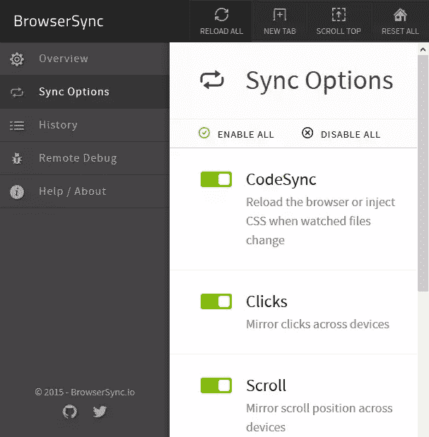

# 如何使用 BrowserSync 2.0 改进您的工作流程

> 原文：<https://www.sitepoint.com/improve-workflow-browsersync-2-0/>

Web 开发涉及大量的反复试验。这和你的技术相似吗？…

1.  在浏览器中打开您的站点。
2.  编写或编辑一两行代码。
3.  点击浏览器的刷新按钮。返回步骤 2。

然后使用多种测试方法，在多种设备上的多种浏览器中重复测试。在过去的一年中，这需要花费多少时间？

幸运的是，有一些工具可以从根本上提高你的工作效率。我已经使用 BrowserSync 一年了，它彻底改变了我的工作流程。2.0 版本刚刚发布，甚至更好。最新版本提供:

修改一个文件，你的页面就会在所有浏览器中重新加载。CSS 被重新注入，因此不需要刷新整个页面。

**交互同步**
你的滚动、点击和表单动作在每一个浏览器上都是镜像的。这在测试移动设备时尤其有用；您可以修改桌面上的输入字段，相同的字符串将出现在所有连接的手机和平板电脑上。再见屏幕键盘！

**同步定制**
你可以选择镜像哪些动作。

你可以使用类似 Chrome Inspector 的 weinre (WEb INspector REmote)工具远程调试页面。



**模拟较慢的连接**
抑制所有文件的响应时间，以发现那些使用较慢连接的人对网站的看法。

**URL 历史**
您的浏览历史会被记录下来，因此您可以立即向所有设备推送测试 URL。

新的用户界面
和命令行一样，你现在可以从一个基于网络的用户界面控制浏览器同步。



构建工具兼容性
你可以单独运行 BrowserSync，但我通常使用 Gulp 来部署它[。它还兼容 Grunt 和许多其他任务运行程序。](/introduction-gulp-js/)

**随处免费安装**
BrowserSync 是开源的，可以在 Windows、Mac OS 和 Linux 上运行。安装只需几分钟，而且不像其他产品，不需要安装浏览器插件或其他软件。

## BrowserSync 是如何工作的？

BrowserSync 启动一个小型 web 服务器。如果您已经在使用本地 web 服务器或需要连接到实时网站，您可以将 BrowserSync 作为代理服务器启动。它将小脚本注入到通过 [WebSockets](https://developer.mozilla.org/en-US/docs/WebSockets/WebSockets_reference) 与服务器通信的每个页面中。当事件发生时，例如文件修改或滚动操作，服务器会向所有连接的设备发送更新通知。

但是你不需要担心这些。BrowserSync 只要正常工作，你就会成为同龄人羡慕的对象*(或者被指控巫术)*。

## 如何安装 BrowserSync

如果您还没有，请安装 Node。来自 nodejs.org 的 JS。我懂很多 PHP，Ruby，Python，。网络等。开发人员不希望让他们的开发机器充斥着另一个运行时，而是 Node。JS 正迅速变得无价。另外，这是 JavaScript。至少，您可以用它来测试 REPL 中的代码片段。

通过在命令行输入`node -v`来确保您已经安装了节点。然后全局安装 BrowserSync:

```
npm install browser-sync -g
```

根据您的设置，Mac 和 Linux 用户可能需要在那一行的开头加上`sudo`。

使用以下工具测试您的安装:

```
browser-sync --version
```

命令行帮助可用于:

```
browser-sync --help
```

## 如何使用浏览器同步

用一个例子来说明用法是最容易的。假设你有一个位于`test`文件夹中的网站，在`css`子文件夹中有许多 HTML 文件和 CSS 文件。从命令行访问该文件夹:

```
cd test
```

然后启动浏览器同步:

```
browser-sync start --server --files "*.html, css/*.css"
```

这将启动 BrowserSync 服务器，并指示它监视所有。html 文件和任何。`css`子文件夹中的 css 文件。您的控制台应显示类似于以下内容的内容:

```
[BS] Access URLs:
 -------------------------------------
       Local: http://localhost:3000
    External: http://192.168.1.21:3000
 -------------------------------------
          UI: http://localhost:3001
 UI External: http://192.168.1.21:3001
 -------------------------------------
[BS] Serving files from: ./
[BS] Watching files...
```

您可以在网络上任何浏览器的地址栏中输入“外部”地址，即`http://192.168.1.21:3000`。这将加载你的默认页面(index.html ),并在 HTML 或 CSS 改变时自动刷新它。

控制面板可以通过“UI 外部”地址(`http://192.168.1.21:3001`)加载到浏览器中。这些面板允许您检查设置、更改同步选项、查看/推送页面历史、启动远程调试和重新加载所有连接的浏览器。

命令行中还有许多其他选项。参考位于 [browsersync.io](http://www.browsersync.io/) 的网站获取示例，或者查阅[完整文档](http://www.browsersync.io/docs/command-line/)。

今天花半个小时玩 BrowserSync，你会想没有它你怎么工作。

## 分享这篇文章