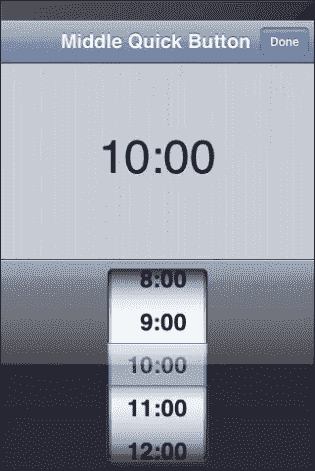
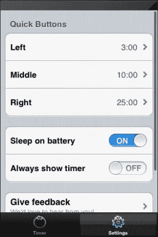

# 使用 iTomato 提高您的工作效率

> 原文：<https://www.sitepoint.com/improve-your-productivity-with-itomato/>

任何移动设备拥有者可以选择的应用程序数量都是惊人的。这些应用程序中有许多是为营销目的、娱乐、社交或纯粹的浪费时间而设计的，但也有一些应用程序可以帮助我们以行动为导向，让我们的生活更有成效。乍一看，iTomato 不像是那些省时、注重行动的生产力应用；这只是一个简单的计时器。但是，为了充分利用 iTomato，你首先必须掌握使用 iTomato 背后的基本原理，这是一种被称为[番茄工作法](https://www.pomodorotechnique.com/)的时间管理方法。

首先，这里有一段创作者弗朗西斯科·西里洛关于番茄工作法的简短摘录:

> 番茄工作法基于三个基本假设:
> 
> 1.  一种不同的看待时间的方式(不再专注于“成为”的抽象概念)减轻了焦虑，这样做可以提高个人效率。
> 2.  更好地使用头脑使我们能够获得更清晰的思想、更高的意识和更敏锐的注意力，同时促进学习。
> 3.  使用易于使用、不引人注目的工具降低了应用该技术的复杂性，同时有利于连续性，并且它允许您将精力集中在您想要完成的目标上。许多时间管理技术之所以失败，是因为相对于手头任务的内在复杂性而言，它们使使用它们的人面临更高水平的额外复杂性。

番茄工作法包括五个阶段:计划、追踪、记录、处理和视觉化。计划包括决定你一天的任务。接下来，跟踪包括收集你完成任务所花费精力的数据。记录需要你写下你为你的任务跟踪的时间，而处理是通过研究你记录的时间和把你的原始数据转换成有用的信息来改进你的时间管理的一种方法。最后，视觉化包括其他四个步骤——你将所有记录的信息整合成一种格式，帮助你理解你的方法，理清你的时间管理。番茄工作法的一个基本迭代应该持续一整天，但是根据你手头的任务可能会少一些。

现在我们手头有了这些信息，我们可以开始了解 iTomato 应用程序在使用番茄工作法方面的用处。

### 首次运行和主屏幕

当你第一次启动应用程序时，你会看到一个类似数字线的计时器。在计时器下面，有三个“快速按钮”来制作三分钟、十分钟和三十分钟的番茄。一旦你按下这两个按钮中的任何一个，计时器就开始倒计时，直到时间结束。应用程序会在时间到了的时候通知你，所以你不需要打开应用程序来计时。您也可以拖移顶部的计时器部分来启动您想要长度的番茄。传统的番茄长 30 分钟:25 分钟的工作加上 5 分钟的休息时间。一旦你的时间到了，你会听到应用程序发出一声蜂鸣，你会收到一个通知，你的计时器已经结束。

* * *

 

* * *

### 设置

您可以通过“设置”菜单更改应用程序中任何快速按钮的时间间隔。选取按钮，然后滚动浏览时间列表，直到达到您想要的持续时间。快速按钮时间间隔是从 1 到 60 的整分钟。此外，你可以选择隐藏计时器持续时间，并启用“电池睡眠”功能，我假设这意味着即使你的 iOS 设备处于睡眠状态，该应用程序也将继续运行。

* * *

 

* * *

### 缺点

iTomato 的主要缺点是它只是一个计时器，仅此而已。App Store 上有更好的番茄工作法计时器，包括列出你的任务，计算你的番茄，处理和可视化你的番茄，这样你就可以跟踪你的进展。

一旦你的番茄完成，你需要回到应用程序并创建另一个番茄，所以很难在一致的基础上使用应用程序，因为它不计算你在番茄之间的休息时间。我还觉得最初的快速按钮间隔有点不对劲。为了让这个应用对我更有用(也更符合番茄工作法)，我把这些快速按钮的值分别改成了 25 分钟、5 分钟和 15 分钟(从左到右)。这样，我可以开始一个 25 分钟的番茄大战，然后当时间到了，我可以设定一个 5 分钟的休息时间。每四个番茄，我可以休息 15 分钟，然后再开始。即使有这些变化，我仍然需要记住我吃了多少番茄，因为应用程序不会为你记录这些信息。

### 结论

iTomato 是一个应用程序，旨在与著名的时间管理番茄工作法配合使用。不幸的是，缺乏记录和可视化番茄成品的功能会影响该应用程序的整体实用性。简单地说，伊托马托没有什么特别的，但是番茄工作法本身非常有用。

* * *

iTomato 在 iOS 应用商店上是免费的，需要 iOS v5.0 或更高版本才能运行。从下面的 App Store 链接或使用提供的 App Store 按钮下载应用程序。

[下载 iTomato](https://itunes.apple.com/us/app/itomato/id368353070?mt=8&uo=4)

你用过番茄工作法吗？番茄工作法是否增加了复杂性，违背了这项技术固有的简单性，还是简化和组织了番茄工作法的不同方面？

## 分享这篇文章