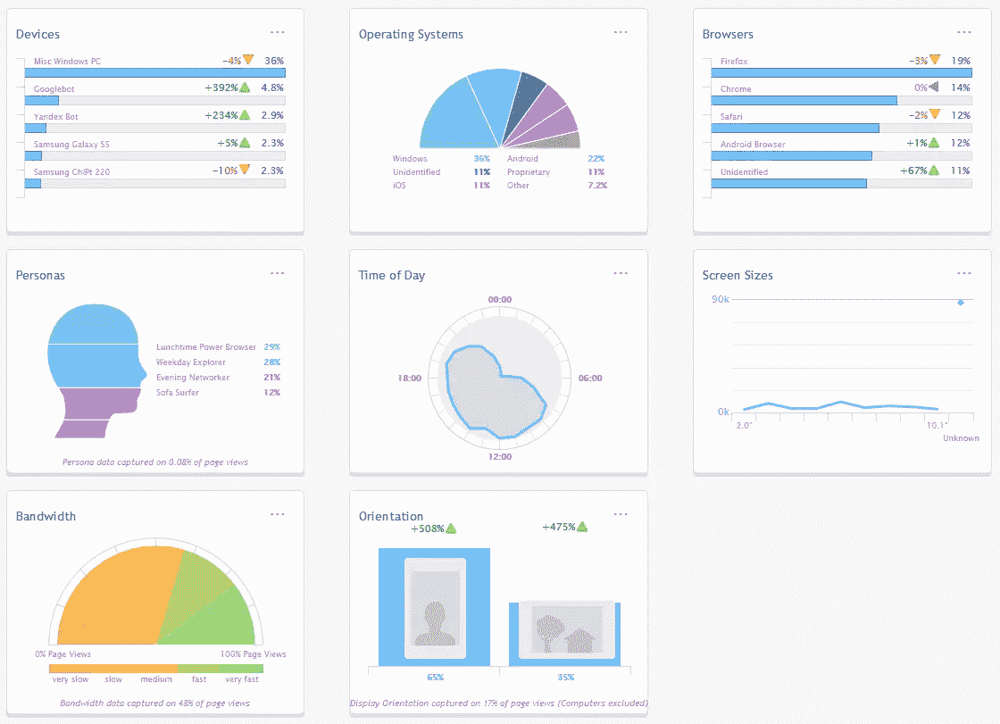
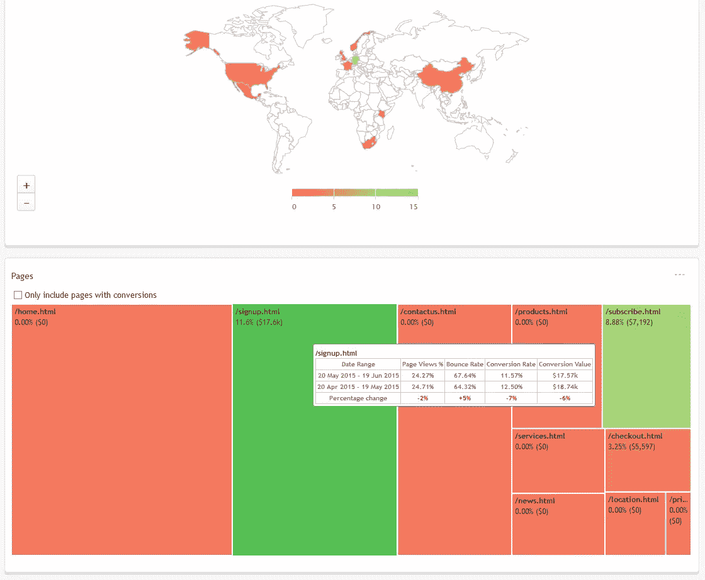

# 用 RESS 改进响应式网页设计

> 原文：<https://www.sitepoint.com/improving-responsive-web-design-ress/>

*本文由[网络饼干](http://www.netbiscuits.com/)赞助。感谢您对使 SitePoint 成为可能的赞助商的支持！*

平均来说，超过三分之一的网站访问者使用移动设备。仅在过去一年，移动使用量就增长了 20%以上。那么我们如何迎合这个市场呢？

## 独立的移动网站

如果你的时间、预算和理智不重要，你可以为移动用户和桌面用户建立单独的网站。内容可以针对设备进行重新打包和精简。不幸的是…

1.  台式机或移动设备的时代早已过去。有大量不同屏幕尺寸、像素密度、处理速度、网络能力和 HTML5 功能的设备。我们中很少有人考虑过可穿戴设备！品牌需要创建许多网站来应对各种可能发生的情况？
2.  识别用户的设备很困难。众所周知，用户代理字符串很难解析，它不会告诉你任何关于屏幕尺寸、网络速度或其他特性的信息。
3.  你通常需要为每个网站单独的网址，如 www.site.com 和 m.site.com。用户可能会因为他们的设备出现在错误的网站上，如果你不小心，搜索引擎会因为重复的内容而惩罚你。
4.  管理一个网站是艰难的。您现在需要构建和部署几个站点，并确保它们同时更新。也许你的开发人员会挺过来，但是内容编辑人员会处理针对不同视图的多种资产吗？

尽管如此，对亚马逊和易贝这样的公司来说，独立网站仍然是一个有吸引力的选择，因为它提供了有针对性的体验。

## 响应式网页设计

或者，设计人员和开发人员可以使用响应浏览器视窗尺寸(通常是较小设备上的整个屏幕)的设计。使用移动优先的方法，该网站实现了一个默认的线性布局，可能使用较小的文本和从汉堡图标访问的菜单。随着尺寸的增加，设计可以重新流动，以显示额外的列，更大的字体，更多的间距，始终可见的菜单等。

RWD 用不同的观点解决了许多问题。我们有一个单一的网站，一套内容，可以响应无限多种屏幕尺寸。不幸的是…

1.  屏幕大小是设备能力的粗略指标，并不能告诉我们任何关于处理器速度、网络带宽或 HTML5 支持水平的信息。一个拥有大显示器的用户可能仍然在使用一台 20 年前的个人电脑进行拨号连接。
2.  相同的页面和资源(大部分)被传送到所有设备。可以在媒体查询中使用 CSS 背景图像、`<picture>`元素和`srcset`属性来限制图像加载，但是支持仍然是不完整的，不能解决所有问题。客户端适配技术也会降低页面渲染的速度，这一点需要解决。例如，即使用户使用慢速连接，也可以将大图像传送到高密度视网膜屏幕上。
3.  一些选项不容易单独在客户端上实现。很难调整内容，例如，将一篇长文章分成几页。所有设备接收相同的页面，即使在小屏幕上阅读不切实际。
4.  [平均网页超过 2MB](https://www.sitepoint.com/2mb-web-pages-whos-blame/) 。许多人使用响应式网页设计，但这并不意味着这个网站在低功耗设备上也能做出 T2 式的响应。现在，创建一个快速、响应迅速的网站已经变得越来越重要，因为谷歌是根据网站的表现来给网站评分的。

因此，独立的网站是困难的，响应式设计不能解决所有问题。我们可以考虑第三种方法吗？

## RESS:响应式网页设计+服务器端组件

RESS 是由卢克·乌鲁布莱夫斯基在 2011 年提出的。这个概念使用了响应式网页设计，但补充了功能检测，以在需要时提供修改的内容。例如，您可以:

*   当带宽有限时，在较小的屏幕*或*上显示较小的图像。
*   仅当设备在快速连接上支持 HTML5 时，才提供视频元素。
*   避免在 iOS 和越来越多的 Android 设备上提供 Flash 游戏或广告。
*   在电子书阅读器上切换到灰度图像。
*   降低慢速连接上 Ajax 轮询请求的频率。
*   当设备不支持动画时，删除不必要的 CSS3 效果。
*   当 SVG 不可用时，回退到 PNG 图像。
*   当用户在特定位置或国家时，提供附加信息。

RESS 从未成为广泛使用的技术，因为特征检测很困难——尤其是在服务器上。每次发布新的浏览器或功能时，都必须验证、更新和维护您的检测代码。幸运的是，有像 [Netbiscuits](http://www.netbiscuits.com/) 这样的第三方服务为你做这些艰苦的工作，并且不断更新最新的设备信息。

第一步:[注册一个网络饼干账户](http://www.netbiscuits.com/pricing-plan/)——有 30 天的免费试用期来评估服务。将网络饼干跟踪代码粘贴到您的网站模板中，等待几秒钟，然后查看吸引人的设备和访客流量分析图表:

[](https://uploads.sitepoint.com/wp-content/uploads/2015/06/1434985186005-ress-netbiscuits-1.png)

[](https://uploads.sitepoint.com/wp-content/uploads/2015/06/1434985191005-ress-netbiscuits-2.png)

## 客户端设备检测 API

跟踪代码还定义了一个名为`dcs`的全局 JavaScript 对象，该对象公开了 650 多个硬件、浏览器、操作系统和网络检测参数。示例:

评估带宽分数-从 0(非常慢)到 20(通常是边缘/HSPA)到 60 (3G)到 120+ (4G/wifi)的等级:

```
var bandwidthScore = dcs.get('bandwidth.score'); // integer
```

识别设备是否有触摸屏:

```
var touchScreen = dcs.get('browser.cantouch'); // boolean
```

具有高密度像素比:

```
var pixelRatio = dcs.get('internal.browserpixelratio'); // real
```

该设备有电话呼叫设施吗？

```
var canCall = dcs.get('browser.cantelmakecall'); // boolean
```

支持 SVG 吗？有 SMIL 动画吗？

```
var svg = dcs.get('browser.css.cansvg'); // boolean
var svgSmil = dcs.get('browser.css.cansvgsmil'); // boolean
```

找出用户所在的位置:

```
var county = dcs.get('internal.countrycode'); // 2-character string, e.g. "US"
```

建议兼容的 HTML5 视频格式:

```
var videoFormat = dcs.get('video.suggestvideoformat'); // object
```

检测正在使用的浏览器:

```
var browser = dcs.get('browser.model'); // string, e.g. "Firefox 38"
```

无论是最新版本:

```
var latest = dcs.get('browser.islatestrelease'); // boolean
```

## 服务器端设备检测 API

设备检测在服务器上最有用，您可以在发送响应之前对其进行修改。代码提供了 PHP，Java 和. net。PHP 的例子…

设备是否支持 H264 HTML5 视频，连接是否合理？

```
<?php
if ($dcs->video->canhh264 && $dcs->internal->bandwidthscore > 150) {
	echo '<video src="video.mp4" controls></video>';
}
?>
```

设备是否支持 Ajax，JavaScript 性能优于 iPhone 5(参考设备，100 分)？

```
<?php
if ($dcs->browser->canajax && $dcs->hardware->performance->js > 100) {
	echo '<script src="moderndevice.js"></script>';
}
?>
```

我们可能永远也不会有一个易于开发并能在所有设备上完美运行的解决方案，但是 RESS 提供了一个很好的折中方案，解决了响应式网页设计遇到的许多性能问题。一个好的[设备检测服务](http://www.netbiscuits.com/device-detection/?utm_source=Sitepoint&utm_medium=Landing%20Page&utm_campaign=Sitepoint%20Test)就是你所需要的。

## 分享这篇文章