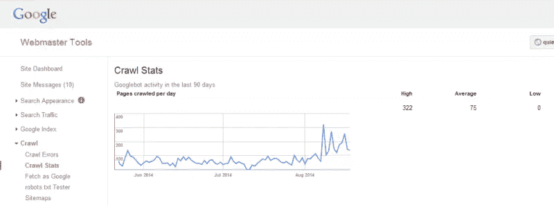
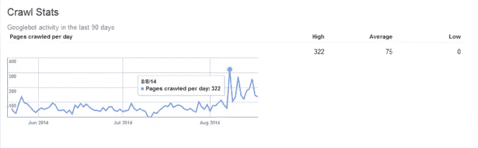
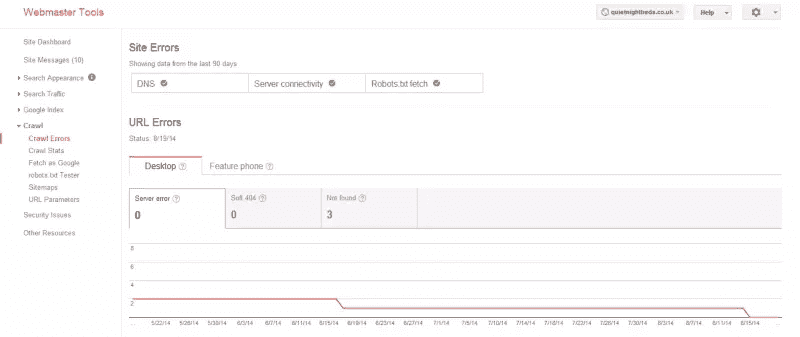

# 通过让你的网站更频繁地被重新抓取来增加搜索流量

> 原文：<https://www.sitepoint.com/increase-search-traffic-getting-site-recrawled-often/>

搜索引擎排名对你网站的成功至关重要。

正因为它们如此重要，当你努力改进和优化你的网站，却发现你的改变几天甚至几周都没有在谷歌上显示出来，这是令人沮丧的。

这种滞后是由于谷歌在互联网上索引网站的方式。它部署了大量的“蜘蛛”,这些蜘蛛使用一种复杂的算法在整个互联网上运行，检查网站并根据关键词索引页面。

然而，谷歌的蜘蛛或“机器人”抓取你网站的时间并没有固定的周期。事实上，不同的站点之间会有很大的不同。

但你不是无助的。通过采取一些基本步骤，你可以鼓励谷歌更频繁地抓取你的网站——提高你的排名，让你的新页面更快地出现。

## 查看您网站的抓取统计

由于谷歌的抓取频率因网站而异，要了解你的网站被抓取的频率，你首先需要查看你的网站管理员工具。

当您第一次登录网站管理员工具时，它会引导您完成网站的设置过程。

一旦你在网站管理员工具中建立并运行了你的网站，点击左边菜单中的**抓取统计**。以下是我经营的一家床上用品零售网站的统计数据:

谷歌只显示最近 90 天的抓取数据。在右边，谷歌告诉我，它平均每天抓取我的床网站 75 次，在 8 月 8 日:

如你所见，抓取频率每天都有很大的变化。两三个月前，这个特定的网站每天被抓取的次数不到 100 次，在六月和七月的几天里，抓取次数为 0 次。从那以后，它被抓取的频率更高了，上个月有上升趋势。

这种差异有许多原因。网站大小是一个因素。这个网站很大——它列出了成千上万张床，并有定期更新的产品目录。谷歌倾向于每天多次重新抓取大型、频繁更新的网站。

七月和六月的低频率代表了 Google 对我的站点应用手动操作的时期。自 8 月份以来，这些行为已经被谷歌删除。我也加倍了我的营销努力，导致更多的链接指向我的网站，以及更多来自谷歌的抓取。

在 6 月份的手动操作之后，增加的抓取率对我的网站重新排名至关重要。在此期间，我实现了网站范围内的规范标签，以消除重复的内容，努力让我的更多产品有机地列在谷歌的搜索中。有超过 1000 个上市产品，每天获得数百次抓取帮助我的 SEO 努力得到回报。

## 让谷歌更频繁地抓取

当大多数人问大 G 多久抓取一次他们的网站时，这往往是他们想知道的。

事实是，虽然一些网站一天被抓取多次，但其他网站一次不会被抓取一个月。当你继续向你的网站添加内容，却在几周内看不到谷歌搜索结果的变化时，这可能会令人非常沮丧。

有多种方法可以鼓励谷歌更频繁地抓取你的网站。

### 1.缩短网站加载时间并减少服务器错误

如果你的网站加载速度很快，并且没有很多错误和坏页面，谷歌的算法更有可能抓取你的网站。

如果你的网站存在连接问题，谷歌就不太可能经常抓取你的网站。这就是为什么有一个好的主机和可靠的服务器是至关重要的。

此外，页面加载时间也对谷歌抓取你的网站的频率有影响。有多种方法可以优化页面加载时间，这超出了本文的范围。但是，有一种简单的方法可以让您自己查看爬网错误，并找出问题所在。

爬网错误报告位于网站管理员工具的爬网部分的左侧菜单中。正如你所看到的，就连接性而言，我的网站看起来相当健康(在网站错误标题下指出)。从 URL 错误图表中，您可以看到 5 月份有两个服务器错误，6 月份有一个错误，该站点现在返回零错误。这也与八月份增加的抓取频率相对应，因为我的服务器错误已经减少到零。

### 2.经常更新你的网站

另一种增加谷歌抓取你网站频率的方法是经常更新网站。

谷歌喜欢定期更新的网站，并会经常回来奖励你的努力，确保该网站在其搜索中被完全索引。

这对于新闻网站来说很简单，但是对于零售网站来说却很棘手，比如我上面的例子。产品很少变化——当然不像新闻报道那样频繁——企业很难绕开这一点。

这就是为什么拥有一个博客如此重要。博客内容可以随时更新。定期添加新的材料会让谷歌回来重新抓取你的网站。

### 3.创建更多的入站链接

这是提高你爬行速度的一种方法，如果做错了，会给你带来很多麻烦。

谷歌不赞成它认为的“无机”的到你网站的链接，它认为这是垃圾邮件。

如果你试图通过购买链接来游戏谷歌，或者如果你有太多低质量的链接指向你的网站(如来自成人或赌博网站的链接)，你可能会发现谷歌的蜘蛛运行从你的网站，永远不会回来。

然而，不可否认的是，你从其他网站获得的指向你网站的权威链接越多，谷歌重新抓取它的可能性就越大。有了更新更新鲜的链接，谷歌会增加抓取频率。

### 4.发布网站地图

就你的网站被抓取的频率而言，这种策略的有效性存在争议。

谷歌在决定何时重新抓取你的网站时会考虑一系列因素，而网站地图只是其中的一个次要因素。网站更新频率、入站链接和页面加载时间更为重要。

但是通过提交一个网站地图给谷歌，你给了它的蜘蛛你的网站的完整布局，使它更容易被抓取。

更重要的是，一些站点地图生成器允许您输入一个字段，表示您计划更改或添加站点内容的频率。

虽然这本身不会影响重新抓取率，但如果你真的像你说的那样经常更新网站，那将会影响它被抓取的频率。

### 5.获取为谷歌

让谷歌重新抓取你的网站的最后一个方法是通过在你的网站管理员工具中提交一个 URL 来直接请求抓取。在左边的抓取菜单下，你会看到一个谷歌抓取的链接:

此选项允许您通过在提供的空白处输入任何页面的完整 URL 来强制 Google 重新抓取您的网站。这几乎可以立即产生结果，并且是让谷歌知道你已经更新了你的网站的最可靠的方法之一。

谷歌限制你每个账户每月只能提交 10 份索引。如果你在同一个网站管理员工具账户中拥有多个客户网站，请确保谨慎使用你的提交内容。

## 从理解你的爬行统计开始

显然有很多因素会影响谷歌抓取你网站的频率。

试图理解这些因素是如何影响你的排名的，首先要使用你的网站管理员工具中的抓取统计数据来获得一个清晰的图像。

这些报告将让你知道如何提高你的抓取率，无论是升级你的服务器，提交网站地图或增加你的网站的入站链接数量。

## 分享这篇文章