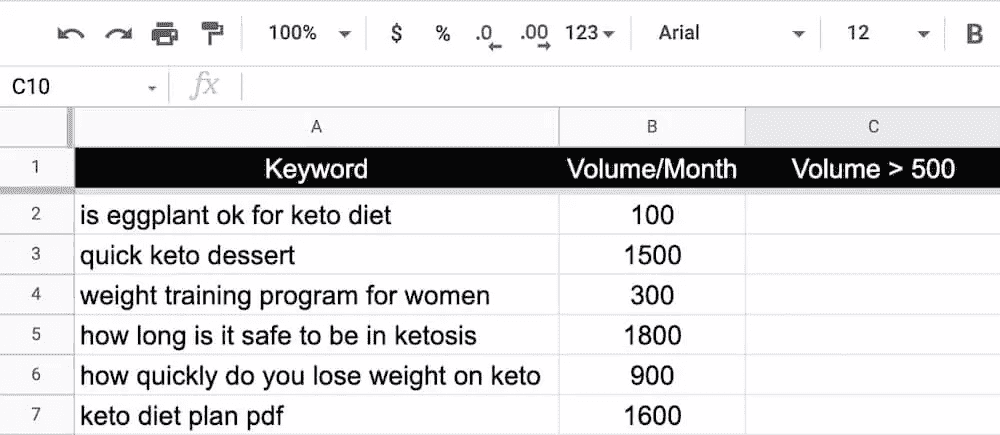
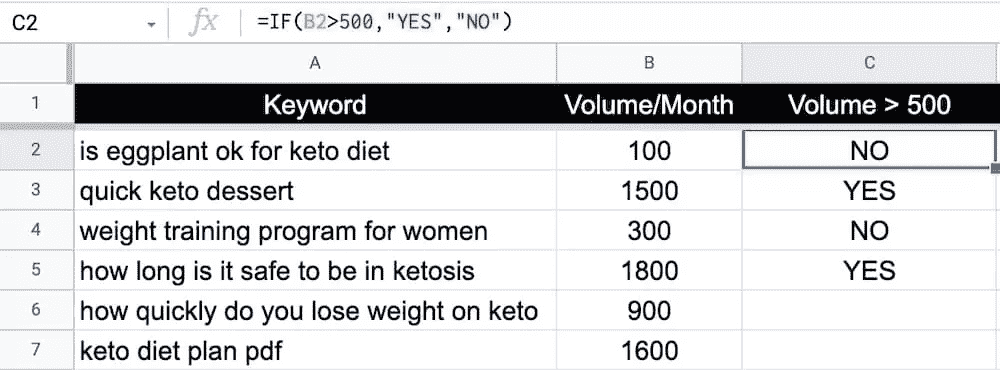
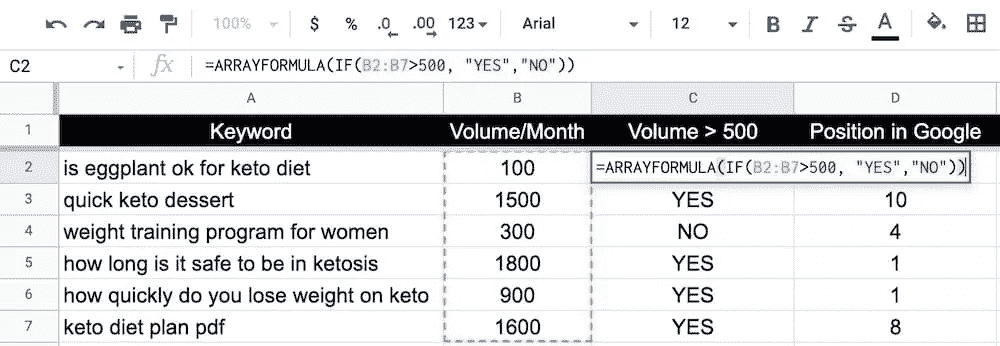
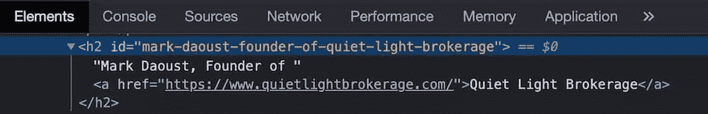
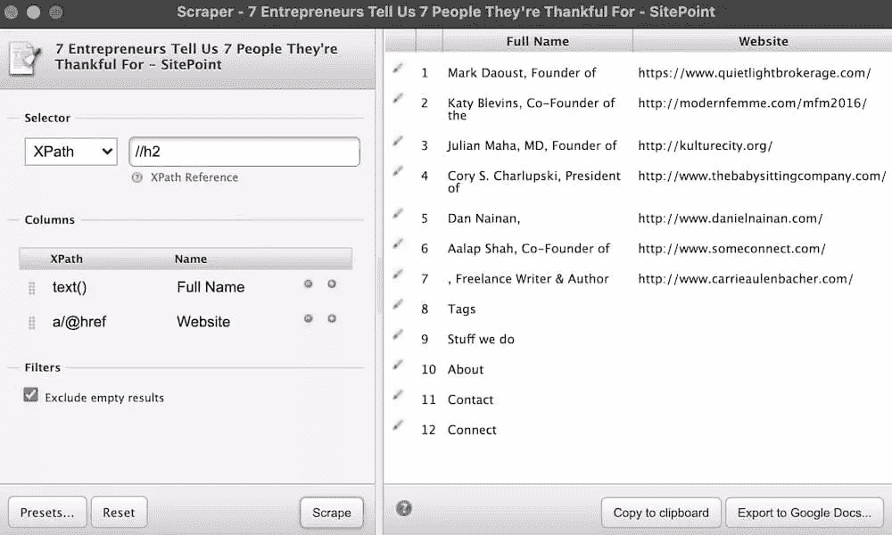
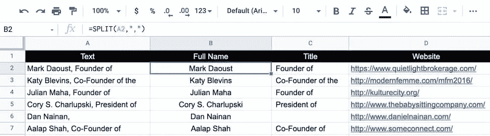

# 使用自动化来增加网络流量

> 原文：<https://www.sitepoint.com/increase-web-traffic-using-automation/>

企业家面临的最大挑战之一是将他们的业务展现在潜在客户面前。营销吸引线索，线索成为客户，客户提供利润。不幸的是，外联、网络和搜索引擎优化都在营销中发挥着作用——而且不用多久你就会意识到，在你为发展业务所做的一切事情之上，你正面临着相当大的工作量。

幸运的是，由于新技术的出现，您现在可以自动化部分流程，以帮助减少工作量并提高效率。在本文中，我们将介绍几种使用自动化来增加 web 流量和改进工作流程的方法。

## 在社交媒体上分享新内容

社交媒体平台在全球拥有 36 亿用户，这些年来经历了令人难以置信的增长，而且没有放缓的迹象。

虽然它们最初用于娱乐和社交，但现在已经成为主要的营销渠道之一。可以预见的是，92%的营销人员使用社交媒体作为他们发展战略的一部分。

一个完善的结构化社交媒体营销计划可以帮助您:

*   从反向链接产生网络流量
*   与你的观众建立信任
*   提高品牌知名度
*   接触更广泛的受众
*   增加你的在线粉丝

每个社交媒体平台都有不同的人口统计，所以你应该为你想关注的平台定制你的内容。例如，你那令人敬畏的 20 秒视频可能在抖音很受欢迎，但在 Instagram 和脸书却完全失败了。

在每个平台上手动发布是非常耗时的，甚至可能不值得[投资回报](https://www.sitepoint.com/really-measure-roi-social-efforts/)。幸运的是，有几个工具可以用来自动化内容发布。

### 将 ContentCal 与 Zapier 集成

[ContentCal](https://www.contentcal.io/) 是一款营销策划工具，帮助你策划和创作内容。当你将它与 Zapier 这样的工具配对时——它可以帮助你在两个或更多应用程序之间自动化重复的任务——你可以自动将内容从 ContentCal 发布到社交平台。

例如，在你用你想要的社交媒体平台设置了 ContentCal 之后，一旦你在日程表中添加了一个新帖子，这个帖子就可以自动生成 Instagram 帖子、Pinterest pins 和脸书更新。所有这些对于每个平台来说都是独一无二的，不需要您做任何额外的工作。

然而，与 ContentCal 的集成并不局限于发布内容并将其发布到不同的地方。您也可以将内容从外部引入 ContentCal。例如，如果您的团队在内部使用 Slack，并且一直在讨论一些新的想法，您可以很容易地将这些想法引入 ContentCal。

用 Zapier 连接 ContentCal 是一个相当简单的过程。一旦你用这两种服务创建了一个账户，你就可以查看 Zapier 的预制[内容集成](https://zapier.com/apps/contentcal/integrations)列表，然后点击“尝试”开始测试。

## 将数据发送到 Google Sheets

Google Sheets 是一个强大的免费工具，它允许你组织和操作大数据集，创建半自动的 SEO 工作流等等。

Google Sheets 可以改善 SEO 工作流程的一个很好的方法是允许您从 SEO 工具中导入关键字和搜索量数据，这样您可以更容易地操作它。

此外，从 SEO 工具中导出数据对于预算不多、不想再增加月支出的初创公司来说也很棒。例如，您可以注册免费试用，或者只支付一个月的使用费用，然后导出您需要的所有数据。

但是，如果没有正确的公式，您可能会花费大量时间来排序、合并、拆分、添加、删除和搜索数据。最基本也是最有用的公式之一是`IF`函数。

### 使用 IF 功能

当您想要检查电子表格中某个数据列表的某个条件是真还是假时，可以使用 Google Sheets 中的`IF`函数。

语法如下所示:

```
IF(condition, value_if_true, value_if_false) 
```

`condition`是你要测试的是真还是假。如果为真，`value_if_true`就是将要显示的内容。如果为假，将显示`value_if_false`。

假设您已经将一系列关键词及其搜索量导入到 Google Sheets，但只想使用每月能带来 500+访问者的关键词。



您可以设置`IF`函数，为每月能带来 500+访问者的关键字返回`YES`,为其余关键字返回`NO`:

```
=IF(B2>500,"YES","NO") 
```



### 使用数组公式

如果你正在处理一个大的数据集，在数千个单元格中拖动公式会很麻烦。这就是 ARRAYFORMULA 派上用场的地方。

语法如下所示:

```
=ARRAYFORMULA(array_formula) 
```

这允许您键入一次公式，然后将其应用于整个行或列。只需用您想要复制的公式替换`array_formula`。在我们的例子中，它是`IF`函数公式。只要记住在公式中包括您的第一个和最后一个单元格。



## 跟踪已发布的帖子

写博客是最常见的将你的网站赚钱和增加网络流量的方式之一。然而，一旦你已经做了几年，就很难记住你已经瞄准的主题和关键词。

跟踪发布的博客文章将帮助你避免[重复内容](https://developers.google.com/search/docs/advanced/guidelines/duplicate-content)的问题，这些问题会对你的搜索引擎优化和网络流量产生负面影响。

Google Sheets 是可视化这些数据的一个很好的工具，但是手动添加每篇博客文章可能很耗时，尤其是如果你的企业每周发布多篇文章的话。

好消息是，你可以使用 Zapier 将 WordPress 与 Google Sheets 连接起来，自动跟踪你发布的内容，而无需手动输入数据。


要设置这个工作流程，您必须首先创建一个 Google Sheet，其中包含日期、标题、类别和其他您想要的信息。

接下来，您将创建一个 Zap，在每次发布帖子时自动将数据添加到表单中。在 Zap 中，将相关的 WordPress 数据分配给你创建的每一列。

这是 Zapier 预先制作的 WordPress 集成列表。

## 使用工具抓取网页

Web 抓取可以用来轻松找到愿意为您的帖子、客座博文机会、竞争分析等做出贡献的专家。

虽然可以在逐个站点的基础上手动进行清理，但这可能非常耗时。一个更好的抓取网页的方法是使用现有的工具，如 [Scraper 浏览器扩展](https://chrome.google.com/webstore/detail/scraper/mbigbapnjcgaffohmbkdlecaccepngjd?hl=en)或[使用 Python 这样的编程语言编写自己的 scraper](https://www.sitepoint.com/web-scraping-for-beginners/) 。

在本文中，我们将讨论如何使用 Scraper 扩展找到潜在的博客贡献者。

### 寻找潜在的博客贡献者

早在 2014 年，在其[搜索质量指南](https://static.googleusercontent.com/media/guidelines.raterhub.com/en//searchqualityevaluatorguidelines.pdf)中，谷歌引入了一个名为 E-A-T 的概念，代表专业、权威和可信。

这三个因素在谷歌的搜索质量评估中使用，在评估中，他们雇佣数千名审查人员手动审查一组网页，并向谷歌提交关于其质量的反馈。基本上，这是谷歌根据专业知识、权威性和可信度来衡量对一个品牌或网站的信任度的一种方式。

让专家为你的博客做贡献将有利于你的业务和谷歌 E-A-T，这可以帮助提高搜索排名，并最终增加网络流量。

但是，虽然很容易想到你可能想要联系的专家，但重要的是要记住，不是每个人都有时间或愿意这样做。与其给你能想到的每一个人发邮件，不如把你的时间花在寻找有贡献的专家上。这可以通过删除现有的“专家综述”帖子来实现。

以下是如何使用刮刀扩展来完成的。

首先，找一个专家综述帖子。我们将以约书亚·克劳斯的这篇综述文章为例。

接下来，您需要检查将要抓取的数据的结构和格式。在我们的例子中，是专家的全名，后面跟着他们的头衔和网站。


当使用浏览器的 inspect 工具检查 HTML 时，您可以看到一切都被包裹在`<h2>`标签中。



为了提取出`<h2>`标签中的名称和网站，您将使用 Scraper 扩展来使用 XPath 抓取`text()`和`a/@href`。

如果你不熟悉 XPath，你可以看看这个备忘单。



现在将数据复制到你的剪贴板，并粘贴到谷歌工作表。你可以重复这些步骤来写尽可能多的综述文章。


为了更好地清理数据，可以使用`SPLIT`公式将姓名和头衔分隔到不同的单元格中。

语法是这样的:

```
=SPLIT(text, delimiter) 
```

由于我们要拆分逗号所在的字符串，我们可以设置以下公式:

```
=SPLIT(A2,”,”) 
```



要将公式应用于整个列，您可以像以前一样将所有内容都放在一个`ARRAYFORMULA`中。

## 设置 Google 提醒

Google Alerts 是一款免费的通知工具，当您的姓名、网站或您指定的任何搜索术语出现在 Google 索引的网站上时，它会向您发送电子邮件或向 RSS 订阅源添加项目。

如果你使用访客发帖作为增加网络流量的策略的一部分，Google Alerts 是一个很好的方式来获得关于新访客发帖机会的通知，而不必手动搜索。

### 寻找访客发布机会

要为访客发布机会设置 Google Alerts，只需访问 google.com/alerts 的，在搜索栏中输入`topic + "guest post by"`，然后点击`Show options`并配置您想要的频率、语言以及您想要发送警报的位置。

例如，如果您是 Tesla 的所有者，您可以尝试以下字符串:

*   `intitle: "electric vehicle" + "guest post by"`
*   `topic + "guest post"`
*   `topic + "write for us"`

使用`"guest post by"`的好处是，你会收到来自网站的通知，这些网站接受客座博文，但可能不会刊登广告。然而，另外两个字符串将返回具有关于如何提交客座博文的专门页面的网站。这意味着会有更多的人向他们发送广告，所以竞争会更激烈一些。

另一个很好的技巧是在你的搜索字符串中包含客座博文作者的名字。这将允许你检查他们贡献的其他网站，这样你也可以向他们发送广告。

以下是如何为来自 SitePoint 的 James Hibbard 的客座博文设置提醒:

```
"guest post by" + "james hibbard" -site:sitepoint.com 
```

如果使用此搜索字符串，请务必删除作者的网站。这样，你就不会收到来自他们自己网站的大量警告。要删除他们的网站，你所要做的就是添加`-site:website.com`操作符。

## 自动化你的生活

作为一名企业主，你应该明智地把时间花在那些必须手工完成并带来有机增长的任务上。

这意味着自动化重复性或非增值任务，不需要您手动执行它们。希望这份指南能帮助你自动化你的策略来增加网络流量。

## 分享这篇文章