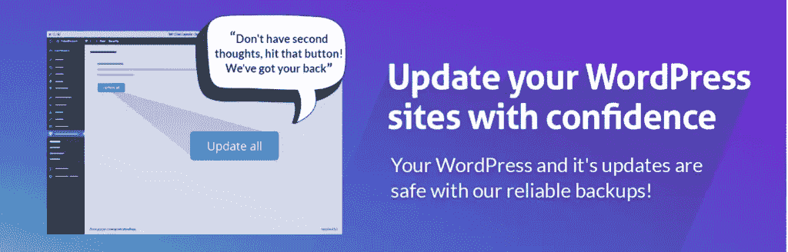
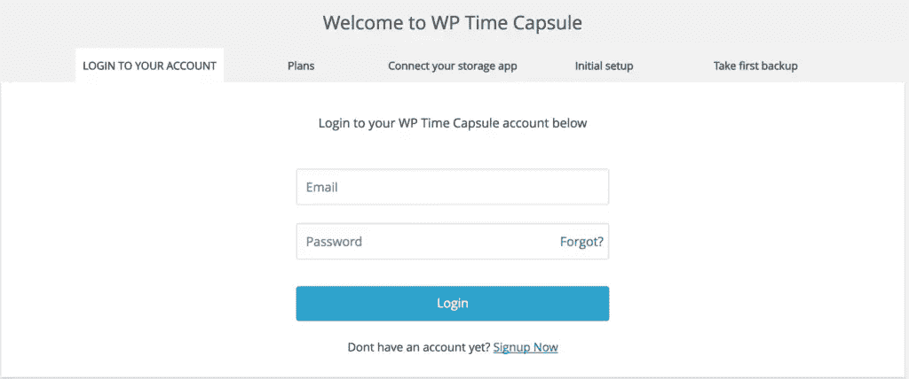
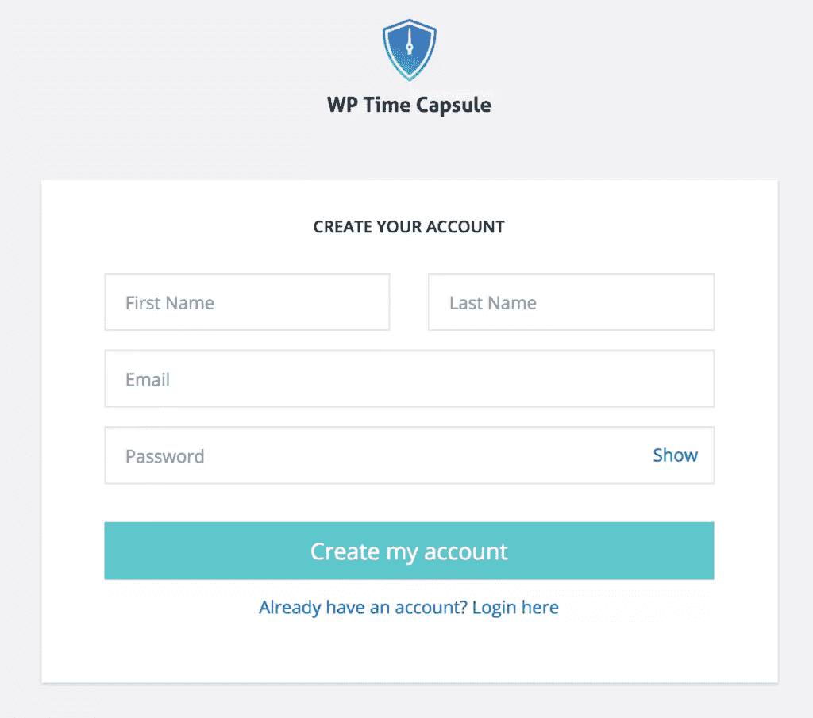
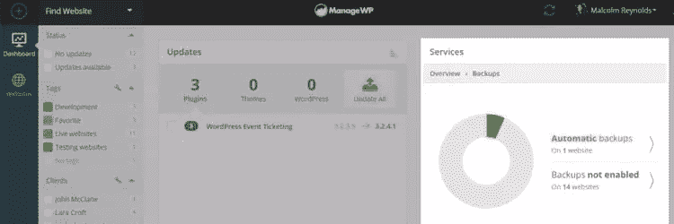

# 如何在 WordPress 中进行增量备份

> 原文：<https://www.sitepoint.com/incremental-backups-wordpress/>

定期备份你的网站将有助于你在出错时恢复丢失的数据。增量备份则更进一步，只备份自上次备份以来的更改，这是安全性和效率的完美结合。

您一定听过人们讲述他们的数据丢失恐怖故事，在这些故事中，他们无法恢复数据，因为他们没有保留备份。备份不亚于网站保险。这就像你把你的数据拷贝放在一个安全的柜子里，在紧急情况下，你取回它并使用它来重建你的站点。WordPress 插件在这方面很有帮助，你会发现有很多很好的选择来轻松创建备份。创建备份时，您会希望它包含当时网站上的所有内容(文件、数据库等)。

### 备份保护 WordPress 网站

通过我们的综合课程，你可以了解更多关于[构建一个定制的主题](https://www.sitepoint.com/premium/courses/wordpress-theme-development-2931)。想要快速了解 WordPress 主题，请查看我们的课程[构建你的第一个 WordPress 主题](https://www.sitepoint.com/premium/courses/build-your-first-wordpress-theme-2953)，你可以在下面预览:

WordPress 安全性已经被讨论了很长时间，你会发现关于它的大量内容。备份是一个永久的解决方案，应该放在你用来保护网站的工具库中。然而，WordPress 备份可以包含不同的类型，例如:

*   **手动:**这里你所有的网页文件(如插件、主题、上传目录)和数据库都是通过 PhpMyAdmin、终端、FTP 等手动下载的。如果你经常在你的 WP 网站上修改，手动备份就不那么方便了。他们需要更多的时间和更多的工作。如果你决定进行手动备份，你可以在[网站上了解更多信息](https://www.sitepoint.com/premium/courses/wordpress-security-2954/lesson/1/step/4)
*   **自动:**你将使用 WordPress 插件或一些服务来自动备份。可以为进行备份的时间间隔(即每天、每周、每月、每小时)配置插件。
*   **实时:**当您对网站内容进行任何更改时，这些备份会实时同步。
*   **完整站点备份:**这里，备份是针对整个站点进行的，而不仅仅是数据库或内容的 XML 导出。
*   **增量备份:**这是一种仅复制自上次备份以来发生更改的文件和数据的备份类型。

### 增量备份

然而，这篇文章的主要目的不是强调备份的重要性。我相信你们大多数人已经意识到需要备份。相反，我将专门讨论增量备份，它不仅提供了站点安全性，还节省了 web 资源。但是，我会深入介绍细节，让我们看一下增量备份的一些基础知识。

例如，假设在第 1 天进行了一次完整站点备份。稍后进行的增量备份将保存自第 1 天备份以来更改过的所有文件。但是，*下一次*增量备份将只备份自最近一次增量备份以来发生更改的文件，依此类推。重复该过程，直到执行另一次全站点备份。

增量备份的主要优势是每天备份的文件更少，允许更短的备份窗口(备份完整站点有时会导致性能问题，需要更长的备份窗口)。这样，您可以保留 web 资源，如服务器内存和存储空间的使用。

希望到现在为止，您已经认识到对您的网站进行增量备份的好处。有几个备份插件，但是 WP Time Capsule 插件取代了几乎所有的备份解决方案。

### WP 时间胶囊

在所有备份插件中， [WP Time Capsule](https://wordpress.org/plugins/wp-time-capsule/) 为 WordPress 网站提供了最好的增量备份实现。安装插件时，它会对你的站点进行完整备份，包括数据库和文件。稍后，它只更新所做的更改。这令人印象深刻，因为它往往利用较少的服务器带宽。一个完整的站点备份可能有数百 MB 大，但许多微小的更改通常都很小，只需几分之一秒就可以更新。

这个插件的目的是在创建自动备份时节省你的时间。此外，WP Time Capsule 插件可以让你自动创建、安排和直接发送备份到 Google Drive、Dropbox 和 AWS。一旦执行了备份，它将使用应用程序的原生版本控制系统来检测未来的文件更改。由于只备份修改过的文件，WP Time Capsule 减轻了你的存储和内存负担，否则你可能会保留多个巨大的备份。同样，备份的检索也很快。一旦插件安装完成，你需要做的就是用一个[WPTimeCapsule.com](https://wptimecapsule.com/)账户连接它。

如果你没有账号，那么你可以[注册一个](https://wptimecapsule.com/)。

输入您的电子邮件 id 后，您将被引导至该注册表单。

这个插件的基本版本是免费的，但是你也可以购买付费的来获得更多的高级功能。每个站点的月价格是 5 美元，这是非常合理的。然而，如果你正在寻找其他付费的增量备份解决方案，尤其是多个 WordPress 网站，那么你可能会对 ManageWP 感兴趣，它已经存在了相当长的时间。

### 管理 WP 备份

当你必须管理多个 WordPress 网站时， [ManageWP](https://managewp.com/) 是一个传统的网络应用程序，你可以用它来做这些事情。它提供了从一个单一的仪表板一键访问您的所有网站。这意味着您可以从一个位置监控安全性和备份。最近，他们经历了一次重大的服务升级，他们称之为猎户座。ManageWP Orion 提供了增量云备份的能力。您可以松一口气，让 Orion 定期进行站点备份。这是一个很棒的特性，因为备份存储在 Amazon Web Services 上。然而，Orion 只能按月安排备份，这就是它落后于 WP Time Capsule 插件的地方。如果出于某种原因，ManageWP 不能满足你对多站点管理系统进行更新和备份的需求，你也可以查看[在 InfiniteWP](https://www.sitepoint.com/managing-wordpress-updates-with-infinitewp/) 上的这篇帖子，这是另一个潜在的解决方案。

### 结论

定期安排手动备份是一个令人厌烦的过程，您不能重复执行。这是浪费时间，而且不可靠，这取决于你繁忙的日程安排和你的记忆力。有了自动增量备份解决方案，这就是一劳永逸的情况。尤其是当你同时保存网络资源的时候！因此，是时候从传统备份转向增量备份了。您正在使用哪种类型的备份解决方案？是增量吗？分享你的经验，并在下面的评论框中留下你的反馈！

## 分享这篇文章