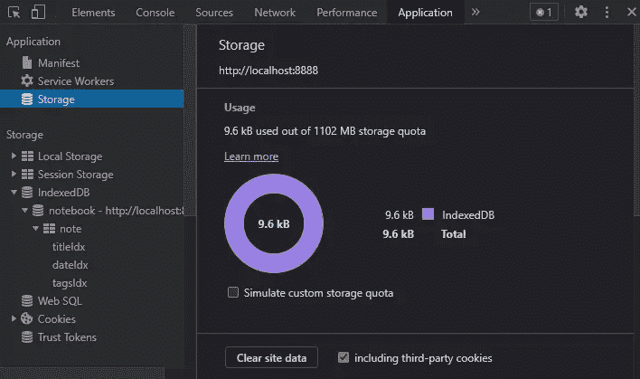
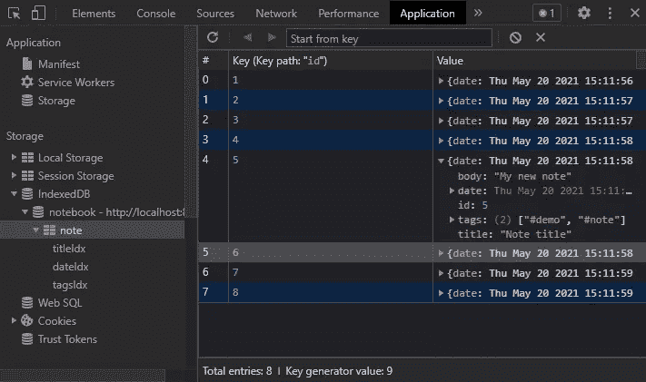

# 如何在带有 IndexedDB 的浏览器中存储无限*数据

> 原文：<https://www.sitepoint.com/indexeddb-store-unlimited-data/>

本文解释了使用 IndexedDB API 在浏览器中存储数据的基本原理，它提供了比其他客户端机制更大的容量。

存储 web 应用程序数据曾经是一个简单的决定。除了将它发送到更新数据库的服务器之外，别无选择。今天，有一系列的选择，数据可以存储在客户端。

## 为什么要在浏览器中存储数据？

将大多数用户生成的数据存储在服务器上是可行的，但也有例外:

*   特定于设备的设置，如 UI 选项、亮/暗模式等。
*   短暂的数据，例如在选择一张照片进行上传之前捕获一系列照片
*   离线数据供以后同步，可能在连接受限的区域
*   出于实用或隐私原因离线运行的渐进式网络应用程序(pwa)
*   缓存资产以提高性能

三种主要的浏览器 API 可能是合适的:

1.  [网络存储](https://developer.mozilla.org/docs/Web/API/Web_Storage_API)

    在当前会话期间或之后的简单同步名称-值对存储。对于较小的、不太重要的数据，如用户界面首选项，这很实用。浏览器允许每个域有 5MB 的网络存储空间。

2.  [缓存 API](https://developer.mozilla.org/docs/Web/API/Cache)

    HTTP 请求和响应对象对的存储。服务人员通常使用 API 来缓存网络响应，因此渐进式 web 应用程序可以更快地执行和离线工作。浏览器不同，但 iOS 上的 Safari 分配的是 50MB。

3.  [索引编制单位](https://developer.mozilla.org/docs/Web/API/IndexedDB_API)

    一个客户端的 NoSQL 数据库，可以存储数据、文件和 blobs。浏览器各不相同，但每个域至少应该有 1GB 的可用空间，最多可以达到剩余磁盘空间的 60%。

好吧，我撒谎了。IndexedDB 不提供无限制的 T2 存储，但是它比其他选项的限制少得多。这是大型客户端数据集的唯一选择。

## IndexedDB 简介

IndexedDB 首次出现在浏览器中是在 2011 年。该 API 于 2015 年 1 月成为 W3C 标准，并于 2018 年 1 月被 API 2.0 取代。API 3.0 正在开发中。因此， [IndexedDB 拥有良好的浏览器支持](https://caniuse.com/indexeddb)，并且可以在标准脚本和 [Web Workers](https://developer.mozilla.org/docs/Web/API/Web_Workers_API) 中使用。自虐的开发者甚至可以在 IE10 中尝试一下。

<picture><source type="image/webp" srcset="https://caniuse.bitsofco.de/image/indexeddb.webp"><source type="image/png" srcset="https://caniuse.bitsofco.de/image/indexeddb.png"></picture>

本文引用了以下数据库和索引数据库术语:

*   **数据库**:顶级店铺。可以创建任意数量的 IndexedDB 数据库，尽管大多数应用程序都会定义一个。数据库访问仅限于同一域内的页面；甚至子域也被排除在外。示例:您可以为笔记应用程序创建一个`notebook`数据库。

*   **对象存储**:相关数据项的名称/值存储，概念上类似于 MongoDB 中的集合或 SQL 数据库中的表。您的`notebook`数据库可以有一个`note`对象存储来保存记录，每个记录都有一个 ID、标题、正文、日期和一个标签数组。

*   **key** :用于引用对象存储中每条记录(值)的唯一名称。它可以自动生成或设置为记录中的一个值。ID 最适合用作`note`商店的密钥。

*   **autoIncrement** :一个已定义的键的值可以在每次记录被添加到存储时自动递增。

*   **索引**:告诉数据库如何在对象存储中组织数据。必须创建一个索引，以便使用该数据项作为标准进行搜索。例如，笔记`date`可以按时间顺序进行索引，这样就可以定位特定时期的笔记。

*   **模式**:数据库中对象存储、键和索引的定义。

*   **version** :分配给模式的版本号(整数)，以便在必要时更新数据库。

*   **操作**:创建、读取、更新或删除(CRUD)记录等数据库活动。

*   **事务**:一个或多个操作的包装器，保证数据的完整性。数据库要么运行事务中的所有操作，要么一个都不运行:它不会运行一些操作而让其他操作失败。

*   游标(cursor):一种迭代许多记录而不必一次将所有记录都加载到内存中的方法。

*   **异步执行** : IndexedDB 操作异步运行。当一个操作开始时，比如获取所有笔记，该活动在后台运行，其他 JavaScript 代码继续运行。当结果准备好时，调用一个函数。

下面的例子将笔记记录存储在名为`notebook`的数据库中的`note`对象存储中，如下所示:

```
{
  id: 1,
  title: "My first note",
  body: "A note about something",
  date: <Date() object>,
  tags: ["#first", "#note"]
} 
```

IndexedDB API 有点过时，依赖于事件和回调。它不直接支持 ES6 的语法可爱性，如 Promises 和`async` / `await`。像 [idb](https://www.npmjs.com/package/idb) 这样的包装库是可用的，但是本教程深入到金属。

## IndexDB 开发工具调试

我确信*你的*代码是完美的，但是我犯了很多错误。甚至本文中的小片段都被重构了很多次，在此过程中，我破坏了几个 IndexedDB 数据库。浏览器开发工具是无价的。

所有基于 Chrome 的浏览器都提供了一个**应用**标签，你可以在这里检查存储空间，人为限制容量，并擦除所有数据:



存储树中的 **IndexedDB** 条目允许您检查、更新和删除对象存储、索引和单个记录:



(Firefox 有一个类似的面板，名为**存储**。)

或者，您可以在匿名模式下运行应用程序，这样当您关闭浏览器窗口时，所有数据都会被删除。

## 检查 IndexedDB 支持

当浏览器支持 IndexedDB 时，`window.indexedDB`评估`true`:

```
if ('indexedDB' in window) {

  // indexedDB supported

}
else {
  console.log('IndexedDB is not supported.');
} 
```

很少会遇到没有 IndexedDB 支持的浏览器。一个应用程序可以退回到更慢的基于服务器的存储，但大多数人会建议用户升级他们十年前的应用程序！

## 检查剩余存储空间

基于承诺的 [StorageManager API](https://developer.mozilla.org/docs/Web/API/StorageManager) 提供了对当前域剩余空间的估计:

```
(async () => {

  if (!navigator.storage) return;

  const
    required = 10, // 10 MB required
    estimate = await navigator.storage.estimate(),

    // calculate remaining storage in MB
    available = Math.floor((estimate.quota - estimate.usage) / 1024 / 1024);

  if (available >= required) {
    console.log('Storage is available');
    // ...call functions to initialize IndexedDB
  }

})(); 
```

IE 或 Safari 还不支持这个 API，所以当`navigator.storage`不能返回 falsy 值时要小心。

除非设备的驱动器容量不足，否则通常有接近 1，000 兆字节的可用空间。Safari *可能会*提示用户同意更多，尽管 pwa 无论如何都会被分配 1GB。

当达到使用限制时，应用程序可以选择:

*   删除旧的临时数据
*   要求用户删除不必要的记录，或者
*   将较少使用的信息转移到服务器*(实现真正的无限存储！)*

## 打开 IndexedDB 连接

使用 [`indexedDB.open()`](https://developer.mozilla.org/docs/Web/API/IDBFactory/open) 初始化 IndexedDB 连接。它通过了:

*   数据库的名称，以及
*   可选版本整数

```
const dbOpen = indexedDB.open('notebook', 1); 
```

这段代码可以在任何初始化块或函数中运行，通常是在检查了 IndexedDB 支持之后。

当第一次遇到这个数据库时，必须创建所有的对象存储和索引。一个`onupgradeneeded`事件处理函数获取数据库连接对象(`dbOpen.result`)并根据需要运行 [`createObjectStore()`](https://developer.mozilla.org/docs/Web/API/IDBDatabase/createObjectStore) 等方法:

```
dbOpen.onupgradeneeded = event => {

  console.log(`upgrading database from ${ event.oldVersion } to ${ event.newVersion }...`);

  const db = dbOpen.result;

  switch( event.oldVersion ) {

    case 0: {
      const note = db.createObjectStore(
        'note',
        { keyPath: 'id', autoIncrement: true }
      );

      note.createIndex('dateIdx', 'date', { unique: false });
      note.createIndex('tagsIdx', 'tags', { unique: false, multiEntry: true });
    }

  }

}; 
```

这个例子创建了一个名为`note`的新对象存储。(可选的)第二个参数声明每个记录中的`id`值可以用作商店的键，并且每当添加新记录时，它可以自动递增。

[`createIndex()`方法](https://developer.mozilla.org/docs/Web/API/IDBObjectStore/createIndex)为对象存储定义了两个新的索引:

1.  `dateIdx`在每条记录的`date`上
2.  每个记录中的`tags`数组上的`tagsIdx`(一个`multiEntry`索引，它将单个数组项扩展到一个索引中)

我们可能有两个具有相同日期或标签的笔记，所以`unique`被设置为 false。

*注意:这个 switch 语句看起来有点奇怪而且没有必要，但是当[升级模式](#updateadatabaseschema)时它会变得有用。*

一个`onerror`处理程序报告任何数据库连接错误:

```
dbOpen.onerror = err => {
  console.error(`indexedDB error: ${ err.errorCode }`);
}; 
```

最后，当连接建立时，运行一个`onsuccess`处理程序。连接(`dbOpen.result`)用于所有进一步的数据库操作，因此它可以被定义为一个全局变量，或者被传递给其他函数(例如`main()`，如下所示):

```
dbOpen.onsuccess = () => {

  const db = dbOpen.result;

  // use IndexedDB connection throughout application
  // perhaps by passing it to another function, e.g.
  // main( db );

}; 
```

## 在对象存储中创建记录

以下过程用于向商店添加记录:

1.  创建一个事务对象，该对象定义一个对象存储(或对象存储数组)和一个访问类型`"readonly"`(仅获取数据—默认)或`"readwrite"`(更新数据)。

2.  使用 [`objectStore()`](https://developer.mozilla.org/docs/Web/API/IDBTransaction/objectStore) 获取一个对象存储(在事务范围内)。

3.  运行任意数量的 [`add()`](https://developer.mozilla.org/docs/Web/API/IDBObjectStore/add) (或 [`put()`](https://developer.mozilla.org/docs/Web/API/IDBObjectStore/put) )方法并向商店提交数据:

    ```
    const

      // lock store for writing
      writeTransaction = db.transaction('note', 'readwrite'),

      // get note object store
      note = writeTransaction.objectStore('note'),

      // insert a new record
      insert = note.add({
        title: 'Note title',
        body: 'My new note',
        date: new Date(),
        tags: [ '#demo', '#note' ]
      }); 
    ```

该代码可从任何块或函数执行，该块或函数可访问建立 [IndexedDB 数据库连接](#openanindexeddbconnection)时创建的`db`对象。

错误和成功处理函数决定结果:

```
insert.onerror = () => {
  console.log('note insert failure:', insert.error);
};

insert.onsuccess = () => {
  // show value of object store's key
  console.log('note insert success:', insert.result);
}; 
```

如果没有定义任何一个函数，它将冒泡到事务，然后数据库处理(可以用`event.stopPropagation()`停止)。

当写入数据时，事务锁定所有对象存储，因此其他进程无法进行更新。这将影响性能，因此使用单个进程批量更新许多记录可能比较实用。

与其他数据库不同，当启动进程的函数完成执行时，IndexedDB 事务会自动提交。

## 更新对象存储中的记录

当试图用现有的键插入记录时，`add()`方法将失败。`put()`将在传递键时添加记录或替换现有记录。以下代码用`1`的`id`更新注释(或在必要时插入):

```
const

  // lock store for writing
  updateTransaction = db.transaction('note', 'readwrite'),

  // get note object store
  note = updateTransaction.objectStore('note'),

  // add new record
  update = note.put({
    id: 1,
    title: 'New title',
    body: 'My updated note',
    date: new Date(),
    tags: [ '#updated', '#note' ]
  });

// add update.onsuccess and update.onerror handler functions... 
```

*注意:如果对象存储没有定义引用`id`的`keyPath`，`add()`和`put()`方法都提供第二个参数来指定键。例如:*

```
update = note.put(
  {
    title: 'New title',
    body: 'My updated note',
    date: new Date(),
    tags: [ '#updated', '#note' ]
  },
  1 // update the record with the key of 1
); 
```

## 通过键从对象存储中读取记录

可以通过将键传递给 [`.get()`方法](https://developer.mozilla.org/docs/Web/API/IDBObjectStore/get)来检索单个记录。当没有找到匹配时，`onsuccess`处理器接收数据或`undefined`:

```
const

  // new transaction
  reqTransaction = db.transaction('note', 'readonly'),

  // get note object store
  note = reqTransaction.objectStore('note'),

  // get a single record by id
  request = note.get(1);

request.onsuccess = () => {
  // returns single object with id of 1
  console.log('note request:', request.result);
};

request.onerror = () => {
  console.log('note failure:', request.error);
}; 
```

类似的 [`getAll()`方法](https://developer.mozilla.org/docs/Web/API/IDBIndex/getAll)返回匹配记录的数组。

两种方法都接受一个 [KeyRange](https://developer.mozilla.org/docs/Web/API/IDBKeyRange) 参数来进一步细化搜索。例如，`IDBKeyRange.bound(5, 10)`返回所有`id`在 5 和 10 之间(包括 5 和 10)的记录:

```
request = note.getAll( IDBKeyRange.bound(5, 10) ); 
```

关键范围选项包括:

*   [`IDBKeyRange.lowerBound(X)`](https://developer.mozilla.org/docs/Web/API/IDBKeyRange/lowerBound) :大于等于`X`的按键
*   [`IDBKeyRange.upperBound(X)`](https://developer.mozilla.org/docs/Web/API/IDBKeyRange/upperBound) :小于等于`Y`的按键
*   [`IDBKeyRange.bound(X,Y)`](https://developer.mozilla.org/docs/Web/API/IDBKeyRange/bound) :介于`X`和`Y`之间的按键
*   [`IDBKeyRange.only(X)`](https://developer.mozilla.org/docs/Web/API/IDBKeyRange/only) :单键匹配`X`

lower、upper 和 bound 方法有一个可选的 exclusive 标志。例如:

*   `IDBKeyRange.lowerBound(5, true)`:大于`5`的键(但不是`5`本身)
*   `IDBKeyRange.bound(5, 10, true, false)`:大于`5`(但不是`5`本身)且小于等于`10`的按键

其他方法包括:

*   [`.getKey(query)`](https://developer.mozilla.org/docs/Web/API/IDBIndex/getKey) :返回匹配的键(而不是分配给该键的值)
*   [`.getAllKeys(query)`](https://developer.mozilla.org/docs/Web/API/IDBIndex/getAllKeys) :返回匹配键的数组
*   [`.count(query)`](https://developer.mozilla.org/docs/Web/API/IDBIndex/getAllKeys) :返回符合条件的记录数

## 通过索引值从对象存储中读取记录

[必须定义一个索引](#openanindexeddbconnection)来搜索记录中的字段。例如，要查找 2021 年的所有笔记，需要搜索`dateIdx`索引:

```
const

  // new transaction
  indexTransaction = db.transaction('note', 'readonly'),

  // get note object store
  note = indexTransaction.objectStore('note'),

  // get date index
  dateIdx = note.index('dateIdx'),

  // get matching records
  request = dateIdx.getAll(
    IDBKeyRange.bound(
      new Date('2021-01-01'), new Date('2022-01-01')
    )
  );

// get results
request.onsuccess = () => {
  console.log('note request:', request.result);
}; 
```

## 使用游标从对象存储中读取记录

对于较大的数据库，将整个数据集读入数组变得不切实际；它可以填满可用的内存。像一些服务器端数据存储一样，IndexedDB 提供了*游标*，可以一次遍历一条记录。

该示例在索引的`tags`数组中查找包含`"#note"`标记的所有记录。它没有使用`.getAll()`，而是运行一个 [`.openCursor()`方法](https://developer.mozilla.org/docs/Web/API/IDBIndex/openCursor)，该方法被传递一个范围和可选的方向字符串(`"next"`、`"nextunique"`、`"prev"`或`"preunique"`):

```
const

  // new transaction
  cursorTransaction = db.transaction('note', 'readonly'),

  // get note object store
  note = cursorTransaction.objectStore('note'),

  // get date index
  tagsIdx = note.index('tagsIdx'),

  // get a single record
  request = tagsIdx.openCursor('#note');

request.onsuccess = () => {

  const cursor = request.result;

  if (cursor) {

    console.log(cursor.key, cursor.value);
    cursor.continue();

  }

}; 
```

`onsuccess`处理程序在光标位置检索结果，对其进行处理，并运行 [`.continue()`方法](https://developer.mozilla.org/docs/Web/API/IDBCursor/continue)前进到数据集中的下一个位置。一个 [`.advance(N)`方法](https://developer.mozilla.org/docs/Web/API/IDBCursor/advance)也可以通过`N`记录向前移动。

或者，当前光标位置的记录可以是:

*   用 [`cursor.update(data)`](https://developer.mozilla.org/docs/Web/API/IDBCursor/update) 更新，或者
*   删除了 [`cursor.delete()`](https://developer.mozilla.org/docs/Web/API/IDBCursor/delete)

## 从对象存储中删除记录

除了删除当前光标位置的记录，对象存储的 [`.delete()`方法](https://developer.mozilla.org/docs/Web/API/IDBObjectStore/delete)可以被传递一个键值或 KeyRange。例如:

```
const

  // lock store for writing
  deleteTransaction = db.transaction('note', 'readwrite'),

  // get note object store
  note = deleteTransaction.objectStore('note'),

  // delete record with an id of 5
  remove = note.delete(5);

remove.onsuccess = () => {
  console.log('note deleted');
}; 
```

一个更极端的选择是 [`.clear()`](https://developer.mozilla.org/docs/Web/API/IDBObjectStore/clear) ，它从对象存储中清除所有记录。

## 更新数据库模式

在某些时候，有必要更改数据库模式—例如，添加索引、创建新的对象存储、修改现有数据，甚至删除所有内容并重新开始。IndexedDB 提供了内置的模式版本控制来处理更新— *(遗憾的是，其他数据库缺少这个特性！)*。

在定义笔记本模式的第 1 版[时，执行了一个`onupgradeneeded`功能](#openanindexeddbconnection):

```
const dbOpen = indexedDB.open('notebook', 1);

dbOpen.onupgradeneeded = event => {

  console.log(`upgrading database from ${ event.oldVersion } to ${ event.newVersion }...`);

  const db = dbOpen.result;

  switch( event.oldVersion ) {

    case 0: {
      const note = db.createObjectStore(
        'note',
        { keyPath: 'id', autoIncrement: true }
      );

      note.createIndex('dateIdx', 'date', { unique: false });
      note.createIndex('tagsIdx', 'tags', { unique: false, multiEntry: true });
    }

  }

}; 
```

假设笔记标题需要另一个索引。`indexedDB.open()`版本应该从`1`变为`2`:

```
const dbOpen = indexedDB.open('notebook', 2); 
```

标题索引可以添加到`onupgradeneeded`处理程序`switch()`的新`case 1`块中:

```
dbOpen.onupgradeneeded = event => {

  console.log(`upgrading database from ${ event.oldVersion } to ${ event.newVersion }...`);

  const db = dbOpen.result;

  switch( event.oldVersion ) {

    case 0: {
      const note = db.createObjectStore(
        'note',
        { keyPath: 'id', autoIncrement: true }
      );

      note.createIndex('dateIdx', 'date', { unique: false });
      note.createIndex('tagsIdx', 'tags', { unique: false, multiEntry: true });
    }

    case 1: {
      const note = dbOpen.transaction.objectStore('note');
      note.createIndex('titleIdx', 'title', { unique: false });
    }

  }

}; 
```

注意在每个`case`块的末尾省略了通常的`break`。当有人第一次访问应用程序时，`case 0`程序块将运行，然后它将一直运行到`case 1`和所有后续程序块。任何已经在版本`1`上的人都会从`case 1`块开始运行更新。

必要时可以使用索引、对象存储和数据库更新方法:

*   [T2`.createIndex()`](https://developer.mozilla.org/docs/Web/API/IDBObjectStore/createIndex)
*   [T2`.deleteIndex()`](https://developer.mozilla.org/docs/Web/API/IDBObjectStore/deleteIndex)
*   [T2`.createObjectStore()`](https://developer.mozilla.org/docs/Web/API/IDBDatabase/createObjectStore)
*   [T2`.deleteObjectStore()`](https://developer.mozilla.org/docs/Web/API/IDBDatabase/deleteObjectStore)
*   [T2`.deleteDatabase()`](https://developer.mozilla.org/docs/Web/API/IDBFactory/deleteDatabase)

因此，所有用户都将使用相同的数据库版本… *,除非他们在两个或更多选项卡中运行应用程序！*

浏览器不允许用户在一个选项卡中运行模式 1，而在另一个选项卡中运行模式 2。为了解决这个问题，数据库连接`onversionchange`处理程序可以提示用户重新加载页面:

```
// version change handler
db.onversionchange = () => {

  db.close();
  alert('The IndexedDB database has been upgraded.\nPlease reload the page...');
  location.reload();

}; 
```

## 低级索引 b

IndexedDB 是更复杂的浏览器 API 之一，你会错过使用 Promises 和`async` / `await`。除非你的应用程序的需求很简单，否则你会想要推出自己的 IndexedDB 抽象层或者使用一个预建的选项，比如 [idb](https://www.npmjs.com/package/idb) 。

无论你选择哪个选项，IndexedDB 都是最快的浏览器数据存储之一，你不太可能达到它的容量极限。

## 分享这篇文章