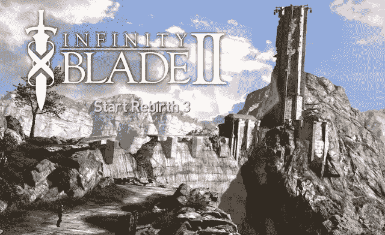
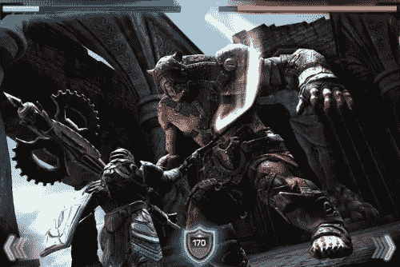

# 无限刀锋 2

> 原文：<https://www.sitepoint.com/infinity-blade-2/>

一般来说，消费者都在寻找一款他们能玩上一两分钟并感到完全满意的游戏。App store 上符合这种需求的珍贵宝石之一是 Infinity Blade II。

将即时满足与引人入胜的故事、角色扮演游戏机制和无限的娱乐结合起来，你就拥有了这款游戏。不要只把这些话当作真理，从 App store 上帮助这款游戏获得 4.5 分(5 颗星)的 19，000 人那里听来。

无限刀锋 II

## 开始

这个游戏开始时你是一名战士，从不朽者那里寻求答案。一场接一场的战斗，你一路杀到楼梯的顶端，一次一个敌人，而这只是序幕！当你搜索和探索一个充满史诗般的战斗、武器、盔甲、宝石的塔时，故事还在继续，最棒的是，还有许多只有不朽者才知道的秘密。

## 游戏部分

这款游戏中的战斗只需要几秒钟，但每一场战斗都会让你紧张不安，这是一款非常棒的移动游戏，适合排队或在家里放松。不像大多数游戏，当你死了，你不会站起来，从同一点继续战斗。相反，游戏会将你所有的物品传给你的近亲，你将开始下一个血统。最好的部分是有无限数量的血统可以玩，这使得无休止的游戏。你玩游戏越多，你就越难放下它。通过更多的游戏，更多的秘密区域将对你开放。

Infinity Blade II 将带你从你碰巧所在的任何地方出发，让你感觉是你在与游戏中的泰坦和巨人战斗，而不是控制一个化身。你需要用你的拇指快速闪避、格挡和招架攻击，以及使用魔法造成伤害和治疗或用你的武器攻击敌人。

## 战斗风格

有三种战斗风格:剑和盾，重型武器，和双重挥舞。每种风格都有其优点和缺点，迫使你为每种风格选择不同的战斗方式。你可以进一步自定义你的角色如何战斗，将你在世界各地找到的宝石添加到你的物品槽中。这包括剑、盾牌、头盔和盔甲，只要你想让武器变得更强或帮助获得黄金或经验，你可以用少量的黄金交换宝石。

战斗

这场比赛是两场比赛中的第二场，但不要因此而气馁！这个游戏很好地解释了你需要玩之前的游戏才能体验的事件。战斗也比第一场有了很大的改进。在最初的几年里，招架更加困难，阻挡似乎几乎不可能。在两个游戏中执行连击从未如此有趣！

在屏幕上向不同的方向滑动手指会使角色做出一连串的摆动，对你的敌人造成巨大的伤害。当你玩游戏时，背景中会播放一段引人注目的音轨，与战斗的激烈程度或塔外及周围土地的宁静景色相匹配。到目前为止，当谈到移动应用程序时，图形是最好的。这个 3D 世界是美丽的，包括一切，从你脚下的草地到远处的山脉，到地牢和走廊。

## 结束语

很少有游戏具有无止境的游戏能力，总是令人兴奋，并让你回来玩更多。要找到这样的游戏，你至少需要支付 20 美元，而且很少提供随时随地玩的功能。但对于任何这种规模的游戏，你都需要 wi-fi 连接才能下载这个应用程序。

由于 iCloud 这样的技术，你只需购买一次游戏，就可以在 iPod Touch(第三代及以上)、iPhone 3GS 及以上、iPad 和 iPad 2 上玩游戏，而无需额外付费！更好的是，你所有的设备将保持彼此同步。这意味着，如果你可以访问 3G 网络或 wi-fi，你可以在 iPad 上开始玩，当天晚些时候，你可以在 iPhone 上准确地回到你离开的地方，而不必将你的设备与 iTunes 同步。

## 分享这篇文章