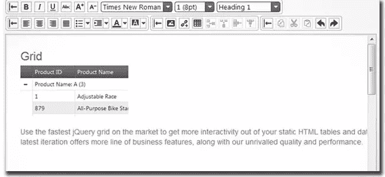
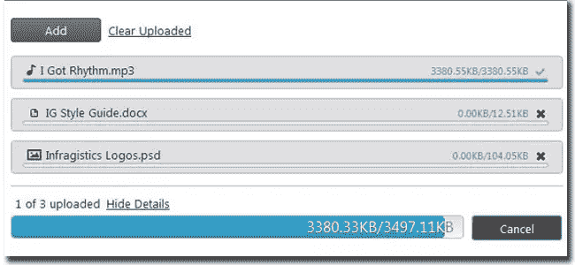
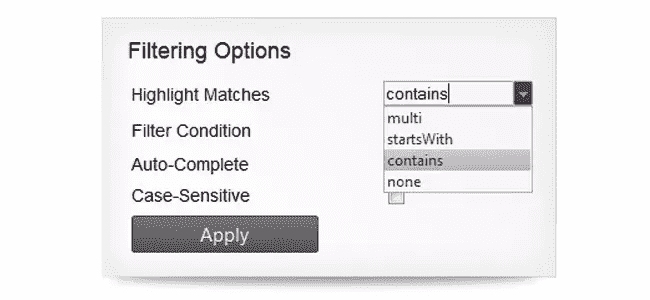

# jQuery/HTML5 控件基础统计检查

> 原文：<https://www.sitepoint.com/infragistics-review/>

什么是基础逻辑学？

**[Infragistics](http://www.infragistics.com/)** 是一家不仅为 ASP.NET，也为其他平台构建定制组件的公司。他们的产品使开发人员能够创建 ui，这些 ui 是开发具有数据可视化的应用程序的基础，这些应用程序适用于平台的业务应用程序，包括: [Windows 窗体](http://www.infragistics.com/products/windows-forms/)、 [Windows 演示基础(WPF)](http://www.infragistics.com/products/wpf/) 、[ASP.NET](http://www.infragistics.com/products/aspnet/)和 [Silverlight](http://www.infragistics.com/products/silverlight/) 以及 [jQuery/HTML5](http://www.infragistics.com/products/jquery/) 和用于 [Windows Phone](http://www.infragistics.com/products/windows-phone/) 、 [iOS (iPhone 和 iPad)](http://www.infragistics.com/products/ios)[的移动控件](http://www.infragistics.com/products/mobileadvantage/)

**具有以下特征**:

*   超过 50 种 2D 和三维图表类型。
*   设计时的便利性–用于设计单层或多层图表的自定义向导，具有优化的默认预设，以确保您能够以最佳方式呈现您选择显示的图表类型。
*   复合图表–使用系列集合、图表区集合和图表层集合构建复杂的图表。
*   高级图形–使用抗锯齿、Alpha 混合、立体 3D、2D 或我们定制的绘画元素来设计最高质量的视觉外观。
*   多重渲染–选择多种图像类型进行渲染。

Infragistics 无疑是最棒的 Windows 窗体控件通用套件。事实上，我可以说他们产品的设计时间体验比我用过的其他几个竞争对手要好。组件设计精良，功能强大。该套件几乎涵盖了我设定的所有要求。

**下面是他们的一些特色控件**:

**图表**

这个 jQuery 图表控件提供了一整套现成的动态 HTML5 业务图表，包括条形图、折线图、气泡图、极坐标图、径向面积图、范围图、阶跃图、样条图、散点图、OHLC 图和蜡烛图，以及技术指标。

该图表提供触摸支持，因此您可以使用捏手势来放大和缩小图表元素，如我们的财务系列。

**HTML 编辑器**

所见即所得编辑器提供丰富的文本格式，能够插入图像，链接，列表和表格；剪贴板支持以及源代码和设计视图。

**文件上传**

这种多文件上传允许您的用户使用 AJAX 一次异步上传一个或多个文件(仅受您的设置限制)。

**组合框**

Auto-Suggest:当用户输入时，组合框的 auto-suggest 选择输入的文本并显示建议值的列表。

这要花多少钱？

您必须首先在他们的网站上拥有一个帐户，才能获得任何当前 Infragistics 产品的免费试用，因为一旦您选择了您想要下载的特定产品，您将被要求登录。如果您没有帐户，您可以[创建一个免费帐户](https://www.infragistics.com/my-account/register)。

但是，如果您订阅，您的订阅将使您有权获得一年的所有 Infragistics 升级、服务发布和支持。

续订也很好，因为它将允许您继续接收所有基础设施升级，确保所有关键的新浏览器、操作系统、安全标准等。在您正在开发的基础设施产品中得到支持。

**结论**:

这是真的，你确实得到了你所支付的，没有比 Infragistics 更多的质量和支持。jQuery4u 向任何试图为 Win 表单或 Web 表单创建健壮的关键任务应用程序的严肃开发人员推荐 Infragistics 控件，因为我真的认为您会对购买他们的产品感到满意。**先看一下试用版**再决定。

## 分享这篇文章