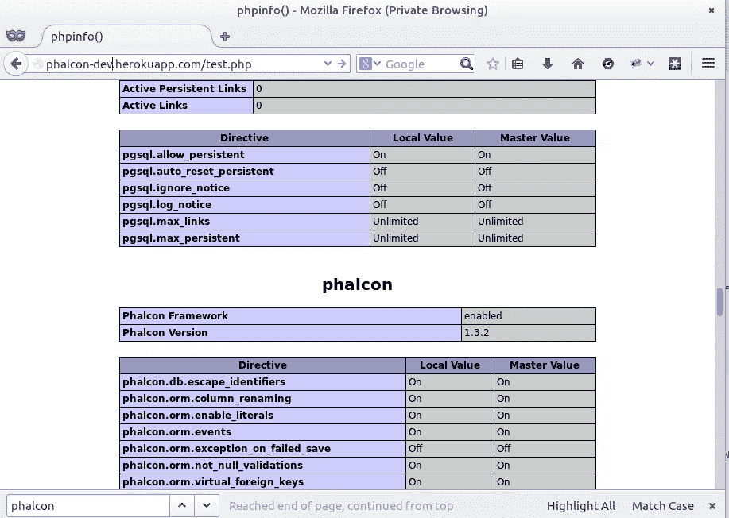
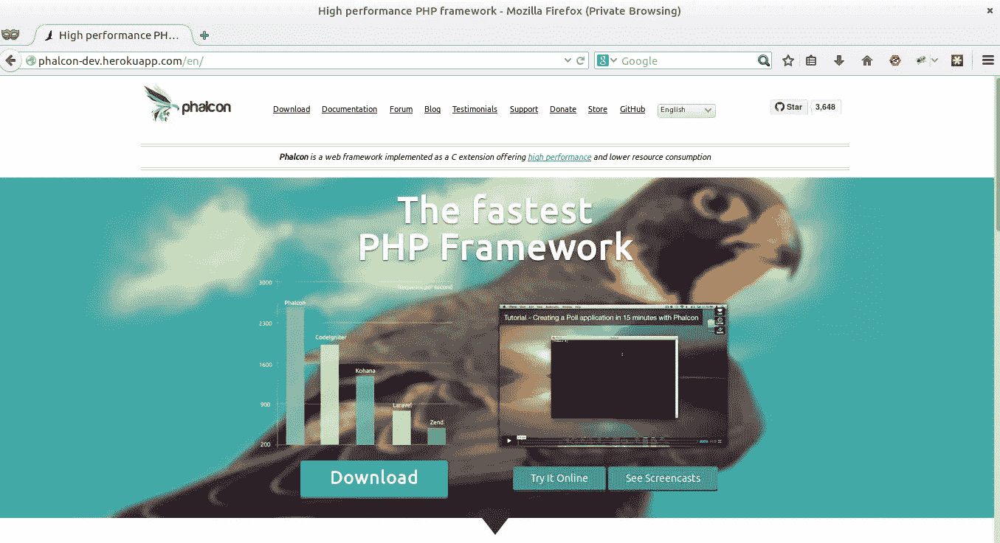

# 如何在 Heroku 上安装自定义 PHP 扩展

> 原文：<https://www.sitepoint.com/install-custom-php-extensions-heroku/>

在本教程中，我们将学习如何在 Heroku 上安装自定义扩展。具体来说，我们将安装[费尔康](http://phalconphp.com)。

## 注册和设置

为了使用 Heroku，你必须[注册一个 Heroku 账户](https://signup.heroku.com/signup/dc)。Heroku 通常使用命令行界面。要使用这个界面，你需要为你的操作系统安装[Heroku toolbart](https://toolbelt.heroku.com/)软件包。如果您使用的是 Linux，请打开终端并键入以下命令。

```
wget -qO- https://toolbelt.heroku.com/install.sh | sh
```

安装工具带后，您将可以从您的命令 shell 访问 heroku 命令。使用您创建 Heroku 帐户时使用的电子邮件地址和密码进行身份验证:

```
heroku login

Enter your Heroku credentials.
Email: fcopensuse@gmail.com
Password:
Could not find an existing public key.
Would you like to generate one? [Yn]
Generating new SSH public key.
Uploading ssh public key /home/duythien/.ssh/id_rsa.pub
```

在提示符下按 enter 键，上传您现有的 ssh 密钥或创建一个新的密钥，用于稍后推送代码。

Phalcon 是第三方扩展，因此不与 PHP 捆绑在一起。Phalcon 需要以下组件:

```
mbstring
mcrypt
openssl
PDO
PDO/Mysql PDO/Postgresql PDO/Sqlite PDO/Oracle
```

mbstring 和 mcrypt 是主要的两个——mbstring 由模板引擎(Volt)以及一些验证器、转义器和过滤器使用，而 mcrypt 用于安全组件(生成安全散列等)。)

为了安装上述元素，我们将使用 PHP buildpack 工具。让我们解释一下这是什么意思。

根据 Heroku 官方文档，buildpacks 提供了魔力和灵活性，使得在 Heroku 上运行应用程序变得如此容易。当您推送代码时，buildpack 是处理环境设置的组件，以便您的应用程序可以运行。buildpack 可以安装依赖项、定制软件、操作资产以及执行应用程序所需的任何操作。Heroku 并不总是有构建包，它们是 Cedar 堆栈中的一个新组件。

您可以通过 buildpack [文档](https://devcenter.heroku.com/articles/buildpack-api)获得关于这三个步骤的更多信息。

首先，我们将这段代码放到 [github](https://github.com/heroku/heroku-buildpack-php) 上。单击存储库中的“Fork”按钮。为了能够处理这个项目，您需要将它克隆到您的本地机器上。

运行以下代码:

```
git clone https://github.com/duythien/heroku-buildpack-php.git buildpack-php
cd buildpack-php
```

在您的`$HOME/buildpack-php/bin`目录中创建包含以下内容的`phalcon.sh`文件:

```
#!/bin/bash
# Build Path: /app/.heroku/php/
dep_url=git://github.com/phalcon/cphalcon.git
phalcon_dir=cphalcon
echo "-----> Building Phalcon..."

### Phalcon
echo "[LOG] Downloading PhalconPHP"
git clone $dep_url -q
if [ ! -d "$phalcon_dir" ]; then
  echo "[ERROR] Failed to find phalconphp directory $phalcon_dir"
  exit
fi
cd $phalcon_dir/build

# /app/php/bin/phpize
# ./configure --enable-phalcon --with-php-config=$PHP_ROOT/bin/php-config
# make
# make install
BUILD_DIR=$1
ln -s $BUILD_DIR/.heroku /app/.heroku
export PATH=/app/.heroku/php/bin:$PATH
bash ./install
cd
echo "important extension phalcon into php.ini"
echo "extension=phalcon.so" >> /app/.heroku/php/etc/php/php.ini
```

这个文件将安装 Phalcon，但必须指示 Heroku 执行它。为此，您必须编辑 [bin/compile](https://github.com/duythien/heroku-buildpack-php/blob/master/bin/compile#L315) 文件，并在其中的某处添加以下行:

```
[...]
source $BP_DIR/bin/phalcon
[...]
```

此外，您需要将文本`extension=phalcon.so`添加到文件“ [conf/php/php.ini](https://github.com/duythien/heroku-buildpack-php/blob/master/conf/php/php.ini) ”中:

```
[....]
extension=phalcon.so
; Local Variables:
; tab-width: 4
; End:
```

现在我们可以推出新的构建包了:

```
git add -A
git commit -m "edit php.ini and create phalcon file"
git push origin master
```

## 在 Heroku 上创建新的应用程序

为您的应用程序创建一个目录，并更改到该目录:

```
mkdir phalcon-dev
cd phalcon-dev
```

此外，您需要给 Heroku 一个指示，表明这个应用程序是一个 PHP 应用程序。为此，创建一个名为`composer.json`的空文件。在 Unix 系统上，您可以像这样创建这个文件:

```
touch composer.json
```

然后，执行以下命令来初始化我们的应用程序的 repo:

```
git init
git add -A
git commit -m" first commit"
```

要创建可以推送的新 Heroku 应用程序，请使用 CLI 的 create 命令:

```
heroku create phalcon-dev

Creating phalcon-dev... done, stack is cedar
http://phalcon-dev.herokuapp.com/ | git@heroku.com:phalcon-dev.git
Git remote heroku added
```

这将在 Heroku 上创建应用程序，并等待我们的代码，同时将 git remote 附加到我们的本地代码库。您现在已经准备好部署应用程序，但是还没有代码。按照下一节向您的应用程序添加一些内容。

您的`composer.json`文件应该是这样的:

```
{
  "require": {
    "php": "5.5.12"
  }
}
```

它会自动在 Heroku 上安装 mcrypt、mbstring 等扩展。如果您需要 mongodb、memcached 等，请进一步修改该文件:

```
{
  "require": {
    "php": "5.5.12",
    "ext-memcached": "*",
    "ext-mongo": "*"
  }
}
```

现在 Heroku 将启用相应的 PHP 扩展，并将其放入[support/build/extensions/no-debug-non-zts-2012 12 12](https://github.com/duythien/heroku-buildpack-php/tree/master/support/build/extensions/no-debug-non-zts-20121212)文件夹中。接下来，创建一个包含以下内容的`test.php`文件:

```
<?php phpinfo() ; ?>
```

最后，让我们部署 Phalcon 安装:

```
heroku config:set BUILDPACK_URL=https://github.com/duythien/heroku-buildpack-php
git add -A
git commit -am "installl phalcon"
git push heroku master
```

第一个命令意味着通过在 BUILDPACK_URL [配置变量](https://devcenter.heroku.com/articles/config-vars)中指定一个定制的 buildpack 来覆盖 Heroku 默认的 buildpack。几分钟后，结果如下:

```
Build complete.
Don't forget to run 'make test'.

Installing shared extensions:     /app/.heroku/php/lib/php/extensions/no-debug-non-zts-20121212/

Thanks for compiling Phalcon!
Build succeed: Please restart your web server to complete the installation
important extension phalcon into php.ini
-----> Discovering process types
       Procfile declares types -> (none)
       Default types for PHP   -> web

-----> Compressing... done, 124.0MB
-----> Launching... done, v8
       http://phalcon-dev.herokuapp.com/ deployed to Heroku

To git@heroku.com:phalcon-dev1.git
   4f1d993..e0936a5  master -> master
```

这已经获取了我们的代码，将它推送到 Heroku，识别它，并对它运行一个构建过程，为部署做好准备。现在我们的应用程序已经在互联网上运行了！要验证这一点，请立即打开它:

```
heroku open test.php
```

如果一切正常，您应该会在浏览器中看到以下屏幕:



## 配置 web 根目录并部署示例站点

现在是指定 web 根目录的棘手部分。指定 web 根目录需要更多的工作和背景信息。Phalcon 网站应用程序在 git 树中的根是`/app/phalcon-website/public`。对于 Heroku，默认情况下，web 根是 git-tree 的根。该目录在内部映射到`/app`。为了改变这一点，我们需要创建一个所谓的 Procfile，它在每次 Heroku app web 节点启动时启动一个 sh 脚本。然后，该脚本修改服务器配置，并包含您自己的配置，将 web 根目录设置为`/app/phalcon-website/public`。创建一个包含以下内容的 Procfile 文件(如果您使用的是 Apache):

```
web: vendor/bin/heroku-php-apache2 phalcon-website/public
```

将 [Phalcon 网站](http://github.com/phalcon/website)克隆到 repo 文件夹中，完成后，git push 命令将本地主机上的所有提交发送到中央存储库。

```
cd && cd phalcon-dev
git clone --depth=1 http://github.com/phalcon/website phalcon-website
git add Procfile phalcon-websiste/
git commit -am " test phalcon website"
git push heroku master
```

访问该应用的公共网址，瞧，你在 Heroku [这里](http://phalcon-dev.heroku.com)有一个正在运行的 Phalconphp.com 克隆。



## 最后

在 Heroku 上安装 Phalcon(或任何其他 PHP 扩展)显然既不容易也不简单，但是如果您使用 buildpacks，它会变得容易得多。

请在下面的评论中留下您的反馈，如果您喜欢这篇文章，请一如既往地分享它！

## 分享这篇文章