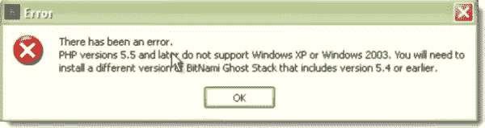
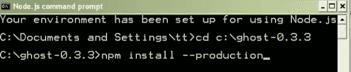
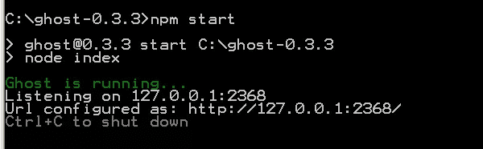
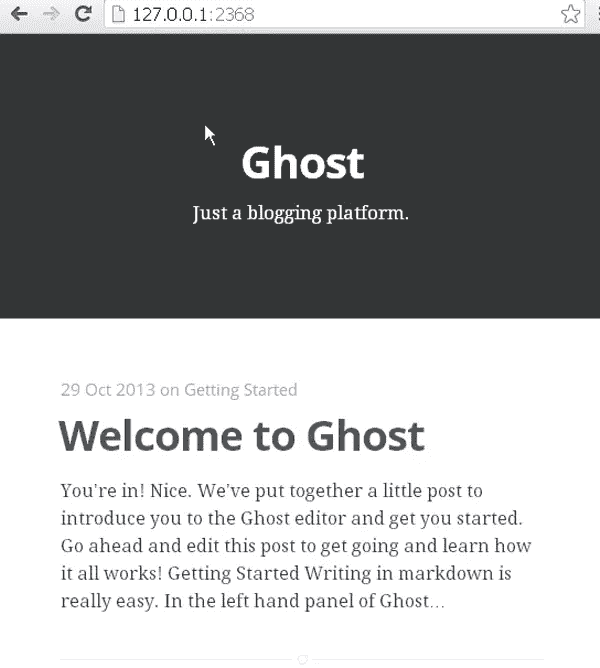
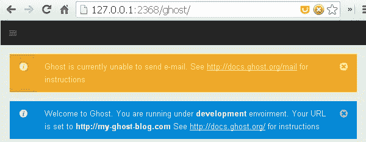
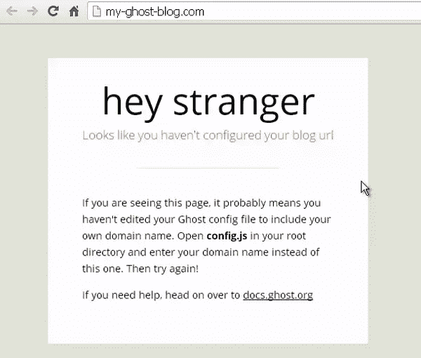
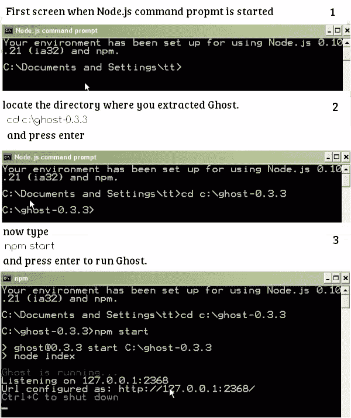

# 如何在 Windows 上安装 Ghost

> 原文：<https://www.sitepoint.com/install-ghost-windows/>

Ghost 是一个新的免费开源博客平台，界面非常简单易用。Ghost 专注于一件事:出版。如果你没有读过乔·休威森最近的文章，你应该读一读。

PHP 是世界上最流行、最受支持的编程语言。一些最受欢迎的 CMS 如 WordPress、Joomla、Drupal——甚至脸书——使用 PHP 作为核心语言，但是 Ghost 是用[节点构建的。Js](http://nodejs.org/) ，不用 PHP。

Ghost 号称是一个简单的博客平台，可惜入门 Ghost 的第一步并不简单。Ghost 的安装过程并不简单容易。它很复杂，可能会让一些用户感到困惑。在实时服务器和本地 PC 上安装并不简单。

Node.js 是一个用于构建服务器端应用程序的软件平台。Node.js 利用 JavaScript 作为其脚本语言。幽灵是节点。基于 Js，所以这意味着你们中的许多人将无法在共享虚拟主机上安装它，这是一个非常受欢迎的新手主机计划。你需要一个支持 Node 的云(Amazon EC2，DigitalOcean，Windows Azure 等)。Js 但是并不是每个人都使用云。

如果你在本地电脑上安装 Ghost，你将不得不安装额外的程序，如 [Node。Js](http://nodejs.org/) 并启动命令行。毫无疑问，如果您不习惯使用命令行，它会让人感到困惑。

## 当前可用的安装程序

目前有几个安装程序可用于本地和实时 web 服务器安装。

### 在实时服务器上安装

这里有一些部署到云的选项。

*   使用 [Bitnami](http://wiki.bitnami.com/Applications/BitNami_Ghost) 部署到云。
*   使用 [Rackspace 部署](http://developer.rackspace.com/blog/launch-ghost-with-rackspace-deployments.html)启动 Ghost。
*   使用 [DigitalOcean Droplet](https://www.digitalocean.com/community/articles/how-to-use-the-digitalocean-ghost-application) 开始运行。

### Windows、Mac 或 Linux 上的本地安装

Bitnami ghost 安装程序是在 Windows、Mac 或 Linux 上安装 ghost 的最简单的方法。你可以从 http://bitnami.com/stack/ghost/installer.下载

如果 Bitnami Ghost 安装程序不适合您，并且您看到任何错误，那么您可以手动安装 Ghost。在本教程中，我将分享我在 Windows PC 上安装 Ghost 的经验。

我下载了用于 Windows 的 Bitnami Ghost 安装程序，它在 Windows 7(最广泛使用的操作系统，市场份额为 46.42%)上运行良好，但在 Windows XP(第二大最流行的操作系统，市场份额为 31.24%)上出现了 PHP 5.5 错误。

我决定在 Windows XP 上手动安装 Ghost。下面是 Windows XP 中错误信息的屏幕截图。

## 如何手动安装 Ghost？

对于手动安装，您需要安装节点。Js 和 Ghost 源文件。

**第一步:下载并安装节点。Js**

进入[nodejs.org](http://nodejs.org)，下载节点安装程序并安装。

**第二步:下载并解压 Ghost 文件**

* * *

访问[Ghost.org](http://ghost.org)，注册一个帐户，或者如果你已经有了帐户就登录，下载 Ghost 压缩文件。接下来，我们需要提取 Ghost 文件。转到 c 盘根目录，创建一个新文件夹，命名为 ghost-#。#.#(将#替换为 ghost 版本)并将所有文件从压缩的归档文件中提取到这个新文件夹中。

## 启动 Node.js 命令提示符

在“开始”菜单中，转到“所有程序”，找到“Node.js”，然后选择“Node.js 命令提示符”。现在我们需要将目录更改为`c:\ghost-0.3.3`，在这里我们提取了 Ghost。

*   键入`cd c:\ghost-#.#.#`(用 Ghost 版本号替换#号)并按回车键
*   接下来键入`npm install --production`并按回车键

下面是节点命令提示符的屏幕截图。

现在你需要等一两分钟。当 npm 完成安装后，键入`npm start`启动 Ghost。

打开浏览器(Firefox、Chrome、Safari ),导航到`127.0.0.1:2368`,查看新设置的 Ghost 博客主页。

现在只需将 URL 更改为`127.0.0.1:2368/ghost` 并创建您的管理员用户来登录 Ghost admin。输入您的全名、电子邮件和密码(长度必须为 8 个字符)，然后单击注册，您将登录到您的 Ghost 仪表板。

## 第三步:更改 config.js 文件中的 Ghost URL

当您访问`127.0.0.1:2368/ghost` 时，您会看到两个通知。第一个是邮件，另一个是关于幽灵网址。您必须更改 config.js 文件中的 URL。可以在 Ghost 的根目录下找到 config.js。(C:\ghost-0.3.3)

在任何文本编辑器(SublimeText、括号等)中打开 config.js 文件，或者可以使用 Windows 中的记事本。在 11 号线和 47 号线周围找到`http://my-ghost-blog.com`并替换为`http://127.0.0.1:2368/`。

## 第四步:重启 Node.js 命令提示符

* * *

现在关闭 Node.js 命令提示符并再次启动它，以便更改可以生效。如果您不重新启动 Node.js 命令提示符，您将看到以下屏幕。

重新启动节点命令提示符后，将目录更改为您提取 Ghost 的位置，并键入`npm start`启动 Ghost blog。

## 恭喜你！您已经成功安装了 Ghost。

请记住，如果您关闭 Node.js 命令 Propmt 或重启 PC，您的 Ghost 博客将无法运行。您必须通过 Node.js 命令提示符重新启动它。

现在你知道如何安装 [Ghost](https://ghost.org/) 了，试试吧，在评论里分享你的经验。

## 分享这篇文章