# 如何集成 APM 和日志管理:Loggly 和 New Relic

> 原文：<https://www.sitepoint.com/integrate-apm-log-management-loggly-new-relic/>

*本文由 [Loggly](https://www.loggly.com/) 赞助。感谢您对使 SitePoint 成为可能的赞助商的支持。*

当运行一个应用程序或网站时，明智的做法是不仅要跟踪你的访问者统计数据，还要跟踪你的表现。虽然我们习惯于在部署后立即设置停机监控，但性能监控并非总是如此。一个缓慢的网站意味着缓慢的收入，尤其是现在当访问者期望网站在几秒钟内加载。

有了像 New Relic 这样的优秀工具，应用程序性能监控和管理不再是一件麻烦的事情。更好的是，他们最近[与](http://blog.newrelic.com/2014/04/15/logglys-new-relic-extension/)合作，Loggly 是一种提供日志管理和分析的服务，可以更好地洞察你的应用程序或网站的性能。现在你可以很容易地从发生的事情进一步深入到它是如何发生的。

在这篇文章中，我将向你展示 New Relic 和 Loggly 是如何作为一个组合工具工作的。一旦你掌握了基础知识，我将向你展示这两个强大的工具如何结合成一个开发者的梦想，用于分析糟糕的性能或停机时间。

## 为什么应该使用应用性能管理(APM)

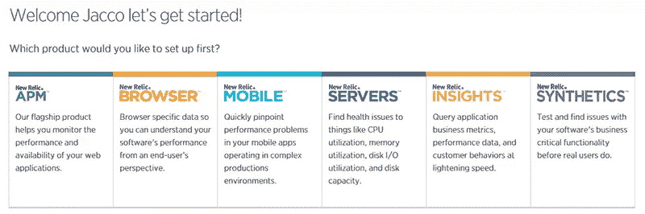

你可能以前听说过 [New Relic](http://www.newrelic.com/) ，因为他们与 SitePoint 有着各种各样的良好合作关系。Darren Jones 在他关于[实时 Ruby 监控](https://www.sitepoint.com/new-relic-realtime-ruby-monitoring/)的精彩文章中也详细讨论了这些问题。

New Relic 为应用性能管理(APM)提供了几种解决方案。无论您想要监控您的 web 应用程序、移动应用程序还是服务器，New Relic 都有合适的工具来完成这项工作。他们也有所有产品的免费版本。在这篇文章中，我将重点关注[新遗迹 APM](http://newrelic.com/application-monitoring) ，让你看看它令人印象深刻的仪表板。

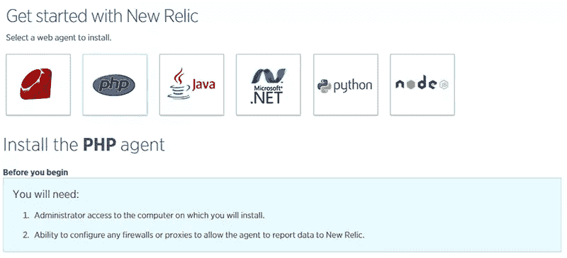

为了让 New Relic 正常工作，您需要对运行您的应用程序的服务器拥有管理员权限。安装后，您的仪表板将会变得生动起来。在运行一个小的负载测试后，你会看到你的应用程序(在我的例子中是一个 Magento 网络商店)。

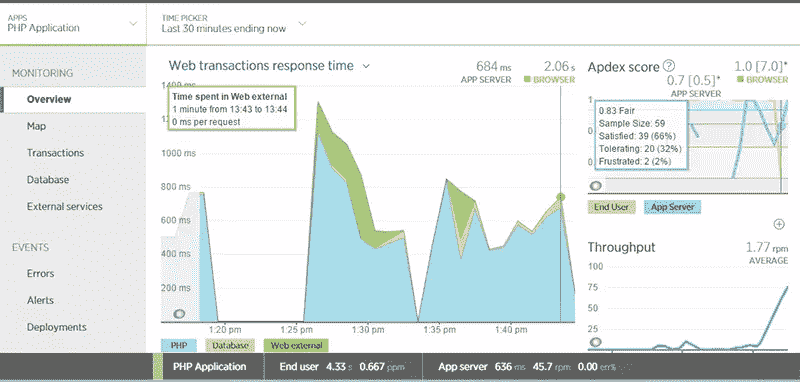

仪表板显示了 PHP 应用程序、数据库和外部资源(例如 DNS)的平均加载时间。您还可以看到您的吞吐量(在该截图中为每分钟 75 个请求)和 APDEX 得分(这基本上是基于默认的 0.5 秒平均加载时间的满意率)。然后，您可以进一步放大所有这些参数，比如外部源加载时间或数据库调用。

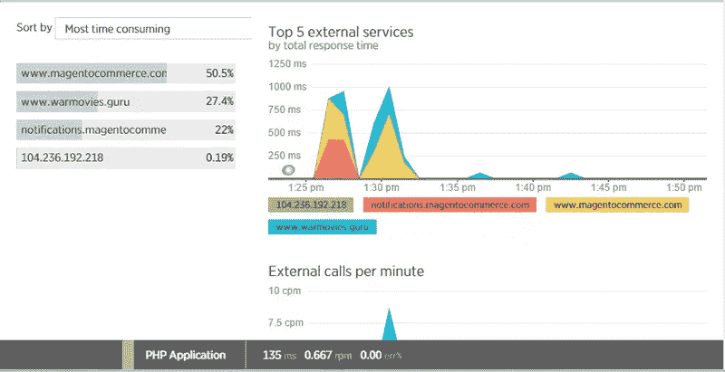

关于 CPU 和内存使用情况以及吞吐量和响应时间的服务器信息也很有限。对于更多扩展的服务器监控，你应该使用[新的遗迹服务器](http://newrelic.com/server-monitoring)，但即使在有限的模式下，这仍然是有价值的信息。

由于 New Relic 为您提供了实时报告，您可以立即看到您所做的更改的效果。当运行第二个负载测试时，我在测试过程中打开了 Magento 缓存，导致 PHP 加载时间和数据库查询次数瞬间下降。新遗迹给你一个很好的观点，结果马上。

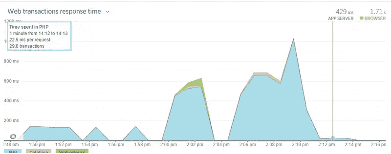

除了实时报告，还有大量其他报告供您运行。您还可以为特定事件(如停机或速度减慢)设置警报。

总而言之，New Relic 是一个很好的性能测试工具，但是在某些情况下，您可能想要更深入地研究并查看您的日志进行详细的分析。这就是 Loggly 的用武之地。它有一个新遗迹的集成，这使得从一个新遗迹的事件跳转到 Loggly 托管的日志非常方便。让我们看一看。

## 为什么你应该重视你的日志

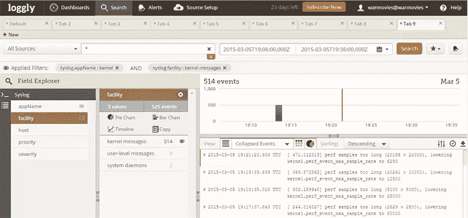

Loggly 是关于日志管理和分析的，他们为你提供了一些漂亮的工具。设置很简单，只需命令行中的几个命令。在那之后，你就在原木天堂了。Loggly 让您深入了解应用程序的每个细节。

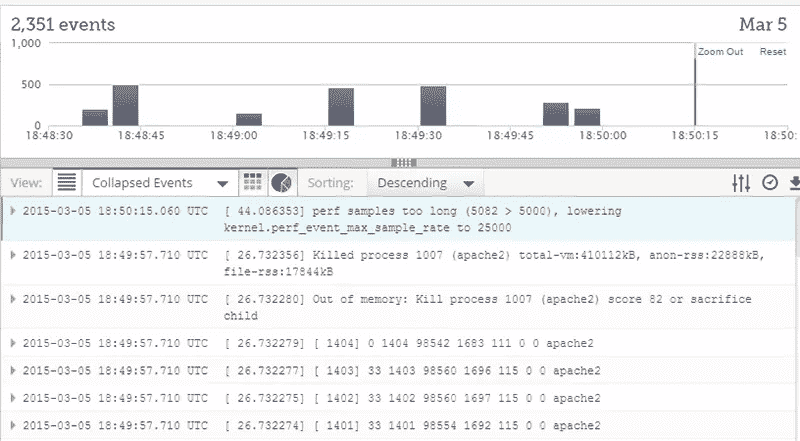

New Relic 告诉您前端发生了什么，Loggly 让您深入了解整个堆栈发生了什么。在我的截图中，你可以看到 Loggly 报告我的实例内存不足。然而，New Relic 只显示“较低”或“没有”性能，因为它们没有测量服务器的内存限制。如果没有 Loggly，我根本不会知道在这个案例中发生了什么。

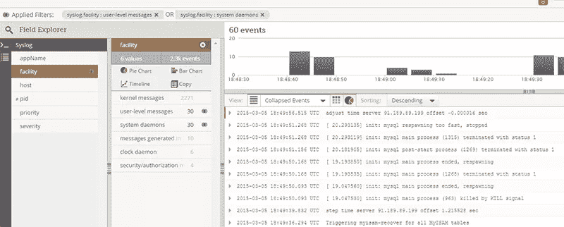

在上面的截图中，你会看到短时间内多次重启的日志。如您所见，Loggly 为您提供了各种级别停机时间累积的极其详细的信息。Loggly 有一个细粒度的方法，因为每个事件都是单独存储的，而 New Relic 将它们聚集在一起。

一个错误或性能问题可能有几个潜在的原因，但是 New Relic 只向您显示最终结果及其影响。使用 Loggly，您可以追溯每个事件的起源，并查看事件发生前的瞬间发生了什么。例如，它还允许您查明特定用户的问题。另外，在浏览日志时，我注意到有人试图以 root 用户身份登录，但被阻止了。这都是新文物所不能提供的有价值的信息，而 Loggly 做得很好。

Loggly 为您提供了多种方式来构建您自己的自定义仪表板，以监控您的应用程序，甚至是您的应用程序或网站的各个部分。您可以将它与其他工具集成，如 PagerDuty 或 HipChat，以获得高级通知。你也可以在 Loggly 内部设置各种提醒，它有一个通用的搜索栏，可以根据你的搜索条件快速获得相关的日志。

浏览大量日志可能是一项单调乏味的任务，尤其是当您不能真正确定每个条目在前端意味着什么的时候。为了帮助您进行分析，New Relic 和 Loggly 联手为您提供了一个出色的集成。使用 Chrome 扩展，您可以简单地点击 New Relic 报告的事件，并在 Loggly 中找到匹配的日志。让我们看看它是如何工作的。

## 两全其美:将 APM 与日志管理结合起来进行详细的故障分析

新的遗迹和逻辑本身提供了解决表演问题的极好方法。但是在做分析的时候，如果不经常切换，你很难把它们放在一起。特别是对于更受欢迎的应用程序或网站，我们谈论的是毫秒级的，每秒钟发生数十甚至数百起事件和交易。

解决方案是安装“[New Relic–Loggly Extension](https://chrome.google.com/webstore/detail/new-relic-loggly-extensio/locgdocadipenhijhbfcfaegbfhgdbbi)”。在你这样做之后，你会在 New Relic 的每个错误和事件屏幕上看到一个“在日志中搜索事件”按钮。

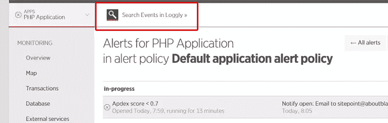

每当您查看一个事件、错误或交易并点击该按钮时，确切的日期和时间参数会传递给 Loggly。这样你就可以得到一个完美的匹配，而不需要进一步调整时间。Loggly 然后允许您滚动浏览它的完整日志，这样您可以看到在实际事件发生之前发生的所有事情。

让我们来看看我在我的[演示站点](http://www.warmovies.guru/)上做的一些负载测试。我在主页上加载了许多产品，并关闭了缓存，这导致每次访问都要调用大量数据库。然后，我启动了一个有 50 个并发用户的负载测试器([负载影响](http://www.loadimpact.com/)，不到一分钟，网站就瘫痪了。在第一次测试之后，我重新打开了缓存，并运行了相同的测试，但是这次有 100 个并发用户。不到一分钟，网站又瘫痪了。

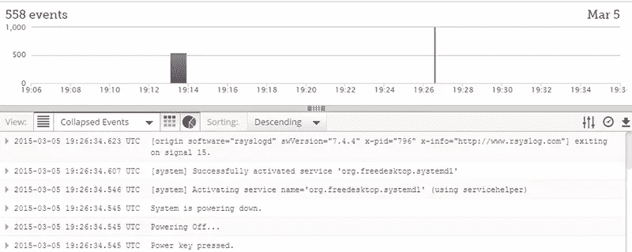

几分钟后，New Relic 赶上了，所以我可以分析是什么导致了实际的停机时间。我原以为数据库会马上崩溃，但是在打开缓存的情况下，不应该出现这种情况。两次都有几十个 PHP 事务(第二次测试时最多 100 个)，但是两次都使用了数据库，即使缓存是打开的(例如，这可能是由于小部件没有被缓存)。

点击“在日志中搜索事件”按钮给了我完全相同的时间范围，所以我可以开始挖掘。对比了几个事件，结果发现 Apache 和 MySQL 都是内存不足。Apache 对打开缓存负有主要责任，但即使如此，MySQL 也可能是最后一击。

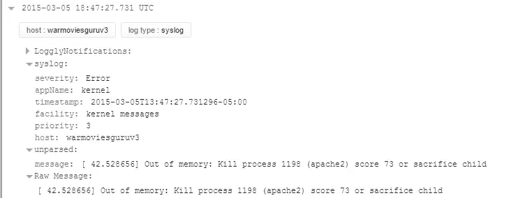

因此，简单的解决方案是升级运行 web 商店的实例。它从单核处理器的 512MB 增加到四核处理器的 8GB。

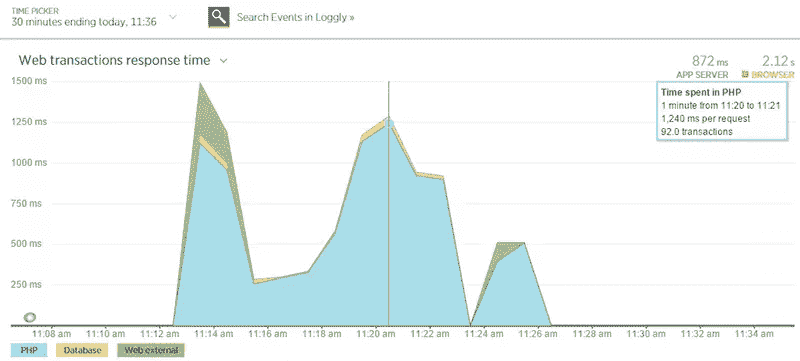

升级后，我运行了一个额外的测试，打开了缓存，有 50 个并发用户。数据库调用仍然在进行，但是性能相当稳定(虽然有点慢),并且没有停机。

Loggly 也很高兴，唯一的事件是实例的大小调整。尽管这是一个非常基本的例子，但它确实显示了基于你在《新遗迹》中看到的特定时刻来分析事件是多么容易。Chrome 扩展使得切换变得轻而易举。

真的就这些了。但是即使这听起来很简单，当您想要分析多个事件时，它将为您节省大量的时间。你可以免费获得 Chrome 扩展，设置时间不到一分钟(只需输入你的 Loggly 帐户名)。

获得灵感:如何从 APM 日志管理中获益
New Relic 和 Loggly 是一个强大的组合，两者都有足够的功能和工具来快速分析问题并确定其原因。但我的演示只是一个例子。虽然这是一个常见的问题，但找到一个快速解决方案并不是火箭科学。但是升级你的实例是一个短期的解决方案，因为当你的网上商店变得更受欢迎时，它会继续发生。

如果您想更深入地了解为什么即使打开了缓存，仍然会有数据库调用呢？或者一个缓慢执行的结帐过程怎么样，由于实际过程的动态特性，缓存没有帮助？

## 结论

New Relic 和 Loggly 都是有效的工具，可以首先识别一个给定的问题，然后隔离一个特定的事件，之后您可以对问题进行逆向工程并找到解决方案。每件事都(几乎)实时完成，比你可能需要的更详细(但拥有它们不会有什么坏处)。

Loggly 已经建立了一个很好的界面，可以在你的日志中搜寻并从数以百万计的条目中找到重要的内容。但是我们不要忘记:他们不仅仅提供一个分析工具，他们也存储你的日志。对于一个受欢迎的应用程序或网站，你的日志增长会很快变得疯狂，有时会变成一个性能问题。Loggly 完成所有的存储和备份工作，因此在服务器完全瘫痪后，您不会有丢失宝贵日志的风险。

New Relic 和 Loggly 都有免费试用，分别为 14 天和 30 天。他们还提供 Lite 计划，New Relic 的数据保留时间为 24 小时，最长为 7 天。这对于具有事后分析选项的实时监控是足够的。

你能想出 New Relic 和 Loggly 的一些巧妙用法吗？请在评论中告诉我们。

## 分享这篇文章