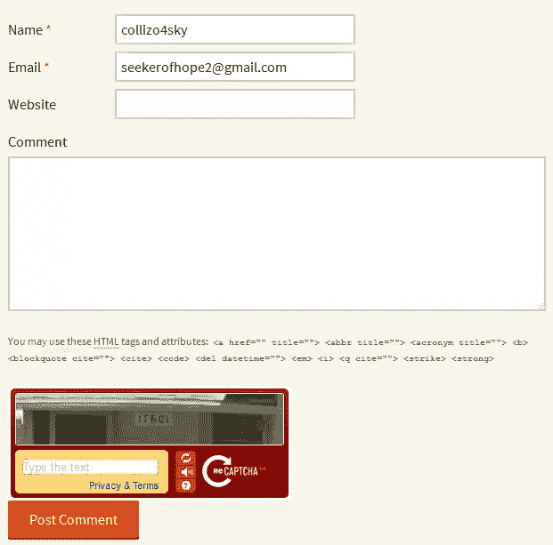

# 整合验证码和 WordPress 评论表单

> 原文：<https://www.sitepoint.com/integrating-a-captcha-with-the-wordpress-comment-form/>

多年来，由于越来越受欢迎，WordPress 已经成为垃圾邮件发送者的目标。

不幸的是，自动化软件的目的是在网络上爬行，搜索用任何流行平台(如 WordPress)构建的网站，并提交数百甚至数千条垃圾评论。垃圾评论非常令人讨厌，当涉及到调节和删除它们时，它们会消耗我们的宝贵时间。

我知道你和我一样讨厌垃圾评论，并且很想知道如何对付它们。阻止机器人提交垃圾评论的一种方法是将验证码集成到评论表单中。

在之前的教程中，我们学习了如何将验证码集成到 WordPress [登录](https://www.sitepoint.com/integrating-a-captcha-with-the-wordpress-login-form/)和[注册表单](https://www.sitepoint.com/integrating-a-captcha-with-the-wordpress-registration-form)中。

以类似的方式，我们现在将浏览如何将验证码与 WordPress 评论系统集成。

WordPress 插件目录中有很多[验证码插件](https://wordpress.org/plugins/tags/captcha)可用，比如 [WP-reCAPTCHA](http://wordpress.org/extend/plugins/wp-recaptcha/) 和 [Securimage-WP-Fixed](https://wordpress.org/plugins/securimage-wp-fixed/) 。

本教程的目的不是创建另一个验证码插件，而是:

1.  演示如何在插件中使用 WordPress [HTTP API](https://www.sitepoint.com/the-wordpress-http-api/) 。
2.  如何在 WordPress 评论表单中包含额外的表单域。
3.  如何验证和利用添加到自定义字段的值。

事不宜迟，让我们开始插件开发吧。

## 插件开发

首先，前往 [reCAPTCHA](https://www.google.com/recaptcha/admin#createsite) ，注册你的域名并获取你的公共和私有 API 密钥。

包括插件头。

```
<?php

/*
Plugin Name: Add reCAPTCHA to comment form
Plugin URI: https://www.sitepoint.com
Description: Add Google's reCAPTCHA to WordPress comment form
Version: 1.0
Author: Agbonghama Collins
Author URI: http://w3guy.com
License: GPL2
*/
```

创建一个具有三个属性的类，这些属性将存储 reCAPTCHA 的私钥和公钥以及 CAPTCHA 错误消息(当 CAPTCHA 表单为空并且用户挑战失败时会生成错误)。

```
class Captcha_Comment_Form {

	/** @type string private key|public key */
	private $public_key, $private_key;

	/** @type string captcha errors */
	private static $captcha_error;
```

类魔法构造器方法将包含两对动作和过滤器挂钩。

```
/** class constructor */
	public function __construct() {

		$this->public_key  = '6Le6d-USAAAAAFuYXiezgJh6rDaQFPKFEi84yfMc';
		$this->private_key = '6Le6d-USAAAAAKvV-30YdZbdl4DVmg_geKyUxF6b';

		// adds the captcha to the WordPress form
		add_action( 'comment_form', array( $this, 'captcha_display' ) );

                // delete comment that fail the captcha challenge
		add_action( 'wp_head', array( $this, 'delete_failed_captcha_comment' ) );

		// authenticate the captcha answer
		add_filter( 'preprocess_comment', array( $this, 'validate_captcha_field' ) );

		// redirect location for comment
		add_filter( 'comment_post_redirect', array( $this, 'redirect_fail_captcha_comment' ), 10, 2 );
	}
```

**代码解释:**首先，我的 reCAPTCHA 公钥和私钥被保存到它们的类属性中。

将输出 reCAPTCHA 挑战的`captcha_display()`方法通过`comment_form`动作被添加到注释表单中。

`wp_head`动作包括回调函数`delete_failed_captcha_comment()`，该函数将删除提交的任何未通过验证码挑战的评论。

过滤器`preprocess_comment`调用`validate_captcha_field()`方法来确保验证码字段不为空，并且答案是正确的。

过滤器`comment_post_redirect`调用`redirect_fail_captcha_comment()`向评论重定向 URL 添加一些查询参数。

这里是将输出验证码挑战的`captcha_display()`的代码。

此外，它还会检查当前页面 URL 是否附有查询字符串，并根据由`redirect_fail_captcha_comment()`设置的`$_GET['captcha']`值显示相应的错误消息

```
/** Output the reCAPTCHA form field. */
	public function captcha_display() {
		if ( isset( $_GET['captcha'] ) && $_GET['captcha'] == 'empty' ) {
			echo '<strong>ERROR</strong>: CAPTCHA should not be empty';
		} elseif ( isset( $_GET['captcha'] ) && $_GET['captcha'] == 'failed' ) {
			echo '<strong>ERROR</strong>: CAPTCHA response was incorrect';
		}

		echo <<<CAPTCHA_FORM
		<style type='text/css'>#submit {
				display: none;
			}</style>
		<script type="text/javascript"
		        src="http://www.google.com/recaptcha/api/challenge?k=<?= $this->public_key; ?>">
		</script>
		<noscript>
			<iframe src="http://www.google.com/recaptcha/api/noscript?k=<?= $this->public_key; ?>"
			        height="300" width="300" frameborder="0"></iframe>
			<br>
			<textarea name="recaptcha_challenge_field" rows="3" cols="40">
			</textarea>
			<input type="hidden" name="recaptcha_response_field"
			       value="manual_challenge">
		</noscript>

		<input name="submit" type="submit" id="submit-alt" tabindex="6" value="Post Comment"/>
CAPTCHA_FORM;

	}
```

```
/**
	 * Add query string to the comment redirect location
	 *
	 * @param $location string location to redirect to after comment
	 * @param $comment object comment object
	 *
	 * @return string
	 */
	function redirect_fail_captcha_comment( $location, $comment ) {

		if ( ! empty( self::$captcha_error ) ) {

			$args = array( 'comment-id' => $comment->comment_ID );

			if ( self::$captcha_error == 'captcha_empty' ) {
				$args['captcha'] = 'empty';
			} elseif ( self::$captcha_error == 'challenge_failed' ) {
				$args['captcha'] = 'failed';
			}

			$location = add_query_arg( $args, $location );
		}

		return $location;
	}
```

顾名思义，方法`validate_captcha_field()`通过确保验证码字段不为空并且提供的答案正确来验证验证码答案。

```
/**
	 * Verify the captcha answer
	 *
	 * @param $commentdata object comment object
	 *
	 * @return object
	 */
	public function validate_captcha_field( $commentdata ) {

		// if captcha is left empty, set the self::$captcha_error property to indicate so.
		if ( empty( $_POST['recaptcha_response_field'] ) ) {
			self::$captcha_error = 'captcha_empty';
		}

		// if captcha verification fail, set self::$captcha_error to indicate so
		elseif ( $this->recaptcha_response() == 'false' ) {
			self::$captcha_error = 'challenge_failed';
		}

		return $commentdata;
	}
```

让我们仔细看看`validate_captcha_field()`，特别是`elseif`条件语句，调用`recaptcha_response()`来检查验证码答案是否正确。

下面是`recaptcha_response()`的代码。

```
/**
	 * Get the reCAPTCHA API response.
	 *
	 * @return string
	 */
	public function recaptcha_response() {

		// reCAPTCHA challenge post data
		$challenge = isset( $_POST['recaptcha_challenge_field'] ) ? esc_attr( $_POST['recaptcha_challenge_field'] ) : '';

		// reCAPTCHA response post data
		$response = isset( $_POST['recaptcha_response_field'] ) ? esc_attr( $_POST['recaptcha_response_field'] ) : '';

		$remote_ip = $_SERVER["REMOTE_ADDR"];

		$post_body = array(
			'privatekey' => $this->private_key,
			'remoteip'   => $remote_ip,
			'challenge'  => $challenge,
			'response'   => $response
		);

		return $this->recaptcha_post_request( $post_body );

	}
```

请允许我解释一下`recaptcha_response()`是如何工作的。

一个带有以下参数的`POST`请求被发送到端点[http://www.google.com/recaptcha/api/verify](http://www.google.com/recaptcha/api/verify)。

*   你的私人钥匙
*   `remoteip`解开验证码的用户的 IP 地址。
*   `challenge`通过表单发送的***recaptcha _ challenge _ field***的值。
*   `response`***的值 recaptcha _ response _ field***通过表单发送。

表单发送的挑战和响应 POST 数据被捕获并分别保存到`$challenge`和`$response`。
`$_SERVER["REMOTE_ADDR"]`捕获用户的 IP 地址并将其传给`$remote_ip`。

HTTP API`POST`参数是数组形式，因此有下面的代码。

```
$post_body = array(
			'privatekey' => $this->private_key,
			'remoteip'   => $remote_ip,
			'challenge'  => $challenge,
			'response'   => $response
		);

		return $this->recaptcha_post_request( $post_body );
```

`recaptcha_post_request()`是`HTTP API`的包装函数，它将接受`POST`参数/主体，向 reCAPTCHA API 发出请求，如果验证码测试通过，则返回`true`，否则返回`false`。

```
/**
	 * Send HTTP POST request and return the response.
	 *
	 * @param $post_body array HTTP POST body
	 *
	 * @return bool
	 */
	public function recaptcha_post_request( $post_body ) {

		$args = array( 'body' => $post_body );

		// make a POST request to the Google reCaptcha Server
		$request = wp_remote_post( 'https://www.google.com/recaptcha/api/verify', $args );

		// get the request response body
		$response_body = wp_remote_retrieve_body( $request );

		/**
		 * explode the response body and use the request_status
		 * @see https://developers.google.com/recaptcha/docs/verify
		 */
		$answers = explode( "\n", $response_body );

		$request_status = trim( $answers[0] );

		return $request_status;
	}
```

未通过验证码挑战或未填写验证码的用户所做的任何评论都会被`delete_failed_captcha_comment()`删除

```
/** Delete comment that fail the captcha test. */
	function delete_failed_captcha_comment() {
		if ( isset( $_GET['comment-id'] ) && ! empty( $_GET['comment-id'] ) ) {

			wp_delete_comment( absint( $_GET['comment-id'] ) );
		}
	}
```

最后，我们关闭插件类。

```
} // Captcha_Comment_Form
```

我们完成了插件类的编码。为了让这个类工作，我们需要像这样实例化它:

```
new Captcha_Comment_Form();
```

激活插件后，验证码会被添加到 WordPress 评论表单中，如下所示。



## 包裹

在本教程结束时，由于提到了[过滤器](http://codex.wordpress.org/Plugin_API/Filter_Reference)和[动作](https://codex.wordpress.org/Plugin_API/Action_Reference/)，你应该能够向评论表单添加额外的表单字段，并在评论系统中实现你想要的任何功能。

如果你想在你的 WordPress 网站上使用插件或者深入研究代码，从 GitHub 下载插件。

直到我再次来到你的身边，编码快乐！

## 分享这篇文章