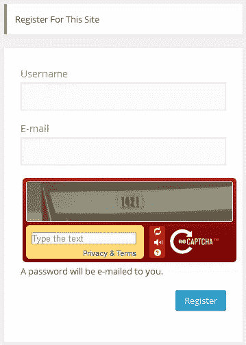

# 整合验证码和 WordPress 注册表单

> 原文：<https://www.sitepoint.com/integrating-a-captcha-with-the-wordpress-registration-form/>

在之前的教程中，我们对 WordPress HTTP API 进行了[的深入研究，学习了如何在构建显示域名的](https://www.sitepoint.com/the-wordpress-http-api/) [WHOIS 和社交数据](https://www.sitepoint.com/building-a-domain-whois-and-social-data-wordpress-widget/)的小部件的过程中使用`HTTP API`来消费插件中的 API，以及将验证码与 WordPress 登录表单集成在一起的[。](https://www.sitepoint.com/integrating-a-captcha-with-the-wordpress-login-form/)

在本教程中，我们将编写一个插件，将验证码([谷歌的 reCAPTCHA](https://www.google.com/recaptcha) )集成到默认的 WordPress 注册表单中。当然，`HTTP API`将用于与 reCAPTCHA 端点通信，以验证用户对 CAPTCHA 质询提供的答案。

下面是受验证码保护防止垃圾注册的注册表单截图。



## 为什么要在注册表中包含验证码？

由于 WordPress 越来越受欢迎，它已经成为肆无忌惮的自动化软件的一个容易的目标。这个软件在网上搜索用 WordPress 建立的网站，并开始每分钟注册成百上千个账户。

在我早期使用 WordPress 的时候，我仍然记得有一天早上醒来，我的邮箱里塞满了 50 多个注册用户的通知。

减少甚至完全消除垃圾邮件的一种可靠的方法是在 web 表单中使用验证码。

验证码是一种通过生成和分级测试来保护网站免受机器人攻击的程序，这些测试人类可以通过，而当前的软件程序不能。

通过将验证码集成到 WordPress 注册表单中，垃圾注册将很快成为过去。

## 插件开发

在我们开始编写插件之前，让我们前往 [reCAPTCHA](https://www.google.com/recaptcha/admin#createsite) ，注册你的域名并获取你的`public`和`private` API 密钥。

首先，包括插件头。

```
<?php

/*
Plugin Name: reCAPTCHA in WP Registration Form
Plugin URI: https://www.sitepoint.com
Description: Add Google's reCAPTCHA to WordPress registration form
Version: 1.0
Author: Agbonghama Collins
Author URI: http://w3guy.com
License: GPL2
*/
```

创建一个带有两个属性的 PHP 类，这两个属性将存储 reCAPTCHA 的私钥和公钥。

```
class Captcha_Registration_Form {

	/** @type string private key|public key */
	private $public_key, $private_key;
```

插件构造器方法将由两个动作挂钩组成，这两个动作挂钩将验证码挑战添加到注册表单中，并验证验证码响应。

```
/** class constructor */
	public function __construct() {
		$this->public_key  = '6Le6d-USAAAAAFuYXiezgJh6rDaQFPKFEi84yfMc';
		$this->private_key = '6Le6d-USAAAAAKvV-30YdZbdl4DVmg_geKyUxF6b';

		// adds the captcha to the registration form
		add_action( 'register_form', array( $this, 'captcha_display' ) );

		// authenticate the captcha answer
		add_action( 'registration_errors', array( $this, 'validate_captcha_field' ), 10, 3 );
	}
```

通过 [register_form](http://codex.wordpress.org/Plugin_API/Action_Reference/register_form) 动作，将输出 reCAPTCHA 挑战的`captcha_display()`方法被添加到 WordPress 注册表单中。

`validate_captcha_field()`方法将确保:验证码字段不为空，并验证用户提供的答案；由 [registration_errors](http://codex.wordpress.org/Plugin_API/Filter_Reference/registration_errors) 动作添加到注册验证系统中。

下面是我们谈到的`captcha_display()`和`validate_captcha_field()`方法的代码。

```
/** Output the reCAPTCHA form field. */
	public function captcha_display() {
		?>
		<script type="text/javascript"
		        src="http://www.google.com/recaptcha/api/challenge?k=<?=$this->public_key;?>">
		</script>
		<noscript>
			<iframe src="http://www.google.com/recaptcha/api/noscript?k=<?=$this->public_key;?>"
			        height="300" width="300" frameborder="0"></iframe>
			<br>
			<textarea name="recaptcha_challenge_field" rows="3" cols="40">
			</textarea>
			<input type="hidden" name="recaptcha_response_field"
			       value="manual_challenge">
		</noscript>

	<?php
	}
```

```
/**
	 * Verify the captcha answer
	 *
	 * @param $user string login username
	 * @param $password string login password
	 *
	 * @return WP_Error|WP_user
	 */
	public function validate_captcha_field($errors, $sanitized_user_login, $user_email) {

		if ( ! isset( $_POST['recaptcha_response_field'] ) || empty( $_POST['recaptcha_response_field'] ) ) {
			$errors->add( 'empty_captcha', '<strong>ERROR</strong>: CAPTCHA should not be empty');
		}

		if( $this->recaptcha_response() == 'false' ) {
			$errors->add( 'invalid_captcha', '<strong>ERROR</strong>: CAPTCHA response was incorrect');
		}

		return $errors;
	}
```

仔细查看`validate_captcha_field()`，特别是第二个`if`条件语句，调用`recaptcha_response()`来检查验证码答案是否正确(如果验证码响应错误，则返回`false`)。

我们来看看`recaptcha_response()`的代码和解释。

```
/**
	 * Get the reCAPTCHA API response.
	 *
	 * @return string
	 */
	public function recaptcha_response() {

		// reCAPTCHA challenge post data
		$challenge = isset($_POST['recaptcha_challenge_field']) ? esc_attr($_POST['recaptcha_challenge_field']) : '';

		// reCAPTCHA response post data
		$response  = isset($_POST['recaptcha_response_field']) ? esc_attr($_POST['recaptcha_response_field']) : '';

		$remote_ip = $_SERVER["REMOTE_ADDR"];

		$post_body = array(
			'privatekey' => $this->private_key,
			'remoteip'   => $remote_ip,
			'challenge'  => $challenge,
			'response'   => $response
		);

		return $this->recaptcha_post_request( $post_body );

	}
```

**代码解释:**为了验证用户提供的验证码答案是否正确，一个 POST 请求被发送到端点`http://www.google.com/recaptcha/api/verify`并带有以下参数。

*   您的私人密钥
*   `remoteip`解开验证码的用户的 IP 地址。
*   `challenge`通过表单发送的***recaptcha _ challenge _ field***的值。
*   `response`***的值 recaptcha _ response _ field***通过表单发送。

首先，表单发送的挑战和响应 POST 数据被捕获并分别保存到`$challenge`和`$response`。

用户的 IP 地址被`$_SERVER["REMOTE_ADDR"]`捕获并保存到`$remote_ip`。

要使用 [HTTP API](https://www.sitepoint.com/the-wordpress-http-api/) 发送 POST 请求，参数或主体必须是如下所示的数组形式:

```
$post_body = array(
			'privatekey' => $this->private_key,
			'remoteip'   => $remote_ip,
			'challenge'  => $challenge,
			'response'   => $response
		);
```

POST 参数作为参数传递给`recaptcha_post_request()`，然后它将请求和参数一起发送给`https://www.google.com/recaptcha/api/verify`，并返回 API 响应。

如果验证码答案正确，则`recaptcha_post_request()`返回`true`，否则返回`false`。

下面是`recaptcha_post_request()`的代码

```
/**
	 * Send HTTP POST request and return the response.
	 *
	 * @param $post_body array HTTP POST body
	 *
	 * @return bool
	 */
	public function recaptcha_post_request( $post_body ) {

		$args = array( 'body' => $post_body );

		// make a POST request to the Google reCaptcha Server
		$request = wp_remote_post( 'https://www.google.com/recaptcha/api/verify', $args );

		// get the request response body
		$response_body = wp_remote_retrieve_body( $request );

		/**
		 * explode the response body and use the request_status
		 * @see https://developers.google.com/recaptcha/docs/verify
		 */
		$answers = explode( "\n", $response_body );

		$request_status = trim( $answers[0] );

		return $request_status;
	}
```

**代码解释:**创建一个数组`$args`，将 POST 体`$post_body`保存到 key `body`中。

`wp_remote_post`发送 POST 请求，响应保存到`$request`。

响应体由`wp_remote_retrieve_body`检索并保存到`$response_body`。

如果验证码测试通过，reCAPTCHA API 返回:

```
true
success
```

否则，将返回以下错误

```
false
incorrect-captcha-sol
```

让`recaptcha_post_request`方法返回一个布尔值，即成功时返回`true`，失败时返回`false`；响应`$response_body`是[分解](http://php.net/manual/en/function.explode.php)并且带有索引`0`的数组数据[被修剪](http://php.net/manual/en/function.trim.php)以从字符串的开头和结尾移除任何冗余的空白。

最后，我们关闭插件类。

```
} // Captcha_Registration_Form
```

为了让这个类发挥作用，我们需要像这样实例化它:

```
new reCAPTCHA_Login_Form();
```

## 包裹

如果你想在你的 WordPress 网站上使用插件或者研究代码，从我的 [GitHub 库](https://github.com/Collizo4sky/WP-Login-Form-with-reCAPTCHA/archive/master.zip)下载插件。

这是演示如何在插件中使用 WordPress HTTP API 来消费 API 的系列文章的第三篇。

一定要关注 WordPress 频道的[类似教程](https://www.sitepoint.com/wordpress/)。

编码快乐！

## 分享这篇文章