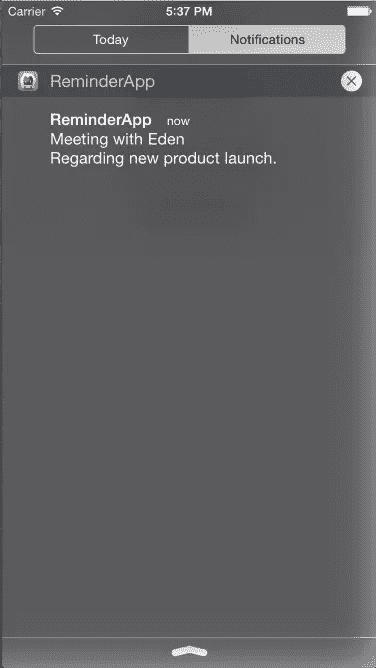
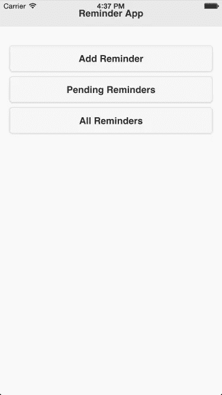
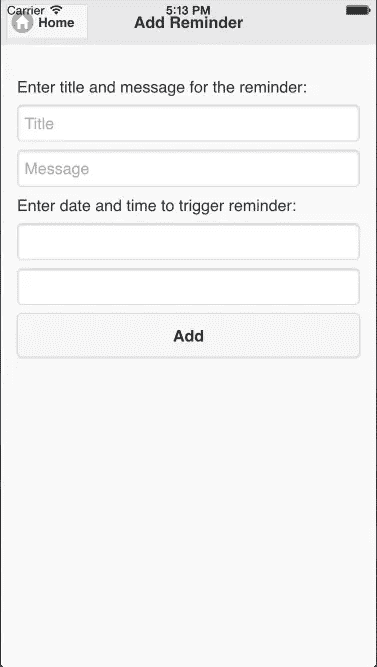
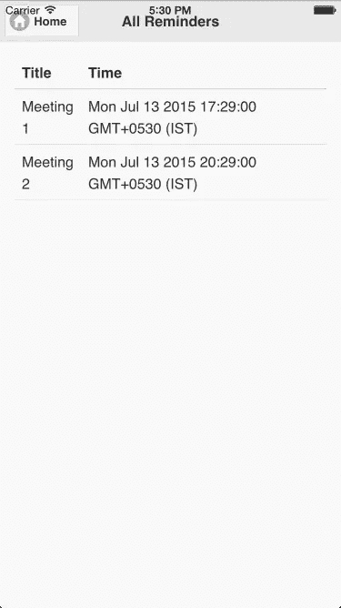
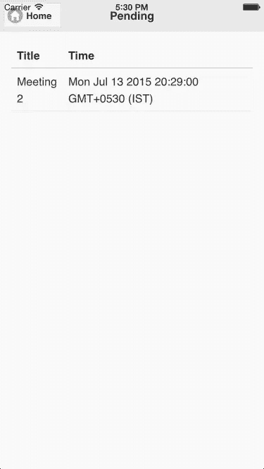

# 在 Cordova 应用程序中集成本地通知

> 原文：<https://www.sitepoint.com/integrating-local-notifications-in-cordova-apps/>

本地通知让应用程序通知它的用户它有适合他们的东西。例如，当应用程序不在前台运行时的提醒或待售的新商品。本地通知被认为是应用程序与其用户通信的最佳方式，即使用户并没有主动使用该应用程序。

在本教程中，我将向你展示如何在一个基于 cordova 的应用程序中触发本地通知。我将解释本地通知是如何工作的，它们与推送通知有何不同，以及由 [Cordova 本地通知插件](https://github.com/katzer/cordova-plugin-local-notifications)提供的用于触发本地通知的 API。我将创建一个基本的提醒应用程序，展示如何在现实世界的项目中使用 Cordova 本地通知插件。

## 本地通知是如何工作的？

当你的应用程序不在前台运行时，本地通知对于及时通知用户相关内容非常有用。本地通知可以显示消息，播放独特的声音，或更新应用程序图标上的徽章。

要让应用程序显示本地通知，它需要在前台运行时安排一个本地通知。

Android、iOS 和 Windows Phone 都支持本地通知。

这是 iOS 中本地通知的外观



## 本地通知和推送通知的区别？

本地和推送通知都以相同的方式显示，即由标题、消息、声音和图标徽章号组成。

不同之处在于，本地通知是由应用程序自己安排的，而推送通知是由应用程序的服务器向移动操作系统的推送服务服务器生成的。本地通知可以在手机没有连接到互联网的情况下触发。只有连接到互联网的手机才能获取推送通知。

## 科尔多瓦本地通知插件

Cordova 本地通知插件是一个第三方 Cordova 插件，我们可以用它在 iOS、Android 和 Windows Phone 中显示本地通知。

在本教程中，我将使用插件来安排本地通知。让我们看看插件提供的 API:

### 检查权限

要让应用程序安排本地通知，它需要获得用户的许可。要检查应用程序是否有权限，请使用以下代码:

```
cordova.plugins.notification.local.hasPermission(function (granted) {
});
```

如果应用程序有权限安排本地通知，则`granted`参数为`true`，否则为`false`。

### 请求许可

如果一个应用程序没有权限安排本地通知，那么它需要请求权限。以下是请求权限的代码:

```
cordova.plugins.notification.local.registerPermission(function (granted) {
});
```

如果用户授予权限，则`granted`参数为`true`，否则为`false`。

### 安排通知

您可以根据需要安排任意数量的通知。以下是安排通知的代码:

```
var sound = device.platform == 'Android' ? 'file://sound.mp3' : 'file://beep.caf';
var date = new Date();

cordova.plugins.notification.local.schedule({
    id: 1,
    title: "Message Title",
    message: "Message Text",
    at: date,
    sound: sound,
    icon: "http://domain.com/icon.png"
});
```

`at`属性需要引用一个`Date`构造函数对象。如果我们超过了当前时间，那么本地通知会被立即触发。

要让通知重复出现，添加一个分配给时间间隔(以分钟为单位)的`every`属性和一个分配给何时第一次触发通知的`firstAt`属性。下面是一个代码示例:

```
var sound = device.platform == 'Android' ? 'file://sound.mp3' : 'file://beep.caf';
var date = new Date();

cordova.plugins.notification.local.schedule({
    id: 1
    title: "Message Title",
    message: "Message Text",
    firstAt: date,
    every: 25,
    sound: sound,
    icon: "http://domain.com/icon.png"
});
```

### 取消通知

要取消待定通知，您需要通知的唯一 id。这里有一个例子:

```
cordova.plugins.notification.local.cancel(1, function () {
    // Notification was cancelled
}, scope);
```

### 点击通知

当用户点击本地通知打开应用程序时，该插件会触发一个事件。下面是一个代码示例:

```
cordova.plugins.notification.local.on("click", function (notification) {
    alert(notification.text);
}, scope);
```

## 创建提醒应用程序

让我们开始构建一个提醒应用程序。提醒应用程序将允许您添加特定日期和时间的提醒。提醒触发本地通知是由应用程序安排的时间。

该应用程序将使用 jQuery mobile 进行设计。你可以在 gitHub 上找到这个项目的[最终代码。](https://github.com/sitepoint-editors/ReminderApp)

### 开始

在起始模板中，包含 jQuery 和 jQuery mobile。我不会在这里介绍安装和创建 Cordova 应用程序，如果你以前没有这样做过，[请阅读入门指南](http://cordova.apache.org/docs/en/4.0.0//guide_cli_index.md.html#The%20Command-Line%20Interface)。运行和构建应用程序的说明位于同一页面上。

给应用程序一个合适的名称，并添加您想要支持的平台。我在本教程中使用 Cordova 的通知插件和设备插件，在这里找到如何添加这些[的说明](http://docs.phonegap.com/en/edge/guide_cli_index.md.html#The%20Command-Line%20Interface_add_plugin_features)。

因为我们将使用本地通知插件，所以通过在 cordova 项目目录中运行以下命令来安装它:

```
cordova plugin add https://github.com/katzer/cordova-plugin-local-notifications
```

在 *www/index.html* 文件中，将以下 JavaScript 和 CSS 文件添加到`head`标签中:

```
<link rel="stylesheet" href="https://code.jquery.com/mobile/1.4.5/jquery.mobile-1.4.5.min.css">

<script src="https://code.jquery.com/jquery-2.1.4.min.js"></script>
<script src="https://code.jquery.com/mobile/1.4.5/jquery.mobile-1.4.5.min.js"></script>

<script type="text/javascript" src="cordova.js"></script>
```

这里我添加了来自 CDNs 的 jQuery 和 jQuery Mobile。您可以在本地嵌入这些文件，这样应用程序就可以在没有互联网连接的情况下工作。

### 数据结构

在本教程中，我将使用 HTML5 本地存储来存储应用程序的数据。

我将把所有的数据组织成一个数组，这个数组将是一个对象的属性。该对象作为 JSON 字符串存储在本地存储中。

第一次加载应用程序时，本地存储将为空，因此需要初始化数据结构。下面的代码检查本地存储中的对象。因为它是空的，所以它会创建并存储一个新的。将此代码放在位于 index.html 页面底部的`script`标签中，在结束`body`标签之前:

```
var info = null;

document.addEventListener("deviceready", function(){
if(!localStorage.getItem("rp_data"))
{
  var rp_data = {data: []};
  localStorage.setItem("rp_data", JSON.stringify(rp_data));
}

info = JSON.parse(localStorage.getItem("rp_data"));
}, false);
```

在这里，我创建了一个在整个应用程序中使用的`info`变量来访问数据。每当我对变量`info`进行修改时，我都需要更新本地存储。

### 创建主屏幕

让我们为我们的应用程序创建一个主屏幕，它将在应用程序加载时显示。

在主屏幕上，我将放置三个按钮。这些用于添加新提醒、显示所有提醒和显示待处理提醒。

下面是为我们的主屏幕创建 jQuery 移动页面的代码。将此代码放在*index.html*页面的`body`标签中(替换那里的 div):

```
<div data-role="page" id="home">
  <div data-role="header">
    <h1>Reminder App</h1>
  </div>

  <div data-role="main" class="ui-content">
    <p>
        <a target="_blank" href="#add" style="text-decoration: none"><button>Add Reminder</button></a>
        <a target="_blank" id="pending_click" href="#pending" style="text-decoration: none"><button>Pending Reminders</button></a>
        <a target="_blank" href="#all" style="text-decoration: none"><button>All Reminders</button></a>
    </p>
  </div>
</div>
```

这里我在页面上放置了三个按钮，每个按钮指向一个新页面。页面应该是这样的:



**注:**:其他页面的代码应添加在此代码下，以便此页面首先加载。

### 创建页面以添加提醒

当用户点击主页上的*添加提醒*按钮时，会显示一个新页面，用户可以在其中添加新的提醒。

接下来，显示四个文本框(标题、消息、日期和时间)和一个添加提醒的按钮。将代码放在*index.html*文件的`body`标签中:

```
<div data-role="page" id="add">
  <div data-role="header">
    <a target="_blank" href="#home" class="ui-btn ui-icon-home ui-btn-icon-left">Home</a>
    <h1>Add Reminder</h1>
  </div>

  <div data-role="main" class="ui-content">
    <p>
        Enter title and message for the reminder:
        <input type="text" id="title" placeholder="Title" />
        <input type="text" id="message" placeholder="Message" />
        Enter date and time to trigger reminder:
        <input type="date" id="date" />
        <input type="time" id="time" />
        <a target="_blank" href="javascript:add_reminder()" style="text-decoration: none"><button>Add</button></a>
    </p>
  </div>
</div>
```

当用户点击*添加*按钮时，调用`add_reminder()`功能。下面是这个函数的实现，将这段代码添加到【index.html】文件*的`script`标签中:*

```
function add_reminder()
{
    var date = document.getElementById("date").value;
    var time = document.getElementById("time").value;
    var title = document.getElementById("title").value;
    var message = document.getElementById("message").value;

    if(date == "" || time == "" || title == "" || message == "")
    {
      navigator.notification.alert("Please enter all details");
      return;
    }

    var schedule_time = new Date((date + " " + time).replace(/-/g, "/")).getTime();
    schedule_time = new Date(schedule_time);

    var id = info.data.length;

    cordova.plugins.notification.local.hasPermission(function(granted){
      if(granted == true)
      {
        schedule(id, title, message, schedule_time);
      }
      else
      {
        cordova.plugins.notification.local.registerPermission(function(granted) {
            if(granted == true)
            {
              schedule(id, title, message, schedule_time);
            }
            else
            {
              navigator.notification.alert("Reminder cannot be added because app doesn't have permission");
            }
        });
      }
    });
}
```

首先，我们检索字段值并检查它们的完整性。然后格式化日期和时间，得到一个合适的格式化字符串，用于`Date`构造函数。

然后应用程序检查它是否有正确的权限。如果没有，那么它请求许可并调用`schedule`函数来安排一个提醒。

下面是`schedule`函数的实现:

```
function schedule(id, title, message, schedule_time)
{
    cordova.plugins.notification.local.schedule({
        id: id,
        title: title,
        message: message,
        at: schedule_time
    });

    var array = [id, title, message, schedule_time];
    info.data[info.data.length] = array;
    localStorage.setItem("rp_data", JSON.stringify(info));

    navigator.notification.alert("Reminder added successfully")
}
```

`schedule`函数调度本地通知，并将提醒细节存储在本地存储器中以备将来参考。

以下是该页面现在的外观:



### 显示所有提醒

当用户点击主页上的*所有提醒*按钮时，会显示一个新页面，其中添加了所有提醒。

将此代码放入*index.html*文件的`body`标签中:

```
<div data-role="page" id="all">
  <div data-role="header">
    <a target="_blank" href="#home" class="ui-btn ui-icon-home ui-btn-icon-left">Home</a>
    <h1>All Reminders</h1>
  </div>

  <div data-role="main" class="ui-content">
    <table data-role="table" data-mode="column" id="allTable" class="ui-responsive table-stroke">
      <thead>
        <tr>
          <th>Title</th>
          <th>Time</th>
        </tr>
      </thead>
      <tbody>
      </tbody>
    </table>
  </div>
</div>
```

下面是用所有提醒填充表格的 JavaScript 代码。将此代码放在`script`标签中:

```
$(document).on("pagebeforeshow","#all",function(){

    var html = '';

    for(var count = 0; count < info.data.length; count++)
    {
        html = html + "<tr><td>" + info.data[count][1] + "</td><td>" + info.data[count][3] + "</td></tr>";

    }

    $("table#allTable tbody").empty();
    $("table#allTable tbody").append(html).closest("table#allTable").table("refresh").trigger("create");  
});
```

以下是该页面现在的外观:



### 显示待定提醒

当用户点击主页上的*未决提醒*按钮时，会显示一个带有未决提醒的新页面。

将此代码放在*index.html*文件的`body`标签中，显示此页面:

```
<div data-role="page" id="pending">
  <div data-role="header">
    <a target="_blank" href="#home" class="ui-btn ui-icon-home ui-btn-icon-left">Home</a>
    <h1>Pending</h1>
  </div>

  <div data-role="main" class="ui-content">
    <table data-role="table" data-mode="column" id="pendingTable" class="ui-responsive table-stroke">
      <thead>
        <tr>
          <th>Title</th>
          <th>Time</th>
        </tr>
      </thead>
      <tbody>
      </tbody>
    </table>
  </div>
</div>
```

下面是用待定提醒填充表格的 JavaScript 代码。将此代码放在`script`标签中:

```
$(document).on("pagebeforeshow","#pending",function(){

    var html = '';

    for(var count = 0; count < info.data.length; count++)
    {
        var schedule_time = new Date(info.data[count][3]).getTime();
        var current_time = new Date().getTime();

        if(current_time < schedule_time)
        {
          html = html + "<tr><td>" + info.data[count][1] + "</td><td>" + info.data[count][3] + "</td></tr>";
        }
    }

    $("table#pendingTable tbody").empty();
    $("table#pendingTable tbody").append(html).closest("table#pendingTable").table("refresh").trigger("create");  
});
```

以下是该页面现在的外观:



## 结论

该应用程序是功能性的，但只是基本的，可以部署到多个平台上。创建完整应用的下一步是让用户改变提醒的时间，或者取消提醒。让我知道你尝试这个教程的经验和扩展它的想法。

## 分享这篇文章