# JavaScript、jQuery 和网络开发——2012 年 4 月

> 原文：<https://www.sitepoint.com/interesting-javascript-jquery-random-web-dev-net-april-2012/>

在 2012 年 4 月的《有趣的随机 JavaScript、jQuery 和 Web 开发》中，我们给你带来了一些非常酷的东西，比如新的 Windows 8 操作系统、一些 JS 到 PHP 的函数转换、免费的 JavaScript 设计模式书、我们见过的最好的表格插件以及一些不错的 ole 随机内容。享受吧。

**相关帖子:**

*   [**2012 年 3 月版**](https://www.jquery4u.com/random/interesting-javascript-jquery-random-web-dev-net-march-2012/)
*   [**2012 年 2 月版**](https://www.jquery4u.com/random/random-js-feb-2012/)

## 快速浏览 Windows 8

<object width="384" height="356" classid="clsid:D27CDB6E-AE6D-11cf-96B8-444553540000" id="ep"><param name="allowfullscreen" value="true"> <param name="allowscriptaccess" value="always"> <param name="wmode" value="transparent"> <param name="movie" value="https://i.cdn.turner.com/money/.element/apps/cvp/4.0/swf/cnn_money_384x216_embed.swf?context=embed&amp;videoId=/video/technology/2012/03/14/t-ts-windows-8-review.cnnmoney"> <param name="bgcolor" value="#000000"> <embed src="https://i.cdn.turner.com/money/.element/apps/cvp/4.0/swf/cnn_money_384x216_embed.swf?context=embed&amp;videoId=/video/technology/2012/03/14/t-ts-windows-8-review.cnnmoney" type="application/x-shockwave-flash" bgcolor="#000000" allowfullscreen="" allowscriptaccess="always" width="384" wmode="transparent" height="356"></object>

## 支撑带

Twitter Bootstrap 的完整版本，包含主题、增强功能和其他内容。

[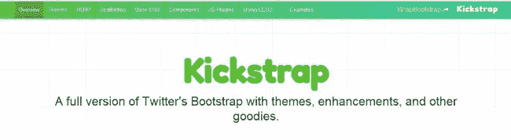](https://ajkochanowicz.github.com/Kickstrap/index.html)

## 3D Tin

伟大的在线工具，用于快速创建 3D 模型并将其导出为 PNG 图像。

[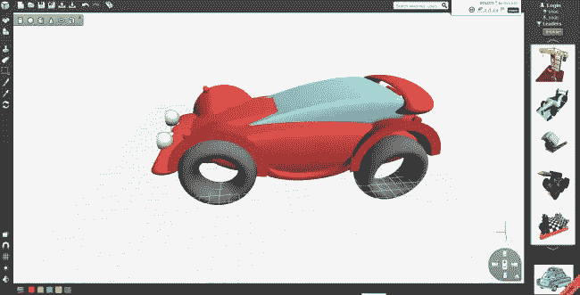](https://www.3dtin.com/)

## jsPHP —带有 PHP API 的 JavaScript 库

我不敢相信他们把每一个 [PHP 函数都移植到了 JS](https://jsphp.co/javascript/php/fn/list) ？？看一看疯狂的东西好工作！

[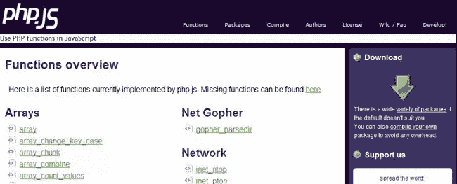](https://phpjs.org/)

## 沙雷

另一个共享小工具。不过，这个还不错。

[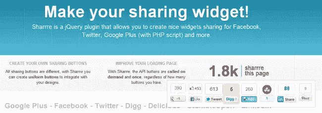](https://sharrre.com)

## 免费云音乐

只是快速分享另一个免费的在线音乐资源。云风格。

[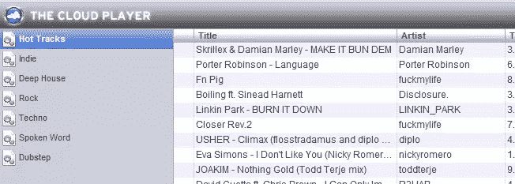](https://www.thecloudplayer.com/)

## 前 5，000 个域名前缀和后缀

对于那些寻找新的非高级域名的人来说，这是一个很好的列表。

[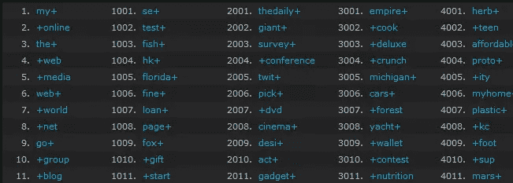](https://www.leandomainsearch.com/top-domain-name-prefixes-and-suffixes)

## 基本 JavaScript 和 jQuery 设计模式

Addy Osmani 的一本书——非常好的读物，请特别注意模块模式部分。

[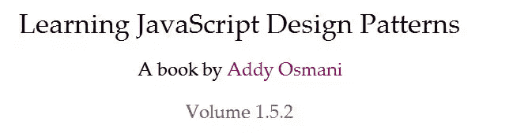](https://addyosmani.com/resources/essentialjsdesignpatterns/book/)

## 紧身上衣

设计非常好的在线 CSS 工具，与 Github 完美集成。

[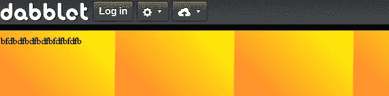](https://dabblet.com/)

## 固定

基于 HTML5 标签填充 HTML 内容，只需在任何标签上添加“fixie”类，它就会为您填充内容。非常适合设计师和页面布局。

[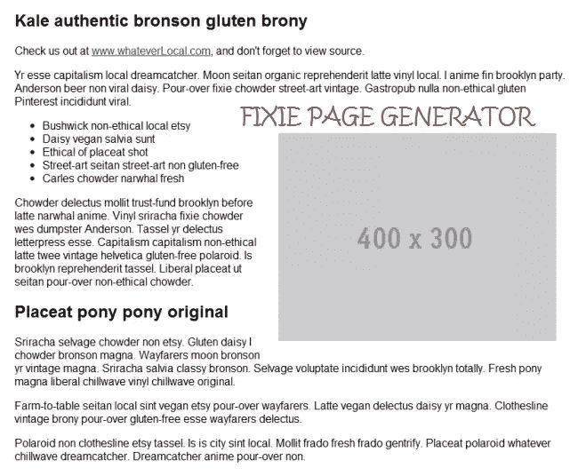](https://fixiejs.com)

## 谷歌金丝雀

有一些不错的功能，访问完整的个人谷歌个人资料，不错的扩展:屏幕捕捉，firebug lite(无网络面板)，网页排名检查器等…

[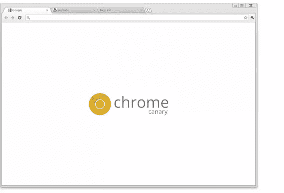](https://tools.google.com/dlpage/chromesxs)

## 崇高文本 2 的谷歌关闭过梁

Closure Linter(https://code.google.com/p/closure-linter/)执行 Google JavaScript 风格指南设定的准则。linter 处理样式问题，这样您就可以专注于代码。

[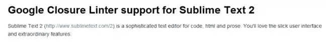](https://github.com/fbzhong/sublime-closure-linter#readme)

## Pivot.js

目前为止我见过的最好的 jQuery 表格插件！提供基于字段名的动态过滤、添加/删除字段、分页、快速实时搜索过滤和标准排序。优秀的插件。比所有这些 [30 个 jQuery 表插件](https://www.jquery4u.com/plugins/30-amazing-jquery-tables/)都要好。**警告:CHROME 上的 ABIT 小车。**

[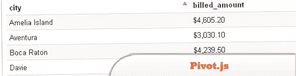](https://rjackson.github.com/pivot.js/)

## 分享这篇文章