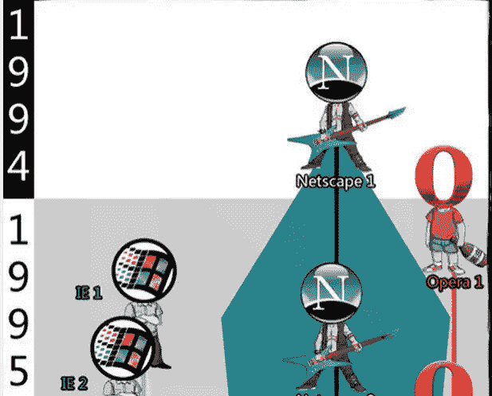
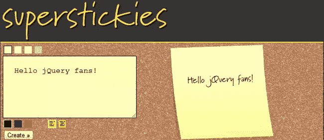
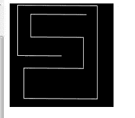
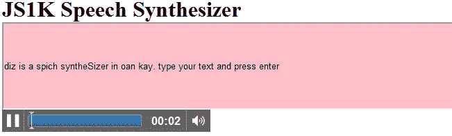
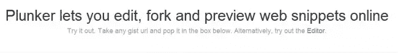

# 有趣的 JavaScript、jQuery 和随机网络开发——2012 年 3 月

> 原文：<https://www.sitepoint.com/interesting-javascript-jquery-random-web-dev-net-march-2012/>

在 2012 年 3 月的《有趣的随机 JavaScript、jQuery 和 Web 开发》中，我们为您带来了一些非常酷的东西，比如快速移动原型、新的 JavaScript 库、一些有用的在线工具、浏览器的历史以及一些不错的 ole 随机内容。享受吧。

**相关帖子:**

*   [**2012 年 2 月版**](https://www.jquery4u.com/random/random-js-feb-2012/)

## 认识网络平台——基础

这是一个很好的播客演示，展示了未来的 web 组件执行各种常见的 web 开发功能。

[https://www.youtube.com/embed/3i4dtgh3ym0](https://www.youtube.com/embed/3i4dtgh3ym0)

## codi QA–快速移动原型

对于 jQuery Mobile 的快速原型制作来说，导出到 HTML 非常有用。轻松的拖放式 jQuery 移动应用构建和共享。该图像是我刚刚创建的 2 分钟原型。

## 巴里·施瓦茨:选择的悖论

非常好的手表老歌从 [TED](https://www.ted.com/) 。心理学家巴里·施瓦茨瞄准了西方社会的一个核心信条:选择自由。在施瓦茨的估计中，选择让我们不是更自由而是更麻痹，不是更快乐而是更不满足。

<object width="640" height="360"><param name="movie" value="https://www.youtube.com/v/VO6XEQIsCoM&amp;hl=en_US&amp;feature=player_embedded&amp;version=3"> <param name="allowFullScreen" value="true"> <param name="allowScriptAccess" value="always"> <embed src="https://www.youtube.com/v/VO6XEQIsCoM&amp;hl=en_US&amp;feature=player_embedded&amp;version=3" type="application/x-shockwave-flash" allowfullscreen="" allowscriptaccess="always" width="640" height="360"></object>

## 浏览器有趣的历史时间轴 JPG

很值得一看，guarenteed 娱乐每一个 web 开发人员几分钟！放大[图像](https://www.jquery4u.cimg/history-of-web-browsers.jpg)以获得最佳观看效果(CTRL 和鼠标滚轮向上或 CTRL 和+)

## 超级便利贴

Superstickies 是一个非常基本的在线工具，但是可以生成很好的基本自定义便笺。

## 用 JS 做的 Tron 游戏

相当酷，只有 219 字节大小。要玩游戏，请按 I、j、k、l 开始并浏览“snake esk”线。

## 彩虹语法荧光笔

只是用 js 做的另一个[语法高亮器](https://www.jquery4u.com/plugins/10-jquery-syntax-highlighters/)。

## JS1K 语音合成器

用 js 制作的非常时髦的语音合成器。

## 主干分页扩展

[骨气。paginator](https://addyosmani.com/blog/backbone-paginator-new-pagination-components-for-backbone-js/)——backbone . js 的新分页组件。一如既往地做得好 Addy。

## plunker–在线片段

Plunker–一个新的在线代码片段编辑器/save，非常像 jsfiddle，但是 plunkers 有更多的选项。干得好。

## Monorail.js

[Monorail](https://github.com/runexec/Monorail.js)–node . js 的超轻量 MVC 框架

## 分享这篇文章