# 有趣的 jQuery、JavaScript 和 Web Dev，2012 年 7 月

> 原文：<https://www.sitepoint.com/interesting-jquery-javascript-web-dev-july-2012/>

今天的帖子我们会给你另一组非常有趣的 jQuery、JavaScript 和 Web 开发，这次是在 2012 年 7 月。一些很酷的东西！尽情享受吧！

**相关帖子:**

*   [**2012 年 6 月版**](http://www.jquery4u.com/javascript/interesting-jquery-javascript-web-dev-june-2012/)
*   [**2012 年 5 月版**](http://www.jquery4u.com/news/interesting-javascript-jquery-random-web-dev-net-2012/)
*   [**2012 年 4 月版**](http://www.jquery4u.com/news/interesting-javascript-jquery-random-web-dev-net-april-2012/)

## amCharts

最佳 JavaScript 图表

  
[源+演示](http://www.amcharts.com/)

## Chrome 多任务模式

允许您同时使用多个光标浏览网页，这样您可以更快地完成更多工作。欢迎来到双向导航革命。

 [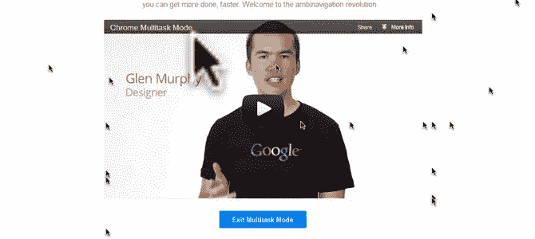](https://www.google.com/intl/en/chrome/multitask.html) 
[源+演示](https://www.google.com/intl/en/chrome/multitask.html)

## IE10 和 Windows 8 中 JavaScript 性能的提升

本文将探讨 JavaScript 引擎是如何得到增强的，以便为新兴的 Web 应用程序场景提供出色的性能。

 [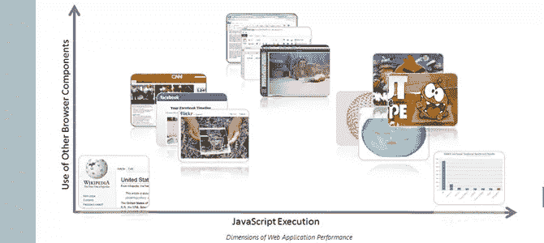](http://blogs.msdn.com/b/ie/archive/2012/06/13/advances-in-javascript-performance-in-ie10-and-windows-8.aspx) 
[源+演示](http://blogs.msdn.com/b/ie/archive/2012/06/13/advances-in-javascript-performance-in-ie10-and-windows-8.aspx)

## 高亮显示. js

它非常容易使用，因为它自动工作:查找代码块，检测语言，突出显示它。

 [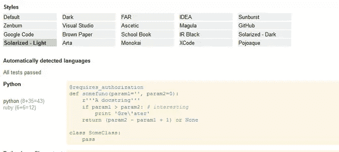](http://softwaremaniacs.org/soft/highlight/en/) 
[来源](http://softwaremaniacs.org/soft/highlight/en/) [演示](http://softwaremaniacs.org/media/soft/highlight/test.html)

## 条纹生成器 2.0

Web 2.0 设计师的终极工具。

 [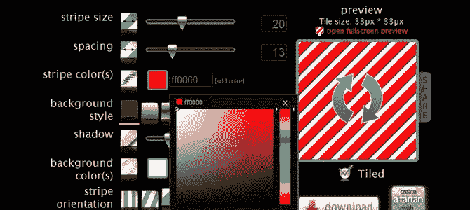](http://www.stripegenerator.com/) 
[源+演示](http://www.stripegenerator.com/)

## CSS3 iPhone v 0.1–code pen

Dylan Hudson 的 CSS3 iPhone v0.1

 [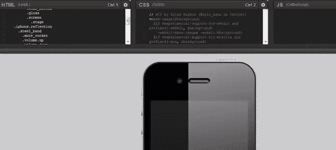](http://codepen.io/dylnhdsn/pen/iphone) 
[源+演示](http://codepen.io/dylnhdsn/pen/iphone)

## HTML5 输入和属性支持

红色输入(后跟皱眉头)表示浏览器不支持该输入类型。

 [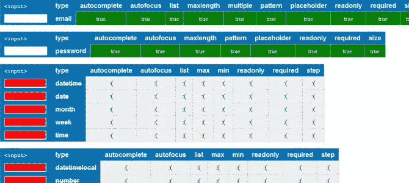](http://miketaylr.com/code/input-type-attr.html) 
[源+演示](http://miketaylr.com/code/input-type-attr.html)

## 幻象

是一个带有 JavaScript API 的无头 WebKit。它对各种 web 标准提供快速的本地支持:DOM 处理、CSS 选择器、JSON、Canvas 和 SVG。

 [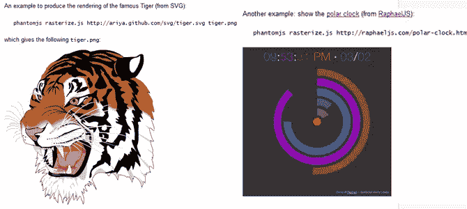](http://phantomjs.org/) 
[来源](http://phantomjs.org/) [演示](http://code.google.com/p/phantomjs/wiki/QuickStart)

## “自行车棚”项目

把 Flash 转换成 HTML5，走上通往未来的高速公路。

 [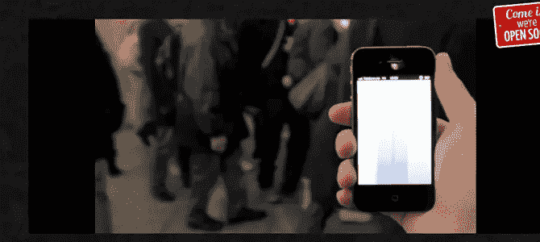](http://bike.sh/) 
[源+演示](http://bike.sh/)

## BananaBread 0.2:关卡！

Sauerbraten 第一人称射击游戏从 C++和 OpenGL 到 JavaScript 和 WebGL 的移植，进展不错。我们正在开始打磨，我们的艺术家 gk 正在制作一些非常酷的关卡！

 [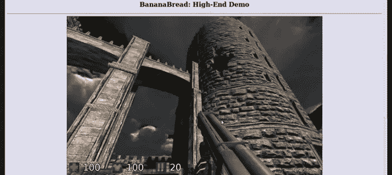](http://syntensity.com/static/night5/bb.html) 
[源+演示](http://syntensity.com/static/night5/bb.html)

## fuckitjs

Javascript 错误压路机——FuckItJS 使用最先进的技术来确保您的 JavaScript 代码运行，无论您的编译器喜欢与否。

 [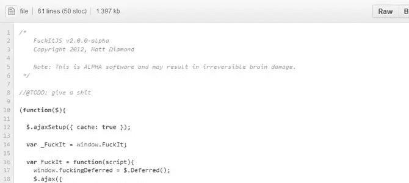](https://github.com/mattdiamond/fuckitjs/#readme) 
[来源](https://github.com/mattdiamond/fuckitjs/#readme) 

## 使用 Jquery 和 CSS3 放大图像的放大镜

学习使用 Jquery 和 CSS3 制作一个逼真的放大镜。将鼠标悬停在图像上方以查看操作。

 [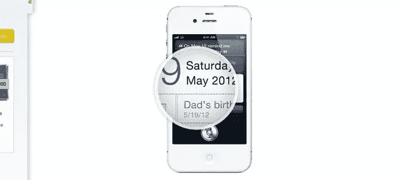](http://thecodeplayer.com/walkthrough/magnifying-glass-for-images-using-jquery-and-css3) 
[源+演示](http://thecodeplayer.com/walkthrough/magnifying-glass-for-images-using-jquery-and-css3)

## jQuery 中跟踪事件绑定和事件触发

使用 jquery.event-trace.js。该跟踪插件通过包装本机 on()方法，在 jquery 事件模型中的事件绑定和事件触发周围注入日志记录语句。

 [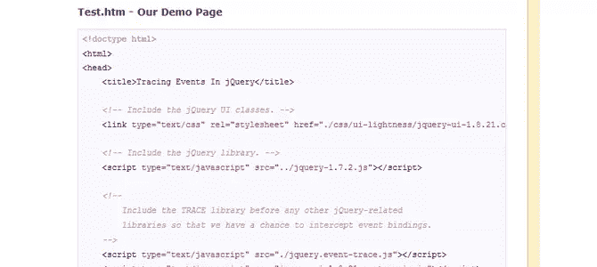](http://www.bennadel.com/blog/2390-Tracing-Event-Binding-And-Event-Triggering-In-jQuery.htm) 
[源+演示](http://www.bennadel.com/blog/2390-Tracing-Event-Binding-And-Event-Triggering-In-jQuery.htm)

## 强大的新 CSS 和 JavaScript 技术

今天，我们终于介绍了其中的一些技术。立即使用它们或保存它们以备将来参考。

 [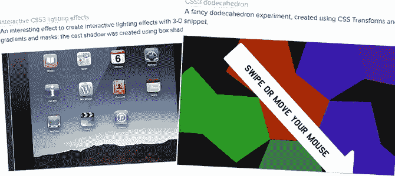](http://coding.smashingmagazine.com/2012/06/21/powerful-new-cssjavascript-techniques/) 
[源+演示](http://coding.smashingmagazine.com/2012/06/21/powerful-new-cssjavascript-techniques/)

## 用 CSS 将图像转换成黑白

了解如何使用 Lena Sö derberg 的经典测试图像，使用纯 CSS 将图像转换为黑白图像。

  
[源+演示](http://demosthenes.info/blog/532/Convert-Images-To-Black--White-With-CSS)

**相关帖子:**

*   [**2012 年 6 月版**](http://www.jquery4u.com/javascript/interesting-jquery-javascript-web-dev-june-2012/)
*   [**2012 年 5 月版**](http://www.jquery4u.com/news/interesting-javascript-jquery-random-web-dev-net-2012/)
*   [**2012 年 4 月版**](http://www.jquery4u.com/news/interesting-javascript-jquery-random-web-dev-net-april-2012/)

## 分享这篇文章