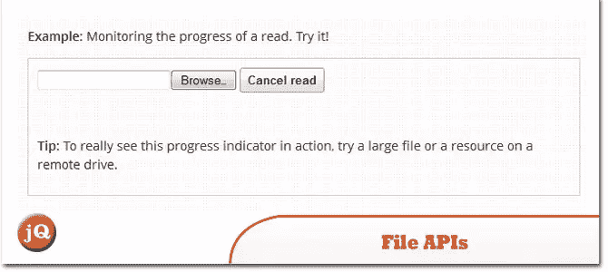
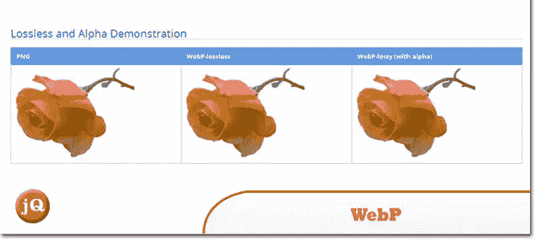
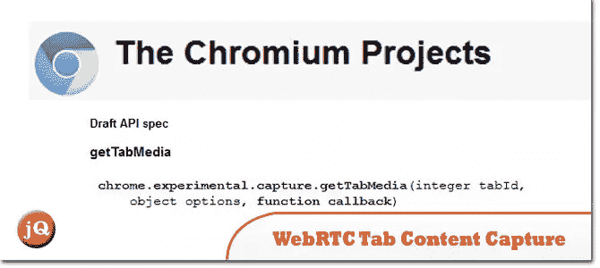
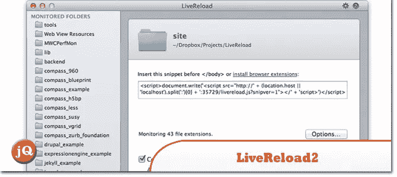
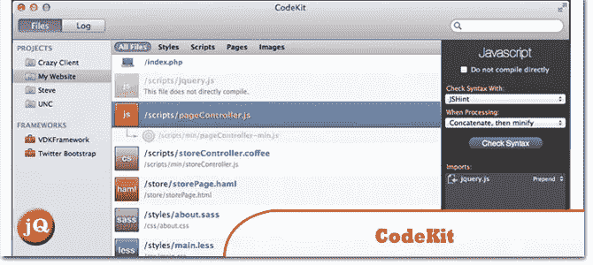
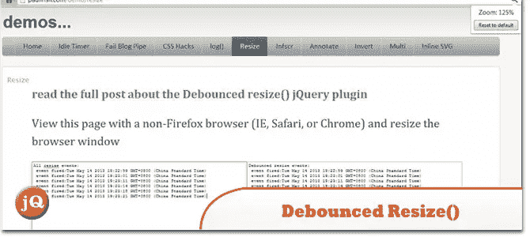

# 20 个有趣的网络开发发现–2013 年 5 月(第 1/2 部分)

> 原文：<https://www.sitepoint.com/interesting-web-dev-finds-may-part1/>

上个月发现了一些很酷的网络开发材料，以下是这些发现。请关注我们下一篇文章的第 2 部分！享受&留下评论！:)

**[有趣的网络发现–2013 年 4 月](http://www.jquery4u.com/random/13-interesting-web-finds-april-2013/)**
**[有趣的网络发现–2013 年 3 月](http://www.jquery4u.com/random/interesting-web-finds-march-2013/)**
**[有趣的网络发现–2013 年 2 月](http://www.jquery4u.com/random/interesting-web-finds-feb-2013/)**

## 2013 波特兰 jQuery 大会——jQuery 活动

2013 波特兰 jQuery 大会——jQuery 活动

 
[来源](http://events.jquery.org/2013/portland/)

## 我知道 jQuery。现在怎么办？

这里是我(相当未经编辑的)关于我如何使用 jQuery，以及我如何看待我在哪里使用原生浏览器技术的准漫谈。

 
[来源](http://remysharp.com/2013/04/19/i-know-jquery-now-what/)

## 使用文件 API 在 JavaScript 中读取文件

文件 API 可以用来在图像发送到服务器时创建图像的缩略图预览，或者允许应用程序在用户离线时保存文件引用。此外，您可以使用客户端逻辑来验证上传的 mimetype 与其文件扩展名是否匹配，或者限制上传的大小。

 
[源+演示](http://www.html5rocks.com/en/tutorials/file/dndfiles/)

## WordPress.com 的应用程序

在 WordPress.com 写博客很棒，这些应用程序通过给你更多的发帖方式让它变得更好。无论你是在桌面上、浏览器上还是在旅途中写博客，一定要看看这些发布到你的 WordPress.com 博客的其他方法。

 
[来源](http://en.support.wordpress.com/apps/)

## WebP

这是一种新的图像格式，为网络上的图像提供无损和有损压缩。与 png 相比，WebP 无损图像的大小要小 26%。与同等 SSIM 指数的 JPEG 图像相比，WebP 有损图像的尺寸要小 25-34%。

 
[来源](https://developers.google.com/speed/webp/) [演示](https://developers.google.com/speed/webp/gallery)

## WebRTC 选项卡内容捕获

提议的 API 使选项卡输出能够被捕获为媒体流，并使用 WebRTC 传输。还定义了支持 API 来通知和查询选项卡的捕获状态。

 
[来源](http://www.chromium.org/developers/design-documents/extensions/proposed-changes/apis-under-development/webrtc-tab-content-capture)

## LiveReload 2

LiveReload 监控文件系统的变化。保存文件后，会根据需要对其进行预处理，并刷新浏览器。

 
[来源](http://livereload.com/)

## code kit——它就像是网络开发人员的类固醇

CodeKit 帮助您更快更好地构建网站。下面列出了它的旗舰功能，右边的一分钟预告视频是一个很好的开始。

 
[来源](http://incident57.com/codekit/)

## 约曼-现代网络应用的现代工作流程

约曼 1.0 不仅仅是一个工具。这是一个工作流程。一个工具和最佳实践的集合，它们协调工作，使 web 开发变得更好。

 
[来源](http://yeoman.io/)

## 去抖动 resize() jQuery 插件

这不完全是节流，但也很接近了。基本上，去抖功能会在自上次尝试触发后经过一个时间阈值(例如 100 毫秒)后触发您的函数。节流会阻止后续的触发，但是反跳会等待最后一次触发并运行它。

 
[来源](http://paulirish.com/2009/throttled-smartresize-jquery-event-handler/) [演示](http://paulirish.com/demo/resize)

## 分享这篇文章