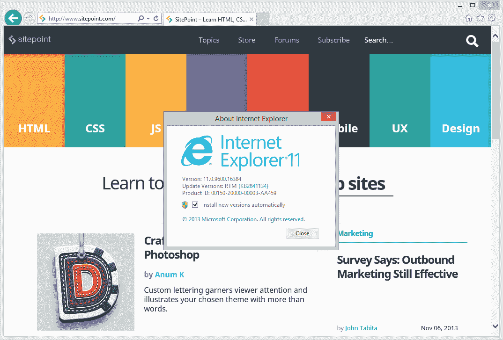
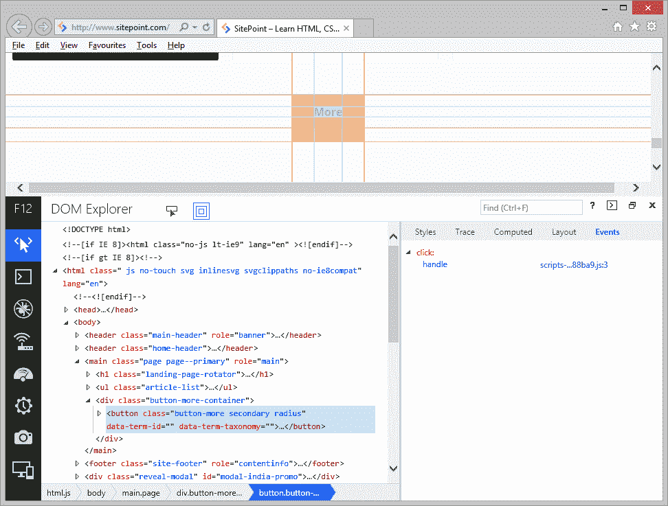

# 互联网浏览器 11:回顾

> 原文：<https://www.sitepoint.com/internet-explorer-11-review/>

Internet Explorer 11.0 于 2013 年 10 月 17 日与 Windows 8.1 一起发布，距离 IE10 不到 12 个月。因此，安装该软件的用户相对较少，上个月的浏览器趋势显示，只有 0.13%的网络用户采用了该软件。随着 Windows 7 版本的发布，这一数字将会迅速增长……*这可能很快*。

IE11 的评论在网上出奇的少。Windows 8.1 评论中提到了这一点，但浏览器在很大程度上受到了漠视。这有点不公平，所以让我们来澄清一下…

## 装置

在撰写本文时，IE11 仅适用于升级到 Windows 8.1 的用户。如果你使用的是 Windows 8，打开 Windows 应用商店，你应该会看到一个升级链接。这将取决于你的系统，但预计下载约 5gb 的更新-幸运的是，你可以继续工作，中途关机或重启。

下载后，完全升级需要大约 15 分钟，似乎对大多数人来说没有痛苦。我有几个问题:联网失败(我需要删除并重新创建 Hyper-V 虚拟交换机),我的 SQL Server 服务消失了？然而，另一台装有较少软件的个人电脑运行顺利。

顺便说一下，Windows 8.1 是一个进步。较小的磁贴很有用，并且更容易访问所有应用程序。“开始”按钮回来了，但它只是开始屏幕的快捷方式。具有讽刺意味的是，在每天使用 Windows 8 一年之后，我并没有错过开始按钮，并且很乐意将其移除——但是没有选项可以这么做！

## 连接

这里没有惊喜。桌面和 Windows 8 UI 风格(Metro)的 IE11 看起来与 IE10(或之前的 9)相同:

[](https://blogs.sitepointstatic.cimg/tech/891-ie11-review.png)

它可能不是最漂亮的浏览器，但它干净、实用，能让你专注于页面而不是应用程序。您可以将选项卡移动到单独的一行，并添加菜单、状态、命令和收藏夹栏，但您可能不会这样做。

## 网络标准

正如您所料，IE11 超越了 IE10:

| 浏览器 | [HTML5test.com](http://html5test.com/) | [acid3.acidtests.org](http://acid3.acidtests.org/) |
| Internet Explorer 11 | 355+6 / 500 | 100 / 100 |
| Internet Explorer 10 | 320+6 / 500 | 100 / 100 |
| Internet Explorer 9 | 138+5 / 500 | 95 / 100 |
| 铬 29 | 463+13 / 500 | 100 / 100 |
| 火狐 24 | 414+10 / 500 | 100 / 100 |

虽然 IE 仍低于 Chrome 和 Firefox 的水平，但缺少的功能大多是最新的、小众的或不推荐的 HTML5 功能，如 Web Audio API、Web SQL 数据库和编解码器支持(如果你在 Windows 中安装了它们，可能会出现)。实际上，你在 IE 中遇到的问题不太可能比在其他浏览器中遇到的多。

最大的新功能是 WebGL …看起来微软已经克服了他们的安全风险顾虑。第一印象很好，性能似乎比 Chrome 和 Firefox 更好。在 babylonjs.com 有一些很好的技术展示。

其他新功能包括:

1.  [全屏](/html5-full-screen-api/?)和[屏幕方向](https://www.w3.org/TR/screen-orientation/)API
2.  CSS Flexbox 和边框图像支持
3.  SPDY 支持
4.  JavaScript 增强，比如块范围的变量、容器对象、国际化 API 和`__proto__`属性
5.  DOM 突变观察者
6.  Web 加密 API(无需 SSL 即可发送安全数据)
7.  视频文本轨道支持
8.  加密媒体(DRM)支持
9.  一个改进的 HTML 编辑器。

你还应该注意到传统的 API 比如`document.all`和`attachEvent`已经被打包到 IE11 中(参见下面的[兼容性](#compatibility))。

对我来说，唯一失望的是在对多个元素应用 3D 变换时继续省略了`transform-style: preserve-3d;`。它可能不是必不可少的，但它非常有用。

## 改革

是的，你没看错标题。IE11 有一些你在其他浏览器中不一定会发现的创新。这些功能包括:

*   高 DPI 支持—增强了高分辨率屏幕的缩放比例。
*   改进的 Windows 集成，如电话号码识别、动态磁贴和阅读视图。
*   后退按钮导航缓存。
*   预渲染；将`rel="prerender"`添加到任何链接，页面将在后台加载，这样当用户进入时它就可用了。
*   预取；`rel="prefetch"`属性标识可以下载并存储在缓存中的资源文件(不一定在页面上使用)。
*   DNS-预取；将`rel="dns-prefetch"`添加到任何链接，以便在后台解析 DNS 查询，从而确保可以更快地处理请求。

网络优先化是一个有趣的优化。IE11 根据类型区分各个网络请求的优先级，以提供最快的用户体验，并确保页面更快可用。一般顺序是 HTML、CSS、字体、脚本、图像、同步 Ajax 请求、异步脚本请求(Web Workers、indexedDB、File API 等)、异步 Ajax 请求、音频/视频和延迟脚本。

微软一直在努力支持触摸，以确保 HTML5 控件在平板电脑和智能手机上运行良好。IE11 也符合最近对 W3C 指针事件推荐标准的修改。这项技术是由微软引入的，所以事件可以以一种硬件不可知的方式处理；不管你是使用鼠标、笔、触摸屏——*还是某个即将发布的游戏主机上的某个运动传感器，都没关系！*

目前，指针事件仅在 IE 中受支持，但微软已经与 Mozilla、Webkit 和 Blink 社区合作，将 API 引入 Firefox、Chrome、Opera 和 Safari。原型已经有了。

## 和睦相处

总的来说，我在 IE 上没有遇到任何问题，它的表现和你预期的一样。

除非你在嗅探用户代理。

当然，你不应该这么做。不幸的是，一些 Google 产品甚至 Outlook web access 都出现了问题，因为它们在用户代理字符串中查找“MSIE”。IE11 的用户代理是:

```
Mozilla/5.0 (Windows NT 6.3; WOW64; Trident/7.0; rv:11.0) like Gecko
```

没有“MSIE”的迹象，微软删除它也不足为奇。一些网站检测字符串以使 IE 显示降级的布局或切换到传统 API 如`document.all`。那种胡说八道不再管用了；IE11 更接近 Chrome 或 Firefox，而不是 IE8。

我已经说过很多很多次了，但是，如果你在嗅探浏览器字符串，你就做错了！有一些例外，如统计数据整理，但这些情况是罕见的。

## 表演

IE10 看起来很快，但基准测试讲述了一个不同的故事。以下测试是在我的开发电脑上进行的——我不能说是严格的实验室条件，但它们是在每个浏览器热重启后在一个选项卡中多次进行的:

| 试验 | IE11 | 铬 30 | 火狐 26 |
| [Webkit SunSpider(较低=较好)](http://www.webkit.org/perf/sunspider/sunspider.html) | 128.8 毫秒 | 199.4 毫秒 | 193.6 毫秒 |
| [谷歌 V8(更高=更好)](http://v8.googlecode.com/svn/data/benchmarks/v7/run.html) | Eleven thousand and fifty | Eighteen thousand three hundred and twenty-one | Sixteen thousand one hundred and thirty-seven |
| [MS 2000 鱼 fps(更高=更好)](http://ie.microsoft.com/testdrive/Performance/FishBowl/) | Fifteen | Fifteen | Fourteen |
| [web GL 1000 鱼 fps(更高=更好)](http://webglsamples.googlecode.com/hg/aquarium/aquarium.html) | Sixty | Fifty-three | Forty-five |

IE11 在两项测试中彻底胜出，在另一项测试中并列第一。WebGL 尤其令人印象深刻。或许不出所料，它仅落后于谷歌的 V8 基准。

基准测试并不能反映真实的使用情况，并且可以随意改变来证明。所有的浏览器都很快，你很少会遇到性能问题。也就是说，IE11 确实令人印象深刻；它的打开、关闭和渲染速度似乎比其他任何浏览器都要快。如果你只是为了速度而改用 Chrome，那你现在用错了浏览器。

## 内存使用

在相同的网站上打开五个标签，我的电脑记录了以下内存使用情况:

*   IE11: 168Mb
*   火狐 26:225 兆字节
*   铬 30:401 兆字节

Windows 8 有可能运行其他后台进程来帮助 IE11，但我找不到任何明显的候选对象。Firefox 有点饥渴，Chrome 是个资源暴食者，它也启动了大约 20 个子进程！

唯一的缺点是 IE11 和 Chrome 一样，会在浏览器重启时重新加载你所有的标签页。令我惊讶的是，微软和谷歌都没有效仿 Mozilla，只提供点播下载。

## 定制和附加组件

与 Firefox、Chrome 甚至 Safari 生态系统相比，IE 的附加软件范围仍然令人失望。大多数是商业扩展，没有什么实际好处。*但这有问题吗？*

如果你想要一个高度可定制的浏览体验，Firefox 是无可争议的冠军，它有成千上万的插件，可以改变应用程序的任何方面。如果你只需要一些基本的增强，Chrome 有很多功能有限的扩展。

对于那些只想要一个没有虚饰的快速浏览器的用户来说，11 是最好的选择吗？我对微软的建议:*废弃 IE 的扩展系统*。很少有公司开发 IE 插件，而且很难吸引 Firefox 和 Chrome 的高级用户。保持 IE 轻量级，防止用户意外安装可疑的工具栏！

## 开发者工具

我过去一直对 IE 的开发者工具持批评态度，但在 IE11 中它们已经被彻底改造了。

[](https://blogs.sitepointstatic.cimg/tech/891-ie11-review-f12.png)

这里涉及的内容太多了，[我以前写过这些工具](/ie11-developer-tools/)，但重点包括:

*   右键单击进行检查
*   一个完整的控制台 API，用于日志记录、跟踪等。
*   控制台中的代码自动完成
*   针对[老歌](/ie11-browser-modes-return/)的设备仿真、响应式网页设计和 GPS
*   一个 UI 响应工具:在页面运行时分析页面并检测问题
*   内存分析器
*   脚本突出显示和重新格式化
*   无刷新断点
*   新网络工作者的突破
*   也许是任何浏览器上最好看的开发工具？

如果你正在使用 Firebug，Firefox 的开发者工具，或者 Chrome 的 Inspector，你会非常乐意使用新的 F12 工具。如果我必须非常挑剔的话，如果你不需要点击图标来开始一些配置选项就好了，但这是一个小问题，我想它是出于性能原因而实现的。

## 结论

几年前，我写过[微软让我们重新爱上 IE 的 10 种方法](/10-ways-microsoft-could-make-us-love-ie/)。微软已经解决了六个问题。我特别高兴的是，他们已经停止了令人尴尬的竞争对手比较，并专注于改善浏览器和标准的合规性。*(讽刺的是，IE11 终于是竞争对手的对手了！)*

我不再相信 IE 需要一个漂亮的界面或更好的附加系统，所以这又是两点。虽然如果他们为 XP 用户做了一些事情会很好，但随着时间的推移，这个问题已经减轻了。只剩下一个了:*推出一个快速发布时间表*。微软已经缩短了每个版本的发布时间，但是我仍然希望每六到八个月能看到一个增量更新或者一个新的版本。

**IE11 加分:**

*   也许是你能得到的最快的浏览器
*   不引人注目的界面，出色的操作系统集成
*   出色的标准支持，包括 web GL——传统 API 已不复存在
*   大幅改进的开发人员工具
*   安全且资源高效

**IE11 负分:**

*   仅在 Windows 8.1 上可用(尽管 Windows 7 即将推出)
*   很少的定制可能性和糟糕的附加功能
*   不支持`transform-style: preserve-3d;`
*   微软的发布进度比其他厂商慢
*   我们仍然需要处理旧版本的浏览器。

说出来感觉怪怪的，但是 Internet Explorer 11 是一个很棒的浏览器。不要被过去所蒙蔽；如果你想要一个快速，精简，符合标准的浏览体验，吞下你的骄傲，试试 IE11。

## 分享这篇文章