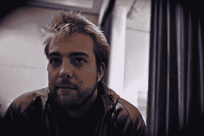
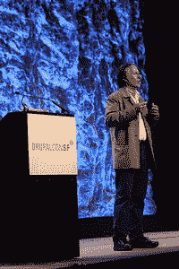

# 采访 Drupal 的创造者 Dries Buytaert

> 原文：<https://www.sitepoint.com/interview-with-dries-buytaert-creator-of-drupal/>

Drupalcon 旧金山——上周，大卫·皮特森([@大卫·赛斯](http://twitter.com/davidseth))采访了 Drupal 的创始人[德里斯·布耶特](http://buytaert.net/)([@德里斯](http://twitter.com/dries))，讨论 Drupal 的发展方向、面临的挑战以及他前进的动力。

Dries Buytaert:你想谈什么？

***David Peterson:我想谈谈你认为大转变发生在哪里——涉及 Tim O'Reilly 在[的主题演讲](http://sf2010.drupal.org/conference/sessions/open-source-cloud-era),他在演讲中谈到了设备和云数据的未来。另外，我参加了[华纳兄弟的 Drupalcon 会议](http://sf2010.drupal.org/conference/sessions/social-analytics-120-warner-bros-records-artist-sites)，他们说他们面临的最大问题不是音乐盗版。这实际上是人们访问内容的碎片化方式。网站不再是焦点；实际上是任天堂的 Wii、Xbox、PlayStations 和手机。因此，考虑到这一点，您认为事情会如何发展，Drupal 将如何促进这一点？***

DB:对。

***DP:那么我们从一个很基本的问题开始。你认为 Drupal 7 的稳定测试版什么时候会登陆？***
 DB:所以，Drupal 7 到今天早上还剩下大约 100 个关键 bug。所以我们会在这个数字为零时发布。但是，我真的不知道这个数字什么时候会为零。这真的取决于社区中的每个人来帮助修复它。

如果我们对当前的大修复率做一些分析，看看我们成功修复 bug 的历史，它看起来可能在 6 月初(最好的情况)和 9 月底(最坏的情况)之间的任何地方。

DP:测试版怎么样？Drupal 7 现在是 alpha 版本，你会在某个时候发布一个稳定的 beta 版本吗？

DB:我们已经释放了第三个阿尔法。当我们觉得升级路径可行时，将会有一个测试版。

***DP:喜欢从 CCK 升级到新的 Fields API 吗？***

DB:Drupal 6 到 Drupal 7 的升级路径。

***DP:所以本质上是 core 6 到 core 7 的升级？***

DB:嗯，是的。CCK 不再是 Drupal 7 的一部分，所以迁移路径必须包括将 CCK 升级到字段。这就是我们现在的想法。这仍然是我们需要进一步讨论的一些事情，因为 CCK 的人实际上认为，出于技术原因，将 CCK 更新作为一个贡献模块保留一段时间可能会更好。

但是 Drupal 7 版本的大目标是让升级路径以一种每个人都同意的方式工作，然后我们将切换到 beta 版本。

DP:在你的主题演讲中，你提到发行版是 Drupal 的一个非常重要的方面，也是一个真正的差异化点。为什么你认为这是 Drupal 独一无二的驱动力，这将如何帮助 Drupal 在更广泛的社区中被接受？

DB:回答第一个问题，我认为为什么它很重要，当我和人们交谈时，可用性仍然是第一位的问题。不仅仅是可用性，还有“Drupal 能做到吗？”，“Drupal 能做到吗？”，“我该怎么做？”。从安装、模块选择和可用性开始，人们会遇到很多障碍。有所有这些事情，我认为发行版是解决这个问题的好方法。这些是打包的解决方案，而不是一个由一大堆构建块组成的框架。

***DP:还有一条吓人的学习曲线(笑)。***

DB:所以我认为这有助于学习曲线，我认为这将有助于 Drupal 的成长。如果我们可以用新的发行版消除一些障碍，那么我认为 Drupal 将会成功地发展得更好。

DP:类似的，你认为 Drupal 未来最大的挑战是什么？在你的主题演讲中，你提到 WordPress 现在正和 Joomla 以及其他系统一起走向一个更加开放的模式。Drupal 在一个更加同质的群体中面临哪些挑战？

DB:最大的威胁，是一个丑陋的词，但是如果 Joomla 和 WordPress 是自下而上的，如果你愿意的话，那将会取代我们的部分用户群。所以这是一个威胁。我认为发行版可以帮助我们抵御这种威胁，因为这意味着发行版可以做很多 WordPress 做的事情。先说清楚，我和 WordPress 或者 Joomla 不是超级竞争对手。我不想给人留下害怕这些项目的印象。

***DP:耶。我想“威胁”这个词可能不恰当。这更像是‘你如何在一个同质化的世界里保持 Drupal 的相关性？’***

DB:我长期关注的是保持相关性。我们如何保持敏捷性和创新的水平，以及我们今天拥有的让我们处于领先地位并成为使我们如此成功的所有因素的东西。

DP:那么你会做些什么来解决这个问题？目前，我想这是一个很棒的社区，有很多贡献和类似的东西。但我的意思是，你在主题演讲中再次提到的一件事是，你希望更多的人回馈社会。你将如何保持 Drupal 永远处于最前沿？你是怎么做到的？

DB:这在很大程度上是一种文化。我认为这些问题没有技术解决方案。只是一个愿望，人们必须成为创新者，与其他项目相比，这个项目是最先进的，但也要保持我们的工作方式。我不是说我们应该调整我们的工作方式。我们必须保持这个项目的健康，但是要保持我们的核心价值观，我们已经坚持了很多很多年的基本原则。但是我觉得成分都在。我认为一切都很好，所以努力坚持那些我认为是关键的事情。

随着它的成长，应用规则总是很容易的。这是其中之一，有时添加规则比删除规则要容易得多，所以一旦你添加了一个规则或一个新的流程，就很难摆脱它。

***DP:现在事情发展的很快。脸书刚刚宣布了[开放图协议](https://www.facebook.com/sitepoint/)，本质上这是一个能够将网页整合到一个图中的协议，一个社交图。我知道在波士顿 Drupalcon 上你谈到了这一点，从那以后你多次谈到关联数据和语义网。在周一的主题演讲中，你再次谈到了蒂姆·伯纳斯·李的[巨型全球图](http://dig.csail.mit.edu/breadcrumbs/node/215)。以前它总是多一点学术和多一点技术，但我猜随着脸书今天早上的橡皮图章，它终于变得真实和令人兴奋。***

DB:是的，我还没看过，但是听起来很刺激。

 *** DP:我自己刚刚才勉强看完(笑)。*** 
***在 Tim O'Reilly 的主题演讲中，他谈到了网络的未来，浏览器变得不那么重要，但便携式设备和与云的交互将成为主导媒介。***
***在这个 web 浏览器和 web 界面实际上正在衰落、云及设备正在崛起的时代，Drupal 将如何领导？***

DB:对。我认为它把更多的注意力放在了导入和导出、web 服务 API 和诸如此类的东西上，而不仅仅是 HTML。在 Drupal 7 中有一些重要的改进。我们开始让 HTML 渲染器基本上从系统中抽象出来一点，这样我们就可以更容易地生成其他格式，比如 JSON、XML 或其他任何格式。所以我认为将这种方式发展到下一个层次，在那里有更多的 web 服务集成，像 RDF 和 RDFa 这样的东西会有所帮助。

DP:所以在某种程度上，我认为 Drupal 页面更像是一个数据层，而不是传统的静态 HTML 页面。可以充当事务中可能的层的东西。差不多吧？

DB:举例来说，这是相关的——就像在 Drupal 6 中，我们基本上生成了 HTML 的片段，这就是一个页面是如何生成的。在 Drupal 7 中，我们仍然做同样的事情，但是在我们开始生成所有这些片段之前，我们首先构建整个页面的大数据对象。一个大的嵌套结构，有点像页面对象。这实际上使它非常酷，因为您捕获了页面的结构，并可以在页面上执行操作。

此外，通过捕获函数周围的注释，我们可以自动为该函数生成 web 服务 API。如果我们可以对函数和数据类型都这样做，那么我认为 Drupal 在一个好的方面变得非常容易被黑客攻击(笑)。我们可以开始使用它作为一个混搭平台，开始做所有这些事情。

***DP:听起来很棒。***
***微软在 Drupalcon 上发布了一款针对 PHP 的原生 SQL Server 驱动程序，非常酷。Drupal 的锦囊妙计还有其他吗？与这些以前不那么开放源码友好的团体的工作或战略合作中还有其他事情吗？***

DB:我知道现在有很多公司在关注 Drupal，试图找出如何利用 Drupal。最终这是他们想要做的。我知道 Dreamweaver 最近得到了一个我认为来自 Adobe 的 Drupal 插件。这是大公司开始注意到 Drupal，开始为它开发软件的又一个小例子。

***DP:还有哪些技术领域让你感兴趣？什么让你兴奋？是什么让你的大脑进入下一步？***

DB:很多不同的事情。例如，一个特定于 Drupal 的，我认为我们需要为企业关注的下一件事是 staging。我与许多企业客户交谈过，暂存和配置管理是我们需要解决的问题。这是一个困难的问题，但同时也是让我感到兴奋的原因。这不像是个小问题。这实际上是一个很大的问题，可能需要一些重要的工程技术，这让我很兴奋。

我认为云计算和软件即服务令我兴奋。不仅从技术的角度，而且从商业模式的角度。我认为云计算和软件即服务实际上为开源带来了新的盈利机会，这是我们以前没有的。我的意思是，有些人以前做过，但我们开始更好地理解云计算和开源的可能性，以及我们如何利用它来货币化开源项目。我认为这是健康的。因为我们仍然可以把一切都还回去，但同时组织将能够从开源中赚钱，我认为这对一个项目的成功非常重要。

我认为 Drupal 中的发行版就是一个很好的例子。真的很酷。如果能有很多这样的人就太好了。我认为我们已经解决了许多技术问题，但不是全部。我认为我们在发行版中构建的技术将会有所改进。但我认为最大的挑战仍然是围绕分销的商业模式。我们需要弄清楚人们如何通过构建发行版来赚钱，因为构建发行版非常耗时，需要付出很多努力，我认为云计算和软件即服务为发行版提供了机会。

***DP:耶。所以，这是一脉相承的，但可能还要再推断几年…你对 Drupal 9 的下一个大事件有什么想法吗，或者对 Drupal 有一个相当长的 3 到 4 年的目标，或者只是对你自己的发展有什么想法。***

DB:嗯…我不认为…我知道，但我不确定这是一个我能描述的画面。

***DP:好的(笑)可能是件好事。***

DB:是的，我不知道，它不像那四个特征或什么的。这就像，举例来说，我相信人们对 web 应用程序的期望正在迅速变化。人们希望它们非常容易使用。使用起来非常直观。有很多非常具体的应用程序正在开发中，所以我坚信我们应该让 Drupal 易于使用

所以，如果我提前考虑，我会看到一些我能描述的很好的易用的东西。我也看到手机变得更加突出，所以我也看到了一些可以从手机网站或设备上轻松访问的内容。

DP:我们刚刚谈到了 Drupal 良好的可攻击性和你对云的兴趣，以及如何将这些东西结合起来。你所描述的看起来考虑到了我们已经拥有的移动、更易用和多设备的能力。
***最后，是什么让你保持动力。我的意思是你经常旅行，你也是孩子们的父亲，是什么让你不断前进，不断梦想。***

DB:这真是一个好问题。你知道，对我来说，只要我能学习，我就很开心。其实真的很开心。我玩得很开心，这种开心来自于能够学习——来自于身边有我可以学习的人。只是和我一起工作的人一起工作，你知道社区里的所有人。做我正在做的项目，这让我非常兴奋。所以刺激和乐趣就在于此。

DP:很好，非常感谢你抽出时间。

DB:不客气。

DP:和你谈话是绝对的快乐。

## 分享这篇文章