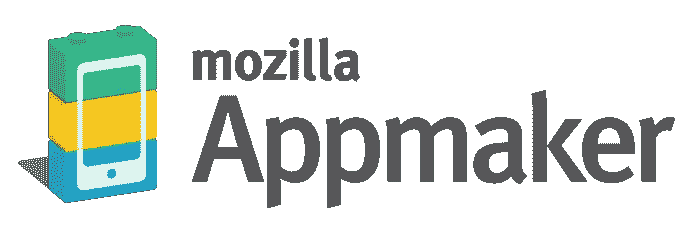
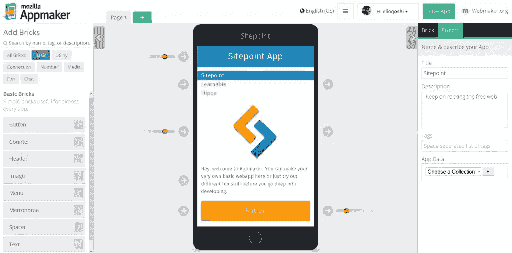
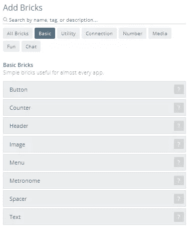
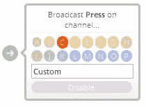
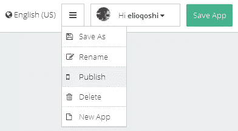

# 介绍 Appmaker，通过应用程序设计教授编码

> 原文：<https://www.sitepoint.com/introducing-appmaker-teaching-coding-app-design/>

还记得网络曾经很难掌握，只为少数懂得它的特权阶层保留的时代吗？没有吗？这并不奇怪，我们的网上生活已经成为我们生活中如此重要的一部分，以至于我们很难记得在它之前的某个时刻。

网络素养变得越来越重要，将学习者转变为教师，并给予它与数学或语言等许多其他学科同等的重要性。

随着未来几年将有 20 多亿人成为互联网社区的一部分，火狐的创造者 Mozilla 已经推出了 [Webmaker](https://webmaker.org/) 。Webmaker 是一个全球性项目，旨在向尽可能多的人教授网络知识。它提供了启动项目、模板和活动指南，以激励各个层次的教师和学习者创造知识并与他人分享。

在许多其他工具中，Webmaker 项目包括 [Appmaker](https://apps.webmaker.org/designer) ，这是一个无需任何编码知识即可创建个人移动应用的免费工具。单个“砖块”组合在一起，在您的网络浏览器中创建和共享定制的移动应用程序。这是 Mozilla 在一系列工具、平台、程序和研究中的首次尝试，旨在提供一种鼓励自由、分散、功能性用户内容创作的移动体验。该项目的主要目标之一是了解和应对全球移动设备用户的使用模式(当前或未来)。

## 手放在 Appmaker 上

[//www.youtube.com/embed/RaRIdLgZTPI](//www.youtube.com/embed/RaRIdLgZTPI)

要开始使用 Appmaker 创建，请使用您的 Webmaker 帐户登录，该帐户使用[角色](https://www.mozilla.org/en-US/persona/)作为登录系统。目前这项服务似乎只能在 FireFox 中完全运行。

Persona 是 Mozilla 自己的私有安全登录系统，类似于脸书登录。我强烈推荐。

在构建应用程序时，你会觉得自己在玩乐高，但不要低估 Appmaker，或者乐高的力量！

在 Appmaker 中，您可以堆叠“砖块”来创建简单的用户界面。您可以使用页面将它们链接在一起，在应用程序部分之间创建一个层次结构。我会把 Appmaker 比作一本“乐高书”(如果有这么棒的东西存在的话)。它是由你可以轻松添加和删除的页面组成的，但每一页都是由砖块组成的，也是可移动的，不会影响其他页面。

在左侧，您可以浏览所有可用的砖块和元素，您可以将它们合并到您的应用程序页面中。它们被整齐地分类，所以你永远不会失去概述。

在屏幕顶部，您可以看到*页面*标签，在这里您可以浏览您的应用程序页面，并添加和删除它们。

砖块和元素如何相互作用由应用程序通道信号决定，该信号具有将元素链接在一起的输入和输出通道。这是布尔运算符的简化版本，*IF THIS THEN than*。您将只能在交互式砖块上看到通道，例如，一个按钮。当砖块是交互式的时，您将会在它的右侧看到一个箭头。

Appmaker 有 16 个默认通道，按字母顺序命名，可以用来存储函数和交互。如果你想更深入地研究更复杂的交互，你可以创建一个自定义频道。将砖块连接在一起是一件非常有趣的事情，可以让你轻松地完成功能。

在其他砖块中使用的通道按钮将会跳动以指示它们已经被使用，所以你不会在相同的通道上覆盖不同的链接。

一旦您对应用程序感到满意，您就可以保存并发布它。后者将为您提供接收安装链接或直接在浏览器中预览的选项。也可以推送到你的 Android 或者 Firefox OS 设备上。

## 你已经是应用程序开发者了吗？

Mozilla 最近通过 Firefox OS、Webmaker 和 Open Badges 等项目扩大了自己的影响力。Appmaker 是 Mozilla 希望改变人们看待网络技术方式的产品之一。让每个人都更容易使用它，不管他们想深入了解 HTML5 有多棒。

我觉得不仅新手可以利用 Appmaker，有经验的开发人员也会发现它对原型开发和实验很有用。它很容易使用和开始，所以试一试，让我知道你的想法。

## 分享这篇文章